- 以单个问题作为一个点，最好是按照学习顺序进行排列，后续方便添加和修改
- 一级标题为最大模块，如javase,javaweb,mysql,mybatis等
- 二级标题为具体模块（为了应付面试，尽量少设二级标题），如集合、IO等
- 三级标题为具体模块分类（为了应付面试，尽量少设三级标题），如list,set,map
- 四级标题为具体问题，如arraylist与linkedarraylist的区别


# 一：javaSE
#### Java语言特点
* **面向对象**(封装，继承，多态) ;
* **平台无关性**，Java是“一次编写，到处运行(Write Once，Run anyWhere)”的语言，很好的可移植性，在引入虚拟机之后，Java语言在不同的平台上运行不需要重新编译。
* **支持多线程。**C++语言没有内置的多线程机制而Java语言却提供了多线程支持;
* **支持网络编程并且很方便。**
* **编译与解释并存;**
- **支持垃圾回收机制**

  

#### 访问（权限）修饰符
Java中，可以使用访问控制符来保护对类、变量、方法和构造方法的访问。Java 支持4种不同的访问权限。public、 protected、default、private。

* private:在同一类内可见，不能修饰类(外部类)
* default (即默认，什么也不写) :在同一包内可见，不使用任何修饰符。
* protected :对不同包的子类可见，不同包其他类就不可见了
* public: 对所有类可见。抽象类只可以public修饰，默认不写也是public修饰


#### 基本数据类型

* 整型
  byte: 占用(内存) 1个字节，8位二进制补码表示的整数
  short: 占用2个字节，16位二进制补码表示的整数
  int:占用4个字节，32位二进制补码表示的整数
  long: 占用8个字节，64位二进制补码表示的整数
* 浮点型
  float:占用4个字节，32位单精度浮点数
  double:占用8个字节，64位双精度浮点数
* 字符型
  char: 占用2个字节，16位字符
* 布尔型
  boolean:只有true和false两个取值。通常编译后JVM内部会把boolean类型变量表示为int
  占4个字节。Boolean类型数组一般每个元素表示为一个字节的byte。


#### 值传递机制

 * 值传递。 即将实际参数值的副本（复制品）传入方法内，而参数本身不受影响

 * 形参是基本数据类型：将实参基本数据类型变量的“数据值”传递给形参

 * 形参是引用数据类型：将实参引用数据类型变量的“地址值”传递给形参

    

#### final、finally、finalize的区别

* **final**:被修饰的变量不可变
  ​	       被修饰的方法不允许子类重写，子类可以使用该方法

  ​         被修饰的类不可以被继承，所有方法不可以被重写
  
* **finally：**作为异常处理的一种机制，只能在**try/catch**语句中，并附带一个语句块表示这段语句一定会执行，System.exit(0)可以阻断finally执行

* **finalize：**Object类中的一个基础方法，设计目的保证对象在被垃圾收集前，完成特地资源的回收，但其执行不稳定且有一定性能问题

  


#### 封装 继承 多态

**封装：**不对外暴露类的内部结构，仅提供少量方法供外部使用，提高程序的可维护性

**继承：**可以使用现有类的所有功能，并在无需重新编写原来类的情况下对这些功能进行扩展。新类的定义可以增加新的数据或新的功能，也可以用父类的功能，但不能选择性地继承父类。通过使用继承，可以快速地创建新的类，可以提高代码的复用性，程序的可维护性，节省大量创建新类的时间，提高我们的开发效率。

**多态：**一个事物的多种形态。以封装和继承为基础，根据运行时对象实际类型使同一行为具有不同表现形式。父类的引用指向子类的对象，调用的方法是子类重写后的方法，多态一般专指重写，既体现了多种类型的传递，又体现了不同类型的特性，即复用了父类的方法，又扩展了自己的逻辑。


#### Static
* static可以修饰成员变量和成员方法
* static修饰成员变量表示该成员变量只在内存中只存储一份，可以被共享访问、修改
* 在不想创建对象的情况下也想调用方法，可以用static

**访问格式**：
类名.静态成员变量
类名.静态成员方法
对象.静态成员变量（不推荐）

 

#### 静态工具类的好处

* 类中都是一些静态方法， 每个方法都是以完成一个共用的功能为目的, 这个类用来给系统开发人员共同使用的。（譬如验证码登录）

* 一次编写，处处可用，提高代码的重用性

* 建议工具类的构造器私有化处理，工具类不需要创建对象

  

#### **静态代码块:** 
 * 可以有输出语句。

 * 可以对类的属性、类的声明进行初始化操作。

 * 静态代码块不可以对非静态的属性初始化。即：不可以调用非静态的属性和方法。

 * 若有多个静态的代码块，那么按照从上到下的顺序依次执行。

 * 静态代码块的执行要先于非静态代码块。

 * ✔静态代码块随着类的加载而加载，且只执行一次。

   

#### 单例模式(拿到的对象都是同一个对象)
- 饿汉单例
```java
    public class SingleInstance
    {
        public static SingleInstance instance = new SingleInstance();
        private SingleInstance(){
            return instance
        }
    }
```
- 懒汉单例
```java
    public class SingleInstance
    {
        private static SingleInstance instance;
        private SingleInstance(){}
        public static SingleInstance  getInstance(){
            if(instance == null){
                instance = new SingleInstance();
            }
            return instance;
        }
    }
```

#### 重载和重写
* 重载 指的是同一个类中的多个同名方法构成重载，是行为水平方向的不同实现，对编译器来说，方法名与参数列表组成了唯一键（称为方法签名），JVM通过方法签名决定调用哪种重载方法。
* 重写指子类实现接口或继承父类时，保持方法签名完全相同，实现不同方法体，是行为垂直方向的不同实现。


#### 面向对象和面向过程
* 面向过程最终执行代码大多是可以直接被CPU执行的二进制机械码，面向对象类调用需要实例化，开销较大，且最终执行代码不是二进制机械码，所以面向过程的性能较好。
* 但面向过程代码模块间耦合严重，不易复用、扩展，面向对象代码强调高内聚、低耦合，先抽象模型定义共性行为，再解决实际问题，系统更加灵活，易于维护、复用、扩展。

  

#### 成员变量和局部变量的区别


#### 继承抽象类/接口的注意事项？

* 一个类如果继承了抽象类，那么这个类必须重写完抽象类的全部抽象方法，否则这个类也必须定义成抽象类

| 语法 维度 | 抽象类                                             |                             接口                             |
| :-------- | -------------------------------------------------- | :----------------------------------------------------------: |
| 成员 变量 | 无特殊要求                                         |                默认 public static final 常量                 |
| 构造 方法 | 有构造方法，不能实例化                             |                   没有构造方法，不能实例化                   |
| 方法      | 抽象类可以没有抽象方法，但有抽象方法一定是抽象类。 | 默认 public abstract，JDK8 支持默认/静态方 法，JDK9 支持私有方法。 |
| 继承      | 单继承                                             |                            多继承                            |


#### 抽象接口与抽象类的异同点

**相同点**
1. 都不能被实例化 
2. 接口的实现类或抽象类的子类都只有实现了接口或抽象类中的方法后才能实例化。

**不同点**

1. 接口只有定义，不能有方法的实现，而抽象类可以有定义与实现，方法可在抽象类中实现。
2. 实现接口的关键字为implements，继承抽象类的关键字为extends。一个类可以实现多个接口，但一个类只能继承一个抽象类。所以，使用接口可以间接地实现多重继承。
3. 接口只能继承接口，抽象类可以实现接口
4. 接口就是一个只有方法和静态常量的类
5. JAVA8后Default修饰后就不需要强制子类再去写新增的抽样方法，JAVA9直接可以Private
6. 描述特征一般用接口，描述概念一般用抽象类


#### String、StringBuffer、StringBuilder的区别

**可变性**

* 简单来说：String 类中使⽤ final 关键字修饰字符数组来保存字符串，所以 **String** **对象是不可变**
* ⽽StringBuilder与StringBuffer都继承⾃**AbstractStringBuilder类**，在AbstractStringBuilder中也是使⽤字符数组保存字符串char[]value，但是没有⽤ final 关键字修饰，所以**这两种对象都是可变的（可变字符串）**。

**线程安全**

* String不可变，所以线程安全
* StringBuilder是非线程安全
* StringBuffer加了Synchronized同步锁，所以线程安全


### List


- |----collection

  ​       |----list

  ​              |----ArrayList：作为list接口的主要实现类，线程不安全，效率高；底层使用object[] elementData存储

  ​              |----LinkedList：作为list接口的次要实现类，对于频繁的插入、删除操作，使用此类效率比ArrayList高；底层使用双向链表存储

  ​              |----Vector：作为list接口的古老实现类，线程安全，效率低；底层使用object[] elementData存储

  

#### arraylist,linkedlist,vector三者的异同

 *  同：三个类都实现了list接口，存储数据的特点相同：储存有序的，可重复的数据。

 * 异（ArrayList和LinkedList）:

    1. 二者都线程不安全，相对线程安全的Vector，执行效率高。

    2. `ArrayList`是实现了基于动态数组(自动扩展大小)的数据结构，`LinkedList`基于双向链表（JDK1.6 之前为循环链表，JDK1.7 取消了循环。注意双向链表和双向循环链表的区别）的数据结构。对于随机访问get和set，`ArrayList`效率优于`LinkedList`，因为`LinkedList`要移动指针。对于新增和删除操作（add和remove），`LinkedList`比较占优势，因为增加和删除操作ArrayList要整体移动数据。
    3. 内存空间占用：ArrayList 的空间浪费主要体现在在 list 列表的结尾会预留一定的容量空间，而 LinkedList 的空间花费则体现在它的每一个元素都需要消耗比 ArrayList 更多的空间（因为要存放**直接后继**和**直接前驱**以及数据）

 * 异（ArrayList和Vector）：

    1. Vector和ArrayList几乎是完全相同的,唯一的区别在于Vector是同步类(synchronized)，属于强同步类。因此开销就比ArrayList要大，访问要慢。

    2. 正常情况下,大多数的Java程序员使用 ArrayList而不是Vector, 因为同步完全可以由程序员自己来控制。Vector每次扩容请求其大小的2倍空间，而ArrayList是1.5倍。Vector还有一个子类Stack

        

### Set

|----collection接口

​       |----set接口：无序的、不可重复的数据

​                   |----HashSet：作为list接口的主要实现类，线程不安全，可以存储null值（基于 `HashMap` 实现的）

​                               |----LinkedHashSet：作为hashset的子类；遍历其内部数据时，可以按照添加的顺序遍历（基于`LinkedHashMap` 来实现）

​                    |----TreeSet： 可以按照添加对象的指定属性进行排序（基于红黑树）


### Map


|----Map:存储双列数据，存储key-value对的数据     ----类似于高中的函数：y=f(x)

​        |----HashMap: 作为Map的主要实现类，线程不安全，效率高; 可以存储null的key和value

​                          |----LinkedHashMap: 保证在遍历map元素时，可以按照添加的顺序实现遍历

​                                                               : 原因，在原有的HashMap底层之上，添加了一对指针（引入了链式结构）

​                                                               ：对于频繁的遍历操作，此类的执行效率高于HashMap

​       |----Hashtable: 作为Map的古老实现类，线程安全，效率低; 不能存储null的key和value

​                          |----Properties：常用来处理配置文件，key和value都是string类型

​       |----TreeMap:可以根据添加的key-value对进行排序，实现排序遍历，通常都是对key进行排序（自然排序，定制排序）

​                                                               :底层使用红黑树


#### jdk7中的底层实现源码流程（饿汉式）

1. HashMap map = new HashMap(); 在实例化以后，底层创建了一个长度为16的一维数组Entry[] table;(看构造器，点this进去)

2.  map.put(key1,value1)(查看Put方法)

​       ① 首先调用key1所在类的hashcode()方法，此hash值经过某种映射，得到在entry数组中的存放位置

​       ② 如果此位置上为空，此时直接添加成功，key1-value1添加成功

​       ③ 如果此位置上数据不为空（意味着此位置上存在一个或多个数据（以链表方式存储）），比较当前key1和已经存在数据的哈希值，如果哈希值不同，添加成功。如果哈希值与某一个数据相同(key2-value2)，继续比较key1所在类的equals()方法，如果equals返回false，添加成功。。 如果equals()返回true,使用value1替换value2

 * 补充：对于原先就有数据的情况，key1-value1和key2-value2以链表的方式存储

 * 扩容：默认扩容为原来容量的2倍，并把原来的数据复制过来

    

#### Jdk8中的底层实现源码流程（懒汉式）

1. HashMap map = new HashMap(); ✔在实例化以后，底层没有创建了一个长度为16的一维数组Node[] table; (改名了而且)
2.  首次调用 map.put(key1,value1)方法时：

​       ① 创建长度为16的一维数组Node[] table;

​       ② jdk8,使用了数组+链表+红黑树

​       ✔当数组的某一个索引位置上有多个元素（以链表方法存储）,元素个数>8 且 当前数组长度>64时，该索引位置上所有数据改用红黑树存储

​       ② 首先调用key1所在类的hashcode()方法，此hash值经过某种映射，得到在entry数组中的存放位置

​       ③ 如果此位置上为空，此时直接添加成功，key1-value1添加成功

​       ④ 如果此位置上数据不为空（意味着此位置上存在一个或多个数据（以链表方式存储）），比较当前key1和已经存在数据的哈希值，

如果哈希值不同，添加成功。如果哈希值与某一个数据相同(key2-value2)，继续比较key1所在类的equals()方法，如果equals返回false，添加成功。。。。如果equals()返回true,使用value1替换value2

 * 补充：对于原先就有数据的情况，key1-value1和key2-value2以链表的方式存储

 * 当形成链表时，七上八下（jdk7中新的元素指向旧元素，jdk8中旧元素指向新元素）

 * 扩容：默认扩容为原来容量的2倍，并把原来的数据复制过来
   
   

#### LinkedHashMap的底层实现原理（了解）
 * 底层使用的结构与hashmap基本相同，因为Linkedhashmap继承于hashmap, 只是重写了newNode方法，

 * 并且 新造了内部类Entry,该Entry对象继承自Node，实现了双向链表，所以LinkedHashMap就可以根据添加的顺序实现遍历

   

#### hashset的底层实现原理
 * 在new HashSet的时候，实际上底层是new了一个HashMap
 * 当我们add元素的时候，实际上是往这个HashMap.put(e, object())
 * ✔✔即我们存入的键值，value处就放一个空的object对象（常量），所有的key都指向它


#### List、Set、Map的区别

* `List`(对付顺序的好帮手)：存储的元素是**有序**的、**可重复**的。

* `Set`(注重独一无二的性质): 存储的元素是**无序**的、**不可重复**的。

* `Map`(用 Key 来搜索的专家): 使用键值对（key-value）存储，类似于数学上的函数 y=f(x)，“x”代表 key，"y"代表 value，Key 是**无序**的、**不可重复**的，value 是**无序**的、**可重复**的，每个键最多映射到一个值。

  

#### HashMap和Hashtable的区别（感觉hashtable基本不会考了）

1.线程是否安全: HashMap 是非线程安全的，HashTable 是线程安全的,因为HashTable 内部的方法基本都经过synchronized修饰。
2.效率:因为线程安全的问题，HashMap 要比HashTable 效率高一点。 另外，HashTable 基本被淘汰，不要在代码中使用它;
3.对Null key和Null value的支持: HashMap 可以存储null 的key和value,但null作为键只能有一个， null 作为值可以有多个; HashTable 不允许有null键和null值，否则会抛出NullPointerException 。
4.初始容量大小和每次扩充容量大小的不同:①创建时如果不指定容量初始值，Hashtable 默认的初始大小为11,之后每次扩充，容量变为原来的2n+1。HashMap 默认的初始化大小为16。之后每次扩充，容量变为原来的2倍。②创建时如果给定了容量初始值，那么Hashtable会直接使用你给定的大小，而HashMap 会将其扩充为2的幂次方大小。
5.**底层数据结构:** JDK1.8 以后的HashMap在解决哈希冲突时有了较大的变化，当链表长度大于阈值(默认为8) (将链表转换成红黑树前会判断，如果当前数组的长度小于64,那么会选择先进行数组扩容，而不是转换为红黑树时，将链表转化为红黑树，以减少搜索时间。Hashtable 没有这样的机制。


#### 为什么转成红黑树

* 链表取元素是从头结点一直遍历到对应的结点，这个过程的复杂度是O(N)， 而红黑树基于二叉树的结构，查找元素的复杂度为O(logN)，所以，当元素个数过多时，用红黑树存储可以提高搜索的效率。

* 可以有效防止用户自己实现了不好的哈希算法时导致链表过长的情况。

  

#### 为什么不一开始转成红黑树

单个TreeNode需要占用的空间大约是普通Node的两倍，所以只有当包含足够多的Nodes时才会转成TreeNodes。


#### 为什么树化标准是8

* 如果hashCode的分布离散良好的话，那么红黑树是很少会被用到的，因为各个值都均匀分布，很少出现链表很长的情况。

* 在理想情况下，链表长度符合泊松分布， 各个长度的命中概率依次递减，当长度为8的时候，概率概率仅为00000006，
  这么小的概率，HashMap的红黑树转换几乎不会发生。
  
* 当然，这是理想的算法，但不妨某些用户使用HashMap过程导致hashCode分布离散很差的场景，这个时候再转换为红黑树
  就是一种很好的退让策略。
  
  

#### 为什么退化为链表的阈值是6
主要是一个过渡，避免链表和红黑树之间频繁的转换。如果阈值是7的话，删除一个元素红黑树就必须退化为链表， 增加一个元
素就必须树化，来回不断的转换结构无疑会降低性能，所以阈值才不设置的那么临界。


#### ConcurrentHashMap和Hashtable的区别

ConcurrentHashMap和Hashtable的区别主要体现在实现线程安全的方式上不同。

* **底层数据结构: **JDK1.7 的ConcurrentHashMap底层采用分段的数组+链表实现，JDK1.8 采用的数据结构跟HashMap1.8的结构一样,数组+链表/红黑叉树。Hashtable和JDK1.8之前的HashMap的底层数据结构类似都是采用数组+链表的形式,数组是HashMap的主体,链表则是主要为了解决哈希冲突而存在的;
* **实现线程安全的方式(重要) :**①在JDK1.7的时候，ConcurrentHashMap (分段锁) 对整个桶数组进行了分割分段(Segment),每把锁只锁容器其中一部分数据，多线程访问容器里不同数据段的数据，就不会存在锁竞争，提高并发访问率。到了 JDK1.8 的时候已经摒弃了Segment 的概念,而是直接用Node数组+链表+红黑树的数据结构来实现，并发控制使用synchronized和CAS来操作，**通过对头节点加锁来保证线程安全，使锁的粒度相对于Segment更小了**。JDK1.6 后对synchronized锁做了很多优化)整个看起来就像是优化过且线程安全的HashMap， 虽然在JDK1.8中还能看到Segment的数据结构，但是已经简化了属性，只是为了兼容旧版本;②Hashtable (同步锁) :使用synchronized来保证线程安全,效率非常低下。当一个线程访问同步方法时，其他线程也访问同步方法，可能会进入阻塞或轮询状态,如使用put添加元素，另一个线程不能使用put添加元素,也不能使用get,竞争会越来越激烈效率越低。
  两者的对比图:
  **HashTable:**


**JDK1.7 的 ConcurrentHashMap：**


**JDK1.8 的 ConcurrentHashMap：**


​		JDK1.8 的 `ConcurrentHashMap` 不在是 **Segment 数组 + HashEntry 数组 + 链表**，而是 **Node 数组 + 链表 / 红黑树**。不过，Node 只能用于链表的情况，红黑树的情况需要使用 **`TreeNode`**。当冲突链表达到一定长度时，链表会转换成红黑树。

总结：JDK1.7给Segment添加ReentrantLock（可重入锁）来实现线程安全

​	   	JDK1.8通过CAS或者synchronized来实现线程安全


#### throw和throws的区别

Java中的异常处理除了包括捕获异常和处理异常之外，还包括声明异常和抛出异常，可以通过throws关键字在方法上声明该方法要抛出的异常，或者在方法内部通过throw拋出异常对象。throws关键字和throw关键字在使用上的几点区别如下:

* throw关键字用在方法内部，只能用于抛出一种异常，用来抛出方法或代码块中的异常，受查异常和非受查异常都可以被抛出。

* throws关键字用在方法声明上，可以抛出多个异常，用来标识该方法可能抛出的异常列表。一个方法用throws标识了可能抛出的异常列表，调用该方法的方法中必须包含可处理异常的代码，否则也要在方法签名中用throws关键字声明相应的异常。

  

#### 处理异常的方式
* throws：用在方法上，可以将方法内部出现的异常抛出去给本方法的调用者处理。
* try...catch：
  * 监视捕获异常，用在方法内部，可以将方法内部出现的异常直接捕获处理。
  * 这种方式还可以，发生异常的方法自己独立完成异常的处理,程序可以继续往下执行。
* 前两者结合


#### 序列化和反序列化
- 用途：对内存中的对象进行持久化或网络传输
- 解释：序列化的原本意图是希望对一个Java对象作一下“变换”，变成字节序列，这样一来方便持久化存储到磁盘，避免程序运行结束后对象就从内存里消失，另外变换成字节序列也更便于网络传输，所以概念上很好理解：怎么把当前JVM进程的对象跨网络传输到另一个JVM进程里面进行恢复。序列化就是把内存里面的对象转化为字节流，以便实现存储或传输。反序列化就是根据从文件或者网络上获取到的对象的字节流，根据字节流里面的保存的对象描述信息和状态重新构建一个新的对象。
- **序列化**： 将数据结构或对象转换成二进制字节流的过程
- **反序列化**：将在序列化过程中所生成的二进制字节流转换成数据结构或者对象的过程


#### 反射的优缺点
通过反射可以获取.class文件得到字节码，从而得到任意一个类的所有属性和方法，还可以调用这些方法和属性。动态获取信息及调用对象方法的功能。反射本质上就是把Java类中的各个成分映射成一个个的Java对象

- **优点** ： 可以让代码更加灵活、为各种框架 开箱即用的功能提供了便利
- **缺点** ：破坏了封装性以及泛型约束。在运行时有了分析操作类的能力，这同样也增加了安全问题。比如可以无视泛型参数的安全检查（泛型参数的安全检查发生在编译时）。另外，反射的性能也要稍差点，不过，对于框架来说实际是影响不大的。


#### 为什么要有无参构造器？
- 反射调用创建实例clazz.newInstance()方法的底层是调用Constructor对象的newInstance()，所以必须保证编写类的时候有个无参构造器。
- 在实例对象的时候，都要不断的向上（父类）回溯到Object（），要想顺利的回溯到Object，就必须给指定调用父类的哪个构造方法，如果没有，就用默认的 super（）。若只有有参构造器，没有无参，可能会发生编译错误。但只有无参，没有有参一定不会出错


#### 深拷贝和浅拷贝
深拷贝和浅拷贝是指在赋值一个对象时，拷贝的深度不同。

**浅拷贝：**在进行深拷贝时，会拷贝所有的属性，并且如果这些属性是对象，也会对这些对象进行深拷贝，直到最底层的基本数据类型为止。这意味着，对于深拷贝后的对象，即使原对象的属性值发生了变化，深拷贝后的对象的属性值也不会受到影响。

**浅拷贝：**相反，浅拷贝只会拷贝对象的第一层属性，如果这些属性是对象，则不会对这些对象进行拷贝，而是直接复制对象的引用。这意味着，对于浅拷贝后的对象，如果原对象的属性值发生了变化，浅拷贝后的对象的属性值也会跟着发生变化。


# 二：数据库
#### 主键 外键 索引
- 主键是表中唯一标识一条记录的，不允许有重复的、不能为空
- 外键是用来和其他表建立联系的，表的外键是另一个表的主键，可以有重复的可以为空
- 索引是对数据库中某些关键字段进行存储，类似数据中的目录，里面包含关键数据和数据的位置，索引不能太多，建议一个表不能超过四个


### 索引
#### 索引的定义与优缺点
- 索引是存储引擎 用于快速找到数据记录的一种数据结构，就好比一本教科书的目录部分，通过目录中找到对应文章的页码，便可快速定位到需要的文章。MySQL中也是一样的道理，进行数据查找时，首先查看查询条件是否命中某条索引，符合则通过索引查找相关数据，如果不符合则需要全表扫描,即需要一条一条地查找记录，直到找到与条件符合的记录

- 索引的优点
  （1）提高数据检索的效率，降低数据库的IO成本,这是创建索引最主要的原因。
  （2）通过创建唯一索引，可以保证数据库中每一行数据的唯一性。
  （3）在实现数据的参考完整性方面，可以加速表和表之间的连接。换句话说，对于有依赖关系的子表和父表联合查询时，可以提高查询速度。
  （4）在使用分组和排序子句进行数据查询时，可以显著减少查询中分组和排序的时间，降低了CPU的消耗。

- 索引的 缺点
  （1）创建索引和维护索引要耗费时间，并且随着数据量的增加，所耗费的时间也会增加。
  （2）索引需要占磁盘空间，除了数据表占数据空间之外，每一个索引还要占一定的物理空间，存储在磁盘上，如果有大量的索引，索引文件就可能比数据文件更快达到最大文件尺寸。
  （3）虽然索引大大提高了查询速度，但却会降低更新表的速度。当对标中的数据进行增加、删除和修改的时候，索引也要动态地维护，这样就降低了数据的维护速度。

#### 聚簇索引 & 非聚簇索引的区别
（1）聚簇索引也就是所谓的主键索引，一般只需要查询一次即可，但是如果是二级索引查询也就是非聚簇索引查询，则需要回表操作，多次查询，在大数据量的情况下，主键索引的效率会很高。
（2） 聚簇索引的叶子节点存储的就是我们的数据记录，非聚簇索引的叶子节点存储的是数据位置（主键位置）。非聚簇索引不会影响数据表的物理存储顺序。
（3）一个表只能有一个聚簇索引，因为只能有一种排序存储的方式，但可以有多个非聚簇索引，也就是多个索引目录提供数据检索。

#### Hash索引与B+树索引的区别（为什么索引结构要设计成树形）
1、Hash索引仅满足（=)（!=）和IN查询。如果进行范围查询，哈希型的索引，时间复杂度会退化为O(n); 而树形的“有序”特性，依然能够保持O(log2N)的高效率。
2、Hash索引不支持联合索引的最左侧原则， 对于联合索引的情况，Hash值是将联合索引合并后一起来计算的，无法对单独的一个键或者几个索引健进行查询。
3、Hash索引还有一个缺陷，数据的存储是没有顺序的，在ORDER BY的情况下，使用Hash索引还需要对数据重新排序。
4、对于等值查询来说，通常Hash索引的效率更高，不过也存在一种情况，就是索引列的重复值如果很多，效率就会降低。这是因为遇到Hash冲突（碰撞）时，需要遍历桶中的行指针来进行比较，找到查询的关键字，非常耗时。
5、InnoDB不支持哈希索引

####  最左前缀原则？
当我们创建一个组合索引的时候，如 (a1,a2,a3)，相当于创建了（a1）、(a1,a2)和(a1,a2,a3)三个索引，这就是 最左前缀原则。  原则上，要根据业务需求，where 子句中使用最频繁的一列放在最左边。

####  B+树和B树的差异
- B+树中有k个关键字（数据页中的记录数）就有k个孩子节点（ 数据页的数量），也就是关键字数 = 孩子数量 ，而B树中，关键字数 + 1 = 孩子数量。

- B+树非叶子节点的关键字 也会同时存在在子节点的关键字中
   这就意味着 B+树的非叶子节点仅用于索引，不保存数据记录，跟记录有关的信息都放在叶子节点中。
   也意味着 B+树中 所有关键字（key）都在叶子节点出现，叶子节点构成一个有序链表，而且叶子节点本身按照关键字的大小从小到大顺序链接。
   而B树中，非叶子节点既保存索引，也保存数据记录。

#### 为什么说B+树比B-树更适合实际应用中操作系统的文件索引和数据库索引？
- 首先，B+树查询效率更稳定。因为B+树每次只有访问到叶子节点才能找到对应的数据，而在B树中，非叶子节点也会存储数据，有时候访问到了非叶子节点就可以找到关键字，

- 其次，B+树的查询效率更高。这是因为通常B+树比B树更矮胖（阶树更大，深度更低），查询所需要的磁盘I/O也会更少。

- 在查找范围上，B+树的效率也比B树高。这是因为所有关键字都出现在B+树的叶子节点中，叶子节点之间会有指针，数据又是递增的，这使得我们范围查找可以通过指针连接查找。而在B树种则需要通过中序遍历才能完成查找范围的查找，效率要低很多。


####MyISAM 与 InnoDB的索引方案对比
- MyISAM的索引方式都是 “非聚簇” 的，InnoDB中一定包含1个聚簇索引
- 在InnoDB存储引擎中，我们只需要根据主键值对 聚簇索引 进行一次查找就能找到对应的记录，而在MyISAM 中却至少需要进行一次 回表（先查找到地址值，再找到对应的记录），意味着MyISAM中建立的索引相当于全部都是 二级索引。
- InnoDB的数据文件本身就是索引文件，而MyISAM索引文件和数据文件是 分离的，索引文件仅保存数据记录的地址。
- InnoDB的非聚簇索引data域存储相应记录 主键的值，而MyISAM索引记录的是 地址
- MyISAM的回表操作是十分 快速 的，因为是拿着地址偏移量直接到文件中取数据的，反观InnoDB是通过获取主键之后再去聚簇索引里找记录，虽然说也不慢，但还是比不上直接用地址去访问。
- InnoDB 要求表 必须有主键（MyISAM可以没有）。如果没有显式指定，则 InnoDB 会自动选择一个可以非空且唯一标识数据记录的列作为主键（如果不存在这种列，则自动创建。

#### B+树的存储能力如何? （为何说一般查找行记录，最多只需1~3次磁盘IO）
InnoDB存储引擎中页的大小为16KB，一般表的主键类型为INT(占用4个字节)或BIGINT（占用8个字节），指针类型也一般为4或8个字节，也就是说一个页（B+Tree中的一个节点）中大概存储16KB/(8B + 8B) = 1k个键值。也就是说一个深度为3的B+Tree索引可以维护 10 ^ 3 * 10^3 * 10^3 = 10亿条记录。

实际情况中每个节点可能不能填充满，因此在数据库中，B+Tree的高度一般都在2~4层。MySQL的InnoDB存储引擎在设计时是将根节点常驻内存的，也就是说查找某一键值的行记录时最多只需要1~3次磁盘I/O操作。

#### Hash 索引与 B+ 树索引是在建索引的时候手动指定的吗？
针对InnoDB和MyISAM存储引擎，都会默认采用B+树索引，无法使用Hash索引。InnoDB提供的自适应Hash是不需要手动指定的。如果是Memory/Heap和NDB存储引擎，是可以进行选择Hash索引的。

####  B+树是如何进行记录检索的？
首先是从B+树的根开始，逐层检索，直到找到叶子节点，也就是找到对应的数据页为止，将数据页加载到内存中，页目录中的槽采用二分查找的方式先找到一个粗略的记录分组，然后再在分组中通过链表遍历的方式查找记录。

#### 普通索引和唯一索引有什么不同？
唯一索引 指的是对 加有唯一约束 的字段建立的索引，因此该字段不会重复。因此，唯一索引在找到第一个元素后就停止了，普通索引一般只是在找到第一个元素后再多往后进行几次查找即可，其时间消耗并不大(真正消耗时间的是磁盘I/O)。

### 事务
#### 事务四大特性
- 事务：指一组逻辑操作单元，使数据从一种状态变换到另一种状态。
  （1）原子性（Atomicity）
    原子性是指事务是一个不可分割的工作单位，事务中的操作要么都发生，要么都不发生。
  （2） 一致性（Consistency）
    事务必须使数据库从一个一致性状态变换到另外一个一致性状态。例如转账业务中，无论事务是否成功，转账者和收款人的总额应该是不变的；
  （3）隔离性（Isolation）
    类似于线程安全问题，当多个用户同时操作表时，需要考虑隔离性事务的隔离性是指一个事务的执行不能被其他事务干扰， 即一个事务内部的操作及使用的数据对并发的其他事务是隔离的，并发执行的各个事务之间不能互相干扰。
  （4）持久性（Durability）
    持久性是指一个事务一旦被提交，它对数据库中数据的改变就是永久性的，接下来的其他操作和数据库故障不应该对其有任何影响

####  数据库的并发下会带来哪些问题？
（0）脏写：对于两个事务 T1, T2，如果事务T1修改了另一个 未提交事务T2修改过的数据，那就意味着发生了脏写.
（1）脏读: 对于两个事务 T1, T2。 T1 读取了已经被 T2 更新但还没有被提交的字段。 T1读取的内容就是临时且无效的。（若T2回滚，数据库中数据其实并未改变，而T1读到的 却是改变的数据）
（2）不可重复读(upgrade): 对于两个事务T1, T2。 T1 读取了一个字段, 然后 T2 更新了该字段（修改并提交）。之后, T1再次读取同一个字段（之前的流未关闭）, 但是值就不同了。
（3）幻读(insert): 对于两个事务T1, T2, T1 从一个表中读取了一个字段, 然后 T2 在该表中插入了一些新的行。之后, 如果 T1 再次读取同一个表（之前的流未关闭）, 但是发现多出几行。我们把新插入的那些记录称之为 幻影记录 。

- 注意：如果T2在该表中 不是插入新记录，而是删除一些记录，T1读取的记录变少了，这种现象不属于幻读，这相当于对每一条记录都发生了不可重复读的现象。幻读只是重点强调了读取到之前读取没有获取到的记录

####  事务隔离级别
- 不同的等级限制了不同的并发范围，实际上隔离等级越高，数据一致性就越好, 但并发性越弱。一般情况下，READ COMMITED就够了，不可重复读和幻读被认为是可以接受的
- 所有的隔离级别都不允许脏写的情况发生！！！
- MySQL InnoDB 存储引擎的默认支持的隔离级别是 REPEATABLE-READ（可重读）
（1） READ UNCOMMITED: 所有并发问题未解决
（2） READ COMMITED：只解决了脏读。oracle默认使用该隔离等级
（3） REPEATABLE READ：解决了脏读和不可重复读。MySQL默认使用该隔离等级
（4） SERIALIZABLE：解决了所有并发问题，一般不使用，影响性能。

####  InnoDB 和 MyISM、MEMORY 存储引擎
（1）✔InnoDB 引擎：具备外键支持功能的事务存储引擎
- 支持事务：InnoDB是MySQL的 默认事务型引擎 ，它被设计用来处理大量的短期(short-lived)事务。可以确保事务的完整提交(Commit)和回滚(Rollback)。
- 若除了增加和查询外，还需要更新、删除操作，那么，应优先选择InnoDB存储引擎（效率更高）
- 数据文件结构：① 表名.frm 存储表结构（MySQL8.0时，合并在表名.ibd中）② 表名.ibd 存储数据和索引
- InnoDB是 为处理巨大数据量的最大性能设计 。
- 对比MyISAM的存储引擎， InnoDB写的处理效率差一些 ，并且会占用更多的磁盘空间以保存数据和索引。
- MyISAM只缓存索引，不缓存真实数据；InnoDB不仅缓存索引还要缓存真实数据，对内存要求较高 ，而且内存大小对性能有决定性的影响。

（2）✔MyISAM 引擎：主要的非事务处理存储引擎
- MyISAM提供了大量的特性，包括全文索引、压缩、空间函数(GIS)等，但MyISAM 不支持事务、行级锁、外键 ，有一个毫无疑问的缺陷就是 崩溃后无法安全恢复 。
- MyISAM 是MySQL5.5之前默认的存储引擎
- MyISAM 访问的速度快 ，若对事务完整性没有要求 或者 以SELECT、INSERT为主的应用（以读为主的业务），那么应优先选择MyISAM存储引擎
- 针对数据统计有额外的常数存储。故而 count(*) 的查询效率很高
- 数据文件结构：① 表名.frm 存储表结构② 表名.MYD 存储数据 (MYData)③ 表名.MYI 存储索引 (MYIndex)

| 对比项 | MyISAM | InnoDB |
| ------ | ----------- |--|
| 外键 | 不支持 | 支持 |
| 事务 | 不支持 | 支持 |
| 行表锁  |表锁，即使操作一条记录也会锁住整个表，不适合高并发的操作|行锁，操作时只锁某一行，不对其它行有影响，适合高并发的操作|
| 缓存 |只缓存索引，不缓存真实数据 |不仅缓存索引还要缓存真实数据，对内存要求较高，而且内存大小对性能有决定性的影响|
| 自带系统表使用 |Y |N|
| 关注点 |性能：节省资源、消耗少、简单业务|事务：并发写、事务、更大资源|
| 默认安装   |Y|Y|
| 默认使用   |Y|N|

（3）Memory引擎：置于内存的表
-  Memory采用的逻辑介质是 内存 ， 响应速度很快 ，但是当mysqld守护进程崩溃的时候 数据会丢失 。另外，要求存储的数据是数据长度不变的格式，比如，Blob和Text类型的数据不可用(长度不固定的)。
- Memory表 的查询速度至少比MyISAM表要快一个数量级。缺点是其数据易丢失，生命周期短。基于这个缺陷，选择MEMORY存储引擎时需要特别小心。
-  Memory表 的大小是有限制的


####  InnoDB 行锁实现方式
- 锁分类1：根据数据的操作类型, 分为共享锁/排他锁
- 锁分类2：根据锁粒度，表锁、页锁、行锁
- 锁分类3：根据对待锁的态度，乐观锁与悲观锁
- 锁分类4：根据加锁的方式，隐式锁与显式锁
- 锁分类5：其他锁，全局锁与死锁

- 由于InnoDB 存储引擎只支持行级锁，这里概述一下所有行级锁
（1）记录锁（Record Lock）：行锁（Row Lock）也称为记录锁，顾名思义，就是锁住某一行（某条记录row）。
（2）间隙锁（Gap Lock）： MySQL在 REPEATABLE READ 隔离级别下是可以解决幻读问题的，解决方案有两种，可以使用MVCC方案解决，也可以采用加锁方案解决。 但是在使用加锁方案解决时有个大问题，就是事务在第一次执行读取操作时，那些幻影记录尚不存在，我们无法给这些幻影记录加上记录锁。因此InnoDB提出了一种称之为Gap Locks的锁。
（3）临键锁（Next-Key Locks）：next-key锁的本质就是一个记录锁和一个gap锁的合体，它既能保护该条记录，又能阻止别的事务将新记录插入被保护记录前边的 间隙。
（4）插入意向锁（Insert Intention Locks）：我们说一个事务在插入一条记录时需要判断一下插入位置是不是被别的事务加了gap锁（next-key锁也包含gap锁），如果有的话，插入操作需要等待InnoDB规定事务在等待的时候也需要在内存中生成一个锁结构，表明有事务想在某个间隙中插入新记录，但是现在在等待。直到拥有gap锁的那个事务提交，拥有插入意向锁的事务继续执行。InnoDB就把这种类型的锁命名为Insert Intention Locks。插入意向锁是一种特殊的Gap锁

#### 乐观锁和悲观锁
- 乐观锁：乐观锁认为对同一数据的并发操作不会总发生，属于小概率事件，不用每次都对数据上锁，但是在更新的时候会判断一下在此期间别人有没有去更新这个数据，也就是不采用数据库自身的锁机制，而是通过程序来实现。在程序上，我们可以采用版本号机制或者CAS机制实现。
- 悲观锁：悲观锁总是假设最坏的情况，每次去拿数据的时候都认为别人会修改，所以每次在拿数据的时候都会上锁，这样别人想拿这个数据就会阻塞 直到它拿到锁（前一个线程释放锁）。 比如行锁，表锁等，读锁，写锁等，都是在做操作之前先上锁，当其他线程想要访问数据时，都需要阻塞挂起。
- 乐观锁适合读操作多的场景，相对来说写的操作比较少。它的优点在于程序实现，不存在死锁问题，不过适用场景也会相对乐观，因为它阻止不了除了程序以外的数据库操作。
  悲观锁适合写操作多的场景，因为写的操作具有排它性。采用悲观锁的方式，可以在数据库层面阻止其他事务对该数据的操作权限，防止 读 - 写 和 写 - 写 的冲突。

#### 死锁
- 死锁：两个事务都持有对方需要的锁，并且在等待对方释放，并且双方都不会释放自己的锁的情况
-  innodb如何处理死锁
   - （1）方式1：等待，直到超时（innodb_lock_wait_timeout=50s）
    即当两个事务互相等待时，当一个事务等待时间超过设置的阈值时，就将其回滚，另外事务继续进行。这种方法简单有效，在innodb中，参数innodb_lock_wait_timeout 用来设置超时时间。
     - 缺点:对于在线服务来说，这个等待时间往往是无法接受的。
   - （2）方式2：使用死锁检测进行死锁处理
    方式1检测死锁太过被动，innodb还提供了 wait-for graph 算法来主动进行死锁检测，每当加锁请求无法立即满足需要并进入等待时，wait-for graph算法都会被触发。
     算法一旦检测到有死锁，这时候InnoDB存储引擎会选择 回滚undo量最小的事务，让其他事务继续执行(innodb_deadlock_detect=on 表示开启这个逻辑)。
     这是一种较为 主动的死锁检测机制 ，要求数据库保存锁的信息链表 和 事务等待链表 两部分信息。
     - 缺点：每个新的被阻塞的线程，都要判断是不是由于自己的加入导致了死锁，这个操作时间复杂度是O(n)。如果100个并发线程同时更新同一行，意味着要检测100*100= 1万次，1万个线程就会有1千万次检测。

####  MVCC
- 介绍：MVCC是通过数据行的多个版本管理来实现数据库的并发控制。这项技术使得在InnoDB的事务隔离级别下执行一致性读（快照读）操作有了保证。简言之，就是可以 查询到一些正在被另一个事务更新的行，并且可以看到它们被更新之前的值，这样在做查询的时候就不用等待另一个事务释放锁。
- MVCC 的实现依赖于：隐藏字段(trx_id、roll_pointer)、Undo Log、ReadView 。
- MVCC只能在READ COMMTTED和REPEATABLE READ两个隔离级别下工作，假如一个事务已经修改了记录但是尚未提交，我们不能直接读取最新版本的记录，
   - 在隔离级别为 读已提交（Read Committed）时，一个事务中的每一次 SELECT 查询都会重新获取一次ReadView。
   - 当隔离级别为可重复读的时候，就避免了不可重复读，这是因为 一个事务中 只在第一次 SELECT 的时候会获取一次 Read View，而后面所有的 SELECT 都会复用这个 Read View

- MVCC的优势
1. 读写之间阻塞的问题。通过MVCC可以让读写互相不阻塞，即读不阻塞写，写不阻塞读，这样就可以提升事务并发处理能力。
2. 降低了死锁的概率。这是因为MVCC采用了乐观锁的方式，读取数据时并不需要加锁，对于写操作，也只锁定必要的行。
3. 解决快照读的问题。当我们查询数据库在某个时间点的快照时，只能看到这个时间点之前事务提交更新的结果，而不能看到这个时间点之后事务提交的更新结果。

   
#### ReadView
- readView就是事务在使用MVCC机制进行快照读操作时产生的读视图，ReadView 要解决的主要问题核心问题是 需要判断一下版本链中的哪个版本是当前事务可见的
- Readview中主要包含四个核心内容：
（1）creator_trx_id： 创建这个Read View 的事务 ID。
 (只有在对表中的记录做改动时（增删改时）才会为事务分配事务id，读 事务中的事务id值都默认为0）
（2） trx_ids： 表示在生成ReadView时当前系统中 活跃的读写事务（启动了，但还未提交） 的事务id列表
（3） up_limit_id ：活跃的事务中最小的事务 ID。
（4）low_limit_id：表示生成ReadView时系统中应该分配给下一个事务的id值。low_limit_id 是系统最大的事务id值，这里要注意是系统中的事务id，需要区别于正在活跃的事务ID。

- ReadView的规则：MVCC实现原理
  （1）如果被访问版本的trx_id属性值与ReadView中的creator_trx_id值相同，意味着当前事务 在访问它自己修改过的记录，所以该版本可以被当前事务访问。
  （2）如果被访问版本的trx_id属性值小于ReadView中的up_limit_id值，表明生成该版本的事务在当前事务生成ReadView前已经提交，所以该版本可以被当前事务访问。
  （3） 如果被访问版本的trx_id属性值大于或等于ReadView中的low_limit_id值，表明生成该版本的事务在当前事务生成ReadView后才开启，所以该版本不可以被当前事务访问。
  （4）如果被访问版本的trx_id属性值在ReadView的up_limit_id和low_limit_id之间，那就需要判断一下trx_id属性值是不是在 trx_ids 列表中。
   - 如果在，说明创建ReadView时生成该版本的事务还是活跃的，该版本不可以被访问。
   - 如果不在，说明创建ReadView时生成该版本的事务已经被提交，该版本可以被访问。

### 数据库优化
#### 数据库优化步骤概述
- 首先在s1部分，我们需要观察服务器的状态是否存在周期性波动，如果存在周期性波动，有可能是周期性节点的原因，比如双十一、促销活动等，可以通过增加缓存（A1）这一步骤解决（即通常使用redis那一步骤）
- 如果缓存策略没有解决，就需要开启慢查询，定位执行慢的SQL语句，并使用查询分析工具（EXPLAIN/show profile）进一步分析查询延迟和卡顿的原因
   - 如果是SQL等待时间长，我们可以 调优服务器的参数 ，比如适当增加数据库的缓冲池！！
   - 如果是SQL的执行时间长，我们可以考虑 是索引设计的问题 还是 查询关联的数据表过多，还是因为一些数据表的字段存在设计问题，在这些方面进行调整
- 如果不是上述问题，我们就需要考虑是否是数据库自身的SQL查询性能已经达到了瓶颈，如果达到了性能瓶颈，我们可以考虑 增加服务器（采用读写分离架构） 或者对数据库进行分库分表（垂直分库、垂直分表、水平分表等..）
 - 总结
   - 从效果来说 调整SQL语句和索引优化 > 调整数据表结构 > 调整系统配置（调优服务器参数） > 硬件调整（增加服务器等）
   - 而从成本来说 调整SQL语句和索引优化 < 调整数据表结构 < 调整系统配置（调优服务器参数） < 硬件调整（增加服务器等）
   - 即如果要对数据库进行优化，一定要优先考虑调整SQL语句和索引优化，因为它成本最低，效果最好


#### 慢查询
- MySQL的慢查询日志，用来记录在MySQL中响应时间超过阈值的语句，具体指运行时间超过 long_query_time 的值的SQL，则会被记录到慢查询日志中。long_query_time的默认值为10，意思是运行10秒以上（不含10秒）的语句，认为是超出了我们的最大忍耐时间值。
- 它的主要作用是，帮助我们发现那些执行时间特别长的SQL查询语句，并且有针对性地进行优化（结合explain进行全面分析），从而提高系统的整体效率


### 日志与备份
#### redo log
- redo log可以简单分为以下两个部分：重做日志的缓冲 和 重做日志文件，
   - 重做日志的缓冲 (redo log buffer)，保存在内存中，是易失的。
   - 重做日志文件 (redo log file)，保存在硬盘中，是持久的。REDO日志文件默认在数据库的根路径下，其中的 ib_logfile8和 ib_logfile1即为REDO日志。
   （1）先将原始数据从磁盘中读入内存中来，修改数据的内存拷贝
   （2）生成一条重做日志并写入redo log buffer，记录的是数据被修改后的值
   （3）刷盘：当事务commit时，将redo log buffer中的内容刷新到 redo log file，对 redo log file采用追加写的方式
   （4）定期将内存中修改的数据刷新到磁盘


- InnoDB引擎的事务采用了WAL技术(Write-Ahead Logging )，这种技术的思想就是 先写日志，再写磁盘，只有日志写入成功，才算事务提交成功，这里的日志就是redo log。

- 当发生宕机且数据未刷到磁盘的时候，可以通过redo log来恢复，保证ACID中的D，这就是redo log的作用✔✔✔

  

#### undo log
- redo log是事务持久性的保证，undo log是事务原子性的保证✔✔✔。在事务中更新数据（DML操作，除了查询）的前置操作其实是要先写入一个undo log。
- Undo日志的作用
1. 回滚数据：undo用于将数据库物理地恢复到执行语句或事务之前的样子。但事实并非如此。undo是逻辑日志，因此只是将数据库逻辑地恢复到原来的样子。所有修改都被逻辑地取消了，但是数据结构和页本身在回滚之后可能大不相同。
      - 比如在新增了一条数据后开辟了新的一页进行存储数据，在rollback后，新增的数据会被逻辑删除，但是新开辟的页并不会被删除
2. MVCC（详情看第16章）
    undo的另一个作用是MVCC，即在InnoDB存储引擎中MVCC的实现是通过undo来完成。当用户读取一行记录时，若该记录已经被其他事务占用，当前事务可以通过undo读取之前的行版本信息，以此实现非锁定读取。

#### redo log与undo log对比
1. redo log：是存储引擎层(innodb)生成的日志，记录的是"物理级别"上的页修改操作，比如页号xx、偏移量yyy写入了'zzz'数据。主要为了保证数据的可靠性;

2. undo log：是存储引擎层(innodb)生成的日志，记录的是 逻辑操作 日志，比如对某一行数据进行了INSERT语句操作，那么undo log就记录一条与之相反的DELETE操作。主要用于事务的回滚(undo log记录的是每个修改操作的 逆操作 ) 和 一致性非锁定读(undo log回滚行记录到某种特定的版本---MVCC，即多版本并发控制)。

   
#### binlog
- binlog：即binary log，二进制日志文件，也叫作变更日志（update log）。它记录了数据库所有执行的DDL 和 DML 等数据库更新事件的语句✔，但是不包含没有修改任何数据的语句（如数据查询语句select、show等）。 它以事件形式 记录并保存在 二进制文件 中。通过这些信息，我们可以再现数据更新操作的全过程。
- binlog主要应用场景：
1. 用于 数据恢复：如果MySQL数据库意外停止，可以通过二进制日志文件来查看用户执行了哪些操作，对数据库服务器文件做了哪些修改，然后根据二进制日志文件中的记录来恢复数据库服务器。
2. 二是用于 数据复制：由于日志的延续性和时效性，master把它的二进制日志传递给slaves来达到 master-slave数据一致的目的。可以说MySQL数据库的 数据备份、主备、主主、主从都离不开binlog，需要依靠binlog来同步数据，保证数据一致性。

####  binlog与redo log对比
- redo log 它是物理日志，记录内容是“在某个数据页上做了什么修改”，属于 InnoDB 存储引擎层产生的。
- binlog 是逻辑日志，记录内容是语句的原始逻辑，类似于“给 ID=2 这一行的 c 字段加 1”，属于MySQL Server 层。
- 虽然它们都属于持久化的保证，但是侧重点不同。
1. redo log 让InnoDB存储引擎拥有了崩溃恢复能力。

2. binlog保证了MySQL集群架构的数据一致性

   

#### 主从复制的优点

- MySQL主从复制是指数据可以从一个MySQL数据库服务器主节点复制到一个或多个从节点。
- 主从复制的优点：
1. 可以提高数据库的吞吐量

2. 读写分离： 我们可以通过主从复制的方式来 同步数据 ，然后通过读写分离提高数据库并发处理能力。具体原因是，其中一个是Master主库，负责写入数据，我们称之为：写库。其它都是Slave从库，负责读取数据，我们称之为：读库。当主库进行更新的时候，会自动将数据复制到从库中，而我们在客户端读取数据的时候，会从从库中进行读取。 面对“读多写少"的需求，采用读写分离的方式，可以实现 更高的并发访问。同时，我们还能对 从服务器 进行负载均衡，让不同的读请求按照策略均匀地分发到不同的从服务器上，让 读取更加顺畅。读取顺畅的另一个原因，就是 减少了锁表的影响，比如我们让主库负责写，当主库出现写锁的时候，不会影响到从库进行SELECT的读取。

3. 数据备份：热备份机制，也就是在主库正常运行的情况下进行的备份，不会影响到服务。
    高可用性：当服务器出现 故障 或 宕机 的情况下，可以 切换 到从服务器上，保证服务的正常运行。

  

#### 主从复制的步骤
- 三个线程：主从复制过程中，会基于3个线程来操作，一个主库线程，两个从库线程。
1. 主库线程1：二进制日志转储线程，主库将二进制日志发送给从库、
2. 从库线程1：从库 I/O 线程，读取到主库的二进制日志转储线程发送的 Binlog 更新部分，并且拷贝到本地的中继日志 （Relay log）。
3. 从库线程2：从库 SQL 线程，读取从库中的中继日志，并且执行日志中的事件，将从库中的数据与主库保持同步。
- 主从复制步骤
1. 步骤1：Master将写操作记录到二进制日志（binlog）。这些记录叫做 二进制日志事件(binary log events);

2. 步骤2：Slave将Master的binary log events拷贝到它的中继日志（relay log）；

3. 步骤3：Slave重做中继日志中的事件，将改变应用到自己的数据库中。 MySQL复制是异步的且串行化的，而且重启后从接入点开始复制。

   

#### 主从复制的延迟问题
- 日志从主库传给从库，从库接收完binlog 到 执行完这个事务。。这个过程所花费的时间即为主从复制的延迟

- 如何降低 主从延迟的时间
  （1）降低多线程大事务并发的概率，优化业务逻辑
  （2）优化SQL，避免慢SQL，减少批量操作，建议写脚本以update-sleep这样的形式完成。
  （3）提高从库机器的配置，减少主库写binlog和从库读binlog的效率差。
  （4）尽量采用短的链路，也就是主库和从库服务器的距离尽量要短，提升端口带宽，减少binlog传输的网络延时。
  （5）实时性要求的业务读强制走主库，从库只做灾备，备份。

  

#### 主从复制的一致性问题
- 半同步复制：原理是在客户端提交COMMIT之后不直接将结果返回给客户端，而是等待至少有一个从库接收到了Binlog，并且写入到中继日志中，再返回给客户端。

- 这样做的好处就是提高了数据的一致性，当然相比于异步复制来说，至少多增加了一个网络连接的延迟，降低了主库写的效率。

- 在MySQL5.7版本中 增加了一个rpl_semi_sync_master_wait_for_slave_count参数，可以对应答的从库数量进行设置，默认为1，也就是说只要有1个从库进行了响应，就可以返回给客户端。

- 如果将这个参数调大,可以提升数据一致性的强度，但也会增加主库等待从库响应的时间。

#### 分库分表
- 随着业务的不断发展，我们的请求量和数据量不断增大，数据库的读写性能开始下降，在优化初期，使用增加索引，读写分离等手段进行优化，随着数据量的不断增加，这些优化手段的效果可能会越来越小，此时就需要使用分库分表来进行优化，对数据进行切分，将单表和单库的数据量控制在一个合理的范围内。当然，分库分表是我们最后的手段，优先考虑其他的方式。
- 分表：在数据库不变的情况下，对数据表进行拆分。 分表后使用连接查询。
   - 1. 水平拆分：在整个表结构不发生变更的情况下！将一张表的数据拆分成多张表，
   - 2. 垂直拆分：把一个有很多字段的表给拆分个成多个表，每个表的结构都不一样，包含的字段不一样。一般来说，会将较少的访问频率很高的字段放到一个表里去，然后将较多的访问频率很低的字段放到另外一个个表里去。
   - 当单表数据量过大，读写性能出现瓶颈，可以只分表
- 分库：在数据表数量不变的情况下，对数据库进行拆分。如将两张表拆到两个库中
   - 当数据库读写压力过大，性能出现瓶颈，可以只分库
- 分库分表：即先进行了分表操作，再进行了分库操作
   - 当单表和数据库都出现了性能瓶颈，

- 分库分表的优点
使MySQL从单机到多机，抗多并发的能力更强；
拆分为多个库，数据库服务器的磁盘的使用率大大降低；
单表数据量减小，执行效率显著提升。


# 三：计算机网络
### IO模型（socket）
- Socket套接字：**套接字(Socket)**，是对网络中不同主机上的应用进程之间进行双向通信的端点的抽象，通常由IP地址和端口号组成（即客户端发送数据 以及 服务端接收数据都需要一个口子，这两个口子就是socket，基本上一个socket就代表一个连接）使用socket进行网络通信如下图所示。
- FD文件描述符：是一个非负整数，linux中有着一切皆文件的设计理念，在linux中的一切资源都可以通过文件的方式进行访问和管理。而FD就类似于文件的索引（指向某个具体文件），linux的内核（kernel）就是利用FD来访问和管理资源
  
- **举例说明各种IO模型，实际也是进化的过程**(同步阻塞==>同步非阻塞==>select/poll==>epoll):
  你是一个老师，让学生做作业，学生做完作业后收作业。

#### **（1）同步阻塞IO（BIO模型）:**
解释1：逐个收作业，先收A,再收B,接着是C、D,如果有一个学生还未做完，则你会等到他写完，然后才继续收下一个。
解释2✔：如图，在服务端完成socket初始化后，调用accept方法等待客户端建立连接（阻塞等待），客户端服务端三次握手建立连接后，继续等待客户端发送数据（阻塞等待），直到处理完客户端1的请求后才去处理客户端2


缺点：
单线程：若某个socket阻塞，会影响到其他socket的处理
多线程：即若为每个连接都分配一个线程来进行管理，则若出现下图中的情况，socket在不同的时间内就绪。实际上只需要单线程就可以处理，这种情况下会造成资源的浪费。并且，线程的调度、上下文切换乃至它们占用的内存，可能都会成为瓶颈。
 


#### **（2）同步非阻塞IO:**
解释1：逐个收作业，先收A,再收B,接着是C、D,如果有一个学生还未做完,则你会跳过该学生，继续去收下一个。
解释2✔： 服务端不断的检查是否客户端有发起连接（接收到的fd是否为非负整数），如果客户端没有发起连接，返回的fd就是一个负数，直到轮巡到有正常数据到来的fd

解释3：从操作系统的底层来看，目前的linux操作系统底层分为用户空间（用户态）和内核空间（内核态），在用户空间下执行一些安全的用户指令，在内核空间中执行一些特权指令。`socket的操作是需要在内核空间中完成的，但是内核将socket调用的能力的封装成了系统调用函数（read,write）供用户空间使用。在用户空间调用系统调用函数，由内核空间执行，并将结果返回用户空间`。。。。。`read函数`：数据从网卡拷贝到内核空间，再从内核空间拷贝到用户空间。`write函数`：数据从用户空间拷贝到内核空间，再从内核空间拷贝到网卡上，
以建立四个socket连接为例，当用户调用read/write函数时，如果没有就绪的数据，非阻塞IO会马上返回非法fd，然后主线程继续查看下一个连接，而不是像阻塞IO一样阻塞住。

优点：单个socket不会影响到其他socket
缺点：需要不断的遍历进行系统调用(read)来检查数据是否到来，这个系统调用涉及到用户态和内核态的转换，当socket比较多的时候，这会是一笔很大的开销。


#### （3）IO多路复用模型select:（NIO模型）
- IO多路复用模型主要能解决同步非阻塞IO下系统调用频繁的问题
- 解释1：学生写完作业会举手，但是你不知道是谁举手，需要一个个的去询问。
- 解释2✔：在用户空间调用select函数后，会将四个fd拷贝一份到内核空间，由内核空间进行遍历，检查这四个fd对应的socket是否有数据到来，遍历后返回 就绪的fd的数量（复用了fd_set，fd_set入参时表示监听的fd，回参时表示就绪的fd）。返回后用户空间知道有数据就绪，但并不知道是哪一个fd上的socket就绪，所以用户空间上也需要进行遍历
  
  
- 优点：将socket是否就绪检查逻辑下沉到操作系统层面，避免大量系统调用。由于不需要每个 FD 都进行一次系统调用，解决了频繁的用户态内核态切换问题
- 缺点：
  单进程（每个进程）监听的 FD 存在限制（由于底层使用数组存储），默认1024
  每次调用需要将 FD 从用户态拷贝到内核态
  不知道具体是哪个文件描述符就绪，需要遍历全部文件描述符
  入参的 3个 fd_set 集合每次调用都需要重置

#### **（4）IO多路复用模型poll:**
  
- 解释：Poll 跟 select 基本一样，主要优化了监听1024的限制。主要就是通过数据结构的优化，底层使用链表存储数据，打破了1024的限制，此外，利用两个不同的参数来存储监听事件和就绪事件，所以无需每次都重置fd_set。
- 优点：将socket是否就绪检查逻辑下沉到操作系统层面，避免大量系统调用。由于不需要每个 FD 都进行一次系统调用，解决了频繁的用户态内核态切换问题
- 缺点：
  每次调用需要将 FD 从用户态拷贝到内核态
  不知道具体是哪个文件描述符就绪，需要遍历全部文件描述符

#### **（5）IO多路复用模型epoll:**
- 问题：select/poll中，每次调用还需要将fd全部复制一份到内核空间中，如果fd比较大，这也是一个比较大的开销，此外，在返回就绪事件时，select/poll是无法知道具体是哪个fd就绪的，这就需要再次进行遍历，这也是一个比较大的开销
- 解释1：学生写完了作业会举手，你知道是谁举手，你直接去收作业。
- 解释2✔：epoll实际上是将文件描述符直接维护在内核态中（使用红黑树），由此解决了select/poll中，每次调用还需要将fd全部复制一份到内核空间中。此外，通过就绪列表，可以知道哪些文件描述符是就绪的，用户空间无需再次进行遍历。
- 缺点：
  跨平台性不够好，只支持 linux，macOS 等操作系统不支持
  相较于 epoll，select 更轻量可移植性更强
  在监听连接数和事件较少的场景下，select 可能更优

#### 网络编程的两个主要问题 及 对应的两个基本要素
- 如何定位另一台主机，定位主机上特定的应用 ==> IP地址+端口号
- 找到主机后如何可靠高效地进行数据传输 ==> 网络通信协议TCP/IP协议（应用层、传输层、）
  **IP地址**
   - IP地址作为internet上计算机的唯一标识，标识了不同计算机的身份。
   - IP地址=网络地址+主机地址，在java中使用inetAddress类，来代表IP。
   - IP分类：（1）IPv4和IPv6（2）万维网和局域网。
  **域名**
   - 域名相当于是ip地址的别名
   - 类似于www.baidu(域名).com。如果我们通过IP地址去访问服务器，非常难以记忆，所以引入了域名的概念。
  **DNS**：
   - DNS称为域名解析服务器，它存储了网络中 `域名`和`对应IP地址的服务器`。他会通过域名找到对应的IP地址去访问对应的网络服务器。
  **网络掩码(子网掩码)**
   - 子网掩码两个作用是：（1）用于屏蔽IP地址的一部分以区别网络标识和主机标识，并说明该IP地址是在局域网（网络标识相同）上，还是在广域网上。只有网络标识相同的两台主机在无路由的情况下才能相互通信。（2）用于将一个大的IP网络划分为若干小的子网络。
   - 使用子网是为了减少IP的浪费。因为随着互联网的发展，有的网络多则几百台，有的只有区区几台，这样就浪费了很多IP地址，所以要划分子网。使用子网可以提高网络应用的效率。

#### URI、URL和URN的区别
- `URI`，是uniform resource identifier，统一资源标识符，用来唯一的标识一个资源。
- `URL`是uniform resource locator，统一资源定位符，它是一种具体的URI，即URL可以用来标识一个资源，而且还指明了如何locate这个资源。如，浏览器通过解析给定的 URL 可以在网络上查找相应的、资源。
- `URN`，uniform resource name，统一资源命名，是通过名字来标识资源，比如 mailto:java-net@java.sun.com。
   - 也就是说，URI是以一种抽象的，高层次概念定义统一资源标识，而URL和URN则是具体的资源标识的方式。
   - URL和URN都是一种URI。在Java的URI中，一个URI实例可以代表绝对的，也可以是相对的，只要它符合URI的语法规则。
   - 而URL类则不仅符合语义，还包含了定位该资源的信息，因此它不能是相对的。 

#### SNAT/DNAT
- 通过路由器接入互联网的两台电脑，若IP地址相同，并且同时访问同一个网站，为什么IP地址不会冲突（若IP地址冲突，则arp缓存表会发生混乱）？
- 解决方案：✔通过原地址转换技术SNAT：让数据包通过路由器发送出去时，修改其ip地址！
- 工作流程：
   - PC1和PC2请求一个因特网上的资源，由于不属于同一个子网，首先将目标ip地址改为网关ip地址
   - 然后通过SNAT技术，修改 源IP 和 源端口 为路由器上的公网ip ———— "我感觉这里得这样理解，互联网看做是一个超大服务器！分配给路由器的一个唯一的ip是这个数"
   - （若不修改端口，则从服务器返回时无法判断该把信息返回给哪一台主机）
   - 服务器处理后将处理后的数据包发送回路由器，再通过反SNAT，修改回 ip和端口，最终将数据返回给客户端
- 目标地址转换技术DNAT：配置DNAT，当访问公网地址的8080端口时，将目标IP改为PC1，当PC2访问公网地址的8080端口时，最终将数据包转发给了PC1！实现了本地服务器！

### 计算机网络体系结构
#### OSI分层
- OSI：开放式系统互联通信参考模型（Open System Interconnection Reference Model），是一种由国际标准化组织提出，一个试图使各种计算机在世界范围内互连为网络的标准框架 的概念模型。
- 结构：分为应用层、表示层、会话层、传输层、网络层、数据链路层、物理层，七层结构！
- 在TCP/IP体系中，它的前三层 和 后两层 都被合并成一层了

#### TCP/IP参考模型
- TCP/IP协议: 指的是一系列协议的集合。指一个由FTP、SMTP、TCP、UDP、IP等协议构成的协议簇，只是因为在TCP/IP协议中TCP协议和IP协议最具代表性，所以被称为TCP/IP协议。
- 结构：分为 应用层、传输层（TCP/UDP）、网际(络)层（IP）、网络接口层


- 应用层：规定了应用程序的数据格式！即 客户端和服务器端 约定一种数据格式，双方遵守，方便解析数据。
   - 常见数据格式有，域名系统DNS、HTTP协议、SMTP协议等。
   
- 传输层: 有了IP地址，就可以在两台主机上建立通信，但是主机上有很多不同的应用程序，需要建立端口到端口的通信。由此引出了 socket = "ip + 端口" 的概念。基于socket，引出了可靠的TCP协议 以及 不可靠的UDP协议。通过这两个协议进行数据传输。

- 网络层（第三层）: 该层主要的参数就是IP路由协议。 数据包不能发送给全世界，所以需要一个IP协议，确认数据包发送的位置，保证点对点传输！

- 数据链路层（第二层）：该层主要参数是MAC地址
   - 并且数据链路层将网络层交下来的IP数据报组装成帧，在两个相邻节点间的链路上传送帧（解析 0 和 1 的电信号并传输）。
   （帧作为数据链路层传输的基本单位，以太网规定，一组电信号组成一个数据包，称为'帧'）
   
- 物理层:物理层就是实际的连接介质，比如网线、光纤、电缆等，负责传输电信号
  
### 应用层
#### HTTP & HTTPS 的区别
- HTTP协议：HTTP协议指的是超文本传输协议，请求和响应的报文都是明文的，所有人都能看得到HTTP报文中的内容。为了给HTTP协议增加安全性，所以应运而生了HTTPS
- HTTPS：HTTPS协议并不是一个单独的协议，只不过是在HTTP的基础之上，运用了TLS和SSL进行加密，这样通信就不容易受到拦截和攻击
- 如要使用HTTPS协议，服务端需要向CA（Certificate Authority）申请SSL证书（证书而言，SSL证书比TLS证书更出名）这个证书中，包含了：域名所属、日期、特定的公钥和密钥。申请成功后，浏览器会把HTTP的默认端口从80改为HTTPS的默认端口443

#### SSL & TLS
- SSL 是 TLS的前身，他们都是加密安全协议，现在绝大部分浏览器都不支持SSL，而是支持 TLS
（只不过SSL的名气大，所以很多人会把这两个名字混用）
- TLS握手过程：
1. 客户端向服务端发送Client Hello，并且发送自己支持的TLS版本和加密套件，以及第一个随机数
2. 服务端向客户端发送Server Hello，确认支持的TLS版本和加密套件，以及第二个随机数。接着，服务端还把自己的证书、公钥都发给了客户端，最后发送一个Server Hello Done，说明自己发送完了
3. 客户端生成第三个随机数（预主密钥），并通过公钥加密后发送给服务端。 服务端使用自己的私钥进行解密，得到原始的预主密钥（只有客户端和服务端知道这个预主密钥）
4. 客户端和服务端，都使用 第一个随机数+第二个随机数+预主密钥 = 会话密钥
5. 前四个步骤直到得到会话密钥都是属于非对称加密！最终得到了只有通信二者才知道的会话密钥。接下来客户端和服务端都使用会话密钥对数据进行加密传输（对称加密）

#### 浏览器输入URL返回页面过程
1. 通过DNS解析URL中域名对应的服务器主机IP地址
2. 与服务器主机三次握手建立TCP连接
3. 发送HTTP请求（请求报文） ，获取服务器返回的数据（响应报文）
4. 浏览器解析HTML、CSS和JS等前端文件，渲染页面

### 传输层
#### 三次握手
1. 当客户端向服务端发起请求时，会先发一包连接请求数据（SYN数据包），询问能否建立连接
2. 如果服务端同意建立连接，则回复一个SYN+ACK包
3. 客户端收到后，回复一个ACK包，则连接建立
- 因为这个过程中发送了三次数据，所以称之为三次握手。


#### 传输确认（确认应答原理）：解决丢包、乱序问题
- 经过三次握手后，客户端和服务端都进入了数据传输状态。。。一个数据包可能被拆成多个，并且数据包到达的先后顺序可能不同，如何解决数据包的丢包、乱序问题呢。为了解决上述问题，tcp协议为每一个连接建立了发送缓冲区，发送缓冲区的第一个字节的序列号为0，后面每个字节号都会增加1（首先将数据写入发送缓冲区）。。。发送数据时，从发送缓冲区取一部分数据（序列号+长度）组成发送报文，在其tcp协议头中会附带序列号和长度，————"这个发送报文最终就由：序列号、长度、数据内容组成！！"
- 接收端在收到数据后，需要回复确认报文，确认报文中的ACK包含了 序列号加长度，这个 序列号+长度 是下一包数据发送的起始序列号和长度！！这样一问一答的方式能够使得发送端确认发送的数据已经被对方收到，发送端也可以一次性发送连续的多包数据，接收端只需要回复一次ACK就可以了，这样发送端可以把待发送的数据分割成一系列的碎片发送到对端，对端根据序列和长度在接收后重构出来完整的数据，假设其中丢失了某些数据包，在接收端可以要求发送端重传。比如丢失100-199这100个字节，接收端向发送端发送ACK=100的报文，发送端收到后重传这包数据，接收端进行补齐！！
- 这种方式不论在客户端还是服务端均适用！

#### 四次挥手
- 处于连接状态的客户端和服务端，都可以发起关闭连接请求，此时需要四次挥手来进行连接关闭
1. 假设客户端主动发起连接关闭请求，需要向服务端发起一包FIN包，表示关闭连接，自己进入终止等待1状态，这是第一次挥手
2. 服务端随后发送一包ACK包，表示自己进入了关闭等待状态，客户端进入终止等待2状态，这是第二次挥手，
3. 服务端此时还可以发送未发送的数据，客户端还可以接收数据，待服务端发送完数据后，发送一个FIN包进入最后确认状态，这是第三次挥手，
4. 客户端收到回复ACK包，进入超时等待状态，经过超时时间后关闭连接，服务端收到ack包后立即关闭连接，这是第四次挥手。
- 客户端需要等待超时时间的原因是，需要保证对方已经收到ACK包，假设客服端发送完最后一包ACK就释放了连接，一旦ACK包在网络中丢失，服务端将一直停留在最后确认状态，如果客户端发送最后一包ACK包后，进入停留等待，这时候服务端会因为没收到ACK包会重发FIN包，客户端会响应这个FIN包，重发ACK包并刷新超时时间。这个功能和三次握手一样，也是为了在不可靠的网络链路中，进行可靠的连接断开


#### TCP是如何保证可靠性的？

1. 校验和机制
计算发送端 数据的校验和，如果接收端算出来的检验和和发送端发送的不一样，那么接收端认为报文在传输过程中出了错，就会丢弃该数据。
2. 确认应答和序列号机制
即上述的 传输确认 过程
3. 超时重传机制
指发送出去数据包后，一段时间后没有收到服务端发来的 收到数据的回应报文，则认为数据发送失败，会重新发送一次数据包
4. 连接管理
在进行连接时以及断开连接时，有三次握手和四次挥手来保证有效连接
5. 流量控制
根据接收端的能力，抑制发送方发送数据的速率，使得接收方来得及接受。
6. 拥塞控制
会向探路一样，先发送小的数据，防止堵塞

#### TCP的粘包和拆包问题
- 为什么TCP有粘包和拆包问题 而 UDP没有呢？
   因为，UDP提供了数据边界。而TCP基于流协议（面向流），传输的是一串没有边界的数据
- 在应用层判定，一个完整的包要进行拆分/合并处理
   -  粘包：两个数据包被合并起来。一起发送给服务器端
   - 拆包：将一个数据包拆分为一个或多个数据包，发送给服务器端
- 为什么会发生拆包和粘包
   -  要发送的数据小于TCP发送缓冲区的大小，TCP将多次写入缓冲区的数据一次发送出去，将会发生粘包；
   - 接收数据端的应用层没有及时读取接收缓冲区中的数据，将发生粘包；
   -  要发送的数据大于TCP发送缓冲区剩余空间大小，将会发生拆包；
- 解决方法：
   - 发送端将每个数据包封装为固定长度（不足的字节补0或1）
   - 在数据尾部增加特殊字符进行分割
   - 将数据分为两部分，一部分是头部，一部分是内容体；其中头部结构大小固定，且有一个字段声明内容体的大小。

#### SYN FLOOD
- 该攻击是利用TCP握手过程缺陷，发送大量连接请求，导致服务器半连接队列溢出 或 服务器资源耗尽，最终导致服务器无法处理正常请求
   - 该攻击本质上和三次握手密切相关，与服务器的两个队列SYN QUEUE半连接队列 和 ACCEPT QUEUE全连接队列
   - SYN QUEUE半连接队列：进入半连接队列意味着服务器已经接收到了SYN，并且已经发送了SYN+ACK
   - ACCEPT QUEUE全连接队列：当服务器收到了客服端回复的ACK后，会进入全连接队列
   - SYN攻击者会在短时间内伪造大量不存在的IP地址，向服务器不断地发送syn包，这些伪造的SYN包将长时间占用未连接队列，
   - 半连接队列/全连接队列 是有上限的，如果请求连接数量过多，导致队列溢出，则会丢弃数据包（即导致新连接被丢弃，导致拒绝服务）！
- 解决：
   - 通过防火墙、路由器等过滤网关防护；
   - 通过加固TCP/IP协议栈防范，比如增加最大半连接数，缩短超时时间。
   - 使用SYN cookies技术，这个技术是对服务器端的三次握手做一些修改，是用来专门SYN防范洪范攻击的一种手段。

#### 为什么不是两次握手？
- 为什么不在服务端发完SYN+ACK完就建立连接？？
   - 这是为了防止已失效的请求报文，突然又传到服务器引起错误。
   - 假设两次握手建立连接，客户端向服务端发送了一个SYN包来请求建立连接，因为某些未知的原因并未到达服务器，在中间某个网络节点产生了滞留，为了建立连接客户端会重发SYN包，这次数据包正常送达，服务端回答SYN+ACK，建立连接。
   - 但是第一包数据阻塞的网络节点突然恢复，第一包SYN包又送到服务端，这时服务端会误认为客户端又发起了一个新的连接，从而两次握手之后进入等待数据状态。服务端认为两个连接，客户端认为是一个连接，造成了状态不一致。
   - 三次握手的话接收不到最后的ACK包（因为当前客户端有连接，不会再传一个ACK包过去），就认为连接失败，所以三次握手就是为了解决网络信道不可靠的问题！！TCP协议就是实现了在不可靠的信道上实现了可靠的连接

#### UDP
- UDP的通信是基于非连接的
   - 发送数据时，就只是把数据简单的封装一下，然后从网卡发出去，数据包之间并没有状态上的联系，正因为UDP这种简单的处理方式，导致它的性能损耗非常小（对于CPU和内存的占用远小于TCP），但是对于网络传输中的丢包等问题，UDP协议并无法保证，所以它的传输稳定性要小于TCP
- TCP和UDP的区别
   - TCP是基于连接的; UDP是基于非连接的（发送数据之前不需要建立连接）
   - TCP传输数据稳定可靠，适用于对网络通信质量较高的场景，如：传输文件、发送邮件、浏览网页等。
   - UDP不保证可靠交付，但是它的速度快，适用于对实时性要求较高，但是对少量丢包没有太大要求的场景，如：语音通话、视频直播等。
   - TCP对每一条连接 是点到点的; UDP支持 一对一、一对多、多对一和多对多的通信方式。


### 数据链路层
#### ARP协议
- ARP(address resolution protocol)地址解析协议，其唯一作用就是根据目标设备的IP地址，解析出目标设备的MAC地址
- ARP缓存：其中存储了IP地址与MAC地址的映射关系
- 工作流程
1. PC1需要根据目标IP地址查找APR缓存，查看目标主机所对应的mac地址
2. 若没有查找到PC2对应的mac地址，PC1发送 APR广播请求(请求报文)，来请求PC2所对应的MAC地址
3. PC2收到之后，回复一个 APR响应报文，其中携带有自身的MAC地址（将PC1的IP地址与MAC地址记录到自己的ARP缓存中）
4. PC1收到PC2的MAC地址后，与PC1建立通信，然后发送请求（将PC2的IP地址与MAC地址记录到自己的ARP缓存中）
5. 若ARP缓存中，存在对应IP地址的MAC地址，则直接根据 缓存表内容 完成数据链路层的封装，并从对应的链路发送请求。


# 四：JVM
#### JDK JRE JVM
* JDK：Java Development Kit 开发工具包，面向程序开发者，提供了编译运行程序Java程序的各种工具包，包括编译器、JRE及常用库类，是JAVA核心。
* JRE：Java RunTime Environment 运行时环境，面向程序使用者。它是运行Java程序的必要环境，包括JVM、核心类库、核心配置工具。
* JVM：Java Virtual Mechinal, Java虚拟机。它负责解释执行字节码文件，是Java实现跨平台的核心。
* JDK包含JRE，JRE包含JVM。
* **使用JDK开发了JAVA程序后，通过JDK中的编译器将java源程序编译成字节码文件，在JRE上运行这些字节码文件，用JVM解析这些字节码文件，得到操作系统可以识别的机器语言进行执行操作。**


#### 类加载器
- 类加载器具体功能就是将 class文件字节码 内容加载到内存中，即 将这些静态数据（静态常量池等）转换成方法区的运行时数据结构（运行时常量池等），最终生成一个代表这个类的java.lang.Class对象（运行时类对象）。以及 将这些静态数据转换成堆空间的实例数据（对象具体的实例）
- 类加载器分为以下四种:
（1）系统类/应用程序类加载器(AppClassloader)。系统类加载器位置，jre/lib/rt.jar/java.lang.ClassLoader，只要实现了该抽象类的都为自定义类(object类也实现了)
（2）扩展类加载器(ExtClassLoader) 。扩展类加载器位置，jre/lib/ext。
（3）引导类/启动类/根加载器（BootstrapClassLoader。无法直接获取。因为是用C编写的）。根加载器位置，jre/lib/rt.jar。
（4）用户自定义类加载器（用户编写，继承自ClassLoader）
作用：隔离加载类、修改类加载的方式、扩展加载源、防止源码泄漏

#### 双亲委派机制
- 为保证安全性，实际上类加载器采用了双亲委派机制✔✔✔✔✔。当一个类加载器收到一个类加载的请求，他首先不会尝试自己去加载，而是将这个请求委派给父类加载器去加载，只有父类加载器在自己的搜索范围类查找不到给类时，子加载器才会尝试自己去加载该类，如果都无法加载则抛出异常（classNotFound）。即，实际上类加载器是层层递进的一层层往下寻找（根加载器==>扩展类加载器==>系统类加载器）

- 双亲委派机制的作用：
  （1）防止重复加载同一个.class。通过委托去向上面问一问，加载过了，就不用再加载一遍。保证数据安全。
  （2）保证核心.class不能被篡改。通过委托方式，不能去篡改核心.class（即使篡改也不会加载）。这样保证了Class执行安全。

- 举例来说，比如我们自己写了一个String类，然后定义一个main方法。这个时候去运行这个代码，会发现他返回错误说在String类中找不到main方法。这个原因就是因为双亲委派模型，在我们的应用类加载器收到类加载请求时，它是先向上委派给扩展类加载器，再委派给启动类加载器去加载的，然后呢这个String类它本身是属于启动类加载器路径中rt.jar包里的核心类，并且它是没有main方法的。所以运行时就会加载这个核心类而不是我们自己编写的String类了。

#### 打破双亲委派模型
使用自定义类加载器，可以实现打破双亲委派模型。

### JVM内存结构
- jvm将虚拟机分为5大区域，程序计数器、虚拟机栈、本地方法栈、java堆、元空间
- **程序计数器、虚拟机栈、本地方法栈3个区域随线程而生，随线程而灭**
  

####  程序计数器
- 每个线程都有一个程序计数器，是线程私有的，是一个非常小的内存空间，几乎可以忽略不计。
- 作用：本质就是一个指针。 要知道 方法区中的字节码文件，里面的一行一行的都是JVM指令。程序计数器的作用就是记住下一条JVM指令的执行地址（类似于记住行号一样），让执行引擎可以顺利读取下一条指令
- 如果是native方法，则PC计数器为空
- 特点
（1）线程私有： Java程序是支持多线程运行的，多个线程运行的时候，CPU会有一个调度器组件，给他们分配时间片，比如说给线程1分配一个时间片，若在时间片内，线程1的代码没有执行完，他就会把线程1的状态执行暂存，切换到线程2去，因为不能让线程2老等着，等线程2代码执行到一定程度了，线程2的时间片用完了，那么切换回来再继续执行线程1的剩余部分的代码，这是时间片的概念。那如果在线程切换的过程中，如果我要记住下一条指令执行到哪里了，那么还是要用到程序计数器, 并且由于各自执行的指令地址都是不一样的，所以每个线程都需要自己的程序计数器。在jvm规范中，每个线程都有它自己的程序计数器，是线程私有的，生命周期与线程的生命周期保持一致✔。
（2）不存在内存溢出： 程序计数器是在Java虚拟机规范中规定的唯一一个不会存在内存溢出（OOM，OutOfMemoryError）的区。 比如其他的一些区（堆、栈、方法区之类的）他们都会出现内存溢出。

#### 虚拟机栈
- 结构：先进后出，后进先出。类似于一个桶的结构。。。。队列就是先进先出
- 为什么main()先执行，最后结束~
main的主线程开始执行，就把main方法放到栈空间中，由于在栈的最下面，所以main方法最后结束。
-  作用：栈可以管理线程的生命周期，当main方法结束（栈空间为空时），线程就结束 即程序就结束了
- 对于栈来说，完全不存在垃圾回收问题
- 存放内容：✔✔✔9大基本类型 + 对象引用 + 实例的方法
每有一个方法就会创建一个栈帧，局部变量中的基本类型可以直接放入栈帧中的局部变量表中，引用类型(String User)就会指向堆里的引用对象。

#### 本地方法栈
- native的作用：示例：在new Thread().start()方法中有一个方法。private native void start0();
   ✔凡是带了native关键字的，说明java的作用范围达不到了，需要调用底层c语言的库！
   ✔具体调用方式为：进入本地方法栈，调用本地方法本地接口（JNI，即Java Native Interface）
   
- JNI作用：开拓Java的使用，融合不同的编程语言为Java所用！

- 本地方法栈的作用：在内存区域中专门开辟了一块标记区域，用来登记native方法。在执行引擎最终执行时通过 JNI 加载本地方法库中的方法

   

####  方法区
- ✔方法区被所有线程共享！所有定义的方法的信息都保存在该区域
  逻辑上，方法区属于堆的一部分，但是为了和堆进行区分，通常又叫 "非堆"

- 存放内容：
  ✔✔✔ 静态变量(static)、运行时常量池（final常量）、类信息(.Class运行时类)。
  注意：实例变量存在堆内存中，和方法区无关

  

#### 堆
- 一个JVM只有一个堆内存，并且堆内存的大小是可以调节的。
✔✔是JVM中所有线程共享的部分
- 存放内容：类的实例化对象，包括实例对象的方法、常量（字符串常量池）、变量等
- 堆内存中还要细分为三个区域
（1）新生区/代(eden gen) Young/New： 包括伊甸园（Eden Space）、幸存者0区（from）、幸存者1区(to)
（2）养老（老年）区/代（old gen）
（3） 永久（持久）区/代（Perm gen）： 实际上永久区在方法区中实现
永久存储区里存放的都是Java自带的类，例如lang包中的类 如果不存在这些，Java就跑不起来了
✔在JDK8以后，永久存储区改了个名字(元空间)

#### 堆内存的溢出处理（JVM优化）
可以使用特殊的命令，可以在发生OOM异常时✔Dump出 堆转储快照，堆转储快照可以使用分析工具JProfile对其进行分析（可以找到哪行代码出问题，内存中占用最多的变量是什么等信息），确认内存中导致 OOM 的对象是否必要，分清到底是内存泄漏还是内存溢出。  

### 内存分配过程
#### 对象的内存分配流程
- 当我们new一个对象，开始流程。（1）大部分对象的内存 是在堆上分配的，只有小部分是在栈上分配的。根据 逃逸分析 算法进行判断，决定是否在栈上分配，栈上分配后的对象通过标量分析，会被拆分成更小的部分（2）如果不允许被栈上分配，就会在堆上进行分配，如果被判定为java中的大对象，该对象会直接在老年代中被进行分配（3）若并未判定为大对象，对象会通过 线程本地分配缓冲区TLAB进行判断后，在eden区完成内存分配
- 逃逸分析：原则（1）当对象的 适用范围不止当前方法，那么不允许对象在栈上分配。（2）当对象 只在当前方法中使用，那么允许对象在栈上分配
- 当经过了逃逸分析后的对象，若对象在栈上进行分配，jvm会通过标量替换来拆解对象


#### 内存划分方式
- （1）指针碰撞：将内存拆分，中间放一个指针，指针左边是已分配的内存空间，右边是空闲的内存空间。
  申请内存时，将空间内存空间中的内存划出，指针向右移动
  缺点：无法分配 非连续的内存空间
- （2）空闲列表：空闲列表记录了哪段内存地址是空闲的，申请内存空间时，从这个空闲列表中的区域获取内存地址

#### 内存分配并发问题 的解决方案
- （1）CAS+失败重试: compareAndSwap
     CAS 加 失败重试机制 来保证更新原子性，从而解决并发问题。
     CAS是乐观锁的一种实现方式。即每次不加锁而是假设没有冲突而去完成某项操作，如果因为冲突失败就重试，直到成功为止。
- （2）TLAB：本地线程分配缓冲区
  每个线程在创建时，这个线程为自己提前申请一小块的内存空间！
  结合对象的内存分配流程：
  TLAB的判断指的是，先判断TLAB中的内存空间是否足够可用，如果足够可用，则在该内存中进行分配，此时不会产生并发问题（因为线程是私有的，申请的内存空间也是私有不可重复的）
  当对象大于 TLAB 中的剩余内存或 TLAB 的内存已用尽时，再采用上述的 CAS 进行内存分配

### 常见GC算法
#### 判断对象是否是垃圾
- 引用计数：在对象中添加一个引用计数器，如果被引用计数器加 1，引用失效时计数器减 1，如果计数器为 0 则被标记为垃圾。原理简单，效率高，但是在 Java 中很少使用，因为存在对象间循环引用的问题，导致计数器无法清零。
- 可达性分析：主流语言的内存管理都使用可达性分析判断对象是否存活。基本思路是通过一系列称为GC Roots 的根对象作为起始节点集，从这些节点开始，根据引用关系向下搜索，搜索过程走过的路径称为引用链，如果某个对象到 GC Roots 没有任何引用链相连，则会被标记为垃圾。可作为 GC Roots的对象包括虚拟机栈和本地方法栈中引用的对象、类静态属性引用的对象、常量引用的对象。 

#### Java 的引用类型（四大引用）
- JDK1.2 后对引用进行了扩充，将引用分为强引用（Strongly Re-ference）、软引用（Soft Reference）、弱引用（Weak Reference）、虚引用（Phantom Reference）4种，这4种引用强度依次逐渐减弱。
（1）强引用：强引用是最传统的“引用”的定义，是指在程序代码之中普遍存在的引用赋值，即类似“Object obj = new Object()”这种引用关系。无论任何情况下，只要强引用关系还存在，垃圾收集器就永远不会回收掉被引用的对象。
（2）软引用：软引用是用来描述一些还有用，但非必须的对象。只被软引用关联着的对象，在系统将要发生内存溢出异常前，会把这些对象列进回收范围之中进行第二次回收，如果这次回收还没有足够的内存，才会抛出内存溢出异常。在JDK 1.2版之后提供了SoftReference类来实现软引用
**软引用用来缓存服务器中间计算结果及不需要实时保存的用户行为等（备用和缓存）**
（3）弱引用： 弱于软引用，弱引用也是用来描述那些非必须对象，但是它的强度比软引用更弱一些，被弱引用关联的对象只能生存到下一次垃圾收集发生为止。当垃圾收集器开始工作，无论当前内存是否足够，都会回收掉只被弱引用关联的对象。在JDK 1.2版之后提供了WeakReference类来实现弱引用。**弱引用常用语ThreadLocal中，用来保证上下文同一个对象**
（4）虚引用：虚引用也称为“幽灵引用”或者“幻影引用”，它是最弱的一种引用关系。定义完成后无法通过该引用获取对象。为一个对象设置虚引用关联的唯一目的只是为了能在这个对象被收集器回收时受到一个系统通知。在JDK 1.2版之后提供了PhantomReference类来实现虚引用。

#### GC算法
（1）复制算法
✔JVM年轻代 中，基本上都是使用这个算法
- 流程：复制算法可以保证to区永远是干净的。每一次GC后，都会将Eden区中存活下来的对象移动到幸存区中（eden区被清空）。**第一次移动**，移动到哪个区，哪个区就是from，即剩下的空的区为to。。。为了方便理解，可以用口诀 "谁空谁是to" 来记忆。**第二次以及之后的GC**，存活下来的对象到to区中区，此时from和to两个区都有对象，此时将其中一个区的对象移动到另一个区（通常将from移动到to），腾出的空区为to区
- 默认当一个对象经历了15次GC 都还没有被清除，就会进入老年区
- 优点：运行高效，没有内存碎片（对象都规整到from区，保证了to区永远干净）
- 缺点: 浪费了内存空间（to区永远为空）
- 问题：如果eden区空间很大，并且其所有对象都幸存下来了，在from和to区进行复制的消耗是很大的。所以复制算法最佳使用场景是在对象存货度较低的区域，即在新生代中能得到很好的利用

（2）标记-清除算法
✔目前JVM老年代中，基本都是使用标记整理算法，标记清除算法就是标记整理算法的前身（当JVM产生的内存碎片不多时，就使用标记清除算法）
- 标记-清除算法将垃圾回收分为两个阶段：标记阶段和清除阶段。
在标记阶段，标记所有 活动的对象（从每个 GC Roots 出发依次标记有引用关系的对象）
 在清除阶段，清除所有未被标记的对象。
- 优点：不需要额外的空间（复制算法就需要两块空间）
-  缺点：两次扫描严重浪费时间,并且还会产生内存碎片

（3）标记-整理算法
- 标记-压缩算法适合用于存活对象较多的场合，如老年代。它在标记-清除算法的基础上做了一些优化。即在清除阶段，它并不简单的清理未标记的对象，而是将所有的存活对象压缩到内存的一端，然后清理边界外所有的空间以便复用，由此来解决内存碎片的问题！
- 优点：解决了内存碎片问题
- 缺点：多了一个移动的成本

（4）分代-收集算法
- 分代收集算法是现在普遍采用的垃圾收集算法：
把堆内存分为新生代和老年代。新生代采用复制算法，老年代采用标记清除和标记整理的算法
- JVM调优很多就是在调整 标记清除和整理 的次数，如几次标记清除后进行整理


####  堆中垃圾回收的过程？
   首先堆中划分了新生代和老生代，新生代中还以8：1：1的比例划分了Eden区，From Survivor区和To Survivor区，我们简称S0和S1区。**垃圾回收主要是在伊甸园区和养老区，幸存区是新生区和养老区的过度，一般不会被回收**。
   那么在实例化一个对象的时候，对象是被存放在堆中的Eden区的，然后在Eden区满了的时候，就会需要进行一次轻GC垃圾收集，存活下来的对象保存到幸存者区，每熬过一次轻GC，年龄会加1，当年龄增加到15岁(默认)，就会晋升到老年代。当养老区满了则触发 重GC。。。。如果重GC后内存仍不足，则触发OOM异常
   S0区，S1区空着，在新生代对象下一次GC时就把Eden区和S0区的存活对象复制到空着的S1区，清空Eden和S0区。S0和S1区交替使用，保证有一个是空闲的，用于复制，这样的效率很高。

####  为何需要Survivor区？
  - 如果没有Survivor区的话，新生代对象存放区域只有一个Eden区，并且新生代对象的更新是非常频繁的，因此在Eden区和老年区之间的复制会非常频繁，也会比较频繁的触发Full GC算法，影响系统的性能。

  - 为何需要两个Survivor区？ 主要是用于复制算法！如果只有一个S区的话，只能用标记清除算法，这样会出现内存碎片，如果要解决内存碎片的问题就需要引入标记整理的算法，而这样又会影响整体性能。

  - 为啥设计8：1：1。统计和经验表明，90%的对象存活时间极短，每次GC会有90%的对象被回收，剩下的10%就要预留一个survivor空间去保存。

    
#### 什么情况下对象会进入老年代？
（1）躲过15次GC之后会进入老年代
（2）大对象直接进入老年代
-   大对象是指需要大量连续内存空间的Java对象，比如很长的字符串或者是很大的数组或者 List集合，大对象在分配空间时，容易导致内存明明还有不少空间时就提前触发垃圾回收以获得足够的连续空间来存放它们，而当复制对象时，大对象又会引起高额的内存复制开销，为了避免新生代里出现那些大对象，然后屡次躲过GC而进行来回复制，此时JVM 就直接把该大对象放入老年代，而不会经过新生代。
   （3）**动态年龄判断**
   Survivor区的对象年龄从小到大累加，当累加到X年龄时占用空间的总和大于50%，则比X年龄大的对象都要晋升到老年代。
   （4）**JVM的空间担保机制(避免频繁进行Full GC)**
   新生代Minor GC后剩余存活对象太多，无法放入S区，就必须把这些存活对象转移到老年代中，如果此时老年代空间也不够怎么办？
- 每次执行Minor GC之前，JVM会检查一下老年代可用的内存空间，是否大于新生代所有对象的总大小。（因为在极端情况下，如果新生代Minor GC之后，所有对象都需要存活，就会造成新生代所有对象都要进入老年代）
   -  如果老年代可用内存大于新生代所有对象总大小，就可以大胆发起Minor GC，因为即使所有新生代对象都存活，S区放不下，也可以转到老年代中。
   - 如果老年代可用空间小于新生代所有对象总大小，那么就去判断老年代可用空间大小是否大于之前每一次Minor GC后进入老年代的对象的平均大小。
      - 如果小于就会直接触发FullGC
      - 如果大于，就可以冒险尝试Minor GC。但是有可能会出现新生代存活对象大小大于S空间同时也大于老年代可用空间，此时就会触发“Full GC”。如果Full GC后，老年代还是没有足够的空间来存放Minor GC后的剩余存活对象，那么就会导致内存溢出。


####  JMM
- java memory mode, java的内存模型
- JMM的定义：是一个缓存一致性的协议，用于定义数据读写的规则。是一种抽象的概念，描述了一组规则或规范
- JMM的作用：JMM定义了线程 工作内存和主内存之间的抽象关系，从而确定了哪些操作是线程安全的，哪些操作是线程不安全的。具体的如：线程之间的共享变量存储在主内存中（main memory），每个线程都有自己的私有本地内存（local memory）
- 共享对象的可见性/一致性问题：解决主内存和私有本地内存中数据的一致性问题，可以使用 volilate关键字，该关键字可以将本地内存中的修改立刻更新到主内存中

#### JMM的规则
- 定义的数据读写的规则
(1) 不允许read和load、store和write操作之一 单独出现，即使用了read必须load，使用了store必须write
(2) 不允许一个线程丢弃它最近的assign操作，即变量在工作内存中改变了之后必须把该变化同步回主内存。
(3) 不允许一个线程无原因地（没有发生过任何assign操作）把数据从线程的工作内存同步回主内存中。
- 前面三点就是 volilate 关键字所实现的功能了
(4) 一个新的变量只能在主内存中“诞生”，不允许在工作内存中直接使用一个未被初始化（load或assign）的变量。
- 这也很合理，因为new操作都是在堆中，在主内存中，工作内存是线程从 主内存中拷贝出来的
(5)一个变量在同一个时刻只允许一条线程对其进行lock操作
- 这个实际上就是lock锁，高并发状态下，只能允许一个线程拿到锁
(6) 如果对一个变量执行lock操作，那将会清空工作内存中此变量的值，在执行引擎使用这个变量前，需要重新执行load或assign操作以初始化变量的值。
(7) 如果一个变量事先没有被lock操作锁定，那就不允许对它执行unlock操作，也不允许去unlock一个被其他线程锁定的变量。
(8) 对一个变量执行unlock操作之前，必须先把此变量同步回主内存中（执行store、write操作）


# 五：Redis
#### redis简介
- Remote Dictionary Server(远程字典服务)是完全开源的，遵守BSD协议，是一个高性能的Key-Value 内存 数据库（数据是存在内存中的）
- 提供了丰富的数据结构，例如String、Hash、List、Set、SortedSet等等。✔同时Redis支持事务、持久化、LUA脚本、发布/订阅、缓存淘汰、流技术等多种功能特性提供了主从模式、Redis Sentinel和Redis Cluster集群架构方案
- redis 属于非关系型数据库（NOSQL），即内部数据使用key-value方式存储
- redis 是分布式缓存，是挡在mysql数据库前的一道屏障

#### 为什么要用Redis做缓存
1. **从高并发的角度说**：直接操作缓存能够承受的请求远远大于直接访问数据库的，所以我们可以考虑把数据库中的部分数据转移到缓存中去，这样用户的一部分请求会直接到缓存这里而不用经过数据库。
2. **从高性能上来说**:   用户第一次访问数据库中的某些数据。因为是从硬盘上读取的所以这个过程会比较慢。将该用户访问的数据存在缓存中，下一次再访问这些数据的时候就可以直接从缓存中获取了。操作缓存就是直接操作内存，所以速度相当快。如果数据库中的对应数据改变的之后，同步改变缓存中相应的数据。

#### redis主要功能
1. 内存存储和持久化（RDB+AOF）：redis支持异步将内存中的数据写到硬盘上，同时不影响继续服务✔
2. 高可用架构搭配保证（支持多个redis共用，防止一个瘫痪整个sql系统瘫痪）。即可以预防：缓存穿透、击穿、雪崩等问题
3. 支持分布式锁
4. 队列：Reids提供list和set操作，这使得Redis能作为一个很好的消息队列平台来使用。
5. 排行榜+点赞：在互联网应用中，有各种各样的排行榜，如电商网站的月度销量排行榜、社交APP的礼物排行榜、小程序的投票排行榜等等。Redis提供的set数据类型能够快速实现这些复杂的排行榜。

#### Redis 和 memcached的异同
- 都是内存数据库，memcached还可以存图片、视频。
- 存储数据类型：memcached的value只能是String，redis支持string/hash/list/set/sortedSet等数据结构。
- 虚拟内存：redis当内存用完时，可以把很久没用的value放到磁盘。
- redis是单线程，memcached是多线程的。
- Redis更可靠：memcached不支持持久化；redis可通过RDB快照和AOF日志持久化，所以支持灾难恢复，支持主从数据备份。
- 应用场景：redis除了可以做NoSQL数据库使用，还可以做消息队列、分布式锁等。

#### redis为什么这么快（端口号：6379）
1. **内存存储**：Redis是使用内存存储数据，避免了磁盘IO上的开销。数据存储在内存中。
2. **单线程实现**：Redis使用单个线程处理请求，避免了多个线程之间线程切换和锁资源争用的开销（redis6.0以前）
3. **非阻塞IO**：Redis使用多路复用IO技术，将epoll作为I/O多路复用技术的实现，再加上Redis自身的事件处理模型将epoll中的连接、读写、关闭都转换为事件，不在网络I/O上浪费时间。
4. **优化的数据结构**：Redis有诸多可以直接应用的优化数据结构的实现，应用层可以直接使用原生的数据结构提升性能


#### Redis的常用场景
1. **缓存**：缓存现在几乎是所有中大型网站都在用的必杀技，合理的利用缓存不仅能够提升网站访问速度，还能大大降低数据库的压力Redis提供了键过期功能，也提供了灵活的键淘汰策略，所以，现在Redis用在缓存的场合比较多
2. **排行榜**：很多网站都有排行榜应用的，如京东的月度销量榜单、商品按时间的上新排行榜等。Redis提供的有序集合数据类构能实现各种复杂的排行榜应用。
3. **计数器**：什么是计数器，如电商网站商品的浏览量、视频网站视频的播放数等。为了保证数据实时效，每次浏览都得给+1，并发量高时如果每次都请求数据库操作无疑是种挑战和压力。Redis提供的incr命令来实现计数器功能，内存操作，性能非常好，非常适用于这些计数场景。
4. **分布式锁**：在很多互联网公司中都使用了分布式技术，分布式技术带来的技术挑战是对同一个资源的并发访问，如全局ID、减库存、秒杀等场景，并发量不大的场景可以使用数据库的悲观锁、乐观锁来实现，但在并发量高的场合中，利用数据库锁来控制资源的并发访问是不太理想的，大大影响了数据库的性能。可以利用Redis的setnx功能来编写分布式的锁，如果设置返回1说明获取锁成功，否则获取锁失败，实际应用中要考虑的细节要更多。
5. **社交网络**：点赞、踩、关注/被关注、共同好友等是社交网站的基本功能，社交网站的访问量通常来说比较大，而且传统的关系数据库类型不适合存储这种类型的数据，Redis提供的哈希、集合等数据结构能很方便的的实现这些功能。如在微博中的共同好友，通过Redis的set能够很方便得出。
6. **最新列表**：Redis列表结构，LPUSH可以在列表头部插入一个内容ID作为关键字，LTRIM可用来限制列表的数量，这样列表永远为N个ID，无需查询最新的列表，直接根据ID去到对应的内容页即可。

#### Redis十大常用数据结构 (前五个重点掌握)
（1）**String**
- string是redis最基本的类型，一个key对应一个value
其他的数据结构都是在String类型的基础上构建的
虽然Redis是用C语言写的，但是Redis并没有使用C语言的的String。而是自己构建了一种 简单动态字符串（SDS）。相比于 C 的原生字符串，Redis 的 SDS 不光可以保存文本数据还可以保存二进制数据（比如jpg图片或者序列化的对象）
- string类型是二进制安全的。
- 一个redis中字符串value最多可以是512M（小于1M扩容双倍，超过1M每次扩1M，最大512M）。
- 使用场景：一般常用在需要计数的场景，比如用户的访问次数、热点文章的点赞转发数量等等。

（2）**List**
- List结构是一个 单key多value的结构。
-  lpush + lpop = 栈、lpush + rpop = 队列、lpush + ltrim = 优先集合、lpush + brpop = 消息队列。
- 使用场景：发布与订阅或者说消息队列、慢查询。

（3）**hash**:
- hash结构保持了 k-v 模式不变，但v 又是一个新的键值对。类似于java中的Map<String, Map<Object,Object>。
- 使用场景：hash结构特别适合用于存储对象，故其常用于系统中对象数据的存储，如购物车中的物品信息等，每个物品使用一对 field-value，但只用一个键保存。  

（4） **set**:
- set结构是一个 单key多value结构，与list结构的区别是  无重复数据,是一个无序集合
- 当你需要存储一个列表数据，又不希望出现重复数据时，set 是一个很好的选择，并且 set 提供了判断某个成员是否在一个 set 集合内的重要接口，这个也是 list 所不能提供的。
- 使用场景：可以基于 set 轻易实现交集、并集、差集的操作。比如：你可以将一个用户所有的关注人存在一个集合中，将其所有粉丝存在一个集合。Redis 可以非常方便的实现如共同关注、共同粉丝、共同喜好等功能。这个过程也就是求交集的过程。

（5）**sorted set/zset**
- 和set 相比，sorted set 增加了一个权重参数 score，使得集合中的元素能够按 score 进行有序排列，还可以通过 score 的范围来获取元素的列表。
- 使用场景：适用于需要对数据进行排序的场景。如根据商品价格进行排序等信息、或是排行榜系统等

（6）**Bitmap位图**
- 位图本质是数组，可以将其想象为一个仅有0 1构成的二进制bit数组，故其占用空间非常小。该数组由多个二进制位组成，每个二进制位都对应一个偏移量(索引)。它是用String类型作为底层数据结构实现的一种统计二值状态的数据类型。
- 使用场景：常用于存储大量的连续布尔值的数据，如：用户的签到等

（7）**Hyperloglog**
-  HyperLogLog 是一种用于统计基数的数据集合类型。它使用了一种 去重复统计功能 的基数估计算法。使用HyperLogLog，只需要花费12KB内存，就能计算 2的64次方=18446744073709551616 个不同元素的基数！！
-  HyperLogLog基数统计算法 是一个不精确的统计算法，标准误差为0.81%
- 使用场景：用于在输入元素的数量或体积非常大时，如统计网页的UV (即Unique Visitor,不重复访客，一个人访问某个网站多次，但是还是只计算为一次)

（8）**Geospatial**
- 主要用于存储地理位置信息，并对存储的信息进行操作。底层使用zset类型作为底层数据结构
- 使用场景：如朋友的定位、附近的人、打车距离计算等。

（9）**Stream**
- 主要用于消息队列，Stream流实现消息队列，它支持消息的持久化、支持自动生成全局唯一 ID、支持ack确认消息的模式、支持消费组模式等，让消息队列更加的稳定和可靠

（10）**bitfiled**
可以一次操作多个比特位域（多个连续的比特位）

### redis持久化
为了能够重用Redis数据，或者防止系统故障，我们需要将Redis中的数据写入到磁盘空间中，即持久化。Redis提供了两种不同的持久化方法可以将数据存储在磁盘中，一种叫快照RDB，另一种叫只追加文件AOF。

####  RDB
RDB实现类似照片记录效果的方式，就是把某一时刻的数据和状态以文件的形式写到磁盘上，也就是快照。这样一来即使故障宕机，快照文件也不会丢失，数据的可靠性也就得到了保证。 这个快照文件就称为RDB文件(dump.rdb)，其中，RDB就是Redis DataBase的缩写。
-  优势
   - 适合大规模的数据恢复
   - 按照业务定时备份
   - 对数据完整性和一致性要求不高
   - RDB文件在内存中的加载速度比AOF快得多
-  劣势
   - 在一定间隔时间做一次备份，如果redis意外down机，就会丢掉最近一次快照到down机时的数据
   - 内存数量的全量同步，如果数据量过大会导致IO严重影响服务器性能
   - RDB依赖于主进程的 fork，在更大的数据集中，这可能会导致服务器请求的瞬间延迟
   - fork的时候内存中的数据被克隆了一份，大致2倍的膨胀性，需要考虑

####  AOF
AOF以日志的形式来记录每个写操作，将Redis执行过的所有写指令记录下来(读操作不记录)，只许追加文件但不可以改写文件，Redis启动之初会读取该文件重新构建数据，换言之，Redis重启的话就根据日志文件的内容将写指令从前到后执行一次以完成数据的恢复工作。
   - AOF重写机制：AOF采用文件追加方式，文件会越来越大，为避免出现此种情况，新增了重写机制，当AOF文件的大小超过所设定的阈值时，Redis就会启动AOF文件的内容压缩，只保留可以恢复数据的最小指令集。

- 优势
   - 更好的保护数据不丢失、性能高、可做紧急恢复
   
- 劣势
   - 相同数据集的数据而言aof文件要远大于rdb文件，恢复速度慢于rdb
   
   - aof运行效率要慢于rdb，每秒同步策略效率较好，不同步效率和rdb相同
   

#### 如何选择合适的持久化方式？
- 如果是数据不那么敏感，且可以从其他地方重新生成补回的，那么可以关闭持久化。
- 如果是数据比较重要，不想再从其他地方获取，且可以承受数分钟的数据丢失，比如缓存等，那么可以只使用RDB。
- 大多数情况推荐使用混合持久化的方式
   - 在同时开启rdb和aof持久化时，重启时只会加载aof文件，不会加载rbd文件。若aof文件不存在，才会加载rdb文件
   - 在通常情况下AOF文件保存的数据集要比RDB文件保存的数据集要完整, 但不推荐只使用AOF。 因为RDB更适合用于备份数据库（AOF不断变化不好备份），留着RDB作为备份。故推荐使用rdb+aof混合的方式，即使用RDB镜像作全量持久化，AOF作增量持久化


#### redis过期键的三个删除(淘汰)策略
**Redis过期键的删除策略**
Redis的过期删除策略就是:惰性删除和定期删除两种策略配合使用。
1. **惰性删除**
惰性删除不会去主动删除数据，设置该key过期时间后，我们不去管它，当需要该key时，我们在检查其是否过期，如果过期，我们就删掉它并返回null给客户端，反之则正常返回该key。
- **优点**: 对CPU友好，我们只会在使用该键时才会进行过期检查，对于很多用不到的key不用浪费时间进行过期检查。
- **缺点**: :对内存不友好，如果一个键已经过期，但是一直没有使用，那么该键就会一直存在内存中，如果数据库中有很多这种使用不到的过期键，这些键便永远不会被删除，内存永远不会释放。从而造成空间浪费 及 内存泄漏。

2. **定期删除**
Redis会周期性的随机测试一批设置了过期时间的key并进行处理。测试到的已过期的key将被删除。
- **优点**:可以通过限制删除操作执行的时长和频率来减少删除操作对CPU的影响。另外定期删除，也能有效释放过期键占用的内存。
- **缺点**: 难以确定删除操作执行的时长和频率。如果执行的太频繁，定期删除策略变得和定时删除策略一样，对CPU不友好。如果执行的太少，那又和惰性删除一样了，过期键占用的内存不会及时得到释放。另外最重要的是，在获取某个键时，如果某个键的过期时间已经到了，但是还没执行定期删除，那么就会返回这个键的值，这是业务不能忍受的错误。

3. **定时删除**
在设置某个key的过期时间同时，我们创建一个定时器，让定时器在该过期时间到来时，立即执行对其进行删除的操作。
- 优点:定时删除对内存是最友好的，能够保存内存的key一旦过期就能立即从内存中删除。
- 缺点:对CPU最不友好，在过期键比较多的时候，删除过期键会占用一部分CPU时间，对服务器的响应时间和吞吐量造成影响。


#### Redis内存淘汰策略（了解）
Redis是不断的删除一些过期数据，但是很多没有设置过期时间的数据也会越来越多，那么Redis内存不够用的时候是怎么处理的呢? 答案就是淘汰策略。此类的当Redis的内存超过最大允许的内存之后，Redis会触发内存淘汰策略，删除一些不常用的数据，以保证Redis服务器的正常运行。

* volatile-lru：利用LRU算法移除设置过过期时间的key
* allkeys-lru： 在键空间，移除最近最少使用的key（最常用）
* volatile-random:从已设置过期时间的数据集(server.db[j.expires) 中任意选择数据淘汰
* allkeys-random: 从数据集(server.db[i].dict) 中任意选择数据淘汰

Redisv4.0后增加以下两种:

* volatile-lfu:从已设置过期时间的数据集(server.db[i].expires)中挑选最不经常使用的数据淘汰(LFU(LeastFrequentlyUsed)算法，也就是最频繁被访问的数据将来最有可能被访问到)
* allkeys-lfu: 当内存不足以容纳新写入数据时，在键空间中，移除最不经常使用的key。


### Redis事务
- Redis事务是一个单独的隔离操作，可以一次执行多个命令（一组命令的集合）。在一个事务中的所有命令都会序列化

####  redis事务 vs 传统的数据库事务
（1）redis命令执行是单线程架构，在执行完事务内所有指令前，不可能去同时执行其他客户端的请求(一致性)
（2）redis事务没有隔离级别的概念，所以就不会产生我们使用关系型数据库需要关注的脏读，幻读，重复读的问题。
（3）redis事务不能保证原子性，也就是不能保证所有的指令他同时成功或同时失败（没有执行到一半回滚的能力）(执行阶段某个命令出错，只有出错命令不被执行)
（Redis不支持直接回滚，但我们可以通过 Redis提供的一个命令来实现回滚）
（4）redis事务能保证一个事务内的命令依次执行，而不被其他命令插入(隔离性)

#### Redis为什么不支持事务回滚/不保证原子性
- Redis命令只会因为错误的语法而失败，或是命令用在了错误类型的键上面。。。这也就是说，从实用性的角度来说，失败的命令是由编程错误造成的，而这些错误应该在开发的过程中被发现，而不应该出现在生产环境中。。。即Redis主要认为失败都是使用者造成的所以就没有回滚操作。
- 因为不需要对回滚进行支持，所以 Redis的内部可以保持简单且快速。

### redis管道
- 管道(pipeline)可以一次性发送多条命令给服务端。服务端依次处理完完毕后，通过一条响应一次性将结果返回，管道通过减少客户端 与 redis的通信次数来实现降低往返延时时间。
- pipeline缓冲的指令只是会依次执行，不保证原子性，如果执行中指令发生异常，将会继续执行后续的指令
- 使用pipeline组装的命令个数不能太多，否则数据量过大 客户端 阻塞的时间可能过久，同时服务器也被迫回复一个队列答复，占用很多内存

#### Pipeline vs 原生批量命令
- 原生批量命令是原子性（如：mset，mget），pipeline是非原子性
- 原生批量命令一次只能执行一种命令，无法执行跨类型命令，pipeline支持批量执行不同命令
- 原生批命令是服务端实现，而pipeline需要服务端与客户端共同完成

#### pipeline vs 事务对比
- 事务具有原子性（不能保证），而管道不具有原子性
- 管道一次性将多条命令发送到服务器，事务是一条一条发的，事务只有在接收到exec命令后才会执行，管道不会（管道是批处理执行）
- 执行事务时会阻塞其他命令的执行，而执行管道中的命令时不会

### redis高可用
#### redis单副本
- 采用单个Redis节点部署架构，没有备用节点实时同步数据，不提供数据持久化和备份策略，适用于数据可靠性要求不高的纯缓存业务场景
- 优点:
   - 架构简单，部署方便;
   - 高性价比:缓存使用时无需备用节点(单实例可用性可以用supervisor或crontab保证) ，当然为了满足业务的高可用性，也可以牺牲一个备用节点，但同时刻只有一个实例对外提供服务;
   - 高性能。
- 缺点:
   - 不保证数据的可靠性;
   - 在缓存使用，进程重启后，数据丢失，即使有备用的节点解决高可用性，但是仍然不能解决缓存预热问题，因此不适用于数据可靠性要求高的业务 ;
   - 高性能受限于单核CPU的处理能力(Redis是单线程机制)，CPU为主要瓶颈，所以适合操作命令简单，排序、计算较少的场景。也可以考虑用Memcached替代

#### redis复制（多副本）
- Redis复制主要指的是 主从复制 功能，相较于单副本而言最大的特点就是主从实例间数据实时同步。即master以写为主，slave以读为主。当master数据变化时，自动将新的数据异步同步到其他slave数据库。主从复制能够解决如下问题，读写分离、down机恢复、数据备份、水平扩容支撑高并发
- redis复制的缺点
1. 复制延时，信号衰减
   - 由于所有的写操作都是先在Master上操作，然后同步更新到Slave上，所以从Master同步到Slave机器有一定的延迟。
   - 当系统很繁忙的时候，延迟问题会更加严重，Slave机器数量的增加也会使这个问题更加严重
2. master挂了
   - 默认情况下不会在slave节点自动重选一个master。 整个系统处于半瘫痪状

####  主从复制的原理解析
1. 首次全新连接master (全量复制)
   - slave启动成功连接到master后会发送一个sync命令。master节点收到sync命令后会在后台开始保存快照（即RDB持久化，主从复制会触发RDB），并将rdb快照文件和缓存的命令发送到所有slave。而slave服务在接收到快照文件后，一次完全同步（全量复制）将被自动执行，slave自身原有数据会被master数据覆盖清除
2. 增量复制
   - 在主库将数据同步给从库的过程中，主库不会阻塞，仍然可以正常接收请求。否则，redis的服务就被中断了。但是，这些请求中的写操作并没有记录到刚刚生成的RDB文件中。 为了保证主从库的数据一敬性,主库会在内存中用专门的replication buffer,记录RDB文件生成收到的所有写操作。
   - 全量复制完成后, 主库会把全量复制执行过程中新收到的写命令。再发送给从库。具体的操作是，当主库完成RDB文件发送后，就会把此时replocation buffer中修改操作发送给从库，从库再执行这些操作。从而实现主从库同步
3. 保持通信
   - repl-ping-replica-period 10。。。。。master发出PING包的周期，默认是10秒
   - master将 新的所有收集到的修改命令（默认10s内的） 自动一次传给slave，完成同步
4. 重连续传
   - 当从机宕机时，主机 master 会检查backlog里面的offset、
   - master只会把offset后面的数据赋值给slave，类似断电续传

#### 主从架构数据丢失问题
1. 异步复制导致的数据丢失:
   - 因为master->slave的复制是异步的，所以可能有部分数据还没复制到slave，master就宕机了 ，此时这些部分数据就丢失了。
2. 脑裂导致的数据丢失
   - 某个master所在机器突然脱离了正常的网络，跟其他slave机器不能连接，但是实际上master还运行着，此时哨兵可能就会认为master宕机了，
   - 然后开启选举，将其他slave切换成了master。这个时候，集群里就会有两个master，也就是所谓的脑裂。此时虽然某个slave被切换成了master，但是可能client还没来得及切换到新的master,此时还继续写向旧master的数据可能也丢失了。当旧master再次恢复的时候，会被作为一个slave挂到新的master上去，自己的数据会清空，重新从新的master复制数据。
3. 优化主从架构数据丢失问题:
   - min-slaves-max-1ag 默认情况下是10。 上面的配置的意思是 数据复制和同步的延迟不能超过10秒。如果说一旦所有的slave，数据复制和同步的延迟都超过了10秒钟，那么这个时候，master就不会再接收任何请求了。通过减小min-slaves-max-1ag参数的值，这样就可以避免在发生故障时大量的数据丢失，一旦发现延迟超过了该值, 就不会往master中写入数据。
   - 此时可以将数据暂时写入本地缓存和磁盘中，在一段时间后重新写入master来保证数据不丢失; 也可以将数据写入kafka消息队列，隔一段时间去消费kafka中的数据。

#### redis哨兵
- redis哨兵介绍：主从模式下，当主服务器宕机后，需要手动把一台从服务器切换为主服务器，这就需要人工干预，费事费力，还会造成一段时间内服务不可用。这种方式并不推荐，实际生产中，我们优先考虑哨兵模式。这种模式下，master宕机，哨兵会自动选举master并将其他的slave指向新的master。

- 哨兵的四个功能
1. 主从监控：监控主从redis库 (包括master和slave) 运行是否正常
2. 消息通知：哨兵可以将故障转移的结果发送到客户端
3. 故障转移：如果master异常，则会进行主从切换，将其中一个slave作为新master
4. 配置中心：客户端通过连接哨兵来获得当前Redis服务的主节点地址

- 哨兵使用建议
1. 哨兵节点的数量应为多个，哨兵本身应该集群，保证高可用
2.  哨兵节点的数量应该是奇数个
3. 各个哨兵节点的配置应该一致
4. 如果哨兵节点部署在Docker等容器里，要注意端口的正确映射
5. 哨兵集群 + 主从复制，并不能保证数据零丢失（选出新master需要时间，所以引出集群的概念）

####  redis哨兵的运行流程以及选举原理
1. SDOWN主观下线: 即单个sentinel 自己主观上检测到的关于master的状态，从sentinel的角度来看，如果发送了PING心跳后，在一定时间内没有收到合法的回复，就达到了SDOWN的条件
2. ODOWN客观下线： ODOWN需要一定数量的sentinel（quorum），多个哨兵达成一致意见才能认为一个master客观上已经宕机
3. 当主节点被判断客观下线以后，各个哨兵节点会进行协商，选举出一个 领导者哨兵（哨兵代表） 节点。 并由该领导者节点进行故障迁移（Raft算法 选出领导者节点，基本思路就是先到先得~）
4. 领导者哨兵依次比较 所有slave的 priority/replication offset/run id， 谁的更大谁就是新的mater (如果priority相同再比较replication offset)
   - slave priority越低，优先级就越高
   - slave复制了越多的数据，offset越靠后， 优先级就越高
   - 如果一个slave跟master断开连接已经超过了down-after-milliseconds的10倍，那么slave就会认为其不适合被选举为master.
5. Sentinel leader会对新选举出来的新master执行slaveof no one操作，将其提升为master节点。Sentinel leader然后向其他slave发送命令，让剩余的slave成为新的matster的slave。若 原master重新上线，Sentinel leader会让原master降级为slave恢复正常工作

#### redis集群
- 若业务量过重，单个Master的复制集（大量的写操作命令集）将难以承担，因此我们需要让Master水平扩展。每个master只负责 整个操作命令集 的一部分（即外部指令传给某一个master），这就是Redis的集群， 当一个节点宕机，其后的slave立刻顶上，最终实现海量数据的高可用
- 集群的功能：
   - Redis集群支持多个Master，每个Master又可以挂载多个Slave，实现了海量数据的高可用
   - 由于Cluster自带Sentinel的故障转移机制，内置了高可用的支持，无需再去使用哨兵功能！
   - 客户端和Redis的节点连接，不再需要连接集群中所有节点，只需连接集群中的任意一个可用节点即可
   - 槽位slot负责分配到各个物理服务节点，由对应的集群来负责维护节点、插槽和数据之间的关系

#### 哈希槽分片
- 分片就是将你的数据拆分到多个 Redis 实例的过程
-  哈希槽实质就是一个数组，数组[0,2^14 -1]形成hash slot空间。
在数据和对应节点之间又加入了一层哈希槽（slot），用于管理数据和节点之间的关系。
- 槽位：redis集群设有 16384 个哈希槽（记着就行），集群的每个master负责一部分哈希槽。如当前集群有三个节点，每个节点负责一些槽位，如节点1负责0-5460，节点2负责5461-10922，节点3负责10923-16384 （分片）
- 接下来只需要通过确定的算法，决定当前命令将由哪些槽位负责（由哪些节点负责即可）（CRC算法： CRC16(key) % 16384）
   - ✔优点：哈希槽分片最大的好处是方便扩容和缩容，比如在上述例子中想要添加节点4，只需要将节点1 2 3 中的槽位匀给节点4即可，由于槽位的移动并不会停止服务，所以扩容和缩容并不会造成集群不可用的状态
   - ✔缺点：Redis集群不保证 强一致性，这意味着在特定的条件下，Redis集群可能会丢掉一些被系统收到的写入请求命令 （比如某节点在同步数据给其slave时宕机，其实slave上位时会有部分数据丢失）


### redis缓存异常
- 存在以下异常情况，（1）缓存与数据库的数据不一致（2）缓存雪崩（3）缓存击穿（4）缓存穿透

#### 缓存与数据库的数据不一致
-  一般我们在更新数据库数据时，需要同步redis中缓存的数据，所以存在两种方法：第一种方案：先执行update操作，再执行缓存清除。 第二种方案：先执行缓存清除，再执行update操作。这两种方案的弊端是当存在并发请求时，很容易出现以下问题：
   - 第一种方案：当请求1执行update操作后，还未来得及进行缓存清除，此时请求2查询到并使用了redis中的旧数据。
   - 第二种方案：当请求1执行清除缓存后，还未进行update操作，此时请求2进行查询到了旧数据并写入了redis。

- ✔mysql 和 redis 数据一致性是一个复杂的课题，通常是多种策略同时使用，例如：延迟双删、redis 过期淘汰、通过路由策略串行处理同类型数据、分布式锁等等。

#### （1）延时双删
- 延迟双删策略是分布式系统中数据库存储和缓存数据保持一致性的常用策略，但它不是强一致
- 工作流程：
1. 服务节点删除 redis 主库数据。（一删）
2. 服务节点修改 mysql 主库数据。
3. 服务节点使得当前业务处理 等待一段时间，等 redis 和 mysql 主从节点数据同步成功。
4. 服务节点从 redis 主库删除数据。（二删）
5. 当前或其它服务节点读取 redis 从库数据，发现 redis 从库没有数据，从 mysql 从库读取数据，并写入 redis 主库。
- 设置延迟时间，是因为 mysql 和 redis 主从节点数据同步不是实时的，所以需要等待一段时间，去增强它们的数据一致性。

#### （2）redis 过期淘汰
所以 redis 的定位是缓存热点数据，热点数据应该设置过期时间，当数据过期后，redis 会自动淘汰，这样当业务服务节点从 redis 查询已淘汰的数据时，查询不到数据，会重新从 mysql 数据库读取数据写入 redis。这也是加强 redis / mysql 数据一致性的相对简单有效的方法。

#### （3）路由策略串行处理同类型数据
很多时候，数据不一致是因为多个节点并行读写共享数据导致。如果某些特定业务只落在某个进程某个线程上独立 串行 处理，也能够在一定程度上增强 数据一致性。

#### 缓存雪崩
- 缓存雪崩是指缓存同一时间大面积的失效，导致大量的请求落到数据库上，造成数据库短时间内承受大量请求而崩掉。这就是缓存雪崩。

- 解决方案：
1. 缓存数据的过期时间设置随机，防止同一时间大量数据过期现象发生。
2. 一般并发量不是特别多的时候，使用最多的解决方案是加锁排队。
3. 给每一个缓存数据增加相应的缓存标记，记录缓存的是否失效，如果缓存标记失效，则更新数据缓存。


#### 缓存击穿
- 缓存击穿是指缓存中没有但数据库中有的数据（一般是缓存时间到期），这时由于并发用户特别多，同时读缓存没读到数据，又同时去数据库去取数据，引起数据库压力瞬间增大，造成过大压力。和缓存雪崩不同的是，缓存雪崩是大规模的key失效，而缓存击穿是某个热点的key失效，

- 解决方案:
1. 设置热点数据永远不过期。永不过期实际包含两层意思:
   - 物理不过期，针对热点key不设置过期时间
   - 逻辑过期，把过期时间存在key对应的value里， 如果发现要过期了，通过一个后台的异步线程进行缓存的构建
2. 加互斥锁，互斥锁。比如某个key只允许一个线程查询数据和写缓存，其他线程等待。这种方式会阻塞其他的线程，此时系统的吞吐量会下降
3. 缓存预热。缓存预热就是系统上线后，将相关的缓存数据直接加载到缓存系统。这样就可以避免在用户请求的时候，先查询数据库，然后再将数据缓存的问题
   - 数据量不大的时候，工程启动的时候进行加载缓存动作；
   - 数据量大的时候，设置一个定时任务脚本，进行缓存的刷新；
   - 数据量太大的时候，优先保证热点数据进行提前加载到缓存。
4. 缓存降级。缓存降级是指缓存失效或缓存服务器挂掉的情况下，不去访问数据库，直接返回默认数据或访问服务的内存数据。降级一般是有损的操作，所以尽量减少降级对于业务的影响程度。在进行降级之前要对系统进行梳理，看看系统是不是可以丢卒保帅；从而梳理出哪些必须誓死保护，哪些可降级；比如可以参考日志级别设置预案：
   - 一般：比如有些服务偶尔因为网络抖动或者服务正在上线而超时，可以自动降级；
   - 警告：有些服务在一段时间内成功率有波动（如在95~100%之间），可以自动降级或人工降级，并发送告警；
   - 错误：比如可用率低于90%，或者数据库连接池被打爆了，或者访问量突然猛增到系统能承受的最大阀值，此时可以根据情况自动降级或者人工降级；
   - 严重错误：比如因为特殊原因数据错误了，此时需要紧急人工降级。


#### 缓存穿透
- 缓存穿透是指 缓存和数据库中都没有的数据，导致所有的请求都落到数据库上，造成数据库短时间内承受大量请求而崩掉。即 用户每次请求该数据都要去数据库中查询一遍。如果有恶意攻击者不断请求系统中不存在的数据，会导致短时间大量请求落在数据库上，造成数据库压力过大，甚至导致数据库承受不住而宕机崩溃。
- 解决方法
1. 接口层增加校验，如用户鉴权校验，id做基础校验，id<=0的直接拦截；
2. 将无效的key存放进Redis中:
   当出现Redis查不到数据，数据库也查不到数据的情况，我们就把这个key保存到Redis中，设置value="null"，并设置其过期时间极短，后面再出现查询这个key的请求的时候，直接返回null，就不需要再查询数据库了，样可以防止攻击用户反复用同一个id暴力攻击。但这种处理方式是有问题的，假如传进来的这个不存在的Key值每次都是随机的，那存进Redis也没有意义。
3. 使用布隆过滤器:
   - 采用布隆过滤器，将所有可能存在的数据哈希到一个足够大的 bitmap 中，一个一定不存在的数据会被这个 bitmap 拦截掉，从而避免了对底层存储系统的查询压力。（布隆过滤器判定某个key不存在布隆过滤器中，那么就一定不存在， 如果判定某个key存在，那么很大可能是存在，但也存在一定的误判率）。
   - 于是我们可以在缓存之前再加一个布隆过滤器，将数据库中的所有key都存储在布隆过滤器中，在查询Redis前先去布隆过滤器查询key是否存在


#### redis缓存异常的解决方案
1、**事前:**
- 均匀过期:设置不同的过期时间，让缓存失效的时间尽量均匀，避免相同的过期时间导致缓存雪崩，造成大量数据库的访问。如把每个Key的失效时间都加个随机值，setRedis (Key, value,time + Math. random()*10000），保证数据不会在同一时间大面积失效。
- 分级缓存:第一级缓存失效的基础上，访问二级缓存，每一级缓存的失效时间都不同。
- 热点数据缓存永远不过期。
- 保证Redis缓存的高可用，防止Redis宕机导致缓存雪崩的问题。可以使用主从+哨兵，Redis集群来避免Redis全盘崩溃的情况。

2、**事中:**

* 互斥锁
* 使用熔断机制，限流降级。当流量达到一定的阈值，直接返回”系统拥挤"之类的提示，防止过多的请求打在数据库上将数据库击垮，至少能保证一部分用户是可以正常使用，其他用户多刷新几次也能得到结果。

3、**事后:**
开启Redis持久化机制，尽快恢复缓存数据，一旦重启，就能从磁盘上自动加载数据恢复内存中的数据。

### redis6.0
#### Redis为何使用单线程
核心意思就是，对于一个DB来说，CPU 通常不会是瓶颈，因为大多数请求不会是CPU密集型的，而是I/O密集型。具体到Redis的话，如果不考虑RDB/AOF等持久化方案，Redis是 完全的纯内存操作，执行速度是非常快的（能够达到8w~10w的QPS），因此这部分操作通常不会是性能瓶颈，Redis真正的性能瓶颈在于网络I/O，也就是客户端和服务端之间的网络传输延迟，因此Redis选择了单线程的I/O多路复用来实现它的核心网络模型。


#### Redis6.0为何引入多线程
对于更大的公司（所需求的QPS可能超过了10w），Reids的网络I/O瓶颈已经越来越明显了，Redis的单线程模式会导致系统消耗很多CPU时间在网络I/O上从而降低吞吐量。所以redis提供了多线程，注意，redis提供的多线程指的是IO的多线程，✔其内部命令还是单线程。


#### 介绍一下Redis的线程模型
**redis6.0** 之前Redis是基于reactor模式开发了网络事件处理器，这个处理器叫做文件事件处理器( file eventhandler)。由于这个文件事件处理器是单线程的，所以Redis才叫做单线程的模型。采用I0多路复用机制同时监听多个Socket，根据socket上的事件来选择对应的事件处理器来处理这个事件。


文件事件处理器的结构包含了四个部分:

* 多个Socket。 Socket会产生AE_ _READABLE和AE_ WRITABLE事件:
  * 当socket变得可读时或者有新的可以应答的socket出现时，socket就会产生一个AE_ READABLE事件
  * 当socket变得可写时，socket就会产生一一个AE_ WRITABLE事件。
* I0多路复用程序
* 文件事件分派器
* 事件处理器。事件处理器包括:连接应答处理器、命令请求处理器、命令回复处理器，每个处理器对应不同的socket事件:
  * 如果是客户端要连接Redis，那么会为socket关联连接应答处理器
  * 如果是客户端要写数据到Redis(读、写请求命令)，那么会为socket关联命令请求处理器
  * 如果是客户端要从Redis读数据，那么会为socket关联命令回复处理器

多个socket会产生不同的事件，不同的事件对应着不同的操作，I0多路复用程序监听着这些Socket,当这些Socket产生了事件，I0多路复用程序会将这些事件放到一个队列中，通过这个队列，以有序、同步、每次一个事件的方式向文件时间分派器中传送。当事件处理器处理完一个事件后，I0多路复用程序才会继续向文件分派器传送下一个事件。

#### Redis多线程的实现机制
流程简述如下：
* 主线程负责接收建立连接请求，获取Socket放入全局等待读处理队列。
* 主线程处理完读事件之后，通过RR (Round Robin)将这些连接分配给这些I0线程。
* 主线程阻塞等待I0线程读取Socket完毕。
* 主线程通过单线程的方式执行请求命令，请求数据读取并解析完成，但并不执行。
* 主线程阻塞等待I0线程将数据回写Socket完毕。

#### Redis6.0开启多线程后，是否会有线程并发安全问题
从实现机制可以看出，Redis的多线程部分只是用来处理网络数据的读写和协议解析，执行命令仍然是单线程顺序执行。所以我们不需要去考虑控制Key、Lua、事务，LPUSH/LPOP等等的并发及线程安全问题。

#### Redis6.0与Memcached多线程模型的对比
* 相同点:都采用了Master线程Worker线程的模型。
* 不同点:Memcached执行主逻辑也是在Worker线程里，模型更加简单，实现了真正的线程隔离，符合我们对线程隔离的常规理解。而Redis把处理逻辑交还给Master线程，虽然一定程度 上增加了模型复杂度，但也解决了线程并发安全等问题。

#### 什么是分布式锁?为什么用分布式锁?
锁在程序中的作用就是同步工具，保证共享资源在同一时刻只能被一个线程访问，Java中的锁我们都很熟悉了，像synchronized 、Lock都是我们经常使用的，但是Java的锁只能保证单机的时候有效，分布式集群环境就无能为力了，这个时候我们就需要用到分布式锁。分布式锁，顾名思义，就是分布式项目开发中用到的锁，可以用来控制分布式系统之间同步访问共享资源。
**思路是:**在整个系统提供一个全局、唯一的获取锁的"东西”，然后每个系统在需要加锁时，都去问这个“东西”拿到一把锁，这样不同的系统拿到的就可以认为是同一把锁。至于这个”东西”，可以是Redis、Zookeeper，也可以是数据库。
一般来说，分布式锁需要满足的特性有这么几点:

* 互斥性:在任何时刻，对于同一条数据，只有一台应用可以获取到分布式锁;
* 高可用性:在分布式场景下，一小部分服务器宕机不影响正常使用，这种情况就需要将提供分布式锁的服务以集群的方式部署;
* 防止锁超时:如果客户端没有主动释放锁，服务器会在一段时间之后自动释放锁，防止客户端宕机或者网络不可达时产生死锁;
* 独占性:加锁解锁必须由同一台服务器进行，也就是锁的持有者才可以释放锁，不能出现你加的锁, 别人给你解锁了。

#### 分布式锁的三个核心要素
**加锁**
当一个线程执行setnx返回1，说明key原本不存在，该线程成功得到了锁;
当一个线程执行setnX返回0，说明键已经存在，该线程抢锁失败；

~~~java
setx key chen
~~~

**解锁**
有加锁就得有解锁。当得到的锁的线程执行完任务，需要释放锁，以便其他线程可以进入。释放锁的最简单方式就是执行del指令。

释放锁之后，其他线程就可以继续执行setnx命令来获得锁。

~~~java
del key
~~~

**锁超时**
锁超时知道的是:如果一个得到锁的线程在执行任务的过程中挂掉，来不及显式地释放锁，这块资源将会永远被锁住，别的线程别想进来。所以，setnx的key必须设置一个超时时间，以保证即使没有被显示释放，这把锁也要在一段时间后自动释放。setnx不支持超时参数，所以需要额外指令

~~~java
expire key 30
~~~

#### 上述分布式锁存在的问题
**SETNX和EXPIRE非原子性**
假设一个场景中，某一个线程刚执行setnx，成功得到了锁。此时setnx刚执行成功，还未来得及执行expire命令，节点就挂掉了。此时这把锁就没有设置过期时间，别的线程就再也无法获得该锁。
解决措施:
由于setnx指令本身是不支持传入超时时间的，而在Redis2.6.12版本.上为set指令增加了可选参数,用法如下:

~~~java
SET key value [EX seconds] [PX milliseconds] [NX |Xx]
~~~

* EX second:设置键的过期时间为second秒;
* PX millisecond:设置键的过期时间为millisecond毫秒; 
* NX: 只在键不存在时，才对键进行设置操作;
* XX:只在键已经存在时，才对键进行设置操作;
* SET操作完成时，返回OK，否则返回nil。

**锁误解除**
如果线程A成功获取到了锁，并且设置了过期时间30秒，但线程A执行时间超过了30秒，锁过期自动释放，此时线程B获取到了锁;随后A执行完成，线程A使用DEL命令来释放锁，但此时线程B加的锁还没有执行完成，线程A实际释放的线程B加的锁。

* **解决办法:**
  在del释放锁之前加一个判断，验证当前的锁是不是自己加的锁。
  具体在加锁的时候把当前线程的id当做value，可生成一个UUID标识当前线程，在删除之前验证key对应的value是不是自己线程的id。还可以使用lua脚本做验证标识和解锁操作。

**超时解锁导致并发**
如果线程A成功获取锁并设置过期时间30秒，但线程A执行时间超过了30秒，锁过期自动释放，此时线程B获取到了锁，线程A和线程B并发执行。A、B两个线程发生并发显然是不被允许的，一般有两种方式解决该问题:

* 将过期时间设置足够长，确保代码逻辑在锁释放之前能够执行完成。
* 为获取锁的线程增加守护线程，为将要过期但未释放的锁增加有效时间。

**不可重复入**

当线程在持有锁的情况下再次请求加锁，如果一个锁支持一个线程多次加锁，那么这个锁就是可重入的。如果一个不可重入锁被再次加锁，由于该锁已经被持有，再次加锁会失败。Redis可通过对锁进行重入计数，加锁时加1，解锁时减1，当计数归0时释放锁。

#### RedLock
Redlock是一种算法，Redlock 也就是Redis Distributed Lock，可用实现多节点Redis的分布式锁。是一种算法，Redlock也就是Redis分布式锁，可用实现多节点Redis的分布式锁。RedLock官方推荐，Redisson完成了对Redlock算法封装。此种方式具有以下特性:

* 互斥访问:即永远只有一个client能拿到锁
* 避免死锁:最终client都可能拿到锁，不会出现死锁的情况，即使锁定资源的服务崩溃或者分区，仍然能释放锁。
* 容错性:只要大部分Redis节点存活(一半以上)，就可以正常提供服务
  

#### 如果现在有个读超高并发的系统，用redis来抗住大部分读请求，你怎么设计
如果是读高并发的话，先看读并发的数量级是多少，因为Redis单机的读QPS在万级，每秒几万没问题，使用一主多从+哨兵集群的缓存架构来承载每秒10W+的读并发，主从复制，读写分离。使用哨兵集群主要是提高缓存架构的可用性，解决单点故障问题。主库负责写，多个从库负责读，支持水平扩容，根据读请求的QPS来决定加多少个Redis从实例。如果读并发继续增加的话，只需要增加Redis从实例就行了。如果需要缓存1T+的数据，选择Redis cluster模式，每个主节点存一部分数据，假设一个master存32G，那只需要n*32G>=1T, n个这样的master节点就可以支持1T+的海量数据的存储了。


#  六、多线程与高并发
#### 程序/进程/线程
- 程序(program)：是为完成特定任务、用某种语言编写的一组指令的集合。即指一段静态的代码（qq.exe、powerpoint.exe）！
- 进程(process)：是程序的一次执行过程（或是正在运行的一个程序）。✔是系统进行资源分配和调度的基本单位（即程序启动后 在内存中为其分配空间）。
- 线程(thread)：进程可进一步细化为线程，是一个程序内部的一条执行路径。✔是程序执行的基本单位。

#### 线程调度/切换/超线程
- 程序的执行过程（CPU读取内存中进程的过程）：CPU中的三个组件（PC、register、ALU），PC存储指令的地址，Register读取进程中的数据，ALU进行计算处理后 将结果返回给内存。
- 线程调度：每个进程都有各自的多个线程，这么多的线程，是通过OS（操作系统）来进行调度的。。。
- 线程切换（context switch）：其中，CPU读取指令 ==> 保存现场 ==> 执行新线程 ==> 恢复现场继续执行原线程这样一个过程，称为线程的切换
   - 了解了线程切换概念，我们知道了线程不是越多越好，如果线程太多，会把时间浪费在切换线程上
   - 所以我们才需要有线程池的概念，提前建立好一些线程，控制好总线程数量，避免大量的线程切换
- 超线程：即一个ALU对应多个(PC + REGISTER)，如4核8线程。。。 具体说来即为一颗cpu中装配两套 PC + REGISTER，一套保存一个线程的数据，这样在线程切换时只需要将ALU指向另一套即可，省去了 保存现场/恢复现场 的流程


#### 对象在内存中的结构
- 对象在内存中的结构，即把对象加载到JVM堆中的内存结构，包括如下：
- 普通对象包含的结构
1. markword对象头，8字节（64bit）
   - 锁的信息记录在markword中，如syschronized(new Object())，锁的信息就记录在这个Object对象的markword中
   - GC相关信息，如分代年龄等
2. class point类型指针，指向所属类，4字节（注意对象指针如果没有被压缩则占8字节，JVM默认开启指针压缩，所以占4字节）
3. instance data实例数据，所含变量字节（如 int为4个字节），本例为0字节
4. padding对齐，将字节数补充至8的倍数（最终所有的java对象所占内存都能被8整除），方便JVM处理，本例为 4字节
- 即，new Object()在内存中占了16字节！！
- 若为数组对象，包含的结构中 除了普通对象包含的结构外，还有一个专门记录数组长度的结构


#### 线程的状态
- **创建状态(new)** ：进程正在被创建，尚未到就绪状态。
- **运行状态(runnable)** ：进程正在CPU上运行(单核 CPU 下任意时刻只有一个进程处于运行状态)。
- **阻塞状态（blocked）：**被阻塞等待监视器锁定的线程处于此状态
- **等待状态(waiting)** ：进程正在等待某一事件而暂停运行如等待某资源为可用或等待 IO 操作完成。即使处理器空闲，该进程也不能运行。
- **限期等待状态(time_waiting)：**限期等待状态，可以在指定时间内自行返回。 可能由于调用了带参的 wait 和join 方法。  
- **结束状态(terminated)** ：进程正在从系统中消失。可能是进程正常结束或其他原因中断退出运行。
   

#### sleep和wait的异同
- 同：一旦执行方法，都可以让当前线程进入阻塞状态
- 异：1）声明位置不同：thread类中声明sleep(),object类中声明wait()
2) 调用要求不同：sleep()可以在任何需要的场景下调用，wait()必须要同步代码块和同步方法中调用
3）如果两个方法都在同步代码块和同步方法中,sleep不会释放同步锁，wait会释放锁
4）sleep会设置时间自动唤醒，而wait可以设置时间唤醒，不设置的话需要notify函数进行唤醒

### 锁
#### CAS
- compare and swap自旋锁，属于乐观锁的一种实现
可以在没有锁的情况下，对数值进行更新操作 且 不会产生并发问题（保证线程一致性）
- 工作流程（原理）
1. 首先读取当前值 并存入E，然后进行更新操作，将结果存入V
2. 再次读取当前值 并存入N
   - 若 E=N，则代表修改过程中没有其他线程进行更新操作，直接对数据进行更新即可
   - 若 E≠N，则代表修改过程中有其他线程进行更新操作，则回到(1)，即重新 首次读取当前值
- ABA问题
✔E=N，但是实际上过程中有其他线程进行更新操作，只不过是多次更新后最后值与原值相同
- ABA问题解决
   - 可以通过添加版本号的方式解决ABA问题。如第一次读取的E=0，版本号为1.0。第二次读取时N=0，版本号为2.0，即说明了版本被更新过（当然也可以使用布尔类型进行标记，修改过版本号为true~）

#### 锁升级过程
- 偏向锁（new对象时） ==> 轻量级锁（无锁、自旋锁、自适应自旋） ==>重量级锁
- 不同锁状态下，markword的布局
1. new对象：刚new的对象，未加锁的状态下，若调用了hashcode()，会将该实体的31位的hashcode存入。4位用来存储分代年龄，所以最多存15代。 3位/2位用来存储 锁信息
2. 偏向锁：当可能存在多个线程（synchronized），并且竞争不是特别激烈时，没有必要申请排他锁（让当前线程工作完后 让给下一个线程就好了）
   - 偏向锁的想法类似于贴标签，使用52位来记录了一个指向当前线程的指针。
3. 轻量级锁（乐观锁）：当另一个线程与持有偏向锁的线程发生任意的竞争，就会撤销偏向锁，自动升级为轻量级锁。此时，每个线程都会在各自的线程栈中生成自己的lock record对象。撤销偏向锁后，各个线程使用自旋（CAS）的方式✔ 去竞争轻量级锁得到轻量级锁的线程，使用62位来记录 指向当前线程中lock record的指针
4. 重量级锁（排他锁）：早期jdk在 某线程自旋超过了10次，或者等待自旋的线程超过了整个cpu核数的二分之一，即竞争特别激烈。锁升级为重量级锁
   - jdk升级到某个版本(1.6)之后，变成了自适应调优，自动判定何时升级为重量级锁
   - 重量级锁需要向内核态中申请（其他锁在用户态即可申请），并且重量级锁是mutex结构，在内核态中也是有数量限制的。申请到重量级锁的线程进入等待队列（重量级锁维护了一个队列），由操作系统进行调度，指挥执行队列中下一个线程

#### synchronized 的底层实现原理
1. java代码层级：添加synchronized关键字
2. 字节码层级：synchronized 被翻译为 monitorenter moniterexit
3. jvm：执行过程中，自动进行锁升级
4. hotSpot层面：
问：多核cpu进行CAS锁升级时，是如何保证原子性的？
答：调用lock comxchg（汇编语言，compare and exchange），
使用comxchg指令，即底层cpu支持CAS操作，但是该操作是非原子性的
使用lock指令，底层具体是调用 cpu锁定缓存行 或者 锁总线来实现的，可以保证了一个cpu执行时不会被另一颗cpu打断，保证了原子性！！！
- 注意：synchronized加锁的代码中，指令仍然能够重排序，即synchronized能够保证程序的可见性(CAS)和原子性(lock)，无法保证其有序性

#### 重入锁
- java中大多数的锁都是重入锁，即可以在一个 锁的内部继续加锁（同一把锁）。。。如synchronized,lock锁等。。。。
- 实际上 锁可重入 是非常常用的，譬如 子类重写父类的 一个同步方法 synchronized m()，并在该方法中调用了父类的 synchronized m()方法，此即为锁重入
   - 重入锁解决了 连续多次对同一把锁进行lock时，会造成死锁的问题。
   - 重入锁使同一个线程可以对同一把锁在不释放的前提下，反复的加锁不会导致线程的卡死，唯一的一点就是需要保证 unlock() 的次数和 lock()一样的多。

#### lock锁
- java提供的两种最常见的锁，一个是synchronized锁，一个就是lock锁
  而lock锁中，最重要的就是 ReentrantLock锁 和ReadWriteLock

#### lock锁 和  synchronized的异同
- 同： ReentrantLock锁 和 synchronized 一样，是一个互斥锁，可以让多线程在执行期间，只有一个线程在执行指定的代码
- 异：
   - 区别1： synchronized是非公平的，ReentrantLock在默认情况下是非公平的，可以通过构造方法指定公平锁。（一旦使用了公平锁，性能会急剧下降，影响吞吐量。。故推荐优先使用非公平锁）（公平锁指多个线程在等待同一个锁时，必须按照申请锁的顺序来依次获得锁，而非公平锁不保证这一点，在锁被释放时，任何线程都有机会获得锁）
   - 区别2：ReentrantLoc锁具有等待可中断的特性，持有锁的线程长期不释放锁时，正在等待的线程可以选择放弃等待而处理其他事情。。。而synchronized是不可中断的
   - 区别3：锁绑定多个条件，一个 ReentrantLock可以同时绑定多个 Condition（多次调用 newCondition 创建多个条件），而synchronized 中锁对象的wait跟notify可以实现一个隐含条件，如果要和多个条件关联就不得不额外添加锁

#### AQS
- AQS介绍：AQS 就是 AbstractQueuedSynchronizer，多线程同步器
  lock锁中，sync()方法就是继承了AQS类。
  AQS 提供了两种锁机制，分别是排它锁，和共享锁。 排它锁，就是存在多线程竞争同一共享资源时，同一时刻只允许一个线程访问该 共享资源，也就是多个线程中只能有一个线程获得锁资源，比如 Lock 中的 ReentrantLock 重入锁实现就是用到了 AQS 中的排它锁功能。共享锁也称为读锁，就是在同一时刻允许多个线程同时获得锁资源，比如 CountDownLatch 和 Semaphore 都是用到了 AQS 中的共享锁功能。

- AQS类的属性
  (1) AQS内部有一个内部类Node(next,prev,thread属性)，由多个node组成双向链表
  (2) AQS类有三个属性，Node head, Node tail, int state

- 锁的实现机制：
   - 如ReentrantLock锁想要获得锁资源，就需要基于CAS的方式，将AQS的state属性值加1（默认为0）。初始化时，state = 0，当一个线程A，拿到了锁资源，state改为1。此时其他线程B，想要获取锁资源时，无法获取锁，会将其信息存储在node双向链表中排队(线程信息存储在thread属性中)（如果线程 A又请求锁，是不需要排队的，否则就直接死锁了，作为可重入锁，state继续加1即可）
   
   - 若为公平锁，只有线程A把此锁全部释放了，状态值减到0了。然后才会通知队列唤醒线程B，使B可以再次竞争锁。如果线程B后面还有线 C，线程C继续休眠，直到B执行完了，通知了线程C。
   
   - 若为非公平锁，唤醒线程B的过程中，来了一个线程 D，那么线程 D 是有可能获取到锁的，如果线程 D 获取到了锁，线程 B 就只能继续等待休眠了。
   
     


#### Lock锁实现（了解）
1. ReentrantLock 可重入锁
- 替代synchronized，需要unlock写在try finally里
- tryLock（时间）方法。决定要不要wait、要不要阻塞，具有等待可中断的特点。二synchronized不可中断
- lockInterruptibly（）方法。这种方式来加锁可以被打断，后用interrupt（）可以打断
- ReentranLock(true)公平锁，线程来取锁先检查队列有没有等待，有就等，没有就去抢锁，默认非公平锁

2. CountDownLatch
CountDownLatch 是基于执行时间的同步类，允许一个或多个线程等待其他线程完成操作，构造方法接收一个 int 参数作为计数器，如果要等待 n 个点就传入 n。每次调用 countDown 方法时计数器减 1，await 方法会阻塞当前线程直到计数器变为0，由于 countDown 方法可用在任何地方，所以 n 个点既可以是 n 个线程也可以是一个线程里的 n 个执行步骤。 

3. Phaser
分为每个阶段，每个阶段完成相应的线程才可以到达下一个阶段，必须完成那个阶段需要完成的所有线程才可以到达下一个阶段

4. ReadWriteLock
- 读就是共享锁。写就是排他锁
- 大大提高了读的效率
- 读的时候不加锁，是不行的，可能写一半被读了

5. Semaphore
- 限流，最多允许多少个线程同时使用
- 信号量用来控制同时访问特定资源的线程数量，通过协调各个线程以保证合理使用公共资源。信号量可以用于流量控制，特别是公共资源有限的应用场景，比如数据库连接。Semaphore 的构造方法参数接收一个 int 值，表示可用的许可数量即最大并发数。使用 acquire 方法获得一个许可证，使用 release 方法归还许可，还可以用 tryAcquire 尝试获得许可。  也可以设公平和不公平，默认不公平

6. Exchanger
- 交换者是用于线程间协作的工具类，用于进行线程间的数据交换。它提供一个同步点，在这个同步点两个线程可以交换彼此的数据。
- 两个线程通过 exchange 方法交换数据，第一个线程执行 exchange 方法后会阻塞等待第二个线程执行该方法，当两个线程都到达同步点时这两个线程就可以交换数据，将本线程生产出的数据传递给对方。应用场景包括遗传算法、校对工作等。  

7. LockSupport
- 锁的支持，park（），当前线程停止
- 解封LockSupport.unpark（），继续运行 
- 与wait区别，wait需要在锁上执行，LockSupport.park()不需要
- 可以叫醒指定的线程
- unpark可以先行park调用，不用停车了


### cacheline
#### 缓存行cacheline

-  CPU到内存之间有L1，L2，L3多层缓存（L1L2为私有缓存，常位于cpu上，L3为公共缓存，常位于主板上多个cpu访问相同的L3）。当需要读取数据时，CPU会先从最近的缓存L1中寻找，一直逐层读取到主内存main memory。若直到 找到主内存中存在需要的数组X，则先将其存到缓存L3 ==> L2 ==> L1，最后由CPU开始计算
- ✔实际上，我们从内存往缓存中读数据是按"块"读（因为程序往往有一个局部性原理，当使用某一个数据后，很可能接下来会使用其相邻的数据）
- ✔这个"块"的概念，专业术语上称 cacheline缓存行，一个缓存行占64字节
- 缓存行的这种特性也决定了在访问同一缓存行中的数据时效率是比较高的。比如当你访问java中的一个long类型（8字节）的数组，当数组中的一个值被加载到缓存中，它会额外加载另外7个，因此可以非常快速的遍历这个数组（遍历连续的内存块中分配的数据结构非常快速）

#### 系统底层如何实现数据一致性

- java层面：除了volatile外，synchronized和final也可以保证可见性
- jvm层面：如果对声明了 volatile 变量将进行写操作，JVM就会向处理器发送一条Lock前缀的指令，将这个变量所在的缓存行的数据立即写回到系统内存。并且cpu读取volatile标识的变量时 只能从系统内存中读取，不能从缓存中读取。这样便保证了线程的可见性。

- cpu层面：数据一致性即指的是，当某一颗cpu改变了某个缓存行中的一个值✔，通知所有其他拥有该缓存行的cpu，该缓存行失效，请从内存中重新读取数据

   即在cpu级别的数据一致性，是以缓存行为单位的。。实现方式是通过缓存一致性协议（MESI）做到的

- MESI做不到的可以用锁总线的方式实现（只允许当前cpu访问）

- MESI：其中一种缓存一致性协议。 MESI是intel芯片的协议，不同的公司缓存一致性协议名称不同
   - cpu将缓存行标记为了四种状态，Modified,Exclusive,Shared,Invalid
   - 缓存一致性协议即当cpu修改某一缓存行的数据时，将当前缓存行修改为modified，然后通知所有其他拥有该缓存行的cpu，将该缓存标记为invalid
   - 若cpu需要修改缓存行状态为invalid中的数据时，需要从内存中重新读取数据到缓存中
   - 缓存一致性协议是硬件级别的协议，不受软件控制，和java层面的volatile有天壤之别

#### 伪共享问题
- 在core1上线程需要更新变量X, 同时core2上线程需要更新变量Y，X和Y处于同一个缓存行。。。。在这种情况下，每个线程都要去竞争缓存行的所有权来更新对应的变量。如果core1获得了缓存行的所有权，那么缓存子系统将会使core2中对应的缓存失效。相反，如果core2获得了所有权然后执行更新操作，core1就要使自己对应的缓存行失效。
- 这里需要注意：整个操作过程是以缓存行为单位进行处理的，这会来来回回的经过L3缓存，大大影响了性能，core1和core2的修改本应该是一个并行的操作，但是由于缓存一致性协议，却成为了串行！这就是伪共享问题，即每次当前线程对缓存行进行写操作时，内核都要把另一个内核上的缓存块无效掉，并重新读取里面的数据。

#### 缓存行对齐
- 缓存行对齐是一种编程技巧。。。在一些会频繁操作数据的情况下，若不希望出现伪共享问题 ，可以根据缓存行的特性进行缓存行对齐，即将要操作的数据凑齐一个缓存行进行操作
- 若数据本身就超过了缓存行的大小，此时仍希望保持数据一致性，只能通过锁总线的方式（即当前cpu访问时，不允许其他的cpu访问）

#### 乱序执行
- 指令乱序执行主要由两种因素导致：（1）编译期指令重排。（2）运行期 CPU 乱序执行。
- 无论是编译期的指令重排还是 CPU 的乱序执行，主要都是为了让 CPU 内部的指令流水线可以“充满”，提高指令执行的并行度。
（允许重排序的原则：as-if-serial原则，单线程下 两条无关的 最终能导致相同结果的指令，可以乱序执行）
- as-if-serial：了解。该原则规定了 不管怎么重排序，单线程程序的执行结果不能改变，编译器和处理器必须遵循 as-if-serial 语义。为了遵循 as-if-serial，编译器和处理器不会对存在数据依赖关系的操作重排序，因为这种重排序会改变执行结果。但是如果操作之间不存在数据依赖关系，这些操作就可能被编译器和处理器重排序。

### Volatile
#### Volatile的两个作用
1. 保证线程可见性
- 指的是 volatile 类型的变量，其变量值一旦被修改，其他线程就能够立刻感知到
- 如果对声明了 volatile 变量将进行写操作，JVM就会向处理器发送一条Lock前缀的指令，将这个变量所在的缓存行的数据立即写回到系统内存。并且cpu读取volatile标识的变量时 只能从系统内存中读取，不能从缓存中读取。这样便保证了线程的可见性
2. 禁止指令重排序
-  指的是被 volatile 修饰的变量，其执行顺序不能被重排序

#### happens-before原则
- JVM中，规定了8种程序不可以乱序执行的情况！这八种情况具体无须背诵，只需要知道存在这么个东西即可✔✔！
1. 程序次序规则：同一个线程内，按照代码出现的顺序，前面的代码 先行于 后面的代码。
2. 管程锁定规则： unlock 操作先行发生于后面对同一个锁的 lock 操作。
3. volatile规则：对 volatile 变量的 写操作 先行发生于 后面对这个变量的读操作。
4. 线程启动规则：线程的 start()方法 先行发生于该线程的每个操作。
5. 线程终止规则：线程中所有操作先行发生于对线程的终止检测。
6. 对象终结规则：对象的初始化完成 先行发生于 finalize()方法。
7. 传递性：如果操作 A 先行发生于操作 B，操作 B 先行发生于操作 C，那么操作 A 先行发生于操作C 。

#### volatile的底层实现
- 即volatile底层如何实现 禁止指令重排序以及线程可见性
1. java层面：对指定变量使用volatile标记
字节码层面: 指定表面添加了ACC_VOLATILE标记
2. ✔JVM层面：JVM中使用了JSR内存屏障机制规范，屏障两端的指令不允许重排序
   - JVM层面规定了必须要实现四种逻辑屏障——针对读读LoadLoad，读写LoadStore，写读StoreLoad，写写StoreStore的屏障。
3. hotSpot层面：调用了lock;addl（汇编语言）
   - 这里是hotSpot中的lock指令，具体是调用 cpu锁定缓存行 或者 锁总线来实现的
4. ✔✔✔cpu层面：① 使用MESI来实现，也即缓存数据的一致性
② 使用sfence/ifence/mfence（intel cpu实现屏障的指令）实现JVM规定的各种屏障（原语支持）
③ 或使用lock指令，锁总线！


#### 对象创建过程(半初始化问题)
1. new #2                      //  申请一段内存空间，此时对象的属性值都是默认值（如int默认为0）
2. dup                            //  暂时不用管
3. invokespecial #3     // 调用构造方法，初始化对象，为对象中的各个属性赋值
4. astore_1                    //  建立关联，将引用指向对象地址。
5. return
- 如果发生了指令重排序，在调用构造方法前，先建立了关联。。。此时该对象,引用指向的对象此时是默认值，别的线程此时读到的是对象的默认值而出现错误。

#### 系统底层如何实现数据有序性
1. Java层面，使用volatile即可禁止指令重排序
2.  JVM中使用了JSR内存屏障机制规范，屏障两端的指令不允许重排序
3.  cpu层面使用sfence/ifence/mfence实现JVM规定的各种屏障（原语支持），或者通过lock指令，锁总线！的方式来实现

#### 系统底层如何实现数据原子性
- cpu层面提供了lock指令，通过锁总线的方式，在当前cpu访问时，不允许其他的cpu访问。。。从而保证了数据操作的原子性


#### 多线程下的单例模式DCL

问：private static volatile UM04 INSTANCE; 是否一定要加volatile
 答：一定需要，因为new一个对象时，实际上分为 (1)为对象分配内存地址 (2)构造器赋值 (3) 建立引用，堆栈之间建立引用
   - 如果不加volatile，指令乱序执行，先执行了3，对象中属性均为初始值（如int=0）
   - 此时若第二个线程进来拿走了对象，由于构造器还未赋值，将造成不可估量的后果


#### Threadlocal

- ThreadLocal 可以解决多线程的数据安全问题。即通过可以给当前线程关联一个数据（普通变量、对象、数组、集合等），避免了其他线程访问该数据

 *  threadLocal 的底层原理，即它是创建了当前线程的一个map（key为当前线程），然后向map中存值，从而实现了数据的线程隔离。然而实际上，key不是简单的指向当前线程！threadLocal.set() 后，底层维护了一个 ThreadLocalMap，key为弱引用指向当前ThreadLocal（即指向当前线程）这里使用弱引用的原因是，当我们不想使用这个 ThreadLocal，垃圾回收可以顺利的清除掉ThreadLocal对象（弱引用关联的对象会被自动垃圾回收），从而不发生内存泄漏的问题
 * 问题1：线程复用会产生脏数据，由于线程池会复用 Thread 对象，因此与 Thread 绑定的 ThreadLocal 也会被重用。如果没有调用 remove 清理与线程相关的 ThreadLocal 信息，那么假如下一个线程没有调用 set 设置初始值就可能 get 到重用的线程信息。
 * 问题2：垃圾回收后，threadLocal对象被顺利回收，而ThreadLocalMap的key变为空值。这条没有用的记录中，value值可能很大（即我们存放的内容），可能也会产生内存泄漏。我们想让这条记录也在清除ThreadLocal后被删掉，因此需要及时调用 remove 方法进行清理操作。


# 七、SSM


## Spring 基础

### 什么是 Spring 框架?

Spring 是一款开源的轻量级 Java 开发框架，旨在提高开发人员的开发效率以及系统的可维护性。

我们一般说 Spring 框架指的都是 Spring Framework，它是很多模块的集合，使用这些模块可以很方便地协助我们进行开发，比如说 Spring 支持 IoC（Inversion of Control:控制反转） 和 AOP(Aspect-Oriented Programming:面向切面编程)、可以很方便地对数据库进行访问、可以很方便地集成第三方组件（电子邮件，任务，调度，缓存等等）、对单元测试支持比较好、支持 RESTful Java 应用程序的开发。


Spring 最核心的思想就是不重新造轮子，开箱即用，提高开发效率。

Spring 翻译过来就是春天的意思，可见其目标和使命就是为 Java 程序员带来春天啊！感动！

🤐 多提一嘴：**语言的流行通常需要一个杀手级的应用，Spring 就是 Java 生态的一个杀手级的应用框架。**

Spring 提供的核心功能主要是 IoC 和 AOP。学习 Spring ，一定要把 IoC 和 AOP 的核心思想搞懂！

### Spring 包含的模块有哪些？

Spring 各个模块的依赖关系如下：


#### Core Container

Spring 框架的核心模块，也可以说是基础模块，主要提供 IoC 依赖注入功能的支持。Spring 其他所有的功能基本都需要依赖于该模块，我们从上面那张 Spring 各个模块的依赖关系图就可以看出来。

- **spring-core**：Spring 框架基本的核心工具类。
- **spring-beans**：提供对 bean 的创建、配置和管理等功能的支持。
- **spring-context**：提供对国际化、事件传播、资源加载等功能的支持。
- **spring-expression**：提供对表达式语言（Spring Expression Language） SpEL 的支持，只依赖于 core 模块，不依赖于其他模块，可以单独使用。

#### AOP

- **spring-aspects**：该模块为与 AspectJ 的集成提供支持。
- **spring-aop**：提供了面向切面的编程实现。
- **spring-instrument**：提供了为 JVM 添加代理（agent）的功能。 具体来讲，它为 Tomcat 提供了一个织入代理，能够为 Tomcat 传递类文 件，就像这些文件是被类加载器加载的一样。没有理解也没关系，这个模块的使用场景非常有限。

#### Data Access/Integration

- **spring-jdbc**：提供了对数据库访问的抽象 JDBC。不同的数据库都有自己独立的 API 用于操作数据库，而 Java 程序只需要和 JDBC API 交互，这样就屏蔽了数据库的影响。
- **spring-tx**：提供对事务的支持。
- **spring-orm**：提供对 Hibernate、JPA、iBatis 等 ORM 框架的支持。
- **spring-oxm**：提供一个抽象层支撑 OXM(Object-to-XML-Mapping)，例如：JAXB、Castor、XMLBeans、JiBX 和 XStream 等。
- **spring-jms** : 消息服务。自 Spring Framework 4.1 以后，它还提供了对 spring-messaging 模块的继承。

#### Spring Web

- **spring-web**：对 Web 功能的实现提供一些最基础的支持。
- **spring-webmvc**：提供对 Spring MVC 的实现。
- **spring-websocket**：提供了对 WebSocket 的支持，WebSocket 可以让客户端和服务端进行双向通信。
- **spring-webflux**：提供对 WebFlux 的支持。WebFlux 是 Spring Framework 5.0 中引入的新的响应式框架。与 Spring MVC 不同，它不需要 Servlet API，是完全异步。

#### Messaging

**spring-messaging** 是从 Spring4.0 开始新加入的一个模块，主要职责是为 Spring 框架集成一些基础的报文传送应用。

#### Spring Test

Spring 团队提倡测试驱动开发（TDD）。有了控制反转 (IoC)的帮助，单元测试和集成测试变得更简单。

Spring 的测试模块对 JUnit（单元测试框架）、TestNG（类似 JUnit）、Mockito（主要用来 Mock 对象）、PowerMock（解决 Mockito 的问题比如无法模拟 final, static， private 方法）等等常用的测试框架支持的都比较好。

### Spring,Spring MVC,Spring Boot 之间什么关系?

很多人对 Spring,Spring MVC,Spring Boot 这三者傻傻分不清楚！这里简单介绍一下这三者，其实很简单，没有什么高深的东西。

Spring 包含了多个功能模块（上面刚刚提到过），其中最重要的是 Spring-Core（主要提供 IoC 依赖注入功能的支持） 模块， Spring 中的其他模块（比如 Spring MVC）的功能实现基本都需要依赖于该模块。

下图对应的是 Spring4.x 版本。目前最新的 5.x 版本中 Web 模块的 Portlet 组件已经被废弃掉，同时增加了用于异步响应式处理的 WebFlux 组件。


Spring MVC 是 Spring 中的一个很重要的模块，主要赋予 Spring 快速构建 MVC 架构的 Web 程序的能力。MVC 是模型(Model)、视图(View)、控制器(Controller)的简写，其核心思想是通过将业务逻辑、数据、显示分离来组织代码。


使用 Spring 进行开发各种配置过于麻烦比如开启某些 Spring 特性时，需要用 XML 或 Java 进行显式配置。于是，Spring Boot 诞生了！

Spring 旨在简化 J2EE 企业应用程序开发。Spring Boot 旨在简化 Spring 开发（减少配置文件，开箱即用！）。

Spring Boot 只是简化了配置，如果你需要构建 MVC 架构的 Web 程序，你还是需要使用 Spring MVC 作为 MVC 框架，只是说 Spring Boot 帮你简化了 Spring MVC 的很多配置，真正做到开箱即用！

## Spring IoC

### 谈谈自己对于 Spring IoC 的了解

**IoC（Inversion of Control:控制反转）** 是一种设计思想，而不是一个具体的技术实现。IoC 的思想就是将原本在程序中手动创建对象的控制权，交由 Spring 框架来管理。不过， IoC 并非 Spring 特有，在其他语言中也有应用。

**为什么叫控制反转？**

- **控制**：指的是对象创建（实例化、管理）的权力
- **反转**：控制权交给外部环境（Spring 框架、IoC 容器）


将对象之间的相互依赖关系交给 IoC 容器来管理，并由 IoC 容器完成对象的注入。这样可以很大程度上简化应用的开发，把应用从复杂的依赖关系中解放出来。 IoC 容器就像是一个工厂一样，当我们需要创建一个对象的时候，只需要配置好配置文件/注解即可，完全不用考虑对象是如何被创建出来的。

在实际项目中一个 Service 类可能依赖了很多其他的类，假如我们需要实例化这个 Service，你可能要每次都要搞清这个 Service 所有底层类的构造函数，这可能会把人逼疯。如果利用 IoC 的话，你只需要配置好，然后在需要的地方引用就行了，这大大增加了项目的可维护性且降低了开发难度。

在 Spring 中， IoC 容器是 Spring 用来实现 IoC 的载体， IoC 容器实际上就是个 Map（key，value），Map 中存放的是各种对象。

Spring 时代我们一般通过 XML 文件来配置 Bean，后来开发人员觉得 XML 文件来配置不太好，于是 SpringBoot 注解配置就慢慢开始流行起来。

### 什么是 Spring Bean？

简单来说，Bean 代指的就是那些被 IoC 容器所管理的对象。

我们需要告诉 IoC 容器帮助我们管理哪些对象，这个是通过配置元数据来定义的。配置元数据可以是 XML 文件、注解或者 Java 配置类。

```xml
<!-- Constructor-arg with 'value' attribute -->
<bean id="..." class="...">
   <constructor-arg value="..."/>
</bean>
```

下图简单地展示了 IoC 容器如何使用配置元数据来管理对象。


`org.springframework.beans`和 `org.springframework.context` 这两个包是 IoC 实现的基础，如果想要研究 IoC 相关的源码的话，可以去看看

### 将一个类声明为 Bean 的注解有哪些?

- `@Component`：通用的注解，可标注任意类为 `Spring` 组件。如果一个 Bean 不知道属于哪个层，可以使用`@Component` 注解标注。
- `@Repository` : 对应持久层即 Dao 层，主要用于数据库相关操作。
- `@Service` : 对应服务层，主要涉及一些复杂的逻辑，需要用到 Dao 层。
- `@Controller` : 对应 Spring MVC 控制层，主要用于接受用户请求并调用 `Service` 层返回数据给前端页面。

### @Component 和 @Bean 的区别是什么？

- `@Component` 注解作用于类，而`@Bean`注解作用于方法。
- `@Component`通常是通过类路径扫描来自动侦测以及自动装配到 Spring 容器中（我们可以使用 `@ComponentScan` 注解定义要扫描的路径从中找出标识了需要装配的类自动装配到 Spring 的 bean 容器中）。`@Bean` 注解通常是我们在标有该注解的方法中定义产生这个 bean,`@Bean`告诉了 Spring 这是某个类的实例，当我需要用它的时候还给我。
- `@Bean` 注解比 `@Component` 注解的自定义性更强，而且很多地方我们只能通过 `@Bean` 注解来注册 bean。比如当我们引用第三方库中的类需要装配到 `Spring`容器时，则只能通过 `@Bean`来实现。

`@Bean`注解使用示例：

```java
@Configuration
public class AppConfig {
    @Bean
    public TransferService transferService() {
        return new TransferServiceImpl();
    }

}
```

上面的代码相当于下面的 xml 配置

```xml
<beans>
    <bean id="transferService" class="com.acme.TransferServiceImpl"/>
</beans>
```

下面这个例子是通过 `@Component` 无法实现的。

```java
@Bean
public OneService getService(status) {
    case (status)  {
        when 1:
                return new serviceImpl1();
        when 2:
                return new serviceImpl2();
        when 3:
                return new serviceImpl3();
    }
}
```

### 注入 Bean 的注解有哪些？

Spring 内置的 `@Autowired` 以及 JDK 内置的 `@Resource` 和 `@Inject` 都可以用于注入 Bean。

| Annotaion    | Package                            | Source       |
| ------------ | ---------------------------------- | ------------ |
| `@Autowired` | `org.springframework.bean.factory` | Spring 2.5+  |
| `@Resource`  | `javax.annotation`                 | Java JSR-250 |
| `@Inject`    | `javax.inject`                     | Java JSR-330 |

`@Autowired` 和`@Resource`使用的比较多一些。

### @Autowired 和 @Resource 的区别是什么？

`Autowired` 属于 Spring 内置的注解，默认的注入方式为`byType`（根据类型进行匹配），也就是说会优先根据接口类型去匹配并注入 Bean （接口的实现类）。

**这会有什么问题呢？** 当一个接口存在多个实现类的话，`byType`这种方式就无法正确注入对象了，因为这个时候 Spring 会同时找到多个满足条件的选择，默认情况下它自己不知道选择哪一个。

这种情况下，注入方式会变为 `byName`（根据名称进行匹配），这个名称通常就是类名（首字母小写）。就比如说下面代码中的 `smsService` 就是我这里所说的名称，这样应该比较好理解了吧。

```java
// smsService 就是我们上面所说的名称
@Autowired
private SmsService smsService;
```

举个例子，`SmsService` 接口有两个实现类: `SmsServiceImpl1`和 `SmsServiceImpl2`，且它们都已经被 Spring 容器所管理。

```java
// 报错，byName 和 byType 都无法匹配到 bean
@Autowired
private SmsService smsService;
// 正确注入 SmsServiceImpl1 对象对应的 bean
@Autowired
private SmsService smsServiceImpl1;
// 正确注入  SmsServiceImpl1 对象对应的 bean
// smsServiceImpl1 就是我们上面所说的名称
@Autowired
@Qualifier(value = "smsServiceImpl1")
private SmsService smsService;
```

我们还是建议通过 `@Qualifier` 注解来显式指定名称而不是依赖变量的名称。

`@Resource`属于 JDK 提供的注解，默认注入方式为 `byName`。如果无法通过名称匹配到对应的 Bean 的话，注入方式会变为`byType`。

`@Resource` 有两个比较重要且日常开发常用的属性：`name`（名称）、`type`（类型）。

```java
public @interface Resource {
    String name() default "";
    Class<?> type() default Object.class;
}
```

如果仅指定 `name` 属性则注入方式为`byName`，如果仅指定`type`属性则注入方式为`byType`，如果同时指定`name` 和`type`属性（不建议这么做）则注入方式为`byType`+`byName`。

```java
// 报错，byName 和 byType 都无法匹配到 bean
@Resource
private SmsService smsService;
// 正确注入 SmsServiceImpl1 对象对应的 bean
@Resource
private SmsService smsServiceImpl1;
// 正确注入 SmsServiceImpl1 对象对应的 bean（比较推荐这种方式）
@Resource(name = "smsServiceImpl1")
private SmsService smsService;
```

简单总结一下：

- `@Autowired` 是 Spring 提供的注解，`@Resource` 是 JDK 提供的注解。
- `Autowired` 默认的注入方式为`byType`（根据类型进行匹配），`@Resource`默认注入方式为 `byName`（根据名称进行匹配）。
- 当一个接口存在多个实现类的情况下，`@Autowired` 和`@Resource`都需要通过名称才能正确匹配到对应的 Bean。`Autowired` 可以通过 `@Qualifier` 注解来显式指定名称，`@Resource`可以通过 `name` 属性来显式指定名称。

### Bean 的作用域有哪些?

Spring 中 Bean 的作用域通常有下面几种：

- **singleton** : IoC 容器中只有唯一的 bean 实例。Spring 中的 bean 默认都是单例的，是对单例设计模式的应用。
- **prototype** : 每次获取都会创建一个新的 bean 实例。也就是说，连续 `getBean()` 两次，得到的是不同的 Bean 实例。
- **request** （仅 Web 应用可用）: 每一次 HTTP 请求都会产生一个新的 bean（请求 bean），该 bean 仅在当前 HTTP request 内有效。
- **session** （仅 Web 应用可用） : 每一次来自新 session 的 HTTP 请求都会产生一个新的 bean（会话 bean），该 bean 仅在当前 HTTP session 内有效。
- **application/global-session** （仅 Web 应用可用）：每个 Web 应用在启动时创建一个 Bean（应用 Bean），该 bean 仅在当前应用启动时间内有效。
- **websocket** （仅 Web 应用可用）：每一次 WebSocket 会话产生一个新的 bean。

**如何配置 bean 的作用域呢？**

xml 方式：

```xml
<bean id="..." class="..." scope="singleton"></bean>
```

注解方式：

```java
@Bean
@Scope(value = ConfigurableBeanFactory.SCOPE_PROTOTYPE)
public Person personPrototype() {
    return new Person();
}
```

### Bean 是线程安全的吗？

Spring 框架中的 Bean 是否线程安全，取决于其作用域和状态。

我们这里以最常用的两种作用域 prototype 和 singleton 为例介绍。几乎所有场景的 Bean 作用域都是使用默认的 singleton ，重点关注 singleton 作用域即可。

prototype 作用域下，每次获取都会创建一个新的 bean 实例，不存在资源竞争问题，所以不存在线程安全问题。singleton 作用域下，IoC 容器中只有唯一的 bean 实例，可能会存在资源竞争问题（取决于 Bean 是否有状态）。如果这个 bean 是有状态的话，那就存在线程安全问题（有状态 Bean 是指包含可变的成员变量的对象）。

不过，大部分 Bean 实际都是无状态（没有定义可变的成员变量）的（比如 Dao、Service），这种情况下， Bean 是线程安全的。

对于有状态单例 Bean 的线程安全问题，常见的有两种解决办法：

1. 在 Bean 中尽量避免定义可变的成员变量。
2. 在类中定义一个 `ThreadLocal` 成员变量，将需要的可变成员变量保存在 `ThreadLocal` 中（推荐的一种方式）。

### Bean 的生命周期了解么?

- Bean 容器找到配置文件中 Spring Bean 的定义。
- Bean 容器利用 Java Reflection API 创建一个 Bean 的实例。
- 如果涉及到一些属性值 利用 `set()`方法设置一些属性值。
- 如果 Bean 实现了 `BeanNameAware` 接口，调用 `setBeanName()`方法，传入 Bean 的名字。
- 如果 Bean 实现了 `BeanClassLoaderAware` 接口，调用 `setBeanClassLoader()`方法，传入 `ClassLoader`对象的实例。
- 如果 Bean 实现了 `BeanFactoryAware` 接口，调用 `setBeanFactory()`方法，传入 `BeanFactory`对象的实例。
- 与上面的类似，如果实现了其他 `*.Aware`接口，就调用相应的方法。
- 如果有和加载这个 Bean 的 Spring 容器相关的 `BeanPostProcessor` 对象，执行`postProcessBeforeInitialization()` 方法
- 如果 Bean 实现了`InitializingBean`接口，执行`afterPropertiesSet()`方法。
- 如果 Bean 在配置文件中的定义包含 init-method 属性，执行指定的方法。
- 如果有和加载这个 Bean 的 Spring 容器相关的 `BeanPostProcessor` 对象，执行`postProcessAfterInitialization()` 方法
- 当要销毁 Bean 的时候，如果 Bean 实现了 `DisposableBean` 接口，执行 `destroy()` 方法。
- 当要销毁 Bean 的时候，如果 Bean 在配置文件中的定义包含 destroy-method 属性，执行指定的方法。

图示：


与之比较类似的中文版本:


## Spring AOP

### 谈谈自己对于 AOP 的了解

AOP(Aspect-Oriented Programming:面向切面编程)能够将那些与业务无关，却为业务模块所共同调用的逻辑或责任（例如事务处理、日志管理、权限控制等）封装起来，便于减少系统的重复代码，降低模块间的耦合度，并有利于未来的可拓展性和可维护性。

Spring AOP 就是基于动态代理的，如果要代理的对象，实现了某个接口，那么 Spring AOP 会使用 **JDK Proxy**，去创建代理对象，而对于没有实现接口的对象，就无法使用 JDK Proxy 去进行代理了，这时候 Spring AOP 会使用 **Cglib** 生成一个被代理对象的子类来作为代理，如下图所示：


当然你也可以使用 **AspectJ** ！Spring AOP 已经集成了 AspectJ ，AspectJ 应该算的上是 Java 生态系统中最完整的 AOP 框架了。

AOP 切面编程设计到的一些专业术语：

| 术语              |                             含义                             |
| :---------------- | :----------------------------------------------------------: |
| 目标(Target)      |                         被通知的对象                         |
| 代理(Proxy)       |             向目标对象应用通知之后创建的代理对象             |
| 连接点(JoinPoint) |         目标对象的所属类中，定义的所有方法均为连接点         |
| 切入点(Pointcut)  | 被切面拦截 / 增强的连接点（切入点一定是连接点，连接点不一定是切入点） |
| 通知(Advice)      | 增强的逻辑 / 代码，也即拦截到目标对象的连接点之后要做的事情  |
| 切面(Aspect)      |                切入点(Pointcut)+通知(Advice)                 |
| Weaving(织入)     |       将通知应用到目标对象，进而生成代理对象的过程动作       |

### Spring AOP 和 AspectJ AOP 有什么区别？

**Spring AOP 属于运行时增强，而 AspectJ 是编译时增强。** Spring AOP 基于代理(Proxying)，而 AspectJ 基于字节码操作(Bytecode Manipulation)。

Spring AOP 已经集成了 AspectJ ，AspectJ 应该算的上是 Java 生态系统中最完整的 AOP 框架了。AspectJ 相比于 Spring AOP 功能更加强大，但是 Spring AOP 相对来说更简单，

如果我们的切面比较少，那么两者性能差异不大。但是，当切面太多的话，最好选择 AspectJ ，它比 Spring AOP 快很多。

### AspectJ 定义的通知类型有哪些？

- **Before**（前置通知）：目标对象的方法调用之前触发
- **After** （后置通知）：目标对象的方法调用之后触发
- **AfterReturning**（返回通知）：目标对象的方法调用完成，在返回结果值之后触发
- **AfterThrowing**（异常通知）：目标对象的方法运行中抛出 / 触发异常后触发。AfterReturning 和 AfterThrowing 两者互斥。如果方法调用成功无异常，则会有返回值；如果方法抛出了异常，则不会有返回值。
- **Around** （环绕通知）：编程式控制目标对象的方法调用。环绕通知是所有通知类型中可操作范围最大的一种，因为它可以直接拿到目标对象，以及要执行的方法，所以环绕通知可以任意的在目标对象的方法调用前后搞事，甚至不调用目标对象的方法

### 多个切面的执行顺序如何控制？

1、通常使用`@Order` 注解直接定义切面顺序

```java
// 值越小优先级越高
@Order(3)
@Component
@Aspect
public class LoggingAspect implements Ordered {
```

**2、实现`Ordered` 接口重写 `getOrder` 方法。**

```java
@Component
@Aspect
public class LoggingAspect implements Ordered {

    // ....

    @Override
    public int getOrder() {
        // 返回值越小优先级越高
        return 1;
    }
}
```

## Spring MVC

### 说说自己对于 Spring MVC 了解?

MVC 是模型(Model)、视图(View)、控制器(Controller)的简写，其核心思想是通过将业务逻辑、数据、显示分离来组织代码。


MVC 是一种设计模式，Spring MVC 是一款很优秀的 MVC 框架。Spring MVC 可以帮助我们进行更简洁的 Web 层的开发，并且它天生与 Spring 框架集成。Spring MVC 下我们一般把后端项目分为 Service 层（处理业务）、Dao 层（数据库操作）、Entity 层（实体类）、Controller 层(控制层，返回数据给前台页面)。

### Spring MVC 的核心组件有哪些？

记住了下面这些组件，也就记住了 SpringMVC 的工作原理。

- **`DispatcherServlet`**：**核心的中央处理器**，负责接收请求、分发，并给予客户端响应。
- **`HandlerMapping`**：**处理器映射器**，根据 uri 去匹配查找能处理的 `Handler` ，并会将请求涉及到的拦截器和 `Handler` 一起封装。
- **`HandlerAdapter`**：**处理器适配器**，根据 `HandlerMapping` 找到的 `Handler` ，适配执行对应的 `Handler`；
- **`Handler`**：**请求处理器**，处理实际请求的处理器。
- **`ViewResolver`**：**视图解析器**，根据 `Handler` 返回的逻辑视图 / 视图，解析并渲染真正的视图，并传递给 `DispatcherServlet` 响应客户端

### SpringMVC 工作原理了解吗?

**Spring MVC 原理如下图所示：**

> SpringMVC 工作原理的图解我没有自己画，直接图省事在网上找了一个非常清晰直观的，原出处不明。


**流程说明（重要）：**

1. 客户端（浏览器）发送请求， `DispatcherServlet`拦截请求。
2. `DispatcherServlet` 根据请求信息调用 `HandlerMapping` 。`HandlerMapping` 根据 uri 去匹配查找能处理的 `Handler`（也就是我们平常说的 `Controller` 控制器） ，并会将请求涉及到的拦截器和 `Handler` 一起封装。
3. `DispatcherServlet` 调用 `HandlerAdapter`适配器执行 `Handler` 。
4. `Handler` 完成对用户请求的处理后，会返回一个 `ModelAndView` 对象给`DispatcherServlet`，`ModelAndView` 顾名思义，包含了数据模型以及相应的视图的信息。`Model` 是返回的数据对象，`View` 是个逻辑上的 `View`。
5. `ViewResolver` 会根据逻辑 `View` 查找实际的 `View`。
6. `DispaterServlet` 把返回的 `Model` 传给 `View`（视图渲染）。
7. 把 `View` 返回给请求者（浏览器）

### 统一异常处理怎么做？

推荐使用注解的方式统一异常处理，具体会使用到 `@ControllerAdvice` + `@ExceptionHandler` 这两个注解 。

```java
@ControllerAdvice
@ResponseBody
public class GlobalExceptionHandler {

    @ExceptionHandler(BaseException.class)
    public ResponseEntity<?> handleAppException(BaseException ex, HttpServletRequest request) {
      //......
    }

    @ExceptionHandler(value = ResourceNotFoundException.class)
    public ResponseEntity<ErrorReponse> handleResourceNotFoundException(ResourceNotFoundException ex, HttpServletRequest request) {
      //......
    }
}
```

这种异常处理方式下，会给所有或者指定的 `Controller` 织入异常处理的逻辑（AOP），当 `Controller` 中的方法抛出异常的时候，由被`@ExceptionHandler` 注解修饰的方法进行处理。

`ExceptionHandlerMethodResolver` 中 `getMappedMethod` 方法决定了异常具体被哪个被 `@ExceptionHandler` 注解修饰的方法处理异常。

```java
@Nullable
	private Method getMappedMethod(Class<? extends Throwable> exceptionType) {
		List<Class<? extends Throwable>> matches = new ArrayList<>();
    //找到可以处理的所有异常信息。mappedMethods 中存放了异常和处理异常的方法的对应关系
		for (Class<? extends Throwable> mappedException : this.mappedMethods.keySet()) {
			if (mappedException.isAssignableFrom(exceptionType)) {
				matches.add(mappedException);
			}
		}
    // 不为空说明有方法处理异常
		if (!matches.isEmpty()) {
      // 按照匹配程度从小到大排序
			matches.sort(new ExceptionDepthComparator(exceptionType));
      // 返回处理异常的方法
			return this.mappedMethods.get(matches.get(0));
		}
		else {
			return null;
		}
	}
```

从源代码看出：**`getMappedMethod()`会首先找到可以匹配处理异常的所有方法信息，然后对其进行从小到大的排序，最后取最小的那一个匹配的方法(即匹配度最高的那个)。**

## Spring 框架中用到了哪些设计模式？

- **工厂设计模式** : Spring 使用工厂模式通过 `BeanFactory`、`ApplicationContext` 创建 bean 对象。
- **代理设计模式** : Spring AOP 功能的实现。
- **单例设计模式** : Spring 中的 Bean 默认都是单例的。
- **模板方法模式** : Spring 中 `jdbcTemplate`、`hibernateTemplate` 等以 Template 结尾的对数据库操作的类，它们就使用到了模板模式。
- **包装器设计模式** : 我们的项目需要连接多个数据库，而且不同的客户在每次访问中根据需要会去访问不同的数据库。这种模式让我们可以根据客户的需求能够动态切换不同的数据源。
- **观察者模式:** Spring 事件驱动模型就是观察者模式很经典的一个应用。
- **适配器模式** : Spring AOP 的增强或通知(Advice)使用到了适配器模式、spring MVC 中也是用到了适配器模式适配`Controller`。
- ......

## 拓展：设计模式详解

### 控制反转(IoC)和依赖注入(DI)

**IoC(Inversion of Control,控制反转)** 是 Spring 中一个非常非常重要的概念，它不是什么技术，而是一种解耦的设计思想。IoC 的主要目的是借助于“第三方”(Spring 中的 IoC 容器) 实现具有依赖关系的对象之间的解耦(IOC 容器管理对象，你只管使用即可)，从而降低代码之间的耦合度。

**IoC 是一个原则，而不是一个模式，以下模式（但不限于）实现了 IoC 原则。**


**Spring IoC 容器就像是一个工厂一样，当我们需要创建一个对象的时候，只需要配置好配置文件/注解即可，完全不用考虑对象是如何被创建出来的。** IoC 容器负责创建对象，将对象连接在一起，配置这些对象，并从创建中处理这些对象的整个生命周期，直到它们被完全销毁。

在实际项目中一个 Service 类如果有几百甚至上千个类作为它的底层，我们需要实例化这个 Service，你可能要每次都要搞清这个 Service 所有底层类的构造函数，这可能会把人逼疯。如果利用 IOC 的话，你只需要配置好，然后在需要的地方引用就行了，这大大增加了项目的可维护性且降低了开发难度。

> 关于 Spring IOC 的理解，推荐看这一下知乎的一个回答：<https://www.zhihu.com/question/23277575/answer/169698662> ，非常不错。

**控制反转怎么理解呢?** 举个例子："对象 a 依赖了对象 b，当对象 a 需要使用 对象 b 的时候必须自己去创建。但是当系统引入了 IOC 容器后， 对象 a 和对象 b 之前就失去了直接的联系。这个时候，当对象 a 需要使用 对象 b 的时候， 我们可以指定 IOC 容器去创建一个对象 b 注入到对象 a 中"。 对象 a 获得依赖对象 b 的过程,由主动行为变为了被动行为，控制权反转，这就是控制反转名字的由来。

**DI(Dependency Inject,依赖注入)是实现控制反转的一种设计模式，依赖注入就是将实例变量传入到一个对象中去。**

### 工厂设计模式

Spring 使用工厂模式可以通过 `BeanFactory` 或 `ApplicationContext` 创建 bean 对象。

**两者对比：**

- `BeanFactory`：延迟注入(使用到某个 bean 的时候才会注入),相比于`ApplicationContext` 来说会占用更少的内存，程序启动速度更快。
- `ApplicationContext`：容器启动的时候，不管你用没用到，一次性创建所有 bean 。`BeanFactory` 仅提供了最基本的依赖注入支持，`ApplicationContext` 扩展了 `BeanFactory` ,除了有`BeanFactory`的功能还有额外更多功能，所以一般开发人员使用`ApplicationContext`会更多。

`ApplicationContext` 的三个实现类：

1. `ClassPathXmlApplication`：把上下文文件当成类路径资源。
2. `FileSystemXmlApplication`：从文件系统中的 XML 文件载入上下文定义信息。
3. `XmlWebApplicationContext`：从 Web 系统中的 XML 文件载入上下文定义信息。

Example:

```java
import org.springframework.context.ApplicationContext;
import org.springframework.context.support.FileSystemXmlApplicationContext;

public class App {
	public static void main(String[] args) {
		ApplicationContext context = new FileSystemXmlApplicationContext(
				"C:/work/IOC Containers/springframework.applicationcontext/src/main/resources/bean-factory-config.xml");

		HelloApplicationContext obj = (HelloApplicationContext) context.getBean("helloApplicationContext");
		obj.getMsg();
	}
}
```

### 单例设计模式

在我们的系统中，有一些对象其实我们只需要一个，比如说：线程池、缓存、对话框、注册表、日志对象、充当打印机、显卡等设备驱动程序的对象。事实上，这一类对象只能有一个实例，如果制造出多个实例就可能会导致一些问题的产生，比如：程序的行为异常、资源使用过量、或者不一致性的结果。

**使用单例模式的好处** :

- 对于频繁使用的对象，可以省略创建对象所花费的时间，这对于那些重量级对象而言，是非常可观的一笔系统开销；
- 由于 new 操作的次数减少，因而对系统内存的使用频率也会降低，这将减轻 GC 压力，缩短 GC 停顿时间。

**Spring 中 bean 的默认作用域就是 singleton(单例)的。** 除了 singleton 作用域，Spring 中 bean 还有下面几种作用域：

- **prototype** : 每次获取都会创建一个新的 bean 实例。也就是说，连续 `getBean()` 两次，得到的是不同的 Bean 实例。
- **request** （仅 Web 应用可用）: 每一次 HTTP 请求都会产生一个新的 bean（请求 bean），该 bean 仅在当前 HTTP request 内有效。
- **session** （仅 Web 应用可用） : 每一次来自新 session 的 HTTP 请求都会产生一个新的 bean（会话 bean），该 bean 仅在当前 HTTP session 内有效。
- **application/global-session** （仅 Web 应用可用）：每个 Web 应用在启动时创建一个 Bean（应用 Bean），，该 bean 仅在当前应用启动时间内有效。
- **websocket** （仅 Web 应用可用）：每一次 WebSocket 会话产生一个新的 bean。

Spring 通过 `ConcurrentHashMap` 实现单例注册表的特殊方式实现单例模式。

Spring 实现单例的核心代码如下：

```java
// 通过 ConcurrentHashMap（线程安全） 实现单例注册表
private final Map<String, Object> singletonObjects = new ConcurrentHashMap<String, Object>(64);

public Object getSingleton(String beanName, ObjectFactory<?> singletonFactory) {
        Assert.notNull(beanName, "'beanName' must not be null");
        synchronized (this.singletonObjects) {
            // 检查缓存中是否存在实例
            Object singletonObject = this.singletonObjects.get(beanName);
            if (singletonObject == null) {
                //...省略了很多代码
                try {
                    singletonObject = singletonFactory.getObject();
                }
                //...省略了很多代码
                // 如果实例对象在不存在，我们注册到单例注册表中。
                addSingleton(beanName, singletonObject);
            }
            return (singletonObject != NULL_OBJECT ? singletonObject : null);
        }
    }
    //将对象添加到单例注册表
    protected void addSingleton(String beanName, Object singletonObject) {
            synchronized (this.singletonObjects) {
                this.singletonObjects.put(beanName, (singletonObject != null ? singletonObject : NULL_OBJECT));

            }
        }
}
```

**单例 Bean 存在线程安全问题吗？**

大部分时候我们并没有在项目中使用多线程，所以很少有人会关注这个问题。单例 Bean 存在线程问题，主要是因为当多个线程操作同一个对象的时候是存在资源竞争的。

常见的有两种解决办法：

1. 在 Bean 中尽量避免定义可变的成员变量。
2. 在类中定义一个 `ThreadLocal` 成员变量，将需要的可变成员变量保存在 `ThreadLocal` 中（推荐的一种方式）。

不过，大部分 Bean 实际都是无状态（没有实例变量）的（比如 Dao、Service），这种情况下， Bean 是线程安全的。

### 代理设计模式

#### 代理模式在 AOP 中的应用

**AOP(Aspect-Oriented Programming，面向切面编程)** 能够将那些与业务无关，却为业务模块所共同调用的逻辑或责任（例如事务处理、日志管理、权限控制等）封装起来，便于减少系统的重复代码，降低模块间的耦合度，并有利于未来的可拓展性和可维护性。

**Spring AOP 就是基于动态代理的**，如果要代理的对象，实现了某个接口，那么 Spring AOP 会使用 **JDK Proxy** 去创建代理对象，而对于没有实现接口的对象，就无法使用 JDK Proxy 去进行代理了，这时候 Spring AOP 会使用 **Cglib** 生成一个被代理对象的子类来作为代理，如下图所示：


当然，你也可以使用 AspectJ ,Spring AOP 已经集成了 AspectJ ，AspectJ 应该算的上是 Java 生态系统中最完整的 AOP 框架了。

使用 AOP 之后我们可以把一些通用功能抽象出来，在需要用到的地方直接使用即可，这样大大简化了代码量。我们需要增加新功能时也方便，这样也提高了系统扩展性。日志功能、事务管理等等场景都用到了 AOP 。

#### Spring AOP 和 AspectJ AOP 有什么区别?

**Spring AOP 属于运行时增强，而 AspectJ 是编译时增强。** Spring AOP 基于代理(Proxying)，而 AspectJ 基于字节码操作(Bytecode Manipulation)。

Spring AOP 已经集成了 AspectJ ，AspectJ 应该算的上是 Java 生态系统中最完整的 AOP 框架了。AspectJ 相比于 Spring AOP 功能更加强大，但是 Spring AOP 相对来说更简单，

如果我们的切面比较少，那么两者性能差异不大。但是，当切面太多的话，最好选择 AspectJ ，它比 Spring AOP 快很多。

### 模板方法

模板方法模式是一种行为设计模式，它定义一个操作中的算法的骨架，而将一些步骤延迟到子类中。 模板方法使得子类可以不改变一个算法的结构即可重定义该算法的某些特定步骤的实现方式。

```java
public abstract class Template {
    //这是我们的模板方法
    public final void TemplateMethod(){
        PrimitiveOperation1();
        PrimitiveOperation2();
        PrimitiveOperation3();
    }

    protected void  PrimitiveOperation1(){
        //当前类实现
    }

    //被子类实现的方法
    protected abstract void PrimitiveOperation2();
    protected abstract void PrimitiveOperation3();

}
public class TemplateImpl extends Template {

    @Override
    public void PrimitiveOperation2() {
        //当前类实现
    }

    @Override
    public void PrimitiveOperation3() {
        //当前类实现
    }
}

```

Spring 中 `JdbcTemplate`、`HibernateTemplate` 等以 Template 结尾的对数据库操作的类，它们就使用到了模板模式。一般情况下，我们都是使用继承的方式来实现模板模式，但是 Spring 并没有使用这种方式，而是使用 Callback 模式与模板方法模式配合，既达到了代码复用的效果，同时增加了灵活性。

### 观察者模式

观察者模式是一种对象行为型模式。它表示的是一种对象与对象之间具有依赖关系，当一个对象发生改变的时候，依赖这个对象的所有对象也会做出反应。Spring 事件驱动模型就是观察者模式很经典的一个应用。Spring 事件驱动模型非常有用，在很多场景都可以解耦我们的代码。比如我们每次添加商品的时候都需要重新更新商品索引，这个时候就可以利用观察者模式来解决这个问题。

### Spring 事件驱动模型中的三种角色

#### 事件角色

`ApplicationEvent` (`org.springframework.context`包下)充当事件的角色,这是一个抽象类，它继承了`java.util.EventObject`并实现了 `java.io.Serializable`接口。

Spring 中默认存在以下事件，他们都是对 `ApplicationContextEvent` 的实现(继承自`ApplicationContextEvent`)：

- `ContextStartedEvent`：`ApplicationContext` 启动后触发的事件;
- `ContextStoppedEvent`：`ApplicationContext` 停止后触发的事件;
- `ContextRefreshedEvent`：`ApplicationContext` 初始化或刷新完成后触发的事件;
- `ContextClosedEvent`：`ApplicationContext` 关闭后触发的事件。


#### 事件监听者角色

`ApplicationListener` 充当了事件监听者角色，它是一个接口，里面只定义了一个 `onApplicationEvent（）`方法来处理`ApplicationEvent`。`ApplicationListener`接口类源码如下，可以看出接口定义看出接口中的事件只要实现了 `ApplicationEvent`就可以了。所以，在 Spring 中我们只要实现 `ApplicationListener` 接口的 `onApplicationEvent()` 方法即可完成监听事件

```java
package org.springframework.context;
import java.util.EventListener;
@FunctionalInterface
public interface ApplicationListener<E extends ApplicationEvent> extends EventListener {
    void onApplicationEvent(E var1);
}
```

#### 事件发布者角色

`ApplicationEventPublisher` 充当了事件的发布者，它也是一个接口。

```java
@FunctionalInterface
public interface ApplicationEventPublisher {
    default void publishEvent(ApplicationEvent event) {
        this.publishEvent((Object)event);
    }

    void publishEvent(Object var1);
}

```

`ApplicationEventPublisher` 接口的`publishEvent（）`这个方法在`AbstractApplicationContext`类中被实现，阅读这个方法的实现，你会发现实际上事件真正是通过`ApplicationEventMulticaster`来广播出去的。具体内容过多，就不在这里分析了，后面可能会单独写一篇文章提到。

### Spring 的事件流程总结

1. 定义一个事件: 实现一个继承自 `ApplicationEvent`，并且写相应的构造函数；
2. 定义一个事件监听者：实现 `ApplicationListener` 接口，重写 `onApplicationEvent()` 方法；
3. 使用事件发布者发布消息: 可以通过 `ApplicationEventPublisher` 的 `publishEvent()` 方法发布消息。

Example:

```java
// 定义一个事件,继承自ApplicationEvent并且写相应的构造函数
public class DemoEvent extends ApplicationEvent{
    private static final long serialVersionUID = 1L;

    private String message;

    public DemoEvent(Object source,String message){
        super(source);
        this.message = message;
    }

    public String getMessage() {
         return message;
          }


// 定义一个事件监听者,实现ApplicationListener接口，重写 onApplicationEvent() 方法；
@Component
public class DemoListener implements ApplicationListener<DemoEvent>{

    //使用onApplicationEvent接收消息
    @Override
    public void onApplicationEvent(DemoEvent event) {
        String msg = event.getMessage();
        System.out.println("接收到的信息是："+msg);
    }

}
// 发布事件，可以通过ApplicationEventPublisher  的 publishEvent() 方法发布消息。
@Component
public class DemoPublisher {

    @Autowired
    ApplicationContext applicationContext;

    public void publish(String message){
        //发布事件
        applicationContext.publishEvent(new DemoEvent(this, message));
    }
}

```

当调用 `DemoPublisher` 的 `publish()` 方法的时候，比如 `demoPublisher.publish("你好")` ，控制台就会打印出:`接收到的信息是：你好` 。

### 适配器模式

适配器模式(Adapter Pattern) 将一个接口转换成客户希望的另一个接口，适配器模式使接口不兼容的那些类可以一起工作。

#### Spring AOP 中的适配器模式

我们知道 Spring AOP 的实现是基于代理模式，但是 Spring AOP 的增强或通知(Advice)使用到了适配器模式，与之相关的接口是`AdvisorAdapter` 。

Advice 常用的类型有：`BeforeAdvice`（目标方法调用前,前置通知）、`AfterAdvice`（目标方法调用后,后置通知）、`AfterReturningAdvice`(目标方法执行结束后，return 之前)等等。每个类型 Advice（通知）都有对应的拦截器:`MethodBeforeAdviceInterceptor`、`AfterReturningAdviceInterceptor`、`ThrowsAdviceInterceptor` 等等。

Spring 预定义的通知要通过对应的适配器，适配成 `MethodInterceptor` 接口(方法拦截器)类型的对象（如：`MethodBeforeAdviceAdapter` 通过调用 `getInterceptor` 方法，将 `MethodBeforeAdvice` 适配成 `MethodBeforeAdviceInterceptor` ）。

#### Spring MVC 中的适配器模式

在 Spring MVC 中，`DispatcherServlet` 根据请求信息调用 `HandlerMapping`，解析请求对应的 `Handler`。解析到对应的 `Handler`（也就是我们平常说的 `Controller` 控制器）后，开始由`HandlerAdapter` 适配器处理。`HandlerAdapter` 作为期望接口，具体的适配器实现类用于对目标类进行适配，`Controller` 作为需要适配的类。

**为什么要在 Spring MVC 中使用适配器模式？**

Spring MVC 中的 `Controller` 种类众多，不同类型的 `Controller` 通过不同的方法来对请求进行处理。如果不利用适配器模式的话，`DispatcherServlet` 直接获取对应类型的 `Controller`，需要的自行来判断，像下面这段代码一样：

```java
if(mappedHandler.getHandler() instanceof MultiActionController){
   ((MultiActionController)mappedHandler.getHandler()).xxx
}else if(mappedHandler.getHandler() instanceof XXX){
    ...
}else if(...){
   ...
}
```

假如我们再增加一个 `Controller`类型就要在上面代码中再加入一行 判断语句，这种形式就使得程序难以维护，也违反了设计模式中的开闭原则 – 对扩展开放，对修改关闭。

### 装饰者模式

装饰者模式可以动态地给对象添加一些额外的属性或行为。相比于使用继承，装饰者模式更加灵活。简单点儿说就是当我们需要修改原有的功能，但我们又不愿直接去修改原有的代码时，设计一个 Decorator 套在原有代码外面。其实在 JDK 中就有很多地方用到了装饰者模式，比如 `InputStream`家族，`InputStream` 类下有 `FileInputStream` (读取文件)、`BufferedInputStream` (增加缓存,使读取文件速度大大提升)等子类都在不修改`InputStream` 代码的情况下扩展了它的功能。


Spring 中配置 DataSource 的时候，DataSource 可能是不同的数据库和数据源。我们能否根据客户的需求在少修改原有类的代码下动态切换不同的数据源？这个时候就要用到装饰者模式(这一点我自己还没太理解具体原理)。Spring 中用到的包装器模式在类名上含有 `Wrapper`或者 `Decorator`。这些类基本上都是动态地给一个对象添加一些额外的职责

## Spring 事务

### Spring 管理事务的方式有几种？

- **编程式事务**：在代码中硬编码(不推荐使用) : 通过 `TransactionTemplate`或者 `TransactionManager` 手动管理事务，实际应用中很少使用，但是对于你理解 Spring 事务管理原理有帮助。
- **声明式事务**：在 XML 配置文件中配置或者直接基于注解（推荐使用） : 实际是通过 AOP 实现（基于`@Transactional` 的全注解方式使用最多）

### Spring 事务中哪几种事务传播行为?

**事务传播行为是为了解决业务层方法之间互相调用的事务问题**。

当事务方法被另一个事务方法调用时，必须指定事务应该如何传播。例如：方法可能继续在现有事务中运行，也可能开启一个新事务，并在自己的事务中运行。

正确的事务传播行为可能的值如下:

**1.`TransactionDefinition.PROPAGATION_REQUIRED`**

使用的最多的一个事务传播行为，我们平时经常使用的`@Transactional`注解默认使用就是这个事务传播行为。如果当前存在事务，则加入该事务；如果当前没有事务，则创建一个新的事务。

**`2.TransactionDefinition.PROPAGATION_REQUIRES_NEW`**

创建一个新的事务，如果当前存在事务，则把当前事务挂起。也就是说不管外部方法是否开启事务，`Propagation.REQUIRES_NEW`修饰的内部方法会新开启自己的事务，且开启的事务相互独立，互不干扰。

**3.`TransactionDefinition.PROPAGATION_NESTED`**

如果当前存在事务，则创建一个事务作为当前事务的嵌套事务来运行；如果当前没有事务，则该取值等价于`TransactionDefinition.PROPAGATION_REQUIRED`。

**4.`TransactionDefinition.PROPAGATION_MANDATORY`**

如果当前存在事务，则加入该事务；如果当前没有事务，则抛出异常。（mandatory：强制性）

这个使用的很少。

若是错误的配置以下 3 种事务传播行为，事务将不会发生回滚：

- **`TransactionDefinition.PROPAGATION_SUPPORTS`**: 如果当前存在事务，则加入该事务；如果当前没有事务，则以非事务的方式继续运行。
- **`TransactionDefinition.PROPAGATION_NOT_SUPPORTED`**: 以非事务方式运行，如果当前存在事务，则把当前事务挂起。
- **`TransactionDefinition.PROPAGATION_NEVER`**: 以非事务方式运行，如果当前存在事务，则抛出异常。

### Spring 事务中的隔离级别有哪几种?

和事务传播行为这块一样，为了方便使用，Spring 也相应地定义了一个枚举类：`Isolation`

```java
public enum Isolation {

    DEFAULT(TransactionDefinition.ISOLATION_DEFAULT),

    READ_UNCOMMITTED(TransactionDefinition.ISOLATION_READ_UNCOMMITTED),

    READ_COMMITTED(TransactionDefinition.ISOLATION_READ_COMMITTED),

    REPEATABLE_READ(TransactionDefinition.ISOLATION_REPEATABLE_READ),

    SERIALIZABLE(TransactionDefinition.ISOLATION_SERIALIZABLE);

    private final int value;

    Isolation(int value) {
        this.value = value;
    }

    public int value() {
        return this.value;
    }

}
```

下面我依次对每一种事务隔离级别进行介绍：

- **`TransactionDefinition.ISOLATION_DEFAULT`** :使用后端数据库默认的隔离级别，MySQL 默认采用的 `REPEATABLE_READ` 隔离级别 Oracle 默认采用的 `READ_COMMITTED` 隔离级别.
- **`TransactionDefinition.ISOLATION_READ_UNCOMMITTED`** :最低的隔离级别，使用这个隔离级别很少，因为它允许读取尚未提交的数据变更，**可能会导致脏读、幻读或不可重复读**
- **`TransactionDefinition.ISOLATION_READ_COMMITTED`** : 允许读取并发事务已经提交的数据，**可以阻止脏读，但是幻读或不可重复读仍有可能发生**
- **`TransactionDefinition.ISOLATION_REPEATABLE_READ`** : 对同一字段的多次读取结果都是一致的，除非数据是被本身事务自己所修改，**可以阻止脏读和不可重复读，但幻读仍有可能发生。**
- **`TransactionDefinition.ISOLATION_SERIALIZABLE`** : 最高的隔离级别，完全服从 ACID 的隔离级别。所有的事务依次逐个执行，这样事务之间就完全不可能产生干扰，也就是说，**该级别可以防止脏读、不可重复读以及幻读**。但是这将严重影响程序的性能。通常情况下也不会用到该级别。

### @Transactional(rollbackFor = Exception.class)注解了解吗？

`Exception` 分为运行时异常 `RuntimeException` 和非运行时异常。事务管理对于企业应用来说是至关重要的，即使出现异常情况，它也可以保证数据的一致性。

当 `@Transactional` 注解作用于类上时，该类的所有 public 方法将都具有该类型的事务属性，同时，我们也可以在方法级别使用该标注来覆盖类级别的定义。如果类或者方法加了这个注解，那么这个类里面的方法抛出异常，就会回滚，数据库里面的数据也会回滚。

在 `@Transactional` 注解中如果不配置`rollbackFor`属性,那么事务只会在遇到`RuntimeException`的时候才会回滚，加上 `rollbackFor=Exception.class`,可以让事务在遇到非运行时异常时也回滚。

## Spring Data JPA

JPA 重要的是实战，这里仅对小部分知识点进行总结。

### 如何使用 JPA 在数据库中非持久化一个字段？

假如我们有下面一个类：

```java
@Entity(name="USER")
public class User {

    @Id
    @GeneratedValue(strategy = GenerationType.AUTO)
    @Column(name = "ID")
    private Long id;

    @Column(name="USER_NAME")
    private String userName;

    @Column(name="PASSWORD")
    private String password;

    private String secrect;

}
```

如果我们想让`secrect` 这个字段不被持久化，也就是不被数据库存储怎么办？我们可以采用下面几种方法：

```java
static String transient1; // not persistent because of static
final String transient2 = "Satish"; // not persistent because of final
transient String transient3; // not persistent because of transient
@Transient
String transient4; // not persistent because of @Transient
```

一般使用后面两种方式比较多，我个人使用注解的方式比较多。

### JPA 的审计功能是做什么的？有什么用？

审计功能主要是帮助我们记录数据库操作的具体行为比如某条记录是谁创建的、什么时间创建的、最后修改人是谁、最后修改时间是什么时候。

```java
@Data
@AllArgsConstructor
@NoArgsConstructor
@MappedSuperclass
@EntityListeners(value = AuditingEntityListener.class)
public abstract class AbstractAuditBase {

    @CreatedDate
    @Column(updatable = false)
    @JsonIgnore
    private Instant createdAt;

    @LastModifiedDate
    @JsonIgnore
    private Instant updatedAt;

    @CreatedBy
    @Column(updatable = false)
    @JsonIgnore
    private String createdBy;

    @LastModifiedBy
    @JsonIgnore
    private String updatedBy;
}
```

- `@CreatedDate`: 表示该字段为创建时间字段，在这个实体被 insert 的时候，会设置值

- `@CreatedBy` :表示该字段为创建人，在这个实体被 insert 的时候，会设置值

  `@LastModifiedDate`、`@LastModifiedBy`同理。

### 实体之间的关联关系注解有哪些？

- `@OneToOne ` : 一对一。
- `@ManyToMany`：多对多。
- `@OneToMany` : 一对多。
- `@ManyToOne`：多对一。

利用 `@ManyToOne` 和 `@OneToMany` 也可以表达多对多的关联关系。

## Spring Security

Spring Security 重要的是实战，这里仅对小部分知识点进行总结。

### 有哪些控制请求访问权限的方法？


- `permitAll()`：无条件允许任何形式访问，不管你登录还是没有登录。
- `anonymous()`：允许匿名访问，也就是没有登录才可以访问。
- `denyAll()`：无条件决绝任何形式的访问。
- `authenticated()`：只允许已认证的用户访问。
- `fullyAuthenticated()`：只允许已经登录或者通过 remember-me 登录的用户访问。
- `hasRole(String)` : 只允许指定的角色访问。
- `hasAnyRole(String)	` : 指定一个或者多个角色，满足其一的用户即可访问。
- `hasAuthority(String)`：只允许具有指定权限的用户访问
- `hasAnyAuthority(String)`：指定一个或者多个权限，满足其一的用户即可访问。
- `hasIpAddress(String)` : 只允许指定 ip 的用户访问。

### hasRole 和 hasAuthority 有区别吗？

从代码上来说，hasRole 和 hasAuthority 写代码时前缀不同，但是最终执行是一样的；设计上来说，role 和 authority 这是两个层面的权限设计思路，一个是角色，一个是权限，角色是权限的集合

### 如何对密码进行加密？

如果我们需要保存密码这类敏感数据到数据库的话，需要先加密再保存。

Spring Security 提供了多种加密算法的实现，开箱即用，非常方便。这些加密算法实现类的父类是 `PasswordEncoder` ，如果你想要自己实现一个加密算法的话，也需要继承 `PasswordEncoder`。

`PasswordEncoder` 接口一共也就 3 个必须实现的方法。

```java
public interface PasswordEncoder {
    // 加密也就是对原始密码进行编码
    String encode(CharSequence var1);
    // 比对原始密码和数据库中保存的密码
    boolean matches(CharSequence var1, String var2);
    // 判断加密密码是否需要再次进行加密，默认返回 false
    default boolean upgradeEncoding(String encodedPassword) {
        return false;
    }
}
```


官方推荐使用基于 bcrypt 强哈希函数的加密算法实现类。

### 如何优雅更换系统使用的加密算法？

如果我们在开发过程中，突然发现现有的加密算法无法满足我们的需求，需要更换成另外一个加密算法，这个时候应该怎么办呢？

推荐的做法是通过 `DelegatingPasswordEncoder` 兼容多种不同的密码加密方案，以适应不同的业务需求。

从名字也能看出来，`DelegatingPasswordEncoder` 其实就是一个代理类，并非是一种全新的加密算法，它做的事情就是代理上面提到的加密算法实现类。在 Spring Security 5.0 之后，默认就是基于 `DelegatingPasswordEncoder` 进行密码加密的。

### AOP就是IOC的一个扩展实现

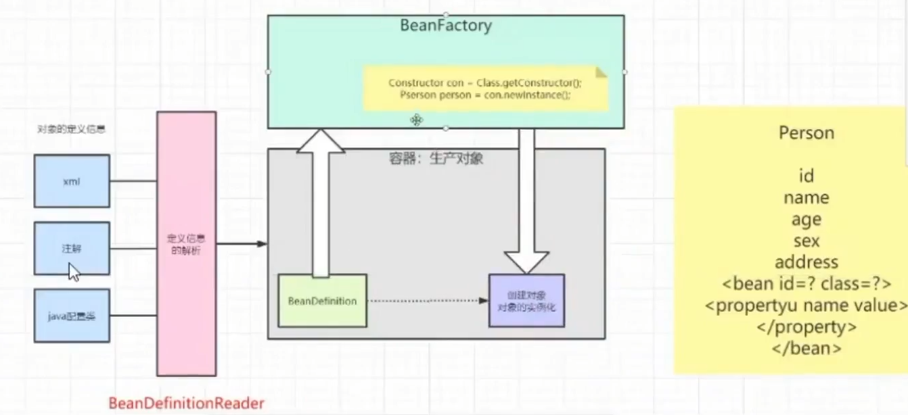

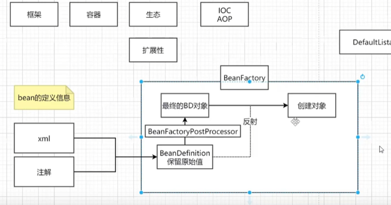

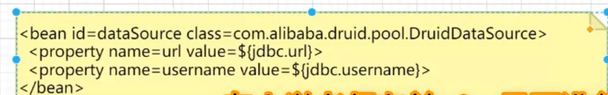

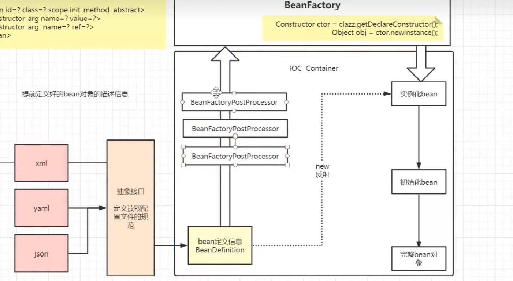

 

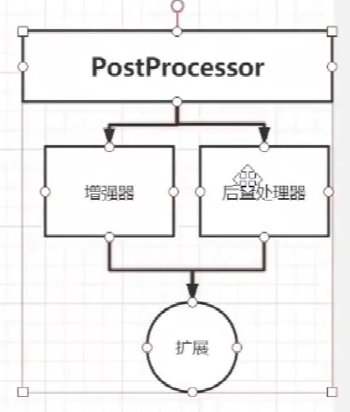


### refresh的13个方法

* 先看有没有beanfactory对象没有的话直接创建 new一个DefaultListableBeanFactory对象叫beanFactory，有的话销毁了再创建bean工厂

* 此时xml读入后   这个BeanDefinition对象都是默认值

* 下面加载beanFactory得到BeanDefinition对象此时还是原始值${jdbc.url}，还没替换

* 此时执行invokeBeanFactoryPostProcessor增强器，完成替换值 url username都替换了

* 可以放监听器 ，监听事件 在我实例化前准备工作要做到位

* 国际化处理：切换语言的

* 初始化多播器 就是监听器

* 这时候可以单例化的实例操作了 非懒加载

* 反射开始 docreatebean方法 Constructor ctor = clazz.getDeclareConstructor();Object obj =  ctor.newInstance();

* 对象实例化好了 开始填充属性 把配置文件里的属性值填充进来 譬如你名字叫张三就填充张三

* 下面进行实现aware接口，实现容器对象的赋值

* 下面进行before增强 

* init方法

* after 增强--- AOP是一个小功能

* 结束可以直接拿对象 getbean（）方法

* 最后 结束了 init-destory销毁

  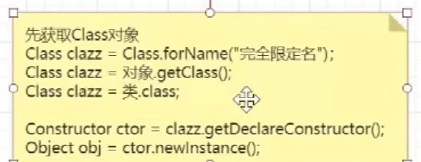

上图解析：首先xml和注解通过一系列操作得到BeanDefinition的对象此时是原始值也就是占位符未被替换，经过BeanFactoryPostProcessor将值替换得到最终的BeanDefinition对象

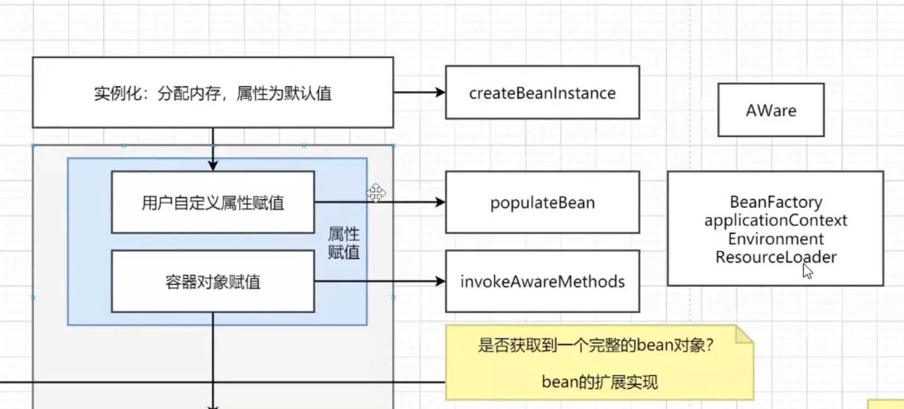

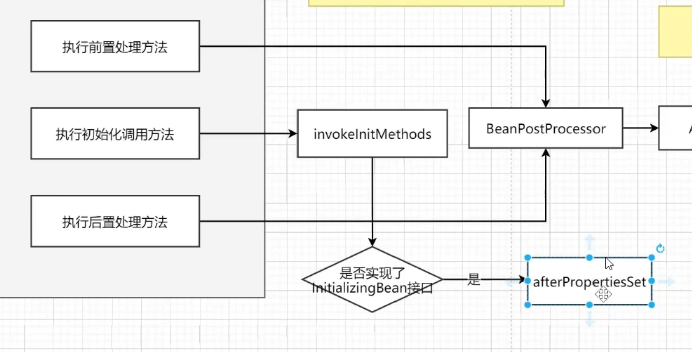

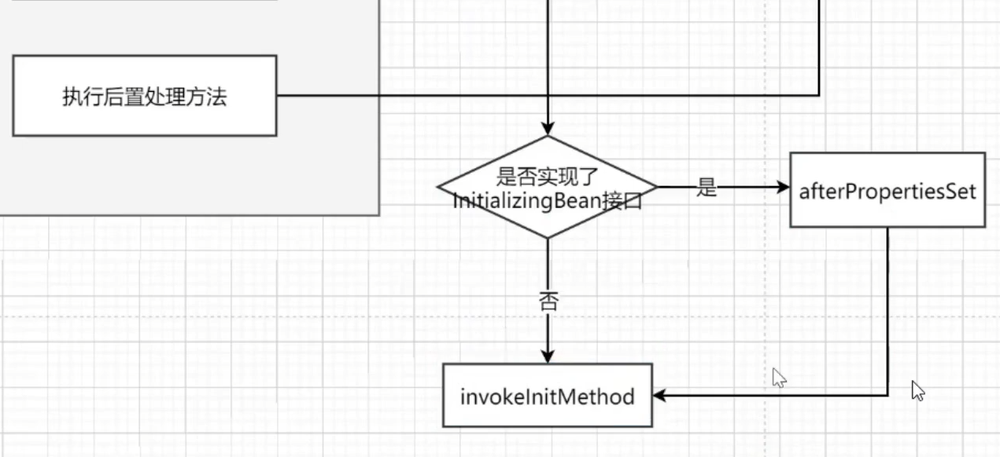

### 理解bean的生命周期

* 实例化 分配内存、属性默认值
* 用户自定义属性（set get）
* 容器对象赋值 通过实现aware接口来完成set get赋值
* 下面全是spring扩展实现 初始化前置处理方法
* 初始化（不是前一个初始化） 应该叫做执行初始化调用方法
* 后置处理方法---->AOP
* 使用对象
* 销毁对象

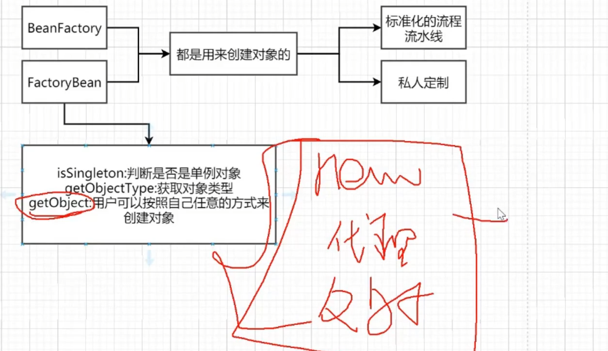

FactoryBean你可以按照自己想的方式去生成对象new 代理 反射生成对象，而不需要去经历Bean的生命周期

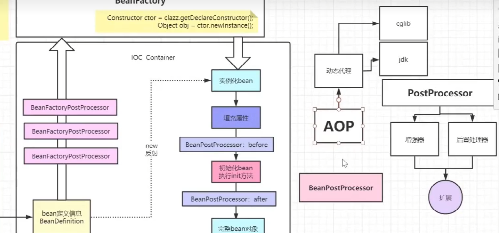

### 什么是Spring IOC容器

**IOC即控制反转，总结而言就是借助IOC容器实现对象之间的解耦并完成对象的创建、配置它们并管理它们的完整生命周期。**IOC的实现方式有依赖注入和依赖查找，依赖查找基本用的很少，所以IOC又叫依赖注入，依赖注入。依赖注入指对象被动地接受依赖类而不用自己主动去找，对象不是从容器中查找它依赖的类，而是在容器实例化对象时主动将它依赖的类注入给它。假设一个 Car 类需要一个 Engine 的对象，那么一般需要需要手动 new 一个 Engine，利用 IoC 就只需要定义一个私有的 Engine 类型的成员变量，容器会在运行时自动创建一个 Engine 的实例对象并将引用自动注入给成员变量。  

* 通过xml文件经过抽象接口（定义读取配置文件的规范）BeanDefinationReader（抽象接口）定义信息解析出BeanDefinaition

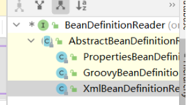

BeanDefinationReader实现类，能够实现对应的功能，解析出BeanDefination

**过程**

* xml配置文件，配置创建的对象（在spring配置文件中，使用bean标签，标签里面添加对应属性，就可以实现对象的创建，默认是无参构造函数）

  * bean中的属性
    * id属性：唯一标识（不允许重复）
    * class属性：类的全路径（包类路径）

  ~~~~java
  <bean id = "userdao" class = "com.atguigu.UserDao"></bean>
  ~~~~

* 创建工厂类（直接当作容器 直接通过beanfactory获得对象，ApplicationContext继承beanfactory）

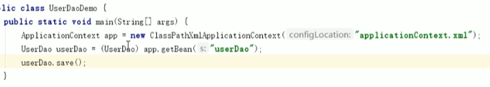

* 通过反射读取到字节码，也就是.class文件，进行对象的创建 先获取class对象 Class.forName("完全限定名");或者对象.getClass()或者类.class             下面是第一种                  clazz.newInstance();

* 还有    Constructor ctor = clazz.getDeclareConstructor();Object obj =  ctor.newInstance();

  

~~~java
class UserFactory{
	public static UserDao getDao()
    {
    	String classValue = class属性值//1.xml解析
        Class clazz = Class.forName(classValue);
        return (UserDao)clazz.newInstance();
    }
}
~~~

**接口**

IOC思想基于IOC容器完成，IOC容器的底层就是对象工厂（beanfactory里有很多抽象类和接口）

Spring提供IOC容器实现的两个方式（接口）

* BeanFactory：IOC容器基本实现，是Spring内部的使用接口，不提供开发人员使用
* ApplicationContext：BeanFactory的子接口，提供更多更强大的功能，由开发人员使用

Spring 时代我们一般通过 XML 文件来配置 Bean，后来开发人员觉得 XML 文件来配置不太好，于是 SpringBoot 注解配置就慢慢开始流行起来。

### 什么是依赖注入？可以通过多少种方式完成依赖注入？

在依赖注入中，您不必创建对象，但必须描述如何创建它们。您不是直接在代码中将组件和服务连接在一起，而是描述配置文件中哪些组件需要哪些服务。由loC容器将它们装配在一起。通常，依赖注入可以通过三种方式完成，即: 

解决的问题就是：业务层需要调用持久层的方法，不想编写程序来写出依赖关系，而想通过Spring来维护，通过spring自动把持久层对象传入业务层，不用我们自己去获取，去把UserDao注入到UserService

* 构造函数注入（有参构造）
* setter注入

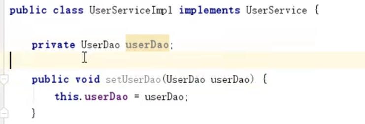

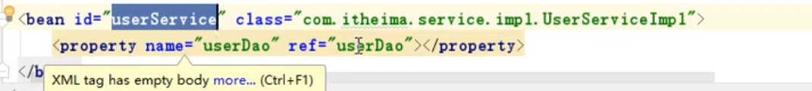

* 接口注入
* 在SpringFramework中，仅使用构造函数和setter注入。

### 区分BeanFactory和ApplicationContext？

| BeanFactory                | ApplicationContext       |
| -------------------------- | ------------------------ |
| 它使用懒加载               | 它使用即时加载           |
| 它使用语法显示提供资源对象 | 它自己创建和管理资源对象 |
| 不支持基于依赖的注解       | 支持依赖的注解           |

BeanFactory和ApplicationContext的优缺点分析:
**BeanFactory的优缺点:**

* 优点:应用启动的时候占用资源很少，对资源要求较高的应用，比较有优势;
* 缺点:运行速度会相对来说慢一些。而且有可能会出现空指针异常的错误，而且通过Bean工厂创建的Bean生命周期会简单一些。

**ApplicationContext的优缺点:**（ClassPathXmlApplication实现类，getbean（））

* 优点:所有的Bean在启动的时候都进行了加载，系统运行的速度快;在系统启动的时候，可以发现系统中的配置问题。
* 缺点:把费时的操作放到系统启动中完成，所有的对象都可以预加载，缺点就是内存占用较大。

####  Bean 的作用范围

​	通过 scope 属性指定 bean 的作用范围，包括：
​		① singleton：单例模式，是默认作用域，不管收到多少 Bean 请求每个容器中只有一个唯一的 Bean实例。
​		② prototype：原型模式，和 singleton 相反，每次 Bean 请求都会创建一个新的实例，多例的。
​		③ request：每次 HTTP 请求都会创建一个新的 Bean 并把它放到 request 域中，在请求完成后 Bean会失效并被垃圾收集器回收。
​		④ session：和 request 类似，确保每个 session 中有一个 Bean 实例，session 过期后 bean 会随之失效。
​		⑤ global session：当应用部署在 Portlet 容器时，如果想让所有 Portlet 共用全局存储变量，那么该变量需要存储在 global session 中。

#### Bean 的生命周期

* (1)通过构造器创建bean实例(无参数构造) 
* (2)为bean的属性设置值和对其他bean引用(调用set方法)。
* (3)调用bean的初始化的方法(在xml中需要进行配置初始化的方法init-Method)。
* (4) bean可以使用了(对象获取到了)
* (5)当容器关闭时候，调用bean的销毁的方法(需要进行配置销毁的方法)destroy-method属性 
* 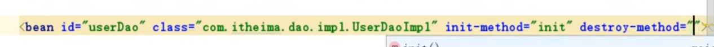

#### 数据源（Druid）

* 提高程序性能
* 实例化数据源    初始化部分连接资源
* 使用获取
* 用完还回去
* 步骤
  * 导入数据源的坐标和数据库驱动 坐标
  * 创建数据源对象
  * 设置数据源

#### Spring如何解决循环依赖

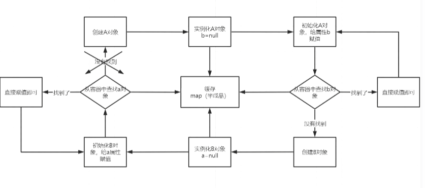

* 三级缓存，提前暴露对象 AOP

* 总：循环依赖问题 A依赖B B依赖A

* 分：说明bean的创建过程：实例化 初始化  （属性赋值）

* 打断闭环操作 1先创建A对象 实例化A对象，A对象中的B属性为空，填充属性B

* 从容器中查找B对象，找到了直接赋值，不存在循环依赖的问题（不通），找不到直接创建B对象

* 实例化B对象，此时B对象中的A属性为空，填充属性A

* 从容器中查找A对象，找不到直接创建，上述形成闭环原因

* 此时仔细琢磨 A对象存在，此时A对象不是一个完整状态，只完成实例化未完成初始化 也就是半初始化状态如果在程序调用过程中

  拥有了某个对象的引用，能否后期给他完成赋值操作，可以优先把非完整状态的对象优先赋值，等待后序操作来完成赋值，相当于提前暴露了某个不完整对象的引用，所以解决问题的核心就在于实例化和初始化分开操作，所有对象都完成实例化和初始化操作后，还要把完整对象放到容器中，此时在容器中存在对象的几个状态，完成实例化未完成初始化、完整状态，因为在容器中所以就要采取不同的容器存储，此时就有了一级缓存和二级缓存。如果一级缓存中有 二级缓存就不会存在同名对象，因为他们查找顺序是123，这样的方式来查找的 一级缓存中存放的完整对象 二级缓存中放的是非完整对象，半成品

  为什么需要三级缓存 三级缓存的value类型是ObjectFactory，是一个函数式接口，存在的意义是保证在整个容器的运行过程中只能有一个同名bean的对象

  如果一个对象被代理，是要生成一个普通对象的。

  普通对象和代理对象是不能同时出现在容器中的，当一个对象需要被代理的时候，就需要代理对象覆盖掉之前的普通对象，实际的调用过程中，是没有办法确定什么时候对象被使用的，所以就要求某个对象被调用的时候，优先判断此对象是否需要被代理，类似回调机制的实现，因此传入lambda表达式，可以通过lambda表达式来执行对象的覆盖过程，getEarlyBeanReference（）

  因此所有的bean的对象优先放到三级缓存中，如果需要被代理，则返回代理对象，不需要被代理返回普通对象

  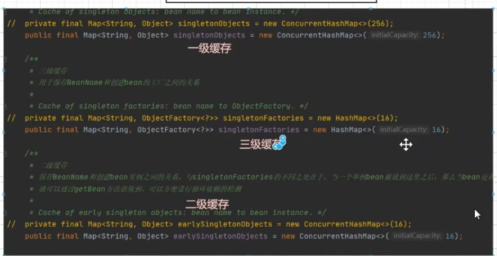


#### 通过注解创建 Bean

​		@Component 把当前类对象存入 Spring 容器中，相当于在 xml 中配置一个 bean 标签。value 属性指定 bean 的 id，不加的话，默认使用当前类的首字母小写的类名。

~~~java
@Component(value = "userService")
public class UserService
{
    public void add(){
    	System.out.println("add.....")
     }
}
~~~

​		@Controller ， @Service ， @Repository 三个注解都是 @Component 的衍生注解，作用及属性都是一模一样的。只是提供了更加明确语义， @Controller 用于表现层， @Service 用于业务层，@Repository 用于持久层。如果注解中有且只有一个 value 属性要赋值时可以省略 value。把类交给spring管理

* @Controller 注解主要声明将控制器类配置给Spring管理，例如Servlet
* @Service 注解主要声明业务处理类配置Spring管理，Service接口的实现类
* @Repository直接主要声明持久化类配置给Spring管理，DAO接口
* @Component除了控制器、service和DAO之外的类一律使用此注解声明

​		如果想将第三方的类变成组件又没有源代码，也就没办法使用 @Component 进行自动配置，这种时候就要使用 @Bean 注解。被 @Bean 注解的方法返回值是一个对象，将会实例化，配置和初始化一个新对象并返回，这个对象由 Spring 的 IoC 容器管理。name 属性用于给当前 @Bean 注解方法创建的对象指定一个名称，即 bean 的 id。当使用注解配置方法时，如果方法有参数，Spring 会去容器查找是否有可用 bean对象，查找方式和 @Autowired 一样。

#### 通过注解方式实现属性注入

~~~~java
//@Autowired   根据类型装配 UserDao
//第一步 把service和dao对象创建，在service和dao类添加对象注解
//第二步 在service注入dao对象，在service类添加dao类型属性，在属性上面使用注解。
@Service
public class UserService{
    //定义dao类型属性。
	//不需要添加set方法
	//添加注入属性注解。
	@Autowired
    private UserDao userdao;
    public void add(){
    	System.out.println("service add.......");
        userDao.add();
    }
}
//@Qualifier 根据名称进行注入 搭配Autowired一起使用
@Service
public class UserService{
    //定义dao类型属性。
	//不需要添加set方法
	//添加注入属性注解。
	@Autowired
    @Qualifier(value = "userdao1")//这里的目的就是UserDao接口有很多实现类，你可以指定注入具体的实现类，通过名称 以防你有多个子类继承userDao
    private UserDao userdao;
    public void add(){
    	System.out.println("service add.......");
        userDao.add();//多态父类的引用指向子类的对象，调用的方法是子类重写之后的方法
    }
}
// 上面两个都是spring里的包 Resource是javax扩展包里的 不建议但是功能可以的
@Service
public class UserService{
	@Resource //先byname找userdao  没找到就根据类型UserDao进行注入
    private UserDao userdao;
    public void add(){
    	System.out.println("service add.......");
        userDao.add();
    }
}
@Service
public class UserService{
	@Resource(name = "userDaoImpl1") //根据类型进行注入
    private UserDao userdao;
    public void add(){
    	System.out.println("service add.......");
        userDao.add();
    }
}
~~~~

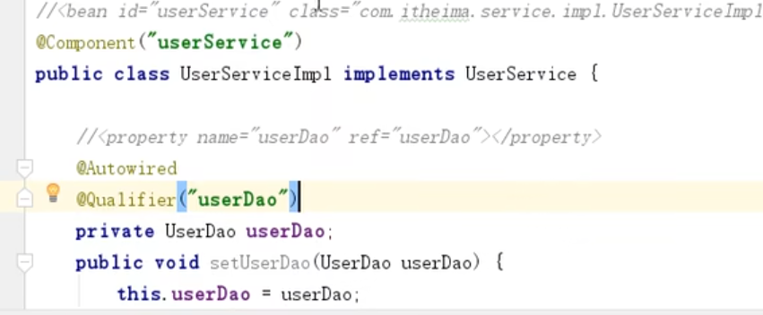

#### AOP

​		AOP 即面向切面编程，简单地说就是将代码中重复的部分抽取出来，在需要执行的时候使用动态代理技术，在不修改源码的基础上对方法进行增强，将切面织入到主业务中。
​		Spring 根据类是否实现接口来判断动态代理方式，如果实现接口会使用 JDK 的动态代理，核心是InvocationHandler 接口和 Proxy 类，**用proxy里面的newProxyInstance创建接口实现类的代理对象**。如果没有实现接口会使用 CGLib 动态代理，CGLib 是在运行时动态生成某个类的子类，如果某个类被标记为 final，不能使用 CGLib 。
​		JDK 动态代理主要通过重组字节码实现，首先获得被代理对象的引用和所有接口，生成新的类必须实现被代理类的所有接口，动态生成Java 代码后编译新生成的 .class 文件并重新加载到 JVM 运行。JDK代理直接写 Class 字节码，CGLib 是采用 ASM 框架写字节码，生成代理类的效率低。但是 CGLib 调用方法的效率高，因为 JDK 使用反射调用方法，CGLib 使用 FastClass 机制为代理类和被代理类各生成一个类，这个类会为代理类或被代理类的方法生成一个 index，这个 index 可以作为参数直接定位要调用的方法。
​		常用场景包括权限认证、自动缓存、错误处理、日志、调试和事务等。

**总结：AOP是面向切面编程，AOP关注的不再是程序代码中某个类，某些方法，考虑的是面到面，层与层之间的切入；AOP通常用来做一 些公共性的重复功能，比如安全控制、性能统计、日志记录；AOP作用是降低模块之间的耦合度，提高业务代码的聚合度，实现高内聚低耦合，提高代码的复用性，在不影响原有代码的情况下添加一些额外的功能；AOP的底层是动态代理实现的。**

AOP(Aspect-Oriented Programming:面向切面编程)能够将那些与业务无关，却为业务模块所共同调用的逻辑或责任（例如事务处理、日志管理、权限控制等）封装起来，便于减少系统的重复代码，降低模块间的耦合度，并有利于未来的可拓展性和可维护性。

~~~~java
UserDao dao = (UserDao)Proxy.newProxyInstance(JDKProxy.class.getClassLoader(),interfaces,new UserDao(userDao));
~~~~

#### 连接点 切入点  通知（增强）

* 连接点：类里面哪些方法可以被增强，这些方法称为连接点

* 切入点：实际被真正增强的方法被称为切入点

* 通知（增强）：实际增强逻辑部分就叫通知或者增强

  ​                                                         JDK动态代理：创建接口实现类代理对象，增强类的方法

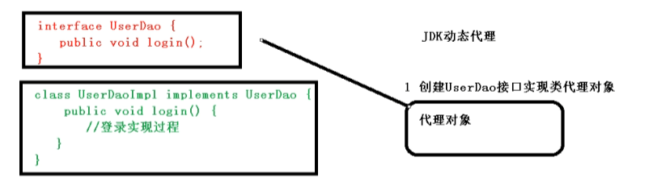

​                                                               CGLIB动态代理:创建子类的代理对象，增强类的方法

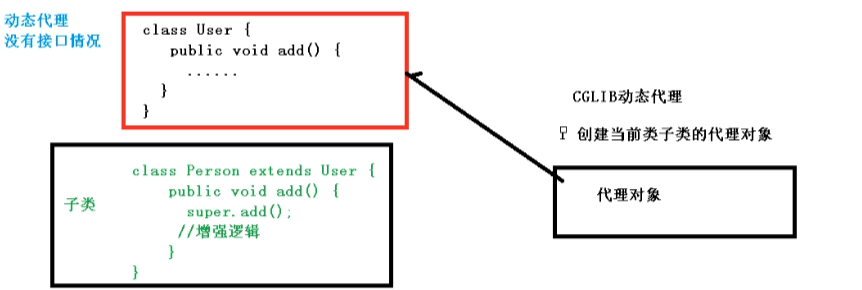

#### 谈谈IOC和AOP的理解

IOC控制反转 AOP面向切面编程

Spring要自己控制和管理Bean，就需要从配置到实例化设置属性初始化这一套都要自己做，自己要操作bean，因此叫做控制反转
AOP叫做切面编程统一做局部功能的加强，Spring想要通过ioc控制反转来创建bean，就需要自己从xml和注解中读取资源文件，把bean对象通过BeanDefineReader，把bean对象读取为BeanDefinition，然后进行实例化，属性填充
AOP实现的是使用JDK动态代理和CGlib动态代理实现的功能增加，譬如日志的功能

#### Bean的生命周期

在 IoC 容器的初始化过程中会对 Bean 定义完成资源定位，加载读取配置并解析，最后将解析的 Bean信息放在一个 HashMap 集合中。当 IoC 容器初始化完成后，会进行对 Bean 实例的创建和依赖注入过程，注入对象依赖的各种属性值，在初始化时可以指定自定义的初始化方法。经过这一系列初始化操作后 Bean 达到可用状态，接下来就可以使用 Bean 了，当使用完成后会调用 destroy 方法进行销毁，此
时也可以指定自定义的销毁方法，最终 Bean 被销毁且从容器中移除。
XML 方式通过配置 bean 标签中的 init-Method 和 destory-Method 指定自定义初始化和销毁方法。
注解方式通过配置 @Bean 注解中的 init-Method 和 destory-Method 指定自定义初始化和销毁方法。  

#### BeanFactory、FactoryBean 和 ApplicationContext 的区别

* BeanFactory 是一个 Bean 工厂，使用简单工厂模式，是 Spring IoC 容器顶级接口，可以理解为含有Bean 集合的工厂类，作用是管理 Bean，包括实例化、定位、配置对象及建立这些对象间的依赖。BeanFactory 实例化后并不会自动实例化 Bean，只有当 Bean 被使用时才实例化与装配依赖关系，属于延迟加载，适合多例模式。简而言之**创建一系列的类似对象**
* FactoryBean 是一个工厂 Bean，使用了工厂方法模式，作用是生产其他 Bean 实例，可以通过实现该接口，提供一个工厂方法来自定义实例化 Bean 的逻辑。FactoryBean 接口由 BeanFactory 中配置的对象实现，这些对象本身就是用于创建对象的工厂，如果一个 Bean 实现了这个接口，那么它就是创建对象的工厂 Bean，而不是 Bean 实例本身。简而言之**生成一个有很复杂属性的对象**
* ApplicationConext 是 BeanFactory 的子接口，扩展了 BeanFactory 的功能，提供了支持国际化的文本消息，统一的资源文件读取方式，事件传播以及应用层的特别配置等。容器会在初始化时对配置的Bean 进行预实例化，Bean 的依赖注入在容器初始化时就已经完成，属于立即加载，适合单例模式，一般推荐使用  

#### Springboot 事务

* Spring事务机制根据数据库事务和AOP机制的
* 首先对使用@Transctional注解的Bean，Spring会创建一个代理对象作为Bean
* 利用数据库管理器创建一个数据库连接
* 修改数据库连接的auto commit为false，禁止连接的自动提交
* 没出现异常就提交
* 出现异常就回滚

* 编程式事务管理 这意味着你可以通过编程的方式管理事务，这种方式带来了很大的灵活性，但很难维护。
* 声明式事务管理，基于AOP原理的注解@Transcational 这种方式意味着你可以将事务管理和业务代码分离。你只需要通过注解或者XML配置管理事务

#### Springboot Starter的工作原理

总结一下，其实就是Spring Boot在启动的时候，按照约定去读取Spring Boot Starter的配置信息，再根据配置信息对资源进行初始化，并注入到Spring容器中。这样Spring Boot启动完毕后，就已经准备好了一切资源，使用过程中直接注入对应Bean资源即可

#### Spring优势

* 方便解耦，简化开发
* AOP编程支持
* 声明式事务的支持
* 方便程序的测试
* 方便集成优秀的框架


## Mybatis

### #{} 和 \${} 的区别是什么？

答：

- `${}`是 Properties 文件中的变量占位符，它可以用于标签属性值和 sql 内部，属于静态文本替换，比如\${driver}会被静态替换为`com.mysql.jdbc. Driver`。
- `#{}`是 sql 的参数占位符，MyBatis 会将 sql 中的`#{}`替换为? 号，在 sql 执行前会使用 PreparedStatement 的参数设置方法，按序给 sql 的? 号占位符设置参数值，比如 ps.setInt(0, parameterValue)，`#{item.name}` 的取值方式为使用反射从参数对象中获取 item 对象的 name 属性值，相当于 `param.getItem().getName()`。

### xml 映射文件中，除了常见的 select、insert、update、delete 标签之外，还有哪些标签？

答：还有很多其他的标签， `<resultMap>`、 `<parameterMap>`、 `<sql>`、 `<include>`、 `<selectKey>` ，加上动态 sql 的 9 个标签， `trim|where|set|foreach|if|choose|when|otherwise|bind` 等，其中 `<sql>` 为 sql 片段标签，通过 `<include>` 标签引入 sql 片段， `<selectKey>` 为不支持自增的主键生成策略标签。

### Dao 接口的工作原理是什么？Dao 接口里的方法，参数不同时，方法能重载吗？

答：最佳实践中，通常一个 xml 映射文件，都会写一个 Dao 接口与之对应。Dao 接口就是人们常说的 `Mapper` 接口，接口的全限名，就是映射文件中的 namespace 的值，接口的方法名，就是映射文件中 `MappedStatement` 的 id 值，接口方法内的参数，就是传递给 sql 的参数。 `Mapper` 接口是没有实现类的，当调用接口方法时，接口全限名+方法名拼接字符串作为 key 值，可唯一定位一个 `MappedStatement` ，举例：`com.mybatis3.mappers. StudentDao.findStudentById` ，可以唯一找到 namespace 为 `com.mybatis3.mappers. StudentDao` 下面 `id = findStudentById` 的 `MappedStatement` 。在 MyBatis 中，每一个 `<select>`、 `<insert>`、 `<update>`、 `<delete>` 标签，都会被解析为一个 `MappedStatement` 对象。

Dao 接口里的方法可以重载，但是 Mybatis 的 xml 里面的 ID 不允许重复。

Mybatis 版本 3.3.0，亲测如下：

```java
/**
 * Mapper接口里面方法重载
 */
public interface StuMapper {

 List<Student> getAllStu();

 List<Student> getAllStu(@Param("id") Integer id);
}
```

然后在 `StuMapper.xml` 中利用 Mybatis 的动态 sql 就可以实现。

```xml
<select id="getAllStu" resultType="com.pojo.Student">
  select * from student
  <where>
    <if test="id != null">
      id = #{id}
    </if>
  </where>
</select>
```

能正常运行，并能得到相应的结果，这样就实现了在 Dao 接口中写重载方法。

**Mybatis 的 Dao 接口可以有多个重载方法，但是多个接口对应的映射必须只有一个，否则启动会报错。**

相关 issue：更正：Dao 接口里的方法可以重载，但是 Mybatis 的 xml 里面的 ID 不允许重复！

Dao 接口的工作原理是 JDK 动态代理，MyBatis 运行时会使用 JDK 动态代理为 Dao 接口生成代理 proxy 对象，代理对象 proxy 会拦截接口方法，转而执行 `MappedStatement` 所代表的 sql，然后将 sql 执行结果返回。

**补充**：

Dao 接口方法可以重载，但是需要满足以下条件：

1. 仅有一个无参方法和一个有参方法
2. 多个有参方法时，参数数量必须一致。且使用相同的 `@Param` ，或者使用 `param1` 这种

**测试如下**：

`PersonDao.java`

```java
Person queryById();

Person queryById(@Param("id") Long id);

Person queryById(@Param("id") Long id, @Param("name") String name);
```

`PersonMapper.xml`

```xml
<select id="queryById" resultMap="PersonMap">
    select
      id, name, age, address
    from person
    <where>
        <if test="id != null">
            id = #{id}
        </if>
        <if test="name != null and name != ''">
            name = #{name}
        </if>
    </where>
    limit 1
</select>
```

`org.apache.ibatis.scripting.xmltags. DynamicContext. ContextAccessor#getProperty` 方法用于获取 `<if>` 标签中的条件值

```java
public Object getProperty(Map context, Object target, Object name) {
  Map map = (Map) target;

  Object result = map.get(name);
  if (map.containsKey(name) || result != null) {
    return result;
  }

  Object parameterObject = map.get(PARAMETER_OBJECT_KEY);
  if (parameterObject instanceof Map) {
    return ((Map)parameterObject).get(name);
  }

  return null;
}
```

`parameterObject` 为 map，存放的是 Dao 接口中参数相关信息。

`((Map)parameterObject).get(name)` 方法如下

```java
public V get(Object key) {
  if (!super.containsKey(key)) {
    throw new BindingException("Parameter '" + key + "' not found. Available parameters are " + keySet());
  }
  return super.get(key);
}
```

1. `queryById()`方法执行时，`parameterObject`为 null，`getProperty`方法返回 null 值，`<if>`标签获取的所有条件值都为 null，所有条件不成立，动态 sql 可以正常执行。
2. `queryById(1L)`方法执行时，`parameterObject`为 map，包含了`id`和`param1`两个 key 值。当获取`<if>`标签中`name`的属性值时，进入`((Map)parameterObject).get(name)`方法中，map 中 key 不包含`name`，所以抛出异常。
3. `queryById(1L,"1")`方法执行时，`parameterObject`中包含`id`,`param1`,`name`,`param2`四个 key 值，`id`和`name`属性都可以获取到，动态 sql 正常执行。

### MyBatis 是如何进行分页的？分页插件的原理是什么？

答：**(1)** MyBatis 使用 RowBounds 对象进行分页，它是针对 ResultSet 结果集执行的内存分页，而非物理分页；

**(2)** 可以在 sql 内直接书写带有物理分页的参数来完成物理分页功能，**(3)** 也可以使用分页插件来完成物理分页。

分页插件的基本原理是使用 MyBatis 提供的插件接口，实现自定义插件，在插件的拦截方法内拦截待执行的 sql，然后重写 sql，根据 dialect 方言，添加对应的物理分页语句和物理分页参数。

举例：`select _ from student` ，拦截 sql 后重写为：`select t._ from （select \* from student）t limit 0，10`

### 简述 MyBatis 的插件运行原理，以及如何编写一个插件

答：MyBatis 仅可以编写针对 `ParameterHandler`、 `ResultSetHandler`、 `StatementHandler`、 `Executor` 这 4 种接口的插件，MyBatis 使用 JDK 的动态代理，为需要拦截的接口生成代理对象以实现接口方法拦截功能，每当执行这 4 种接口对象的方法时，就会进入拦截方法，具体就是 `InvocationHandler` 的 `invoke()` 方法，当然，只会拦截那些你指定需要拦截的方法。

实现 MyBatis 的 `Interceptor` 接口并复写 `intercept()` 方法，然后在给插件编写注解，指定要拦截哪一个接口的哪些方法即可，记住，别忘了在配置文件中配置你编写的插件。

### MyBatis 执行批量插入，能返回数据库主键列表吗？

答：能，JDBC 都能，MyBatis 当然也能。

### MyBatis 动态 sql 是做什么的？都有哪些动态 sql？能简述一下动态 sql 的执行原理不？

答：MyBatis 动态 sql 可以让我们在 xml 映射文件内，以标签的形式编写动态 sql，完成逻辑判断和动态拼接 sql 的功能。其执行原理为，使用 OGNL 从 sql 参数对象中计算表达式的值，根据表达式的值动态拼接 sql，以此来完成动态 sql 的功能。

MyBatis 提供了 9 种动态 sql 标签:

- `<if></if>`
- `<where></where>(trim,set)`
- `<choose></choose>（when, otherwise）`
- `<foreach></foreach>`
- `<bind/>`

### MyBatis 是如何将 sql 执行结果封装为目标对象并返回的？都有哪些映射形式？

答：第一种是使用 `<resultMap>` 标签，逐一定义列名和对象属性名之间的映射关系。第二种是使用 sql 列的别名功能，将列别名书写为对象属性名，比如 T_NAME AS NAME，对象属性名一般是 name，小写，但是列名不区分大小写，MyBatis 会忽略列名大小写，智能找到与之对应对象属性名，你甚至可以写成 T_NAME AS NaMe，MyBatis 一样可以正常工作。

有了列名与属性名的映射关系后，MyBatis 通过反射创建对象，同时使用反射给对象的属性逐一赋值并返回，那些找不到映射关系的属性，是无法完成赋值的。

### MyBatis 能执行一对一、一对多的关联查询吗？都有哪些实现方式，以及它们之间的区别

答：能，MyBatis 不仅可以执行一对一、一对多的关联查询，还可以执行多对一，多对多的关联查询，多对一查询，其实就是一对一查询，只需要把 `selectOne()` 修改为 `selectList()` 即可；多对多查询，其实就是一对多查询，只需要把 `selectOne()` 修改为 `selectList()` 即可。

关联对象查询，有两种实现方式，一种是单独发送一个 sql 去查询关联对象，赋给主对象，然后返回主对象。另一种是使用嵌套查询，嵌套查询的含义为使用 join 查询，一部分列是 A 对象的属性值，另外一部分列是关联对象 B 的属性值，好处是只发一个 sql 查询，就可以把主对象和其关联对象查出来。

那么问题来了，join 查询出来 100 条记录，如何确定主对象是 5 个，而不是 100 个？其去重复的原理是 `<resultMap>` 标签内的 `<id>` 子标签，指定了唯一确定一条记录的 id 列，MyBatis 根据 `<id>` 列值来完成 100 条记录的去重复功能， `<id>` 可以有多个，代表了联合主键的语意。

同样主对象的关联对象，也是根据这个原理去重复的，尽管一般情况下，只有主对象会有重复记录，关联对象一般不会重复。

举例：下面 join 查询出来 6 条记录，一、二列是 Teacher 对象列，第三列为 Student 对象列，MyBatis 去重复处理后，结果为 1 个老师 6 个学生，而不是 6 个老师 6 个学生。

| t_id | t_name  | s_id |
| ---- | ------- | ---- |
| 1    | teacher | 38   |
| 1    | teacher | 39   |
| 1    | teacher | 40   |
| 1    | teacher | 41   |
| 1    | teacher | 42   |
| 1    | teacher | 43   |

### MyBatis 是否支持延迟加载？如果支持，它的实现原理是什么？

答：MyBatis 仅支持 association 关联对象和 collection 关联集合对象的延迟加载，association 指的就是一对一，collection 指的就是一对多查询。在 MyBatis 配置文件中，可以配置是否启用延迟加载 `lazyLoadingEnabled=true|false。`

它的原理是，使用 `CGLIB` 创建目标对象的代理对象，当调用目标方法时，进入拦截器方法，比如调用 `a.getB().getName()` ，拦截器 `invoke()` 方法发现 `a.getB()` 是 null 值，那么就会单独发送事先保存好的查询关联 B 对象的 sql，把 B 查询上来，然后调用 a.setB(b)，于是 a 的对象 b 属性就有值了，接着完成 `a.getB().getName()` 方法的调用。这就是延迟加载的基本原理。

当然了，不光是 MyBatis，几乎所有的包括 Hibernate，支持延迟加载的原理都是一样的。

### MyBatis 的 xml 映射文件中，不同的 xml 映射文件，id 是否可以重复？

答：不同的 xml 映射文件，如果配置了 namespace，那么 id 可以重复；如果没有配置 namespace，那么 id 不能重复；毕竟 namespace 不是必须的，只是最佳实践而已。

原因就是 namespace+id 是作为 `Map<String, MappedStatement>` 的 key 使用的，如果没有 namespace，就剩下 id，那么，id 重复会导致数据互相覆盖。有了 namespace，自然 id 就可以重复，namespace 不同，namespace+id 自然也就不同。

### MyBatis 中如何执行批处理？

答：使用 `BatchExecutor` 完成批处理。

### MyBatis 都有哪些 Executor 执行器？它们之间的区别是什么？

答：MyBatis 有三种基本的 `Executor` 执行器：

- **`SimpleExecutor`：** 每执行一次 update 或 select，就开启一个 Statement 对象，用完立刻关闭 Statement 对象。
- **`ReuseExecutor`：** 执行 update 或 select，以 sql 作为 key 查找 Statement 对象，存在就使用，不存在就创建，用完后，不关闭 Statement 对象，而是放置于 Map<String, Statement>内，供下一次使用。简言之，就是重复使用 Statement 对象。
- **`BatchExecutor`**：执行 update（没有 select，JDBC 批处理不支持 select），将所有 sql 都添加到批处理中（addBatch()），等待统一执行（executeBatch()），它缓存了多个 Statement 对象，每个 Statement 对象都是 addBatch()完毕后，等待逐一执行 executeBatch()批处理。与 JDBC 批处理相同。

作用范围：`Executor` 的这些特点，都严格限制在 SqlSession 生命周期范围内。

### MyBatis 中如何指定使用哪一种 Executor 执行器？

答：在 MyBatis 配置文件中，可以指定默认的 `ExecutorType` 执行器类型，也可以手动给 `DefaultSqlSessionFactory` 的创建 SqlSession 的方法传递 `ExecutorType` 类型参数。

### MyBatis 是否可以映射 Enum 枚举类？

答：MyBatis 可以映射枚举类，不单可以映射枚举类，MyBatis 可以映射任何对象到表的一列上。映射方式为自定义一个 `TypeHandler` ，实现 `TypeHandler` 的 `setParameter()` 和 `getResult()` 接口方法。 `TypeHandler` 有两个作用：

- 一是完成从 javaType 至 jdbcType 的转换；
- 二是完成 jdbcType 至 javaType 的转换，体现为 `setParameter()` 和 `getResult()` 两个方法，分别代表设置 sql 问号占位符参数和获取列查询结果。

### MyBatis 映射文件中，如果 A 标签通过 include 引用了 B 标签的内容，请问，B 标签能否定义在 A 标签的后面，还是说必须定义在 A 标签的前面？

答：虽然 MyBatis 解析 xml 映射文件是按照顺序解析的，但是，被引用的 B 标签依然可以定义在任何地方，MyBatis 都可以正确识别。

原理是，MyBatis 解析 A 标签，发现 A 标签引用了 B 标签，但是 B 标签尚未解析到，尚不存在，此时，MyBatis 会将 A 标签标记为未解析状态，然后继续解析余下的标签，包含 B 标签，待所有标签解析完毕，MyBatis 会重新解析那些被标记为未解析的标签，此时再解析 A 标签时，B 标签已经存在，A 标签也就可以正常解析完成了。

### 简述 MyBatis 的 xml 映射文件和 MyBatis 内部数据结构之间的映射关系？

答：MyBatis 将所有 xml 配置信息都封装到 All-In-One 重量级对象 Configuration 内部。在 xml 映射文件中， `<parameterMap>` 标签会被解析为 `ParameterMap` 对象，其每个子元素会被解析为 ParameterMapping 对象。 `<resultMap>` 标签会被解析为 `ResultMap` 对象，其每个子元素会被解析为 `ResultMapping` 对象。每一个 `<select>、<insert>、<update>、<delete>` 标签均会被解析为 `MappedStatement` 对象，标签内的 sql 会被解析为 BoundSql 对象。

### 为什么说 MyBatis 是半自动 ORM 映射工具？它与全自动的区别在哪里？

答：Hibernate 属于全自动 ORM 映射工具，使用 Hibernate 查询关联对象或者关联集合对象时，可以根据对象关系模型直接获取，所以它是全自动的。而 MyBatis 在查询关联对象或关联集合对象时，需要手动编写 sql 来完成，所以，称之为半自动 ORM 映射工具。

面试题看似都很简单，但是想要能正确回答上来，必定是研究过源码且深入的人，而不是仅会使用的人或者用的很熟的人，以上所有面试题及其答案所涉及的内容，在我的 MyBatis 系列博客中都有详细讲解和原理分析。


## Spring&SpringBoot常用注解总结

### 1. `@SpringBootApplication`

这里先单独拎出`@SpringBootApplication` 注解说一下，虽然我们一般不会主动去使用它。

_Guide：这个注解是 Spring Boot 项目的基石，创建 SpringBoot 项目之后会默认在主类加上。_

```java
@SpringBootApplication
public class SpringSecurityJwtGuideApplication {
      public static void main(java.lang.String[] args) {
        SpringApplication.run(SpringSecurityJwtGuideApplication.class, args);
    }
}
```

我们可以把 `@SpringBootApplication`看作是 `@Configuration`、`@EnableAutoConfiguration`、`@ComponentScan` 注解的集合。

```java
package org.springframework.boot.autoconfigure;
@Target(ElementType.TYPE)
@Retention(RetentionPolicy.RUNTIME)
@Documented
@Inherited
@SpringBootConfiguration
@EnableAutoConfiguration
@ComponentScan(excludeFilters = {
		@Filter(type = FilterType.CUSTOM, classes = TypeExcludeFilter.class),
		@Filter(type = FilterType.CUSTOM, classes = AutoConfigurationExcludeFilter.class) })
public @interface SpringBootApplication {
   ......
}

package org.springframework.boot;
@Target(ElementType.TYPE)
@Retention(RetentionPolicy.RUNTIME)
@Documented
@Configuration
public @interface SpringBootConfiguration {

}
```

根据 SpringBoot 官网，这三个注解的作用分别是：

- `@EnableAutoConfiguration`：启用 SpringBoot 的自动配置机制
- `@ComponentScan`：扫描被`@Component` (`@Repository`,`@Service`,`@Controller`)注解的 bean，注解默认会扫描该类所在的包下所有的类。
- `@Configuration`：允许在 Spring 上下文中注册额外的 bean 或导入其他配置类

### 2. Spring Bean 相关

#### 2.1. `@Autowired`

自动导入对象到类中，被注入进的类同样要被 Spring 容器管理比如：Service 类注入到 Controller 类中。

```java
@Service
public class UserService {
  ......
}

@RestController
@RequestMapping("/users")
public class UserController {
   @Autowired
   private UserService userService;
   ......
}
```

#### 2.2. `@Component`,`@Repository`,`@Service`, `@Controller`

我们一般使用 `@Autowired` 注解让 Spring 容器帮我们自动装配 bean。要想把类标识成可用于 `@Autowired` 注解自动装配的 bean 的类,可以采用以下注解实现：

- `@Component`：通用的注解，可标注任意类为 `Spring` 组件。如果一个 Bean 不知道属于哪个层，可以使用`@Component` 注解标注。
- `@Repository` : 对应持久层即 Dao 层，主要用于数据库相关操作。
- `@Service` : 对应服务层，主要涉及一些复杂的逻辑，需要用到 Dao 层。
- `@Controller` : 对应 Spring MVC 控制层，主要用于接受用户请求并调用 Service 层返回数据给前端页面。

#### 2.3. `@RestController`

`@RestController`注解是`@Controller`和`@ResponseBody`的合集,表示这是个控制器 bean,并且是将函数的返回值直接填入 HTTP 响应体中,是 REST 风格的控制器。

_Guide：现在都是前后端分离，说实话我已经很久没有用过`@Controller`。如果你的项目太老了的话，就当我没说。_

单独使用 `@Controller` 不加 `@ResponseBody`的话一般是用在要返回一个视图的情况，这种情况属于比较传统的 Spring MVC 的应用，对应于前后端不分离的情况。`@Controller` +`@ResponseBody` 返回 JSON 或 XML 形式数据

关于`@RestController` 和 `@Controller`的对比

- @RestController加在类上面的注解，使得类里面的每个方法都将json/xml返回数据加返回到前台页面中

- @Controller加在类上面的注解，使得类里面的每个方法都返回一个试图页面

- @Controller和@ResponseBody（加在方法/类上面）一起使用，和@RestController的作用相同

- 为了兼容以前方式，RestController其实就是Controller，只是在Controller返回对象前，它干了件事情，通过注解标识@ResponseBody把返回的对象Object，转换成了JSON字符串。

  这里注意@Controller返回也是java对象，但它本质是SpringMVC框架的ModelAndView对象；
  而@RestController返回则是业务对象，或者统一的返回值对象 SysResult。

#### 2.4. `@Scope`

声明 Spring Bean 的作用域，使用方法:

```java
@Bean
@Scope("singleton")
public Person personSingleton() {
    return new Person();
}
```

**四种常见的 Spring Bean 的作用域：**

- singleton : 唯一 bean 实例，Spring 中的 bean 默认都是单例的。
- prototype : 每次请求都会创建一个新的 bean 实例。
- request : 每一次 HTTP 请求都会产生一个新的 bean，该 bean 仅在当前 HTTP request 内有效。
- session : 每一个 HTTP Session 会产生一个新的 bean，该 bean 仅在当前 HTTP session 内有效。

#### 2.5. `@Configuration`

一般用来声明配置类，可以使用 `@Component`注解替代，不过使用`@Configuration`注解声明配置类更加语义化。

```java
@Configuration
public class AppConfig {
    @Bean
    public TransferService transferService() {
        return new TransferServiceImpl();
    }

}
```

### 3. 处理常见的 HTTP 请求类型

**5 种常见的请求类型:**

- **GET**：请求从服务器获取特定资源。举个例子：`GET /users`（获取所有学生）
- **POST**：在服务器上创建一个新的资源。举个例子：`POST /users`（创建学生）
- **PUT**：更新服务器上的资源（客户端提供更新后的整个资源）。举个例子：`PUT /users/12`（更新编号为 12 的学生）
- **DELETE**：从服务器删除特定的资源。举个例子：`DELETE /users/12`（删除编号为 12 的学生）
- **PATCH**：更新服务器上的资源（客户端提供更改的属性，可以看做作是部分更新），使用的比较少，这里就不举例子了。

#### 3.1. GET 请求

`@GetMapping("users")` 等价于`@RequestMapping(value="/users",method=RequestMethod.GET)`

```java
@GetMapping("/users")
public ResponseEntity<List<User>> getAllUsers() {
 return userRepository.findAll();
}
```

#### 3.2. POST 请求

`@PostMapping("users")` 等价于`@RequestMapping(value="/users",method=RequestMethod.POST)`

关于`@RequestBody`注解的使用，在下面的“前后端传值”这块会讲到。

```java
@PostMapping("/users")
public ResponseEntity<User> createUser(@Valid @RequestBody UserCreateRequest userCreateRequest) {
 return userRespository.save(userCreateRequest);
}
```

#### 3.3. PUT 请求

`@PutMapping("/users/{userId}")` 等价于`@RequestMapping(value="/users/{userId}",method=RequestMethod.PUT)`

```java
@PutMapping("/users/{userId}")
public ResponseEntity<User> updateUser(@PathVariable(value = "userId") Long userId,
  @Valid @RequestBody UserUpdateRequest userUpdateRequest) {
  ......
}
```

#### 3.4. **DELETE 请求**

`@DeleteMapping("/users/{userId}")`等价于`@RequestMapping(value="/users/{userId}",method=RequestMethod.DELETE)`

```java
@DeleteMapping("/users/{userId}")
public ResponseEntity deleteUser(@PathVariable(value = "userId") Long userId){
  ......
}
```

#### 3.5. **PATCH 请求**

一般实际项目中，我们都是 PUT 不够用了之后才用 PATCH 请求去更新数据。

```java
  @PatchMapping("/profile")
  public ResponseEntity updateStudent(@RequestBody StudentUpdateRequest studentUpdateRequest) {
        studentRepository.updateDetail(studentUpdateRequest);
        return ResponseEntity.ok().build();
    }
```

### 4. 前后端传值

**掌握前后端传值的正确姿势，是你开始 CRUD 的第一步！**

#### 4.1. `@PathVariable` 和 `@RequestParam`

`@PathVariable`用于获取路径参数，`@RequestParam`用于获取查询参数。

举个简单的例子：

```java
@GetMapping("/klasses/{klassId}/teachers")
public List<Teacher> getKlassRelatedTeachers(
         @PathVariable("klassId") Long klassId,
         @RequestParam(value = "type", required = false) String type ) {
...
}
```

如果我们请求的 url 是：`/klasses/123456/teachers?type=web`

那么我们服务获取到的数据就是：`klassId=123456,type=web`。

#### 4.2. `@RequestBody`

用于读取 Request 请求（可能是 POST,PUT,DELETE,GET 请求）的 body 部分并且**Content-Type 为 application/json** 格式的数据，接收到数据之后会自动将数据绑定到 Java 对象上去。系统会使用`HttpMessageConverter`或者自定义的`HttpMessageConverter`将请求的 body 中的 json 字符串转换为 java 对象。

我用一个简单的例子来给演示一下基本使用！

我们有一个注册的接口：

```java
@PostMapping("/sign-up")
public ResponseEntity signUp(@RequestBody @Valid UserRegisterRequest userRegisterRequest) {
  userService.save(userRegisterRequest);
  return ResponseEntity.ok().build();
}
```

`UserRegisterRequest`对象：

```java
@Data
@AllArgsConstructor
@NoArgsConstructor
public class UserRegisterRequest {
    @NotBlank
    private String userName;
    @NotBlank
    private String password;
    @NotBlank
    private String fullName;
}
```

我们发送 post 请求到这个接口，并且 body 携带 JSON 数据：

```json
{ "userName": "coder", "fullName": "shuangkou", "password": "123456" }
```

这样我们的后端就可以直接把 json 格式的数据映射到我们的 `UserRegisterRequest` 类上。

👉 需要注意的是：**一个请求方法只可以有一个`@RequestBody`，但是可以有多个`@RequestParam`和`@PathVariable`**。 如果你的方法必须要用两个 `@RequestBody`来接受数据的话，大概率是你的数据库设计或者系统设计出问题了！

### 5. 读取配置信息

**很多时候我们需要将一些常用的配置信息比如阿里云 oss、发送短信、微信认证的相关配置信息等等放到配置文件中。**

**下面我们来看一下 Spring 为我们提供了哪些方式帮助我们从配置文件中读取这些配置信息。**

我们的数据源`application.yml`内容如下：

```yaml
wuhan2020: 2020年初武汉爆发了新型冠状病毒，疫情严重，但是，我相信一切都会过去！武汉加油！中国加油！

my-profile:
  name: Guide哥
  email: koushuangbwcx@163.com

library:
  location: 湖北武汉加油中国加油
  books:
    - name: 天才基本法
      description: 二十二岁的林朝夕在父亲确诊阿尔茨海默病这天，得知自己暗恋多年的校园男神裴之即将出国深造的消息——对方考取的学校，恰是父亲当年为她放弃的那所。
    - name: 时间的秩序
      description: 为什么我们记得过去，而非未来？时间“流逝”意味着什么？是我们存在于时间之内，还是时间存在于我们之中？卡洛·罗韦利用诗意的文字，邀请我们思考这一亘古难题——时间的本质。
    - name: 了不起的我
      description: 如何养成一个新习惯？如何让心智变得更成熟？如何拥有高质量的关系？ 如何走出人生的艰难时刻？
```

#### 5.1. `@Value`(常用)

使用 `@Value("${property}")` 读取比较简单的配置信息：

```java
@Value("${wuhan2020}")
String wuhan2020;
```

#### 5.2. `@ConfigurationProperties`(常用)

通过`@ConfigurationProperties`读取配置信息并与 bean 绑定。

```java
@Component
@ConfigurationProperties(prefix = "library")
class LibraryProperties {
    @NotEmpty
    private String location;
    private List<Book> books;

    @Setter
    @Getter
    @ToString
    static class Book {
        String name;
        String description;
    }
  省略getter/setter
  ......
}
```

你可以像使用普通的 Spring bean 一样，将其注入到类中使用。

#### 5.3. `@PropertySource`（不常用）

`@PropertySource`读取指定 properties 文件

```java
@Component
@PropertySource("classpath:website.properties")

class WebSite {
    @Value("${url}")
    private String url;

  省略getter/setter
  ......
}
```


### 6. 参数校验

**数据的校验的重要性就不用说了，即使在前端对数据进行校验的情况下，我们还是要对传入后端的数据再进行一遍校验，避免用户绕过浏览器直接通过一些 HTTP 工具直接向后端请求一些违法数据。**

**JSR(Java Specification Requests）** 是一套 JavaBean 参数校验的标准，它定义了很多常用的校验注解，我们可以直接将这些注解加在我们 JavaBean 的属性上面，这样就可以在需要校验的时候进行校验了，非常方便！

校验的时候我们实际用的是 **Hibernate Validator** 框架。Hibernate Validator 是 Hibernate 团队最初的数据校验框架，Hibernate Validator 4.x 是 Bean Validation 1.0（JSR 303）的参考实现，Hibernate Validator 5.x 是 Bean Validation 1.1（JSR 349）的参考实现，目前最新版的 Hibernate Validator 6.x 是 Bean Validation 2.0（JSR 380）的参考实现。

SpringBoot 项目的 spring-boot-starter-web 依赖中已经有 hibernate-validator 包，不需要引用相关依赖。如下图所示（通过 idea 插件—Maven Helper 生成）：

**注**：更新版本的 spring-boot-starter-web 依赖中不再有 hibernate-validator 包（如 2.3.11.RELEASE），需要自己引入 `spring-boot-starter-validation` 依赖。


👉 需要注意的是：**所有的注解，推荐使用 JSR 注解，即`javax.validation.constraints`，而不是`org.hibernate.validator.constraints`**

#### 6.1. 一些常用的字段验证的注解

- `@NotEmpty` 被注释的字符串的不能为 null 也不能为空
- `@NotBlank` 被注释的字符串非 null，并且必须包含一个非空白字符
- `@Null` 被注释的元素必须为 null
- `@NotNull` 被注释的元素必须不为 null
- `@AssertTrue` 被注释的元素必须为 true
- `@AssertFalse` 被注释的元素必须为 false
- `@Pattern(regex=,flag=)`被注释的元素必须符合指定的正则表达式
- `@Email` 被注释的元素必须是 Email 格式。
- `@Min(value)`被注释的元素必须是一个数字，其值必须大于等于指定的最小值
- `@Max(value)`被注释的元素必须是一个数字，其值必须小于等于指定的最大值
- `@DecimalMin(value)`被注释的元素必须是一个数字，其值必须大于等于指定的最小值
- `@DecimalMax(value)` 被注释的元素必须是一个数字，其值必须小于等于指定的最大值
- `@Size(max=, min=)`被注释的元素的大小必须在指定的范围内
- `@Digits(integer, fraction)`被注释的元素必须是一个数字，其值必须在可接受的范围内
- `@Past`被注释的元素必须是一个过去的日期
- `@Future` 被注释的元素必须是一个将来的日期
- ......

#### 6.2. 验证请求体(RequestBody)

```java
@Data
@AllArgsConstructor
@NoArgsConstructor
public class Person {

    @NotNull(message = "classId 不能为空")
    private String classId;

    @Size(max = 33)
    @NotNull(message = "name 不能为空")
    private String name;

    @Pattern(regexp = "((^Man$|^Woman$|^UGM$))", message = "sex 值不在可选范围")
    @NotNull(message = "sex 不能为空")
    private String sex;

    @Email(message = "email 格式不正确")
    @NotNull(message = "email 不能为空")
    private String email;

}
```

我们在需要验证的参数上加上了`@Valid`注解，如果验证失败，它将抛出`MethodArgumentNotValidException`。

```java
@RestController
@RequestMapping("/api")
public class PersonController {

    @PostMapping("/person")
    public ResponseEntity<Person> getPerson(@RequestBody @Valid Person person) {
        return ResponseEntity.ok().body(person);
    }
}
```

#### 6.3. 验证请求参数(Path Variables 和 Request Parameters)

**一定一定不要忘记在类上加上 `@Validated` 注解了，这个参数可以告诉 Spring 去校验方法参数。**

```java
@RestController
@RequestMapping("/api")
@Validated
public class PersonController {

    @GetMapping("/person/{id}")
    public ResponseEntity<Integer> getPersonByID(@Valid @PathVariable("id") @Max(value = 5,message = "超过 id 的范围了") Integer id) {
        return ResponseEntity.ok().body(id);
    }
}
```


介绍一下我们 Spring 项目必备的全局处理 Controller 层异常。

**相关注解：**

1. `@ControllerAdvice` :注解定义全局异常处理类
2. `@ExceptionHandler` :注解声明异常处理方法

如何使用呢？拿参数校验这块来举例子。如果方法参数不对的话就会抛出`MethodArgumentNotValidException`，我们来处理这个异常。

```java
@ControllerAdvice
@ResponseBody
public class GlobalExceptionHandler {

    /**
     * 请求参数异常处理
     */
    @ExceptionHandler(MethodArgumentNotValidException.class)
    public ResponseEntity<?> handleMethodArgumentNotValidException(MethodArgumentNotValidException ex, HttpServletRequest request) {
       ......
    }
}
```


#### 8.1. 创建表

`@Entity`声明一个类对应一个数据库实体。

`@Table` 设置表名

```java
@Entity
@Table(name = "role")
public class Role {
    @Id
    @GeneratedValue(strategy = GenerationType.IDENTITY)
    private Long id;
    private String name;
    private String description;
    省略getter/setter......
}
```

#### 8.2. 创建主键

`@Id`：声明一个字段为主键。

使用`@Id`声明之后，我们还需要定义主键的生成策略。我们可以使用 `@GeneratedValue` 指定主键生成策略。

**1.通过 `@GeneratedValue`直接使用 JPA 内置提供的四种主键生成策略来指定主键生成策略。**

```java
@Id
@GeneratedValue(strategy = GenerationType.IDENTITY)
private Long id;
```

JPA 使用枚举定义了 4 种常见的主键生成策略，如下：

_Guide：枚举替代常量的一种用法_

```java
public enum GenerationType {

    /**
     * 使用一个特定的数据库表格来保存主键
     * 持久化引擎通过关系数据库的一张特定的表格来生成主键,
     */
    TABLE,

    /**
     *在某些数据库中,不支持主键自增长,比如Oracle、PostgreSQL其提供了一种叫做"序列(sequence)"的机制生成主键
     */
    SEQUENCE,

    /**
     * 主键自增长
     */
    IDENTITY,

    /**
     *把主键生成策略交给持久化引擎(persistence engine),
     *持久化引擎会根据数据库在以上三种主键生成 策略中选择其中一种
     */
    AUTO
}

```

`@GeneratedValue`注解默认使用的策略是`GenerationType.AUTO`

```java
public @interface GeneratedValue {

    GenerationType strategy() default AUTO;
    String generator() default "";
}
```

一般使用 MySQL 数据库的话，使用`GenerationType.IDENTITY`策略比较普遍一点（分布式系统的话需要另外考虑使用分布式 ID）。

**2.通过 `@GenericGenerator`声明一个主键策略，然后 `@GeneratedValue`使用这个策略**

```java
@Id
@GeneratedValue(generator = "IdentityIdGenerator")
@GenericGenerator(name = "IdentityIdGenerator", strategy = "identity")
private Long id;
```

等价于：

```java
@Id
@GeneratedValue(strategy = GenerationType.IDENTITY)
private Long id;
```

jpa 提供的主键生成策略有如下几种：

```java
public class DefaultIdentifierGeneratorFactory
		implements MutableIdentifierGeneratorFactory, Serializable, ServiceRegistryAwareService {

	@SuppressWarnings("deprecation")
	public DefaultIdentifierGeneratorFactory() {
		register( "uuid2", UUIDGenerator.class );
		register( "guid", GUIDGenerator.class );			// can be done with UUIDGenerator + strategy
		register( "uuid", UUIDHexGenerator.class );			// "deprecated" for new use
		register( "uuid.hex", UUIDHexGenerator.class ); 	// uuid.hex is deprecated
		register( "assigned", Assigned.class );
		register( "identity", IdentityGenerator.class );
		register( "select", SelectGenerator.class );
		register( "sequence", SequenceStyleGenerator.class );
		register( "seqhilo", SequenceHiLoGenerator.class );
		register( "increment", IncrementGenerator.class );
		register( "foreign", ForeignGenerator.class );
		register( "sequence-identity", SequenceIdentityGenerator.class );
		register( "enhanced-sequence", SequenceStyleGenerator.class );
		register( "enhanced-table", TableGenerator.class );
	}

	public void register(String strategy, Class generatorClass) {
		LOG.debugf( "Registering IdentifierGenerator strategy [%s] -> [%s]", strategy, generatorClass.getName() );
		final Class previous = generatorStrategyToClassNameMap.put( strategy, generatorClass );
		if ( previous != null ) {
			LOG.debugf( "    - overriding [%s]", previous.getName() );
		}
	}

}
```

#### 8.3. 设置字段类型

`@Column` 声明字段。

**示例：**

设置属性 userName 对应的数据库字段名为 user_name，长度为 32，非空

```java
@Column(name = "user_name", nullable = false, length=32)
private String userName;
```

设置字段类型并且加默认值，这个还是挺常用的。

```java
@Column(columnDefinition = "tinyint(1) default 1")
private Boolean enabled;
```

#### 8.4. 指定不持久化特定字段

`@Transient`：声明不需要与数据库映射的字段，在保存的时候不需要保存进数据库 。

如果我们想让`secrect` 这个字段不被持久化，可以使用 `@Transient`关键字声明。

```java
@Entity(name="USER")
public class User {

    ......
    @Transient
    private String secrect; // not persistent because of @Transient

}
```

除了 `@Transient`关键字声明， 还可以采用下面几种方法：

```java
static String secrect; // not persistent because of static
final String secrect = "Satish"; // not persistent because of final
transient String secrect; // not persistent because of transient
```

一般使用注解的方式比较多。

#### 8.5. 声明大字段

`@Lob`:声明某个字段为大字段。

```java
@Lob
private String content;
```

更详细的声明：

```java
@Lob
//指定 Lob 类型数据的获取策略， FetchType.EAGER 表示非延迟加载，而 FetchType.LAZY 表示延迟加载 ；
@Basic(fetch = FetchType.EAGER)
//columnDefinition 属性指定数据表对应的 Lob 字段类型
@Column(name = "content", columnDefinition = "LONGTEXT NOT NULL")
private String content;
```

#### 8.6. 创建枚举类型的字段

可以使用枚举类型的字段，不过枚举字段要用`@Enumerated`注解修饰。

```java
public enum Gender {
    MALE("男性"),
    FEMALE("女性");

    private String value;
    Gender(String str){
        value=str;
    }
}
```

```java
@Entity
@Table(name = "role")
public class Role {
    @Id
    @GeneratedValue(strategy = GenerationType.IDENTITY)
    private Long id;
    private String name;
    private String description;
    @Enumerated(EnumType.STRING)
    private Gender gender;
    省略getter/setter......
}
```

数据库里面对应存储的是 MALE/FEMALE。

#### 8.7. 增加审计功能

只要继承了 `AbstractAuditBase`的类都会默认加上下面四个字段。

```java
@Data
@AllArgsConstructor
@NoArgsConstructor
@MappedSuperclass
@EntityListeners(value = AuditingEntityListener.class)
public abstract class AbstractAuditBase {

    @CreatedDate
    @Column(updatable = false)
    @JsonIgnore
    private Instant createdAt;

    @LastModifiedDate
    @JsonIgnore
    private Instant updatedAt;

    @CreatedBy
    @Column(updatable = false)
    @JsonIgnore
    private String createdBy;

    @LastModifiedBy
    @JsonIgnore
    private String updatedBy;
}

```

我们对应的审计功能对应地配置类可能是下面这样的（Spring Security 项目）:

```java
@Configuration
@EnableJpaAuditing
public class AuditSecurityConfiguration {
    @Bean
    AuditorAware<String> auditorAware() {
        return () -> Optional.ofNullable(SecurityContextHolder.getContext())
                .map(SecurityContext::getAuthentication)
                .filter(Authentication::isAuthenticated)
                .map(Authentication::getName);
    }
}
```

简单介绍一下上面涉及到的一些注解：

1. `@CreatedDate`: 表示该字段为创建时间字段，在这个实体被 insert 的时候，会设置值

2. `@CreatedBy` :表示该字段为创建人，在这个实体被 insert 的时候，会设置值

   `@LastModifiedDate`、`@LastModifiedBy`同理。

`@EnableJpaAuditing`：开启 JPA 审计功能。

#### 8.8. 删除/修改数据

`@Modifying` 注解提示 JPA 该操作是修改操作,注意还要配合`@Transactional`注解使用。

```java
@Repository
public interface UserRepository extends JpaRepository<User, Integer> {

    @Modifying
    @Transactional(rollbackFor = Exception.class)
    void deleteByUserName(String userName);
}
```

#### 8.9. 关联关系

- `@OneToOne` 声明一对一关系
- `@OneToMany` 声明一对多关系
- `@ManyToOne` 声明多对一关系
- `@ManyToMany` 声明多对多关系

### 9. 事务 `@Transactional`

在要开启事务的方法上使用`@Transactional`注解即可!

```java
@Transactional(rollbackFor = Exception.class)
public void save() {
  ......
}

```

我们知道 Exception 分为运行时异常 RuntimeException 和非运行时异常。在`@Transactional`注解中如果不配置`rollbackFor`属性,那么事务只会在遇到`RuntimeException`的时候才会回滚,加上`rollbackFor=Exception.class`,可以让事务在遇到非运行时异常时也回滚。

`@Transactional` 注解一般可以作用在`类`或者`方法`上。

- **作用于类**：当把`@Transactional` 注解放在类上时，表示所有该类的 public 方法都配置相同的事务属性信息。
- **作用于方法**：当类配置了`@Transactional`，方法也配置了`@Transactional`，方法的事务会覆盖类的事务配置信息。

### 10. json 数据处理

#### 10.1. 过滤 json 数据

**`@JsonIgnoreProperties` 作用在类上用于过滤掉特定字段不返回或者不解析。**

```java
//生成json时将userRoles属性过滤
@JsonIgnoreProperties({"userRoles"})
public class User {

    private String userName;
    private String fullName;
    private String password;
    private List<UserRole> userRoles = new ArrayList<>();
}
```

**`@JsonIgnore`一般用于类的属性上，作用和上面的`@JsonIgnoreProperties` 一样。**

```java
public class User {

    private String userName;
    private String fullName;
    private String password;
   //生成json时将userRoles属性过滤
    @JsonIgnore
    private List<UserRole> userRoles = new ArrayList<>();
}
```

#### 10.2. 格式化 json 数据

`@JsonFormat`一般用来格式化 json 数据。

比如：

```java
@JsonFormat(shape=JsonFormat.Shape.STRING, pattern="yyyy-MM-dd'T'HH:mm:ss.SSS'Z'", timezone="GMT")
private Date date;
```

#### 10.3. 扁平化对象

```java
@Getter
@Setter
@ToString
public class Account {
    private Location location;
    private PersonInfo personInfo;

  @Getter
  @Setter
  @ToString
  public static class Location {
     private String provinceName;
     private String countyName;
  }
  @Getter
  @Setter
  @ToString
  public static class PersonInfo {
    private String userName;
    private String fullName;
  }
}

```

未扁平化之前：

```json
{
  "location": {
    "provinceName": "湖北",
    "countyName": "武汉"
  },
  "personInfo": {
    "userName": "coder1234",
    "fullName": "shaungkou"
  }
}
```

使用`@JsonUnwrapped` 扁平对象之后：

```java
@Getter
@Setter
@ToString
public class Account {
    @JsonUnwrapped
    private Location location;
    @JsonUnwrapped
    private PersonInfo personInfo;
    ......
}
```

```json
{
  "provinceName": "湖北",
  "countyName": "武汉",
  "userName": "coder1234",
  "fullName": "shaungkou"
}
```

### 11. 测试相关

**`@ActiveProfiles`一般作用于测试类上， 用于声明生效的 Spring 配置文件。**

```java
@SpringBootTest(webEnvironment = RANDOM_PORT)
@ActiveProfiles("test")
@Slf4j
public abstract class TestBase {
  ......
}
```

**`@Test`声明一个方法为测试方法**

**`@Transactional`被声明的测试方法的数据会回滚，避免污染测试数据。**

**`@WithMockUser` Spring Security 提供的，用来模拟一个真实用户，并且可以赋予权限。**

```java
    @Test
    @Transactional
    @WithMockUser(username = "user-id-18163138155", authorities = "ROLE_TEACHER")
    void should_import_student_success() throws Exception {
        ......
    }
```


## Spring事务

### 什么是事务？

**事务是逻辑上的一组操作，要么都执行，要么都不执行。**

相信大家应该都能背上面这句话了，下面我结合我们日常的真实开发来谈一谈。

我们系统的每个业务方法可能包括了多个原子性的数据库操作，比如下面的 `savePerson()` 方法中就有两个原子性的数据库操作。这些原子性的数据库操作是有依赖的，它们要么都执行，要不就都不执行。

```java
	public void savePerson() {
		personDao.save(person);
		personDetailDao.save(personDetail);
	}
```

另外，需要格外注意的是：**事务能否生效数据库引擎是否支持事务是关键。比如常用的 MySQL 数据库默认使用支持事务的 `innodb`引擎。但是，如果把数据库引擎变为 `myisam`，那么程序也就不再支持事务了！**

事务最经典也经常被拿出来说例子就是转账了。假如小明要给小红转账 1000 元，这个转账会涉及到两个关键操作就是：

> 1. 将小明的余额减少 1000 元。
> 2. 将小红的余额增加 1000 元。

万一在这两个操作之间突然出现错误比如银行系统崩溃或者网络故障，导致小明余额减少而小红的余额没有增加，这样就不对了。事务就是保证这两个关键操作要么都成功，要么都要失败。


```java
public class OrdersService {
	private AccountDao accountDao;

	public void setOrdersDao(AccountDao accountDao) {
		this.accountDao = accountDao;
	}

  @Transactional(propagation = Propagation.REQUIRED,
                isolation = Isolation.DEFAULT, readOnly = false, timeout = -1)
	public void accountMoney() {
    //小红账户多1000
		accountDao.addMoney(1000,xiaohong);
		//模拟突然出现的异常，比如银行中可能为突然停电等等
    //如果没有配置事务管理的话会造成，小红账户多了1000而小明账户没有少钱
		int i = 10 / 0;
		//小王账户少1000
		accountDao.reduceMoney(1000,xiaoming);
	}
}
```

另外，数据库事务的 ACID 四大特性是事务的基础，下面简单来了解一下。

## 事务的特性（ACID）了解么?

1. **原子性**（`Atomicity`）：事务是最小的执行单位，不允许分割。事务的原子性确保动作要么全部完成，要么完全不起作用；
2. **一致性**（`Consistency`）：执行事务前后，数据保持一致，例如转账业务中，无论事务是否成功，转账者和收款人的总额应该是不变的；
3. **隔离性**（`Isolation`）：并发访问数据库时，一个用户的事务不被其他事务所干扰，各并发事务之间数据库是独立的；
4. **持久性**（`Durability`）：一个事务被提交之后。它对数据库中数据的改变是持久的，即使数据库发生故障也不应该对其有任何影响。

🌈 这里要额外补充一点：**只有保证了事务的持久性、原子性、隔离性之后，一致性才能得到保障。也就是说 A、I、D 是手段，C 是目的！** 

另外，DDIA 也就是 [《Designing Data-Intensive Application（数据密集型应用系统设计）》](https://book.douban.com/subject/30329536/) 的作者在他的这本书中如是说：

> Atomicity, isolation, and durability are properties of the database, whereas consis‐ tency (in the ACID sense) is a property of the application. The application may rely on the database’s atomicity and isolation properties in order to achieve consistency, but it’s not up to the database alone.
>
> 翻译过来的意思是：原子性，隔离性和持久性是数据库的属性，而一致性（在 ACID 意义上）是应用程序的属性。应用可能依赖数据库的原子性和隔离属性来实现一致性，但这并不仅取决于数据库。因此，字母 C 不属于 ACID 。

## 详谈 Spring 对事务的支持

> ⚠️ 再提醒一次：你的程序是否支持事务首先取决于数据库 ，比如使用 MySQL 的话，如果你选择的是 innodb 引擎，那么恭喜你，是可以支持事务的。但是，如果你的 MySQL 数据库使用的是 myisam 引擎的话，那不好意思，从根上就是不支持事务的。

这里再多提一下一个非常重要的知识点：**MySQL 怎么保证原子性的？**

我们知道如果想要保证事务的原子性，就需要在异常发生时，对已经执行的操作进行**回滚**，在 MySQL 中，恢复机制是通过 **回滚日志（undo log）** 实现的，所有事务进行的修改都会先记录到这个回滚日志中，然后再执行相关的操作。如果执行过程中遇到异常的话，我们直接利用 **回滚日志** 中的信息将数据回滚到修改之前的样子即可！并且，回滚日志会先于数据持久化到磁盘上。这样就保证了即使遇到数据库突然宕机等情况，当用户再次启动数据库的时候，数据库还能够通过查询回滚日志来回滚之前未完成的事务。

### Spring 支持两种方式的事务管理

#### 编程式事务管理

通过 `TransactionTemplate`或者`TransactionManager`手动管理事务，实际应用中很少使用，但是对于你理解 Spring 事务管理原理有帮助。

使用`TransactionTemplate` 进行编程式事务管理的示例代码如下：

```java
@Autowired
private TransactionTemplate transactionTemplate;
public void testTransaction() {

        transactionTemplate.execute(new TransactionCallbackWithoutResult() {
            @Override
            protected void doInTransactionWithoutResult(TransactionStatus transactionStatus) {

                try {

                    // ....  业务代码
                } catch (Exception e){
                    //回滚
                    transactionStatus.setRollbackOnly();
                }

            }
        });
}
```

使用 `TransactionManager` 进行编程式事务管理的示例代码如下：

```java
@Autowired
private PlatformTransactionManager transactionManager;

public void testTransaction() {

  TransactionStatus status = transactionManager.getTransaction(new DefaultTransactionDefinition());
          try {
               // ....  业务代码
              transactionManager.commit(status);
          } catch (Exception e) {
              transactionManager.rollback(status);
          }
}
```

#### 声明式事务管理

推荐使用（代码侵入性最小），实际是通过 AOP 实现（基于`@Transactional` 的全注解方式使用最多）。

使用 `@Transactional`注解进行事务管理的示例代码如下：

```java
@Transactional(propagation = Propagation.REQUIRED)
public void aMethod {
  //do something
  B b = new B();
  C c = new C();
  b.bMethod();
  c.cMethod();
}
```

### Spring 事务管理接口介绍

Spring 框架中，事务管理相关最重要的 3 个接口如下：

- **`PlatformTransactionManager`**：（平台）事务管理器，Spring 事务策略的核心。
- **`TransactionDefinition`**：事务定义信息(事务隔离级别、传播行为、超时、只读、回滚规则)。
- **`TransactionStatus`**：事务运行状态。

我们可以把 **`PlatformTransactionManager`** 接口可以被看作是事务上层的管理者，而 **`TransactionDefinition`** 和 **`TransactionStatus`** 这两个接口可以看作是事务的描述。

**`PlatformTransactionManager`** 会根据 **`TransactionDefinition`** 的定义比如事务超时时间、隔离级别、传播行为等来进行事务管理 ，而 **`TransactionStatus`** 接口则提供了一些方法来获取事务相应的状态比如是否新事务、是否可以回滚等等。

#### PlatformTransactionManager:事务管理接口

**Spring 并不直接管理事务，而是提供了多种事务管理器** 。Spring 事务管理器的接口是：**`PlatformTransactionManager`** 。

通过这个接口，Spring 为各个平台如：JDBC(`DataSourceTransactionManager`)、Hibernate(`HibernateTransactionManager`)、JPA(`JpaTransactionManager`)等都提供了对应的事务管理器，但是具体的实现就是各个平台自己的事情了。

**`PlatformTransactionManager` 接口的具体实现如下:**

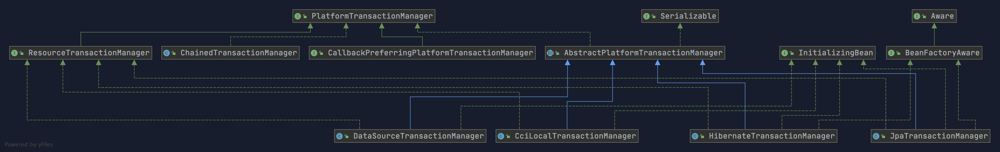

`PlatformTransactionManager`接口中定义了三个方法：

```java
package org.springframework.transaction;

import org.springframework.lang.Nullable;

public interface PlatformTransactionManager {
    //获得事务
    TransactionStatus getTransaction(@Nullable TransactionDefinition var1) throws TransactionException;
    //提交事务
    void commit(TransactionStatus var1) throws TransactionException;
    //回滚事务
    void rollback(TransactionStatus var1) throws TransactionException;
}

```

**这里多插一嘴。为什么要定义或者说抽象出来`PlatformTransactionManager`这个接口呢？**

主要是因为要将事务管理行为抽象出来，然后不同的平台去实现它，这样我们可以保证提供给外部的行为不变，方便我们扩展。

#### TransactionDefinition:事务属性

事务管理器接口 **`PlatformTransactionManager`** 通过 **`getTransaction(TransactionDefinition definition)`** 方法来得到一个事务，这个方法里面的参数是 **`TransactionDefinition`** 类 ，这个类就定义了一些基本的事务属性。

**什么是事务属性呢？** 事务属性可以理解成事务的一些基本配置，描述了事务策略如何应用到方法上。

事务属性包含了 5 个方面：

- 隔离级别
- 传播行为
- 回滚规则
- 是否只读
- 事务超时

`TransactionDefinition` 接口中定义了 5 个方法以及一些表示事务属性的常量比如隔离级别、传播行为等等。

```java
package org.springframework.transaction;

import org.springframework.lang.Nullable;

public interface TransactionDefinition {
    int PROPAGATION_REQUIRED = 0;
    int PROPAGATION_SUPPORTS = 1;
    int PROPAGATION_MANDATORY = 2;
    int PROPAGATION_REQUIRES_NEW = 3;
    int PROPAGATION_NOT_SUPPORTED = 4;
    int PROPAGATION_NEVER = 5;
    int PROPAGATION_NESTED = 6;
    int ISOLATION_DEFAULT = -1;
    int ISOLATION_READ_UNCOMMITTED = 1;
    int ISOLATION_READ_COMMITTED = 2;
    int ISOLATION_REPEATABLE_READ = 4;
    int ISOLATION_SERIALIZABLE = 8;
    int TIMEOUT_DEFAULT = -1;
    // 返回事务的传播行为，默认值为 REQUIRED。
    int getPropagationBehavior();
    //返回事务的隔离级别，默认值是 DEFAULT
    int getIsolationLevel();
    // 返回事务的超时时间，默认值为-1。如果超过该时间限制但事务还没有完成，则自动回滚事务。
    int getTimeout();
    // 返回是否为只读事务，默认值为 false
    boolean isReadOnly();

    @Nullable
    String getName();
}
```

#### TransactionStatus:事务状态

`TransactionStatus`接口用来记录事务的状态 该接口定义了一组方法,用来获取或判断事务的相应状态信息。

`PlatformTransactionManager.getTransaction(…)`方法返回一个 `TransactionStatus` 对象。

**TransactionStatus 接口内容如下：**

```java
public interface TransactionStatus{
    boolean isNewTransaction(); // 是否是新的事务
    boolean hasSavepoint(); // 是否有恢复点
    void setRollbackOnly();  // 设置为只回滚
    boolean isRollbackOnly(); // 是否为只回滚
    boolean isCompleted; // 是否已完成
}
```

### 事务属性详解

实际业务开发中，大家一般都是使用 `@Transactional` 注解来开启事务，但很多人并不清楚这个注解里面的参数是什么意思，有什么用。为了更好的在项目中使用事务管理，强烈推荐好好阅读一下下面的内容。

#### 事务传播行为

**事务传播行为是为了解决业务层方法之间互相调用的事务问题**。

当事务方法被另一个事务方法调用时，必须指定事务应该如何传播。例如：方法可能继续在现有事务中运行，也可能开启一个新事务，并在自己的事务中运行。

举个例子：我们在 A 类的`aMethod()`方法中调用了 B 类的 `bMethod()` 方法。这个时候就涉及到业务层方法之间互相调用的事务问题。如果我们的 `bMethod()`如果发生异常需要回滚，如何配置事务传播行为才能让 `aMethod()`也跟着回滚呢？这个时候就需要事务传播行为的知识了，如果你不知道的话一定要好好看一下。

```java
@Service
Class A {
    @Autowired
    B b;
    @Transactional(propagation = Propagation.xxx)
    public void aMethod {
        //do something
        b.bMethod();
    }
}

@Service
Class B {
    @Transactional(propagation = Propagation.xxx)
    public void bMethod {
       //do something
    }
}
```

在`TransactionDefinition`定义中包括了如下几个表示传播行为的常量：

```java
public interface TransactionDefinition {
    int PROPAGATION_REQUIRED = 0;
    int PROPAGATION_SUPPORTS = 1;
    int PROPAGATION_MANDATORY = 2;
    int PROPAGATION_REQUIRES_NEW = 3;
    int PROPAGATION_NOT_SUPPORTED = 4;
    int PROPAGATION_NEVER = 5;
    int PROPAGATION_NESTED = 6;
    ......
}
```

不过，为了方便使用，Spring 相应地定义了一个枚举类：`Propagation`

```java
package org.springframework.transaction.annotation;

import org.springframework.transaction.TransactionDefinition;

public enum Propagation {

    REQUIRED(TransactionDefinition.PROPAGATION_REQUIRED),

    SUPPORTS(TransactionDefinition.PROPAGATION_SUPPORTS),

    MANDATORY(TransactionDefinition.PROPAGATION_MANDATORY),

    REQUIRES_NEW(TransactionDefinition.PROPAGATION_REQUIRES_NEW),

    NOT_SUPPORTED(TransactionDefinition.PROPAGATION_NOT_SUPPORTED),

    NEVER(TransactionDefinition.PROPAGATION_NEVER),

    NESTED(TransactionDefinition.PROPAGATION_NESTED);

    private final int value;

    Propagation(int value) {
        this.value = value;
    }

    public int value() {
        return this.value;
    }

}

```

**正确的事务传播行为可能的值如下**：

**1.`TransactionDefinition.PROPAGATION_REQUIRED`**

使用的最多的一个事务传播行为，我们平时经常使用的`@Transactional`注解默认使用就是这个事务传播行为。如果当前存在事务，则加入该事务；如果当前没有事务，则创建一个新的事务。也就是说：

- 如果外部方法没有开启事务的话，`Propagation.REQUIRED`修饰的内部方法会新开启自己的事务，且开启的事务相互独立，互不干扰。
- 如果外部方法开启事务并且被`Propagation.REQUIRED`的话，所有`Propagation.REQUIRED`修饰的内部方法和外部方法均属于同一事务 ，只要一个方法回滚，整个事务均回滚。

举个例子：如果我们上面的`aMethod()`和`bMethod()`使用的都是`PROPAGATION_REQUIRED`传播行为的话，两者使用的就是同一个事务，只要其中一个方法回滚，整个事务均回滚。

```java
@Service
Class A {
    @Autowired
    B b;
    @Transactional(propagation = Propagation.REQUIRED)
    public void aMethod {
        //do something
        b.bMethod();
    }
}
@Service
Class B {
    @Transactional(propagation = Propagation.REQUIRED)
    public void bMethod {
       //do something
    }
}
```

**`2.TransactionDefinition.PROPAGATION_REQUIRES_NEW`**

创建一个新的事务，如果当前存在事务，则把当前事务挂起。也就是说不管外部方法是否开启事务，`Propagation.REQUIRES_NEW`修饰的内部方法会新开启自己的事务，且开启的事务相互独立，互不干扰。

举个例子：如果我们上面的`bMethod()`使用`PROPAGATION_REQUIRES_NEW`事务传播行为修饰，`aMethod`还是用`PROPAGATION_REQUIRED`修饰的话。如果`aMethod()`发生异常回滚，`bMethod()`不会跟着回滚，因为 `bMethod()`开启了独立的事务。但是，如果 `bMethod()`抛出了未被捕获的异常并且这个异常满足事务回滚规则的话,`aMethod()`同样也会回滚，因为这个异常被 `aMethod()`的事务管理机制检测到了。

```java
@Service
Class A {
    @Autowired
    B b;
    @Transactional(propagation = Propagation.REQUIRED)
    public void aMethod {
        //do something
        b.bMethod();
    }
}

@Service
Class B {
    @Transactional(propagation = Propagation.REQUIRES_NEW)
    public void bMethod {
       //do something
    }
}
```

**3.`TransactionDefinition.PROPAGATION_NESTED`**:

如果当前存在事务，就在嵌套事务内执行；如果当前没有事务，就执行与`TransactionDefinition.PROPAGATION_REQUIRED`类似的操作。也就是说：

- 在外部方法开启事务的情况下，在内部开启一个新的事务，作为嵌套事务存在。
- 如果外部方法无事务，则单独开启一个事务，与 `PROPAGATION_REQUIRED` 类似。

这里还是简单举个例子：如果 `bMethod()` 回滚的话，`aMethod()`不会回滚。如果 `aMethod()` 回滚的话，`bMethod()`会回滚。

```java
@Service
Class A {
    @Autowired
    B b;
    @Transactional(propagation = Propagation.REQUIRED)
    public void aMethod {
        //do something
        b.bMethod();
    }
}

@Service
Class B {
    @Transactional(propagation = Propagation.NESTED)
    public void bMethod {
       //do something
    }
}
```

**4.`TransactionDefinition.PROPAGATION_MANDATORY`**

如果当前存在事务，则加入该事务；如果当前没有事务，则抛出异常。（mandatory：强制性）

这个使用的很少，就不举例子来说了。

**若是错误的配置以下 3 种事务传播行为，事务将不会发生回滚，这里不对照案例讲解了，使用的很少。**

- **`TransactionDefinition.PROPAGATION_SUPPORTS`**: 如果当前存在事务，则加入该事务；如果当前没有事务，则以非事务的方式继续运行。
- **`TransactionDefinition.PROPAGATION_NOT_SUPPORTED`**: 以非事务方式运行，如果当前存在事务，则把当前事务挂起。
- **`TransactionDefinition.PROPAGATION_NEVER`**: 以非事务方式运行，如果当前存在事务，则抛出异常。

#### 事务隔离级别

`TransactionDefinition` 接口中定义了五个表示隔离级别的常量：

```java
public interface TransactionDefinition {
    ......
    int ISOLATION_DEFAULT = -1;
    int ISOLATION_READ_UNCOMMITTED = 1;
    int ISOLATION_READ_COMMITTED = 2;
    int ISOLATION_REPEATABLE_READ = 4;
    int ISOLATION_SERIALIZABLE = 8;
    ......
}
```

和事务传播行为那块一样，为了方便使用，Spring 也相应地定义了一个枚举类：`Isolation`

```java
public enum Isolation {

  DEFAULT(TransactionDefinition.ISOLATION_DEFAULT),

  READ_UNCOMMITTED(TransactionDefinition.ISOLATION_READ_UNCOMMITTED),

  READ_COMMITTED(TransactionDefinition.ISOLATION_READ_COMMITTED),

  REPEATABLE_READ(TransactionDefinition.ISOLATION_REPEATABLE_READ),

  SERIALIZABLE(TransactionDefinition.ISOLATION_SERIALIZABLE);

  private final int value;

  Isolation(int value) {
    this.value = value;
  }

  public int value() {
    return this.value;
  }

}
```

下面我依次对每一种事务隔离级别进行介绍：

- **`TransactionDefinition.ISOLATION_DEFAULT`** :使用后端数据库默认的隔离级别，MySQL 默认采用的 `REPEATABLE_READ` 隔离级别 Oracle 默认采用的 `READ_COMMITTED` 隔离级别.
- **`TransactionDefinition.ISOLATION_READ_UNCOMMITTED`** :最低的隔离级别，使用这个隔离级别很少，因为它允许读取尚未提交的数据变更，**可能会导致脏读、幻读或不可重复读**
- **`TransactionDefinition.ISOLATION_READ_COMMITTED`** : 允许读取并发事务已经提交的数据，**可以阻止脏读，但是幻读或不可重复读仍有可能发生**
- **`TransactionDefinition.ISOLATION_REPEATABLE_READ`** : 对同一字段的多次读取结果都是一致的，除非数据是被本身事务自己所修改，**可以阻止脏读和不可重复读，但幻读仍有可能发生。**
- **`TransactionDefinition.ISOLATION_SERIALIZABLE`** : 最高的隔离级别，完全服从 ACID 的隔离级别。所有的事务依次逐个执行，这样事务之间就完全不可能产生干扰，也就是说，**该级别可以防止脏读、不可重复读以及幻读**。但是这将严重影响程序的性能。通常情况下也不会用到该级别。

#### 事务超时属性

所谓事务超时，就是指一个事务所允许执行的最长时间，如果超过该时间限制但事务还没有完成，则自动回滚事务。在 `TransactionDefinition` 中以 int 的值来表示超时时间，其单位是秒，默认值为-1，这表示事务的超时时间取决于底层事务系统或者没有超时时间。

#### 事务只读属性

```java
package org.springframework.transaction;

import org.springframework.lang.Nullable;

public interface TransactionDefinition {
    ......
    // 返回是否为只读事务，默认值为 false
    boolean isReadOnly();

}
```

对于只有读取数据查询的事务，可以指定事务类型为 readonly，即只读事务。只读事务不涉及数据的修改，数据库会提供一些优化手段，适合用在有多条数据库查询操作的方法中。

很多人就会疑问了，为什么我一个数据查询操作还要启用事务支持呢？

拿 MySQL 的 innodb 举例子，根据官网 [https://dev.mysql.com/doc/refman/5.7/en/innodb-autocommit-commit-rollback.html](https://dev.mysql.com/doc/refman/5.7/en/innodb-autocommit-commit-rollback.html) 描述：

> MySQL 默认对每一个新建立的连接都启用了`autocommit`模式。在该模式下，每一个发送到 MySQL 服务器的`sql`语句都会在一个单独的事务中进行处理，执行结束后会自动提交事务，并开启一个新的事务。

但是，如果你给方法加上了`Transactional`注解的话，这个方法执行的所有`sql`会被放在一个事务中。如果声明了只读事务的话，数据库就会去优化它的执行，并不会带来其他的什么收益。

如果不加`Transactional`，每条`sql`会开启一个单独的事务，中间被其它事务改了数据，都会实时读取到最新值。

分享一下关于事务只读属性，其他人的解答：

- 如果你一次执行单条查询语句，则没有必要启用事务支持，数据库默认支持 SQL 执行期间的读一致性；
- 如果你一次执行多条查询语句，例如统计查询，报表查询，在这种场景下，多条查询 SQL 必须保证整体的读一致性，否则，在前条 SQL 查询之后，后条 SQL 查询之前，数据被其他用户改变，则该次整体的统计查询将会出现读数据不一致的状态，此时，应该启用事务支持

#### 事务回滚规则

这些规则定义了哪些异常会导致事务回滚而哪些不会。默认情况下，事务只有遇到运行期异常（`RuntimeException` 的子类）时才会回滚，`Error` 也会导致事务回滚，但是，在遇到检查型（Checked）异常时不会回滚。

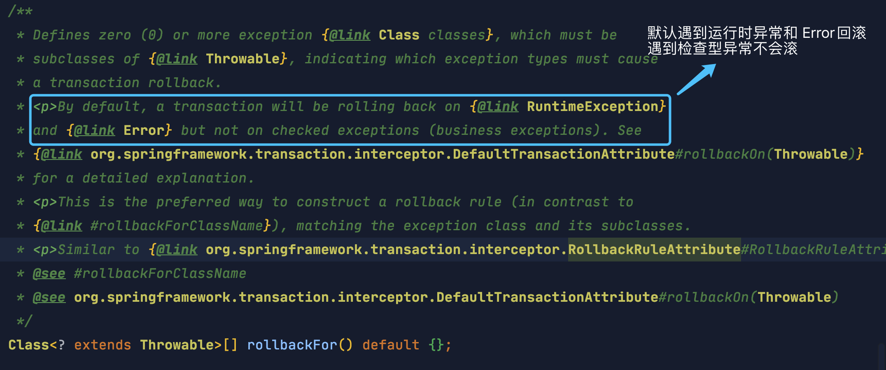

如果你想要回滚你定义的特定的异常类型的话，可以这样：

```java
@Transactional(rollbackFor= MyException.class)
```

### @Transactional 注解使用详解

#### `@Transactional` 的作用范围

1. **方法**：推荐将注解使用于方法上，不过需要注意的是：**该注解只能应用到 public 方法上，否则不生效。**
2. **类**：如果这个注解使用在类上的话，表明该注解对该类中所有的 public 方法都生效。
3. **接口**：不推荐在接口上使用。

#### `@Transactional` 的常用配置参数

`@Transactional`注解源码如下，里面包含了基本事务属性的配置：

```java
@Target({ElementType.TYPE, ElementType.METHOD})
@Retention(RetentionPolicy.RUNTIME)
@Inherited
@Documented
public @interface Transactional {

	@AliasFor("transactionManager")
	String value() default "";

	@AliasFor("value")
	String transactionManager() default "";

	Propagation propagation() default Propagation.REQUIRED;

	Isolation isolation() default Isolation.DEFAULT;

	int timeout() default TransactionDefinition.TIMEOUT_DEFAULT;

	boolean readOnly() default false;

	Class<? extends Throwable>[] rollbackFor() default {};

	String[] rollbackForClassName() default {};

	Class<? extends Throwable>[] noRollbackFor() default {};

	String[] noRollbackForClassName() default {};

}
```

**`@Transactional` 的常用配置参数总结（只列出了 5 个我平时比较常用的）：**

| 属性名      | 说明                                                         |
| :---------- | :----------------------------------------------------------- |
| propagation | 事务的传播行为，默认值为 REQUIRED，可选的值在上面介绍过      |
| isolation   | 事务的隔离级别，默认值采用 DEFAULT，可选的值在上面介绍过     |
| timeout     | 事务的超时时间，默认值为-1（不会超时）。如果超过该时间限制但事务还没有完成，则自动回滚事务。 |
| readOnly    | 指定事务是否为只读事务，默认值为 false。                     |
| rollbackFor | 用于指定能够触发事务回滚的异常类型，并且可以指定多个异常类型。 |

#### `@Transactional` 事务注解原理

面试中在问 AOP 的时候可能会被问到的一个问题。简单说下吧！

我们知道，**`@Transactional` 的工作机制是基于 AOP 实现的，AOP 又是使用动态代理实现的。如果目标对象实现了接口，默认情况下会采用 JDK 的动态代理，如果目标对象没有实现了接口,会使用 CGLIB 动态代理。**

🤐 多提一嘴：`createAopProxy()` 方法 决定了是使用 JDK 还是 Cglib 来做动态代理，源码如下：

```java
public class DefaultAopProxyFactory implements AopProxyFactory, Serializable {

	@Override
	public AopProxy createAopProxy(AdvisedSupport config) throws AopConfigException {
		if (config.isOptimize() || config.isProxyTargetClass() || hasNoUserSuppliedProxyInterfaces(config)) {
			Class<?> targetClass = config.getTargetClass();
			if (targetClass == null) {
				throw new AopConfigException("TargetSource cannot determine target class: " +
						"Either an interface or a target is required for proxy creation.");
			}
			if (targetClass.isInterface() || Proxy.isProxyClass(targetClass)) {
				return new JdkDynamicAopProxy(config);
			}
			return new ObjenesisCglibAopProxy(config);
		}
		else {
			return new JdkDynamicAopProxy(config);
		}
	}
  .......
}
```

如果一个类或者一个类中的 public 方法上被标注`@Transactional` 注解的话，Spring 容器就会在启动的时候为其创建一个代理类，在调用被`@Transactional` 注解的 public 方法的时候，实际调用的是，`TransactionInterceptor` 类中的 `invoke()`方法。这个方法的作用就是在目标方法之前开启事务，方法执行过程中如果遇到异常的时候回滚事务，方法调用完成之后提交事务。

> `TransactionInterceptor` 类中的 `invoke()`方法内部实际调用的是 `TransactionAspectSupport` 类的 `invokeWithinTransaction()`方法。由于新版本的 Spring 对这部分重写很大，而且用到了很多响应式编程的知识，这里就不列源码了。

#### Spring AOP 自调用问题


当一个方法被标记了`@Transactional` 注解的时候，Spring 事务管理器只会在被其他类方法调用的时候生效，而不会在一个类中方法调用生效。

这是因为 Spring AOP 工作原理决定的。因为 Spring AOP 使用动态代理来实现事务的管理，它会在运行的时候为带有 `@Transactional` 注解的方法生成代理对象，并在方法调用的前后应用事物逻辑。如果该方法被其他类调用我们的代理对象就会拦截方法调用并处理事务。但是在一个类中的其他方法内部调用的时候，我们代理对象就无法拦截到这个内部调用，因此事务也就失效了。

`MyService` 类中的`method1()`调用`method2()`就会导致`method2()`的事务失效。

```java
@Service
public class MyService {

private void method1() {
     method2();
     //......
}
@Transactional
 public void method2() {
     //......
  }
}
```

解决办法就是避免同一类中自调用或者使用 AspectJ 取代 Spring AOP 代理。

#### `@Transactional` 的使用注意事项总结

- `@Transactional` 注解只有作用到 public 方法上事务才生效，不推荐在接口上使用；
- 避免同一个类中调用 `@Transactional` 注解的方法，这样会导致事务失效；
- 正确的设置 `@Transactional` 的 `rollbackFor` 和 `propagation` 属性，否则事务可能会回滚失败;
- 被 `@Transactional` 注解的方法所在的类必须被 Spring 管理，否则不生效；
- 底层使用的数据库必须支持事务机制，否则不生效；
- ......
