- 以单个问题作为一个点，最好是按照学习顺序进行排列，后续方便添加和修改
- 一级标题为最大模块，如javase,javaweb,mysql,mybatis等
- 二级标题为具体模块（为了应付面试，尽量少设二级标题），如集合、IO等
- 三级标题为具体模块分类（为了应付面试，尽量少设三级标题），如list,set,map
- 四级标题为具体问题，如arraylist与linkedarraylist的区别


# 一：javaSE
#### Java语言特点
* **面向对象**(封装，继承，多态) ;
* **平台无关性**，Java是“一次编写，到处运行(Write Once，Run anyWhere)”的语言，很好的可移植性，在引入虚拟机之后，Java语言在不同的平台上运行不需要重新编译。
* **支持多线程。**C++语言没有内置的多线程机制而Java语言却提供了多线程支持;
* **支持网络编程并且很方便。**
* **编译与解释并存;**
- **支持垃圾回收机制**

  

#### 访问（权限）修饰符
Java中，可以使用访问控制符来保护对类、变量、方法和构造方法的访问。Java 支持4种不同的访问权限。public、 protected、default、private。

* private:在同一类内可见，不能修饰类(外部类)
* default (即默认，什么也不写) :在同一包内可见，不使用任何修饰符。
* protected :对不同包的子类可见，不同包其他类就不可见了
* public: 对所有类可见。抽象类只可以public修饰，默认不写也是public修饰


#### 基本数据类型

* 整型
  byte: 占用(内存) 1个字节，8位二进制补码表示的整数
  short: 占用2个字节，16位二进制补码表示的整数
  int:占用4个字节，32位二进制补码表示的整数
  long: 占用8个字节，64位二进制补码表示的整数
* 浮点型
  float:占用4个字节，32位单精度浮点数
  double:占用8个字节，64位双精度浮点数
* 字符型
  char: 占用2个字节，16位字符
* 布尔型
  boolean:只有true和false两个取值。通常编译后JVM内部会把boolean类型变量表示为int
  占4个字节。Boolean类型数组一般每个元素表示为一个字节的byte。


#### 值传递机制

 * 值传递。 即将实际参数值的副本（复制品）传入方法内，而参数本身不受影响

 * 形参是基本数据类型：将实参基本数据类型变量的“数据值”传递给形参

 * 形参是引用数据类型：将实参引用数据类型变量的“地址值”传递给形参

    

#### final、finally、finalize的区别

* **final**:被修饰的变量不可变
  ​	       被修饰的方法不允许子类重写，子类可以使用该方法

  ​         被修饰的类不可以被继承，所有方法不可以被重写
  
* **finally：**作为异常处理的一种机制，只能在**try/catch**语句中，并附带一个语句块表示这段语句一定会执行，System.exit(0)可以阻断finally执行

* **finalize：**Object类中的一个基础方法，设计目的保证对象在被垃圾收集前，完成特地资源的回收，但其执行不稳定且有一定性能问题

  


#### 封装 继承 多态

**封装：**不对外暴露类的内部结构，仅提供少量方法供外部使用，提高程序的可维护性

**继承：**可以使用现有类的所有功能，并在无需重新编写原来类的情况下对这些功能进行扩展。新类的定义可以增加新的数据或新的功能，也可以用父类的功能，但不能选择性地继承父类。通过使用继承，可以快速地创建新的类，可以提高代码的复用性，程序的可维护性，节省大量创建新类的时间，提高我们的开发效率。

**多态：**一个事物的多种形态。以封装和继承为基础，根据运行时对象实际类型使同一行为具有不同表现形式。父类的引用指向子类的对象，调用的方法是子类重写后的方法，多态一般专指重写，既体现了多种类型的传递，又体现了不同类型的特性，即复用了父类的方法，又扩展了自己的逻辑。


#### Static
* static可以修饰成员变量和成员方法
* static修饰成员变量表示该成员变量只在内存中只存储一份，可以被共享访问、修改
* 在不想创建对象的情况下也想调用方法，可以用static

**访问格式**：
类名.静态成员变量
类名.静态成员方法
对象.静态成员变量（不推荐）

 

#### 静态工具类的好处

* 类中都是一些静态方法， 每个方法都是以完成一个共用的功能为目的, 这个类用来给系统开发人员共同使用的。（譬如验证码登录）

* 一次编写，处处可用，提高代码的重用性

* 建议工具类的构造器私有化处理，工具类不需要创建对象

  

#### **静态代码块:** 
 * 可以有输出语句。

 * 可以对类的属性、类的声明进行初始化操作。

 * 静态代码块不可以对非静态的属性初始化。即：不可以调用非静态的属性和方法。

 * 若有多个静态的代码块，那么按照从上到下的顺序依次执行。

 * 静态代码块的执行要先于非静态代码块。

 * ✔静态代码块随着类的加载而加载，且只执行一次。

   

#### 单例模式(拿到的对象都是同一个对象)
- 饿汉单例
```java
    public class SingleInstance
    {
        public static SingleInstance instance = new SingleInstance();
        private SingleInstance(){
            return instance
        }
    }
```
- 懒汉单例
```java
    public class SingleInstance
    {
        private static SingleInstance instance;
        private SingleInstance(){}
        public static SingleInstance  getInstance(){
            if(instance == null){
                instance = new SingleInstance();
            }
            return instance;
        }
    }
```

#### 重载和重写
* 重载 指的是同一个类中的多个同名方法构成重载，是行为水平方向的不同实现，对编译器来说，方法名与参数列表组成了唯一键（称为方法签名），JVM通过方法签名决定调用哪种重载方法。
* 重写指子类实现接口或继承父类时，保持方法签名完全相同，实现不同方法体，是行为垂直方向的不同实现。


#### 面向对象和面向过程
* 面向过程最终执行代码大多是可以直接被CPU执行的二进制机械码，面向对象类调用需要实例化，开销较大，且最终执行代码不是二进制机械码，所以面向过程的性能较好。
* 但面向过程代码模块间耦合严重，不易复用、扩展，面向对象代码强调高内聚、低耦合，先抽象模型定义共性行为，再解决实际问题，系统更加灵活，易于维护、复用、扩展。

  

#### 成员变量和局部变量的区别


#### 继承抽象类/接口的注意事项？

* 一个类如果继承了抽象类，那么这个类必须重写完抽象类的全部抽象方法，否则这个类也必须定义成抽象类

| 语法 维度 | 抽象类                                             |                             接口                             |
| :-------- | -------------------------------------------------- | :----------------------------------------------------------: |
| 成员 变量 | 无特殊要求                                         |                默认 public static final 常量                 |
| 构造 方法 | 有构造方法，不能实例化                             |                   没有构造方法，不能实例化                   |
| 方法      | 抽象类可以没有抽象方法，但有抽象方法一定是抽象类。 | 默认 public abstract，JDK8 支持默认/静态方 法，JDK9 支持私有方法。 |
| 继承      | 单继承                                             |                            多继承                            |


#### 抽象接口与抽象类的异同点

**相同点**
1. 都不能被实例化 
2. 接口的实现类或抽象类的子类都只有实现了接口或抽象类中的方法后才能实例化。

**不同点**

1. 接口只有定义，不能有方法的实现，而抽象类可以有定义与实现，方法可在抽象类中实现。
2. 实现接口的关键字为implements，继承抽象类的关键字为extends。一个类可以实现多个接口，但一个类只能继承一个抽象类。所以，使用接口可以间接地实现多重继承。
3. 接口只能继承接口，抽象类可以实现接口
4. 接口就是一个只有方法和静态常量的类
5. JAVA8后Default修饰后就不需要强制子类再去写新增的抽样方法，JAVA9直接可以Private
6. 描述特征一般用接口，描述概念一般用抽象类


#### String、StringBuffer、StringBuilder的区别

**可变性**

* 简单来说：String 类中使⽤ final 关键字修饰字符数组来保存字符串，所以 **String** **对象是不可变**
* ⽽StringBuilder与StringBuffer都继承⾃**AbstractStringBuilder类**，在AbstractStringBuilder中也是使⽤字符数组保存字符串char[]value，但是没有⽤ final 关键字修饰，所以**这两种对象都是可变的（可变字符串）**。

**线程安全**

* String不可变，所以线程安全
* StringBuilder是非线程安全
* StringBuffer加了Synchronized同步锁，所以线程安全


### List

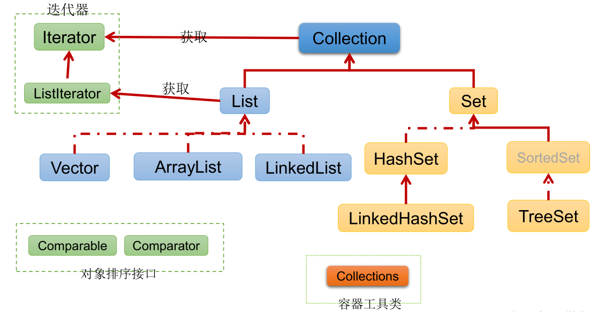

- |----collection

  ​       |----list

  ​              |----ArrayList：作为list接口的主要实现类，线程不安全，效率高；底层使用object[] elementData存储

  ​              |----LinkedList：作为list接口的次要实现类，对于频繁的插入、删除操作，使用此类效率比ArrayList高；底层使用双向链表存储

  ​              |----Vector：作为list接口的古老实现类，线程安全，效率低；底层使用object[] elementData存储

  

#### arraylist,linkedlist,vector三者的异同

 *  同：三个类都实现了list接口，存储数据的特点相同：储存有序的，可重复的数据。

 * 异（ArrayList和LinkedList）:

    1. 二者都线程不安全，相对线程安全的Vector，执行效率高。

    2. `ArrayList`是实现了基于动态数组(自动扩展大小)的数据结构，`LinkedList`基于双向链表（JDK1.6 之前为循环链表，JDK1.7 取消了循环。注意双向链表和双向循环链表的区别）的数据结构。对于随机访问get和set，`ArrayList`效率优于`LinkedList`，因为`LinkedList`要移动指针。对于新增和删除操作（add和remove），`LinkedList`比较占优势，因为增加和删除操作ArrayList要整体移动数据。
    3. 内存空间占用：ArrayList 的空间浪费主要体现在在 list 列表的结尾会预留一定的容量空间，而 LinkedList 的空间花费则体现在它的每一个元素都需要消耗比 ArrayList 更多的空间（因为要存放**直接后继**和**直接前驱**以及数据）

 * 异（ArrayList和Vector）：

    1. Vector和ArrayList几乎是完全相同的,唯一的区别在于Vector是同步类(synchronized)，属于强同步类。因此开销就比ArrayList要大，访问要慢。

    2. 正常情况下,大多数的Java程序员使用 ArrayList而不是Vector, 因为同步完全可以由程序员自己来控制。Vector每次扩容请求其大小的2倍空间，而ArrayList是1.5倍。Vector还有一个子类Stack

        

### Set

|----collection接口

​       |----set接口：无序的、不可重复的数据

​                   |----HashSet：作为list接口的主要实现类，线程不安全，可以存储null值（基于 `HashMap` 实现的）

​                               |----LinkedHashSet：作为hashset的子类；遍历其内部数据时，可以按照添加的顺序遍历（基于`LinkedHashMap` 来实现）

​                    |----TreeSet： 可以按照添加对象的指定属性进行排序（基于红黑树）


### Map

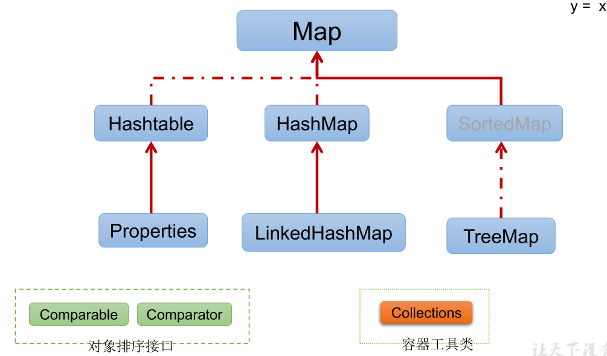

|----Map:存储双列数据，存储key-value对的数据     ----类似于高中的函数：y=f(x)

​        |----HashMap: 作为Map的主要实现类，线程不安全，效率高; 可以存储null的key和value

​                          |----LinkedHashMap: 保证在遍历map元素时，可以按照添加的顺序实现遍历

​                                                               : 原因，在原有的HashMap底层之上，添加了一对指针（引入了链式结构）

​                                                               ：对于频繁的遍历操作，此类的执行效率高于HashMap

​       |----Hashtable: 作为Map的古老实现类，线程安全，效率低; 不能存储null的key和value

​                          |----Properties：常用来处理配置文件，key和value都是string类型

​       |----TreeMap:可以根据添加的key-value对进行排序，实现排序遍历，通常都是对key进行排序（自然排序，定制排序）

​                                                               :底层使用红黑树


#### jdk7中的底层实现源码流程（饿汉式）

1. HashMap map = new HashMap(); 在实例化以后，底层创建了一个长度为16的一维数组Entry[] table;(看构造器，点this进去)

2.  map.put(key1,value1)(查看Put方法)

​       ① 首先调用key1所在类的hashcode()方法，此hash值经过某种映射，得到在entry数组中的存放位置

​       ② 如果此位置上为空，此时直接添加成功，key1-value1添加成功

​       ③ 如果此位置上数据不为空（意味着此位置上存在一个或多个数据（以链表方式存储）），比较当前key1和已经存在数据的哈希值，如果哈希值不同，添加成功。如果哈希值与某一个数据相同(key2-value2)，继续比较key1所在类的equals()方法，如果equals返回false，添加成功。。 如果equals()返回true,使用value1替换value2

 * 补充：对于原先就有数据的情况，key1-value1和key2-value2以链表的方式存储

 * 扩容：默认扩容为原来容量的2倍，并把原来的数据复制过来

    

#### Jdk8中的底层实现源码流程（懒汉式）

1. HashMap map = new HashMap(); ✔在实例化以后，底层没有创建了一个长度为16的一维数组Node[] table; (改名了而且)
2.  首次调用 map.put(key1,value1)方法时：

​       ① 创建长度为16的一维数组Node[] table;

​       ② jdk8,使用了数组+链表+红黑树

​       ✔当数组的某一个索引位置上有多个元素（以链表方法存储）,元素个数>8 且 当前数组长度>64时，该索引位置上所有数据改用红黑树存储

​       ② 首先调用key1所在类的hashcode()方法，此hash值经过某种映射，得到在entry数组中的存放位置

​       ③ 如果此位置上为空，此时直接添加成功，key1-value1添加成功

​       ④ 如果此位置上数据不为空（意味着此位置上存在一个或多个数据（以链表方式存储）），比较当前key1和已经存在数据的哈希值，

如果哈希值不同，添加成功。如果哈希值与某一个数据相同(key2-value2)，继续比较key1所在类的equals()方法，如果equals返回false，添加成功。。。。如果equals()返回true,使用value1替换value2

 * 补充：对于原先就有数据的情况，key1-value1和key2-value2以链表的方式存储

 * 当形成链表时，七上八下（jdk7中新的元素指向旧元素，jdk8中旧元素指向新元素）

 * 扩容：默认扩容为原来容量的2倍，并把原来的数据复制过来
   
   

#### LinkedHashMap的底层实现原理（了解）
 * 底层使用的结构与hashmap基本相同，因为Linkedhashmap继承于hashmap, 只是重写了newNode方法，

 * 并且 新造了内部类Entry,该Entry对象继承自Node，实现了双向链表，所以LinkedHashMap就可以根据添加的顺序实现遍历

   

#### hashset的底层实现原理
 * 在new HashSet的时候，实际上底层是new了一个HashMap
 * 当我们add元素的时候，实际上是往这个HashMap.put(e, object())
 * ✔✔即我们存入的键值，value处就放一个空的object对象（常量），所有的key都指向它


#### List、Set、Map的区别

* `List`(对付顺序的好帮手)：存储的元素是**有序**的、**可重复**的。

* `Set`(注重独一无二的性质): 存储的元素是**无序**的、**不可重复**的。

* `Map`(用 Key 来搜索的专家): 使用键值对（key-value）存储，类似于数学上的函数 y=f(x)，“x”代表 key，"y"代表 value，Key 是**无序**的、**不可重复**的，value 是**无序**的、**可重复**的，每个键最多映射到一个值。

  

#### HashMap和Hashtable的区别（感觉hashtable基本不会考了）

1.线程是否安全: HashMap 是非线程安全的，HashTable 是线程安全的,因为HashTable 内部的方法基本都经过synchronized修饰。
2.效率:因为线程安全的问题，HashMap 要比HashTable 效率高一点。 另外，HashTable 基本被淘汰，不要在代码中使用它;
3.对Null key和Null value的支持: HashMap 可以存储null 的key和value,但null作为键只能有一个， null 作为值可以有多个; HashTable 不允许有null键和null值，否则会抛出NullPointerException 。
4.初始容量大小和每次扩充容量大小的不同:①创建时如果不指定容量初始值，Hashtable 默认的初始大小为11,之后每次扩充，容量变为原来的2n+1。HashMap 默认的初始化大小为16。之后每次扩充，容量变为原来的2倍。②创建时如果给定了容量初始值，那么Hashtable会直接使用你给定的大小，而HashMap 会将其扩充为2的幂次方大小。
5.**底层数据结构:** JDK1.8 以后的HashMap在解决哈希冲突时有了较大的变化，当链表长度大于阈值(默认为8) (将链表转换成红黑树前会判断，如果当前数组的长度小于64,那么会选择先进行数组扩容，而不是转换为红黑树时，将链表转化为红黑树，以减少搜索时间。Hashtable 没有这样的机制。


#### 为什么转成红黑树

* 链表取元素是从头结点一直遍历到对应的结点，这个过程的复杂度是O(N)， 而红黑树基于二叉树的结构，查找元素的复杂度为O(logN)，所以，当元素个数过多时，用红黑树存储可以提高搜索的效率。

* 可以有效防止用户自己实现了不好的哈希算法时导致链表过长的情况。

  

#### 为什么不一开始转成红黑树

单个TreeNode需要占用的空间大约是普通Node的两倍，所以只有当包含足够多的Nodes时才会转成TreeNodes。


#### 为什么树化标准是8

* 如果hashCode的分布离散良好的话，那么红黑树是很少会被用到的，因为各个值都均匀分布，很少出现链表很长的情况。

* 在理想情况下，链表长度符合泊松分布， 各个长度的命中概率依次递减，当长度为8的时候，概率概率仅为00000006，
  这么小的概率，HashMap的红黑树转换几乎不会发生。
  
* 当然，这是理想的算法，但不妨某些用户使用HashMap过程导致hashCode分布离散很差的场景，这个时候再转换为红黑树
  就是一种很好的退让策略。
  
  

#### 为什么退化为链表的阈值是6
主要是一个过渡，避免链表和红黑树之间频繁的转换。如果阈值是7的话，删除一个元素红黑树就必须退化为链表， 增加一个元
素就必须树化，来回不断的转换结构无疑会降低性能，所以阈值才不设置的那么临界。


#### ConcurrentHashMap和Hashtable的区别

ConcurrentHashMap和Hashtable的区别主要体现在实现线程安全的方式上不同。

* **底层数据结构: **JDK1.7 的ConcurrentHashMap底层采用分段的数组+链表实现，JDK1.8 采用的数据结构跟HashMap1.8的结构一样,数组+链表/红黑叉树。Hashtable和JDK1.8之前的HashMap的底层数据结构类似都是采用数组+链表的形式,数组是HashMap的主体,链表则是主要为了解决哈希冲突而存在的;
* **实现线程安全的方式(重要) :**①在JDK1.7的时候，ConcurrentHashMap (分段锁) 对整个桶数组进行了分割分段(Segment),每把锁只锁容器其中一部分数据，多线程访问容器里不同数据段的数据，就不会存在锁竞争，提高并发访问率。到了 JDK1.8 的时候已经摒弃了Segment 的概念,而是直接用Node数组+链表+红黑树的数据结构来实现，并发控制使用synchronized和CAS来操作，**通过对头节点加锁来保证线程安全，使锁的粒度相对于Segment更小了**。JDK1.6 后对synchronized锁做了很多优化)整个看起来就像是优化过且线程安全的HashMap， 虽然在JDK1.8中还能看到Segment的数据结构，但是已经简化了属性，只是为了兼容旧版本;②Hashtable (同步锁) :使用synchronized来保证线程安全,效率非常低下。当一个线程访问同步方法时，其他线程也访问同步方法，可能会进入阻塞或轮询状态,如使用put添加元素，另一个线程不能使用put添加元素,也不能使用get,竞争会越来越激烈效率越低。
  两者的对比图:
  **HashTable:**


**JDK1.7 的 ConcurrentHashMap：**


**JDK1.8 的 ConcurrentHashMap：**


​		JDK1.8 的 `ConcurrentHashMap` 不在是 **Segment 数组 + HashEntry 数组 + 链表**，而是 **Node 数组 + 链表 / 红黑树**。不过，Node 只能用于链表的情况，红黑树的情况需要使用 **`TreeNode`**。当冲突链表达到一定长度时，链表会转换成红黑树。

总结：JDK1.7给Segment添加ReentrantLock（可重入锁）来实现线程安全

​	   	JDK1.8通过CAS或者synchronized来实现线程安全


#### throw和throws的区别

Java中的异常处理除了包括捕获异常和处理异常之外，还包括声明异常和抛出异常，可以通过throws关键字在方法上声明该方法要抛出的异常，或者在方法内部通过throw拋出异常对象。throws关键字和throw关键字在使用上的几点区别如下:

* throw关键字用在方法内部，只能用于抛出一种异常，用来抛出方法或代码块中的异常，受查异常和非受查异常都可以被抛出。

* throws关键字用在方法声明上，可以抛出多个异常，用来标识该方法可能抛出的异常列表。一个方法用throws标识了可能抛出的异常列表，调用该方法的方法中必须包含可处理异常的代码，否则也要在方法签名中用throws关键字声明相应的异常。

  

#### 处理异常的方式
* throws：用在方法上，可以将方法内部出现的异常抛出去给本方法的调用者处理。
* try...catch：
  * 监视捕获异常，用在方法内部，可以将方法内部出现的异常直接捕获处理。
  * 这种方式还可以，发生异常的方法自己独立完成异常的处理,程序可以继续往下执行。
* 前两者结合


#### 序列化和反序列化
- 用途：对内存中的对象进行持久化或网络传输
- 解释：序列化的原本意图是希望对一个Java对象作一下“变换”，变成字节序列，这样一来方便持久化存储到磁盘，避免程序运行结束后对象就从内存里消失，另外变换成字节序列也更便于网络传输，所以概念上很好理解：怎么把当前JVM进程的对象跨网络传输到另一个JVM进程里面进行恢复。序列化就是把内存里面的对象转化为字节流，以便实现存储或传输。反序列化就是根据从文件或者网络上获取到的对象的字节流，根据字节流里面的保存的对象描述信息和状态重新构建一个新的对象。
- **序列化**： 将数据结构或对象转换成二进制字节流的过程
- **反序列化**：将在序列化过程中所生成的二进制字节流转换成数据结构或者对象的过程


#### 反射的优缺点
通过反射可以获取.class文件得到字节码，从而得到任意一个类的所有属性和方法，还可以调用这些方法和属性。动态获取信息及调用对象方法的功能。反射本质上就是把Java类中的各个成分映射成一个个的Java对象

- **优点** ： 可以让代码更加灵活、为各种框架 开箱即用的功能提供了便利
- **缺点** ：破坏了封装性以及泛型约束。在运行时有了分析操作类的能力，这同样也增加了安全问题。比如可以无视泛型参数的安全检查（泛型参数的安全检查发生在编译时）。另外，反射的性能也要稍差点，不过，对于框架来说实际是影响不大的。


#### 为什么要有无参构造器？
- 反射调用创建实例clazz.newInstance()方法的底层是调用Constructor对象的newInstance()，所以必须保证编写类的时候有个无参构造器。
- 在实例对象的时候，都要不断的向上（父类）回溯到Object（），要想顺利的回溯到Object，就必须给指定调用父类的哪个构造方法，如果没有，就用默认的 super（）。若只有有参构造器，没有无参，可能会发生编译错误。但只有无参，没有有参一定不会出错


#### 深拷贝和浅拷贝
深拷贝和浅拷贝是指在赋值一个对象时，拷贝的深度不同。

**浅拷贝：**在进行深拷贝时，会拷贝所有的属性，并且如果这些属性是对象，也会对这些对象进行深拷贝，直到最底层的基本数据类型为止。这意味着，对于深拷贝后的对象，即使原对象的属性值发生了变化，深拷贝后的对象的属性值也不会受到影响。

**浅拷贝：**相反，浅拷贝只会拷贝对象的第一层属性，如果这些属性是对象，则不会对这些对象进行拷贝，而是直接复制对象的引用。这意味着，对于浅拷贝后的对象，如果原对象的属性值发生了变化，浅拷贝后的对象的属性值也会跟着发生变化。


# 二：数据库
#### 主键 外键 索引
- 主键是表中唯一标识一条记录的，不允许有重复的、不能为空
- 外键是用来和其他表建立联系的，表的外键是另一个表的主键，可以有重复的可以为空
- 索引是对数据库中某些关键字段进行存储，类似数据中的目录，里面包含关键数据和数据的位置，索引不能太多，建议一个表不能超过四个


### 索引
#### 索引的定义与优缺点
- 索引是存储引擎 用于快速找到数据记录的一种数据结构，就好比一本教科书的目录部分，通过目录中找到对应文章的页码，便可快速定位到需要的文章。MySQL中也是一样的道理，进行数据查找时，首先查看查询条件是否命中某条索引，符合则通过索引查找相关数据，如果不符合则需要全表扫描,即需要一条一条地查找记录，直到找到与条件符合的记录

- 索引的优点
  （1）提高数据检索的效率，降低数据库的IO成本,这是创建索引最主要的原因。
  （2）通过创建唯一索引，可以保证数据库中每一行数据的唯一性。
  （3）在实现数据的参考完整性方面，可以加速表和表之间的连接。换句话说，对于有依赖关系的子表和父表联合查询时，可以提高查询速度。
  （4）在使用分组和排序子句进行数据查询时，可以显著减少查询中分组和排序的时间，降低了CPU的消耗。

- 索引的 缺点
  （1）创建索引和维护索引要耗费时间，并且随着数据量的增加，所耗费的时间也会增加。
  （2）索引需要占磁盘空间，除了数据表占数据空间之外，每一个索引还要占一定的物理空间，存储在磁盘上，如果有大量的索引，索引文件就可能比数据文件更快达到最大文件尺寸。
  （3）虽然索引大大提高了查询速度，但却会降低更新表的速度。当对标中的数据进行增加、删除和修改的时候，索引也要动态地维护，这样就降低了数据的维护速度。

#### 聚簇索引 & 非聚簇索引的区别
（1）聚簇索引也就是所谓的主键索引，一般只需要查询一次即可，但是如果是二级索引查询也就是非聚簇索引查询，则需要回表操作，多次查询，在大数据量的情况下，主键索引的效率会很高。
（2） 聚簇索引的叶子节点存储的就是我们的数据记录，非聚簇索引的叶子节点存储的是数据位置（主键位置）。非聚簇索引不会影响数据表的物理存储顺序。
（3）一个表只能有一个聚簇索引，因为只能有一种排序存储的方式，但可以有多个非聚簇索引，也就是多个索引目录提供数据检索。

#### Hash索引与B+树索引的区别（为什么索引结构要设计成树形）
1、Hash索引仅满足（=)（!=）和IN查询。如果进行范围查询，哈希型的索引，时间复杂度会退化为O(n); 而树形的“有序”特性，依然能够保持O(log2N)的高效率。
2、Hash索引不支持联合索引的最左侧原则， 对于联合索引的情况，Hash值是将联合索引合并后一起来计算的，无法对单独的一个键或者几个索引健进行查询。
3、Hash索引还有一个缺陷，数据的存储是没有顺序的，在ORDER BY的情况下，使用Hash索引还需要对数据重新排序。
4、对于等值查询来说，通常Hash索引的效率更高，不过也存在一种情况，就是索引列的重复值如果很多，效率就会降低。这是因为遇到Hash冲突（碰撞）时，需要遍历桶中的行指针来进行比较，找到查询的关键字，非常耗时。
5、InnoDB不支持哈希索引

####  最左前缀原则？
当我们创建一个组合索引的时候，如 (a1,a2,a3)，相当于创建了（a1）、(a1,a2)和(a1,a2,a3)三个索引，这就是 最左前缀原则。  原则上，要根据业务需求，where 子句中使用最频繁的一列放在最左边。

####  B+树和B树的差异
- B+树中有k个关键字（数据页中的记录数）就有k个孩子节点（ 数据页的数量），也就是关键字数 = 孩子数量 ，而B树中，关键字数 + 1 = 孩子数量。

- B+树非叶子节点的关键字 也会同时存在在子节点的关键字中
   这就意味着 B+树的非叶子节点仅用于索引，不保存数据记录，跟记录有关的信息都放在叶子节点中。
   也意味着 B+树中 所有关键字（key）都在叶子节点出现，叶子节点构成一个有序链表，而且叶子节点本身按照关键字的大小从小到大顺序链接。
   而B树中，非叶子节点既保存索引，也保存数据记录。

#### 为什么说B+树比B-树更适合实际应用中操作系统的文件索引和数据库索引？
- 首先，B+树查询效率更稳定。因为B+树每次只有访问到叶子节点才能找到对应的数据，而在B树中，非叶子节点也会存储数据，有时候访问到了非叶子节点就可以找到关键字，

- 其次，B+树的查询效率更高。这是因为通常B+树比B树更矮胖（阶树更大，深度更低），查询所需要的磁盘I/O也会更少。

- 在查找范围上，B+树的效率也比B树高。这是因为所有关键字都出现在B+树的叶子节点中，叶子节点之间会有指针，数据又是递增的，这使得我们范围查找可以通过指针连接查找。而在B树种则需要通过中序遍历才能完成查找范围的查找，效率要低很多。


####MyISAM 与 InnoDB的索引方案对比
- MyISAM的索引方式都是 “非聚簇” 的，InnoDB中一定包含1个聚簇索引
- 在InnoDB存储引擎中，我们只需要根据主键值对 聚簇索引 进行一次查找就能找到对应的记录，而在MyISAM 中却至少需要进行一次 回表（先查找到地址值，再找到对应的记录），意味着MyISAM中建立的索引相当于全部都是 二级索引。
- InnoDB的数据文件本身就是索引文件，而MyISAM索引文件和数据文件是 分离的，索引文件仅保存数据记录的地址。
- InnoDB的非聚簇索引data域存储相应记录 主键的值，而MyISAM索引记录的是 地址
- MyISAM的回表操作是十分 快速 的，因为是拿着地址偏移量直接到文件中取数据的，反观InnoDB是通过获取主键之后再去聚簇索引里找记录，虽然说也不慢，但还是比不上直接用地址去访问。
- InnoDB 要求表 必须有主键（MyISAM可以没有）。如果没有显式指定，则 InnoDB 会自动选择一个可以非空且唯一标识数据记录的列作为主键（如果不存在这种列，则自动创建。

#### B+树的存储能力如何? （为何说一般查找行记录，最多只需1~3次磁盘IO）
InnoDB存储引擎中页的大小为16KB，一般表的主键类型为INT(占用4个字节)或BIGINT（占用8个字节），指针类型也一般为4或8个字节，也就是说一个页（B+Tree中的一个节点）中大概存储16KB/(8B + 8B) = 1k个键值。也就是说一个深度为3的B+Tree索引可以维护 10 ^ 3 * 10^3 * 10^3 = 10亿条记录。

实际情况中每个节点可能不能填充满，因此在数据库中，B+Tree的高度一般都在2~4层。MySQL的InnoDB存储引擎在设计时是将根节点常驻内存的，也就是说查找某一键值的行记录时最多只需要1~3次磁盘I/O操作。

#### Hash 索引与 B+ 树索引是在建索引的时候手动指定的吗？
针对InnoDB和MyISAM存储引擎，都会默认采用B+树索引，无法使用Hash索引。InnoDB提供的自适应Hash是不需要手动指定的。如果是Memory/Heap和NDB存储引擎，是可以进行选择Hash索引的。

####  B+树是如何进行记录检索的？
首先是从B+树的根开始，逐层检索，直到找到叶子节点，也就是找到对应的数据页为止，将数据页加载到内存中，页目录中的槽采用二分查找的方式先找到一个粗略的记录分组，然后再在分组中通过链表遍历的方式查找记录。

#### 普通索引和唯一索引有什么不同？
唯一索引 指的是对 加有唯一约束 的字段建立的索引，因此该字段不会重复。因此，唯一索引在找到第一个元素后就停止了，普通索引一般只是在找到第一个元素后再多往后进行几次查找即可，其时间消耗并不大(真正消耗时间的是磁盘I/O)。

### 事务
#### 事务四大特性
- 事务：指一组逻辑操作单元，使数据从一种状态变换到另一种状态。
  （1）原子性（Atomicity）
    原子性是指事务是一个不可分割的工作单位，事务中的操作要么都发生，要么都不发生。
  （2） 一致性（Consistency）
    事务必须使数据库从一个一致性状态变换到另外一个一致性状态。例如转账业务中，无论事务是否成功，转账者和收款人的总额应该是不变的；
  （3）隔离性（Isolation）
    类似于线程安全问题，当多个用户同时操作表时，需要考虑隔离性事务的隔离性是指一个事务的执行不能被其他事务干扰， 即一个事务内部的操作及使用的数据对并发的其他事务是隔离的，并发执行的各个事务之间不能互相干扰。
  （4）持久性（Durability）
    持久性是指一个事务一旦被提交，它对数据库中数据的改变就是永久性的，接下来的其他操作和数据库故障不应该对其有任何影响

####  数据库的并发下会带来哪些问题？
（0）脏写：对于两个事务 T1, T2，如果事务T1修改了另一个 未提交事务T2修改过的数据，那就意味着发生了脏写.
（1）脏读: 对于两个事务 T1, T2。 T1 读取了已经被 T2 更新但还没有被提交的字段。 T1读取的内容就是临时且无效的。（若T2回滚，数据库中数据其实并未改变，而T1读到的 却是改变的数据）
（2）不可重复读(upgrade): 对于两个事务T1, T2。 T1 读取了一个字段, 然后 T2 更新了该字段（修改并提交）。之后, T1再次读取同一个字段（之前的流未关闭）, 但是值就不同了。
（3）幻读(insert): 对于两个事务T1, T2, T1 从一个表中读取了一个字段, 然后 T2 在该表中插入了一些新的行。之后, 如果 T1 再次读取同一个表（之前的流未关闭）, 但是发现多出几行。我们把新插入的那些记录称之为 幻影记录 。

- 注意：如果T2在该表中 不是插入新记录，而是删除一些记录，T1读取的记录变少了，这种现象不属于幻读，这相当于对每一条记录都发生了不可重复读的现象。幻读只是重点强调了读取到之前读取没有获取到的记录

####  事务隔离级别
- 不同的等级限制了不同的并发范围，实际上隔离等级越高，数据一致性就越好, 但并发性越弱。一般情况下，READ COMMITED就够了，不可重复读和幻读被认为是可以接受的
- 所有的隔离级别都不允许脏写的情况发生！！！
- MySQL InnoDB 存储引擎的默认支持的隔离级别是 REPEATABLE-READ（可重读）
（1） READ UNCOMMITED: 所有并发问题未解决
（2） READ COMMITED：只解决了脏读。oracle默认使用该隔离等级
（3） REPEATABLE READ：解决了脏读和不可重复读。MySQL默认使用该隔离等级
（4） SERIALIZABLE：解决了所有并发问题，一般不使用，影响性能。

####  InnoDB 和 MyISM、MEMORY 存储引擎
（1）✔InnoDB 引擎：具备外键支持功能的事务存储引擎
- 支持事务：InnoDB是MySQL的 默认事务型引擎 ，它被设计用来处理大量的短期(short-lived)事务。可以确保事务的完整提交(Commit)和回滚(Rollback)。
- 若除了增加和查询外，还需要更新、删除操作，那么，应优先选择InnoDB存储引擎（效率更高）
- 数据文件结构：① 表名.frm 存储表结构（MySQL8.0时，合并在表名.ibd中）② 表名.ibd 存储数据和索引
- InnoDB是 为处理巨大数据量的最大性能设计 。
- 对比MyISAM的存储引擎， InnoDB写的处理效率差一些 ，并且会占用更多的磁盘空间以保存数据和索引。
- MyISAM只缓存索引，不缓存真实数据；InnoDB不仅缓存索引还要缓存真实数据，对内存要求较高 ，而且内存大小对性能有决定性的影响。

（2）✔MyISAM 引擎：主要的非事务处理存储引擎
- MyISAM提供了大量的特性，包括全文索引、压缩、空间函数(GIS)等，但MyISAM 不支持事务、行级锁、外键 ，有一个毫无疑问的缺陷就是 崩溃后无法安全恢复 。
- MyISAM 是MySQL5.5之前默认的存储引擎
- MyISAM 访问的速度快 ，若对事务完整性没有要求 或者 以SELECT、INSERT为主的应用（以读为主的业务），那么应优先选择MyISAM存储引擎
- 针对数据统计有额外的常数存储。故而 count(*) 的查询效率很高
- 数据文件结构：① 表名.frm 存储表结构② 表名.MYD 存储数据 (MYData)③ 表名.MYI 存储索引 (MYIndex)

| 对比项 | MyISAM | InnoDB |
| ------ | ----------- |--|
| 外键 | 不支持 | 支持 |
| 事务 | 不支持 | 支持 |
| 行表锁  |表锁，即使操作一条记录也会锁住整个表，不适合高并发的操作|行锁，操作时只锁某一行，不对其它行有影响，适合高并发的操作|
| 缓存 |只缓存索引，不缓存真实数据 |不仅缓存索引还要缓存真实数据，对内存要求较高，而且内存大小对性能有决定性的影响|
| 自带系统表使用 |Y |N|
| 关注点 |性能：节省资源、消耗少、简单业务|事务：并发写、事务、更大资源|
| 默认安装   |Y|Y|
| 默认使用   |Y|N|

（3）Memory引擎：置于内存的表
-  Memory采用的逻辑介质是 内存 ， 响应速度很快 ，但是当mysqld守护进程崩溃的时候 数据会丢失 。另外，要求存储的数据是数据长度不变的格式，比如，Blob和Text类型的数据不可用(长度不固定的)。
- Memory表 的查询速度至少比MyISAM表要快一个数量级。缺点是其数据易丢失，生命周期短。基于这个缺陷，选择MEMORY存储引擎时需要特别小心。
-  Memory表 的大小是有限制的


####  InnoDB 行锁实现方式
- 锁分类1：根据数据的操作类型, 分为共享锁/排他锁
- 锁分类2：根据锁粒度，表锁、页锁、行锁
- 锁分类3：根据对待锁的态度，乐观锁与悲观锁
- 锁分类4：根据加锁的方式，隐式锁与显式锁
- 锁分类5：其他锁，全局锁与死锁

- 由于InnoDB 存储引擎只支持行级锁，这里概述一下所有行级锁
（1）记录锁（Record Lock）：行锁（Row Lock）也称为记录锁，顾名思义，就是锁住某一行（某条记录row）。
（2）间隙锁（Gap Lock）： MySQL在 REPEATABLE READ 隔离级别下是可以解决幻读问题的，解决方案有两种，可以使用MVCC方案解决，也可以采用加锁方案解决。 但是在使用加锁方案解决时有个大问题，就是事务在第一次执行读取操作时，那些幻影记录尚不存在，我们无法给这些幻影记录加上记录锁。因此InnoDB提出了一种称之为Gap Locks的锁。
（3）临键锁（Next-Key Locks）：next-key锁的本质就是一个记录锁和一个gap锁的合体，它既能保护该条记录，又能阻止别的事务将新记录插入被保护记录前边的 间隙。
（4）插入意向锁（Insert Intention Locks）：我们说一个事务在插入一条记录时需要判断一下插入位置是不是被别的事务加了gap锁（next-key锁也包含gap锁），如果有的话，插入操作需要等待InnoDB规定事务在等待的时候也需要在内存中生成一个锁结构，表明有事务想在某个间隙中插入新记录，但是现在在等待。直到拥有gap锁的那个事务提交，拥有插入意向锁的事务继续执行。InnoDB就把这种类型的锁命名为Insert Intention Locks。插入意向锁是一种特殊的Gap锁

#### 乐观锁和悲观锁
- 乐观锁：乐观锁认为对同一数据的并发操作不会总发生，属于小概率事件，不用每次都对数据上锁，但是在更新的时候会判断一下在此期间别人有没有去更新这个数据，也就是不采用数据库自身的锁机制，而是通过程序来实现。在程序上，我们可以采用版本号机制或者CAS机制实现。
- 悲观锁：悲观锁总是假设最坏的情况，每次去拿数据的时候都认为别人会修改，所以每次在拿数据的时候都会上锁，这样别人想拿这个数据就会阻塞 直到它拿到锁（前一个线程释放锁）。 比如行锁，表锁等，读锁，写锁等，都是在做操作之前先上锁，当其他线程想要访问数据时，都需要阻塞挂起。
- 乐观锁适合读操作多的场景，相对来说写的操作比较少。它的优点在于程序实现，不存在死锁问题，不过适用场景也会相对乐观，因为它阻止不了除了程序以外的数据库操作。
  悲观锁适合写操作多的场景，因为写的操作具有排它性。采用悲观锁的方式，可以在数据库层面阻止其他事务对该数据的操作权限，防止 读 - 写 和 写 - 写 的冲突。

#### 死锁
- 死锁：两个事务都持有对方需要的锁，并且在等待对方释放，并且双方都不会释放自己的锁的情况
-  innodb如何处理死锁
   - （1）方式1：等待，直到超时（innodb_lock_wait_timeout=50s）
    即当两个事务互相等待时，当一个事务等待时间超过设置的阈值时，就将其回滚，另外事务继续进行。这种方法简单有效，在innodb中，参数innodb_lock_wait_timeout 用来设置超时时间。
     - 缺点:对于在线服务来说，这个等待时间往往是无法接受的。
   - （2）方式2：使用死锁检测进行死锁处理
    方式1检测死锁太过被动，innodb还提供了 wait-for graph 算法来主动进行死锁检测，每当加锁请求无法立即满足需要并进入等待时，wait-for graph算法都会被触发。
     算法一旦检测到有死锁，这时候InnoDB存储引擎会选择 回滚undo量最小的事务，让其他事务继续执行(innodb_deadlock_detect=on 表示开启这个逻辑)。
     这是一种较为 主动的死锁检测机制 ，要求数据库保存锁的信息链表 和 事务等待链表 两部分信息。
     - 缺点：每个新的被阻塞的线程，都要判断是不是由于自己的加入导致了死锁，这个操作时间复杂度是O(n)。如果100个并发线程同时更新同一行，意味着要检测100*100= 1万次，1万个线程就会有1千万次检测。

####  MVCC
- 介绍：MVCC是通过数据行的多个版本管理来实现数据库的并发控制。这项技术使得在InnoDB的事务隔离级别下执行一致性读（快照读）操作有了保证。简言之，就是可以 查询到一些正在被另一个事务更新的行，并且可以看到它们被更新之前的值，这样在做查询的时候就不用等待另一个事务释放锁。
- MVCC 的实现依赖于：隐藏字段(trx_id、roll_pointer)、Undo Log、ReadView 。
- MVCC只能在READ COMMTTED和REPEATABLE READ两个隔离级别下工作，假如一个事务已经修改了记录但是尚未提交，我们不能直接读取最新版本的记录，
   - 在隔离级别为 读已提交（Read Committed）时，一个事务中的每一次 SELECT 查询都会重新获取一次ReadView。
   - 当隔离级别为可重复读的时候，就避免了不可重复读，这是因为 一个事务中 只在第一次 SELECT 的时候会获取一次 Read View，而后面所有的 SELECT 都会复用这个 Read View

- MVCC的优势
1. 读写之间阻塞的问题。通过MVCC可以让读写互相不阻塞，即读不阻塞写，写不阻塞读，这样就可以提升事务并发处理能力。
2. 降低了死锁的概率。这是因为MVCC采用了乐观锁的方式，读取数据时并不需要加锁，对于写操作，也只锁定必要的行。
3. 解决快照读的问题。当我们查询数据库在某个时间点的快照时，只能看到这个时间点之前事务提交更新的结果，而不能看到这个时间点之后事务提交的更新结果。

   
#### ReadView
- readView就是事务在使用MVCC机制进行快照读操作时产生的读视图，ReadView 要解决的主要问题核心问题是 需要判断一下版本链中的哪个版本是当前事务可见的
- Readview中主要包含四个核心内容：
（1）creator_trx_id： 创建这个Read View 的事务 ID。
 (只有在对表中的记录做改动时（增删改时）才会为事务分配事务id，读 事务中的事务id值都默认为0）
（2） trx_ids： 表示在生成ReadView时当前系统中 活跃的读写事务（启动了，但还未提交） 的事务id列表
（3） up_limit_id ：活跃的事务中最小的事务 ID。
（4）low_limit_id：表示生成ReadView时系统中应该分配给下一个事务的id值。low_limit_id 是系统最大的事务id值，这里要注意是系统中的事务id，需要区别于正在活跃的事务ID。

- ReadView的规则：MVCC实现原理
  （1）如果被访问版本的trx_id属性值与ReadView中的creator_trx_id值相同，意味着当前事务 在访问它自己修改过的记录，所以该版本可以被当前事务访问。
  （2）如果被访问版本的trx_id属性值小于ReadView中的up_limit_id值，表明生成该版本的事务在当前事务生成ReadView前已经提交，所以该版本可以被当前事务访问。
  （3） 如果被访问版本的trx_id属性值大于或等于ReadView中的low_limit_id值，表明生成该版本的事务在当前事务生成ReadView后才开启，所以该版本不可以被当前事务访问。
  （4）如果被访问版本的trx_id属性值在ReadView的up_limit_id和low_limit_id之间，那就需要判断一下trx_id属性值是不是在 trx_ids 列表中。
   - 如果在，说明创建ReadView时生成该版本的事务还是活跃的，该版本不可以被访问。
   - 如果不在，说明创建ReadView时生成该版本的事务已经被提交，该版本可以被访问。

### 数据库优化
#### 数据库优化步骤概述
- 首先在s1部分，我们需要观察服务器的状态是否存在周期性波动，如果存在周期性波动，有可能是周期性节点的原因，比如双十一、促销活动等，可以通过增加缓存（A1）这一步骤解决（即通常使用redis那一步骤）
- 如果缓存策略没有解决，就需要开启慢查询，定位执行慢的SQL语句，并使用查询分析工具（EXPLAIN/show profile）进一步分析查询延迟和卡顿的原因
   - 如果是SQL等待时间长，我们可以 调优服务器的参数 ，比如适当增加数据库的缓冲池！！
   - 如果是SQL的执行时间长，我们可以考虑 是索引设计的问题 还是 查询关联的数据表过多，还是因为一些数据表的字段存在设计问题，在这些方面进行调整
- 如果不是上述问题，我们就需要考虑是否是数据库自身的SQL查询性能已经达到了瓶颈，如果达到了性能瓶颈，我们可以考虑 增加服务器（采用读写分离架构） 或者对数据库进行分库分表（垂直分库、垂直分表、水平分表等..）
 - 总结
   - 从效果来说 调整SQL语句和索引优化 > 调整数据表结构 > 调整系统配置（调优服务器参数） > 硬件调整（增加服务器等）
   - 而从成本来说 调整SQL语句和索引优化 < 调整数据表结构 < 调整系统配置（调优服务器参数） < 硬件调整（增加服务器等）
   - 即如果要对数据库进行优化，一定要优先考虑调整SQL语句和索引优化，因为它成本最低，效果最好


#### 慢查询
- MySQL的慢查询日志，用来记录在MySQL中响应时间超过阈值的语句，具体指运行时间超过 long_query_time 的值的SQL，则会被记录到慢查询日志中。long_query_time的默认值为10，意思是运行10秒以上（不含10秒）的语句，认为是超出了我们的最大忍耐时间值。
- 它的主要作用是，帮助我们发现那些执行时间特别长的SQL查询语句，并且有针对性地进行优化（结合explain进行全面分析），从而提高系统的整体效率


### 日志与备份
#### redo log
- redo log可以简单分为以下两个部分：重做日志的缓冲 和 重做日志文件，
   - 重做日志的缓冲 (redo log buffer)，保存在内存中，是易失的。
   - 重做日志文件 (redo log file)，保存在硬盘中，是持久的。REDO日志文件默认在数据库的根路径下，其中的 ib_logfile8和 ib_logfile1即为REDO日志。
   （1）先将原始数据从磁盘中读入内存中来，修改数据的内存拷贝
   （2）生成一条重做日志并写入redo log buffer，记录的是数据被修改后的值
   （3）刷盘：当事务commit时，将redo log buffer中的内容刷新到 redo log file，对 redo log file采用追加写的方式
   （4）定期将内存中修改的数据刷新到磁盘


- InnoDB引擎的事务采用了WAL技术(Write-Ahead Logging )，这种技术的思想就是 先写日志，再写磁盘，只有日志写入成功，才算事务提交成功，这里的日志就是redo log。

- 当发生宕机且数据未刷到磁盘的时候，可以通过redo log来恢复，保证ACID中的D，这就是redo log的作用✔✔✔

  

#### undo log
- redo log是事务持久性的保证，undo log是事务原子性的保证✔✔✔。在事务中更新数据（DML操作，除了查询）的前置操作其实是要先写入一个undo log。
- Undo日志的作用
1. 回滚数据：undo用于将数据库物理地恢复到执行语句或事务之前的样子。但事实并非如此。undo是逻辑日志，因此只是将数据库逻辑地恢复到原来的样子。所有修改都被逻辑地取消了，但是数据结构和页本身在回滚之后可能大不相同。
      - 比如在新增了一条数据后开辟了新的一页进行存储数据，在rollback后，新增的数据会被逻辑删除，但是新开辟的页并不会被删除
2. MVCC（详情看第16章）
    undo的另一个作用是MVCC，即在InnoDB存储引擎中MVCC的实现是通过undo来完成。当用户读取一行记录时，若该记录已经被其他事务占用，当前事务可以通过undo读取之前的行版本信息，以此实现非锁定读取。

#### redo log与undo log对比
1. redo log：是存储引擎层(innodb)生成的日志，记录的是"物理级别"上的页修改操作，比如页号xx、偏移量yyy写入了'zzz'数据。主要为了保证数据的可靠性;

2. undo log：是存储引擎层(innodb)生成的日志，记录的是 逻辑操作 日志，比如对某一行数据进行了INSERT语句操作，那么undo log就记录一条与之相反的DELETE操作。主要用于事务的回滚(undo log记录的是每个修改操作的 逆操作 ) 和 一致性非锁定读(undo log回滚行记录到某种特定的版本---MVCC，即多版本并发控制)。

   
#### binlog
- binlog：即binary log，二进制日志文件，也叫作变更日志（update log）。它记录了数据库所有执行的DDL 和 DML 等数据库更新事件的语句✔，但是不包含没有修改任何数据的语句（如数据查询语句select、show等）。 它以事件形式 记录并保存在 二进制文件 中。通过这些信息，我们可以再现数据更新操作的全过程。
- binlog主要应用场景：
1. 用于 数据恢复：如果MySQL数据库意外停止，可以通过二进制日志文件来查看用户执行了哪些操作，对数据库服务器文件做了哪些修改，然后根据二进制日志文件中的记录来恢复数据库服务器。
2. 二是用于 数据复制：由于日志的延续性和时效性，master把它的二进制日志传递给slaves来达到 master-slave数据一致的目的。可以说MySQL数据库的 数据备份、主备、主主、主从都离不开binlog，需要依靠binlog来同步数据，保证数据一致性。

####  binlog与redo log对比
- redo log 它是物理日志，记录内容是“在某个数据页上做了什么修改”，属于 InnoDB 存储引擎层产生的。
- binlog 是逻辑日志，记录内容是语句的原始逻辑，类似于“给 ID=2 这一行的 c 字段加 1”，属于MySQL Server 层。
- 虽然它们都属于持久化的保证，但是侧重点不同。
1. redo log 让InnoDB存储引擎拥有了崩溃恢复能力。

2. binlog保证了MySQL集群架构的数据一致性

   

#### 主从复制的优点

- MySQL主从复制是指数据可以从一个MySQL数据库服务器主节点复制到一个或多个从节点。
- 主从复制的优点：
1. 可以提高数据库的吞吐量

2. 读写分离： 我们可以通过主从复制的方式来 同步数据 ，然后通过读写分离提高数据库并发处理能力。具体原因是，其中一个是Master主库，负责写入数据，我们称之为：写库。其它都是Slave从库，负责读取数据，我们称之为：读库。当主库进行更新的时候，会自动将数据复制到从库中，而我们在客户端读取数据的时候，会从从库中进行读取。 面对“读多写少"的需求，采用读写分离的方式，可以实现 更高的并发访问。同时，我们还能对 从服务器 进行负载均衡，让不同的读请求按照策略均匀地分发到不同的从服务器上，让 读取更加顺畅。读取顺畅的另一个原因，就是 减少了锁表的影响，比如我们让主库负责写，当主库出现写锁的时候，不会影响到从库进行SELECT的读取。

3. 数据备份：热备份机制，也就是在主库正常运行的情况下进行的备份，不会影响到服务。
    高可用性：当服务器出现 故障 或 宕机 的情况下，可以 切换 到从服务器上，保证服务的正常运行。

  

#### 主从复制的步骤
- 三个线程：主从复制过程中，会基于3个线程来操作，一个主库线程，两个从库线程。
1. 主库线程1：二进制日志转储线程，主库将二进制日志发送给从库、
2. 从库线程1：从库 I/O 线程，读取到主库的二进制日志转储线程发送的 Binlog 更新部分，并且拷贝到本地的中继日志 （Relay log）。
3. 从库线程2：从库 SQL 线程，读取从库中的中继日志，并且执行日志中的事件，将从库中的数据与主库保持同步。
- 主从复制步骤
1. 步骤1：Master将写操作记录到二进制日志（binlog）。这些记录叫做 二进制日志事件(binary log events);

2. 步骤2：Slave将Master的binary log events拷贝到它的中继日志（relay log）；

3. 步骤3：Slave重做中继日志中的事件，将改变应用到自己的数据库中。 MySQL复制是异步的且串行化的，而且重启后从接入点开始复制。

   

#### 主从复制的延迟问题
- 日志从主库传给从库，从库接收完binlog 到 执行完这个事务。。这个过程所花费的时间即为主从复制的延迟

- 如何降低 主从延迟的时间
  （1）降低多线程大事务并发的概率，优化业务逻辑
  （2）优化SQL，避免慢SQL，减少批量操作，建议写脚本以update-sleep这样的形式完成。
  （3）提高从库机器的配置，减少主库写binlog和从库读binlog的效率差。
  （4）尽量采用短的链路，也就是主库和从库服务器的距离尽量要短，提升端口带宽，减少binlog传输的网络延时。
  （5）实时性要求的业务读强制走主库，从库只做灾备，备份。

  

#### 主从复制的一致性问题
- 半同步复制：原理是在客户端提交COMMIT之后不直接将结果返回给客户端，而是等待至少有一个从库接收到了Binlog，并且写入到中继日志中，再返回给客户端。

- 这样做的好处就是提高了数据的一致性，当然相比于异步复制来说，至少多增加了一个网络连接的延迟，降低了主库写的效率。

- 在MySQL5.7版本中 增加了一个rpl_semi_sync_master_wait_for_slave_count参数，可以对应答的从库数量进行设置，默认为1，也就是说只要有1个从库进行了响应，就可以返回给客户端。

- 如果将这个参数调大,可以提升数据一致性的强度，但也会增加主库等待从库响应的时间。

#### 分库分表
- 随着业务的不断发展，我们的请求量和数据量不断增大，数据库的读写性能开始下降，在优化初期，使用增加索引，读写分离等手段进行优化，随着数据量的不断增加，这些优化手段的效果可能会越来越小，此时就需要使用分库分表来进行优化，对数据进行切分，将单表和单库的数据量控制在一个合理的范围内。当然，分库分表是我们最后的手段，优先考虑其他的方式。
- 分表：在数据库不变的情况下，对数据表进行拆分。 分表后使用连接查询。
   - 1. 水平拆分：在整个表结构不发生变更的情况下！将一张表的数据拆分成多张表，
   - 2. 垂直拆分：把一个有很多字段的表给拆分个成多个表，每个表的结构都不一样，包含的字段不一样。一般来说，会将较少的访问频率很高的字段放到一个表里去，然后将较多的访问频率很低的字段放到另外一个个表里去。
   - 当单表数据量过大，读写性能出现瓶颈，可以只分表
- 分库：在数据表数量不变的情况下，对数据库进行拆分。如将两张表拆到两个库中
   - 当数据库读写压力过大，性能出现瓶颈，可以只分库
- 分库分表：即先进行了分表操作，再进行了分库操作
   - 当单表和数据库都出现了性能瓶颈，

- 分库分表的优点
使MySQL从单机到多机，抗多并发的能力更强；
拆分为多个库，数据库服务器的磁盘的使用率大大降低；
单表数据量减小，执行效率显著提升。


# 三：计算机网络
### IO模型（socket）
- Socket套接字：**套接字(Socket)**，是对网络中不同主机上的应用进程之间进行双向通信的端点的抽象，通常由IP地址和端口号组成（即客户端发送数据 以及 服务端接收数据都需要一个口子，这两个口子就是socket，基本上一个socket就代表一个连接）使用socket进行网络通信如下图所示。
- FD文件描述符：是一个非负整数，linux中有着一切皆文件的设计理念，在linux中的一切资源都可以通过文件的方式进行访问和管理。而FD就类似于文件的索引（指向某个具体文件），linux的内核（kernel）就是利用FD来访问和管理资源
  
- **举例说明各种IO模型，实际也是进化的过程**(同步阻塞==>同步非阻塞==>select/poll==>epoll):
  你是一个老师，让学生做作业，学生做完作业后收作业。

#### **（1）同步阻塞IO（BIO模型）:**
解释1：逐个收作业，先收A,再收B,接着是C、D,如果有一个学生还未做完，则你会等到他写完，然后才继续收下一个。
解释2✔：如图，在服务端完成socket初始化后，调用accept方法等待客户端建立连接（阻塞等待），客户端服务端三次握手建立连接后，继续等待客户端发送数据（阻塞等待），直到处理完客户端1的请求后才去处理客户端2
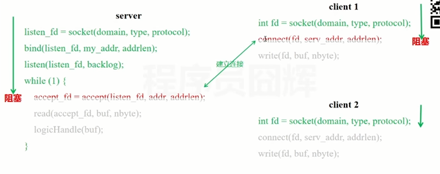
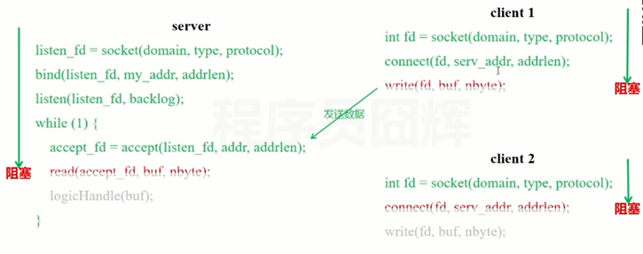
缺点：
单线程：若某个socket阻塞，会影响到其他socket的处理
多线程：即若为每个连接都分配一个线程来进行管理，则若出现下图中的情况，socket在不同的时间内就绪。实际上只需要单线程就可以处理，这种情况下会造成资源的浪费。并且，线程的调度、上下文切换乃至它们占用的内存，可能都会成为瓶颈。
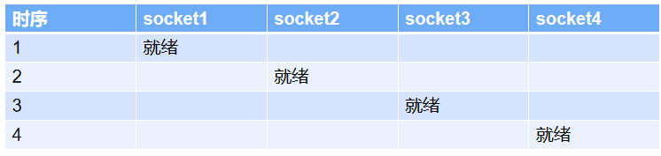 


#### **（2）同步非阻塞IO:**
解释1：逐个收作业，先收A,再收B,接着是C、D,如果有一个学生还未做完,则你会跳过该学生，继续去收下一个。
解释2✔： 服务端不断的检查是否客户端有发起连接（接收到的fd是否为非负整数），如果客户端没有发起连接，返回的fd就是一个负数，直到轮巡到有正常数据到来的fd
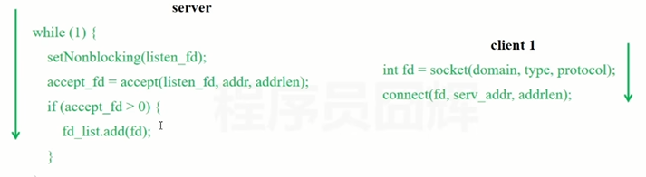
解释3：从操作系统的底层来看，目前的linux操作系统底层分为用户空间（用户态）和内核空间（内核态），在用户空间下执行一些安全的用户指令，在内核空间中执行一些特权指令。`socket的操作是需要在内核空间中完成的，但是内核将socket调用的能力的封装成了系统调用函数（read,write）供用户空间使用。在用户空间调用系统调用函数，由内核空间执行，并将结果返回用户空间`。。。。。`read函数`：数据从网卡拷贝到内核空间，再从内核空间拷贝到用户空间。`write函数`：数据从用户空间拷贝到内核空间，再从内核空间拷贝到网卡上，
以建立四个socket连接为例，当用户调用read/write函数时，如果没有就绪的数据，非阻塞IO会马上返回非法fd，然后主线程继续查看下一个连接，而不是像阻塞IO一样阻塞住。
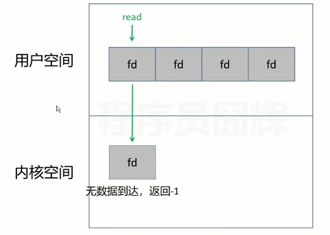
优点：单个socket不会影响到其他socket
缺点：需要不断的遍历进行系统调用(read)来检查数据是否到来，这个系统调用涉及到用户态和内核态的转换，当socket比较多的时候，这会是一笔很大的开销。


#### （3）IO多路复用模型select:（NIO模型）
- IO多路复用模型主要能解决同步非阻塞IO下系统调用频繁的问题
- 解释1：学生写完作业会举手，但是你不知道是谁举手，需要一个个的去询问。
- 解释2✔：在用户空间调用select函数后，会将四个fd拷贝一份到内核空间，由内核空间进行遍历，检查这四个fd对应的socket是否有数据到来，遍历后返回 就绪的fd的数量（复用了fd_set，fd_set入参时表示监听的fd，回参时表示就绪的fd）。返回后用户空间知道有数据就绪，但并不知道是哪一个fd上的socket就绪，所以用户空间上也需要进行遍历
  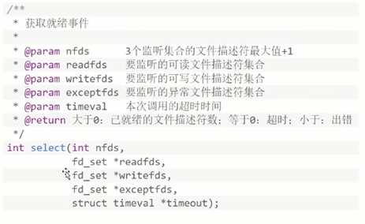
  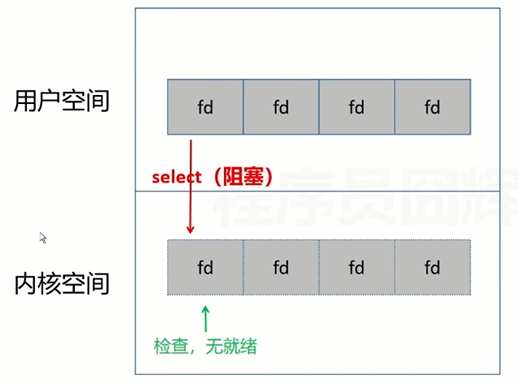
- 优点：将socket是否就绪检查逻辑下沉到操作系统层面，避免大量系统调用。由于不需要每个 FD 都进行一次系统调用，解决了频繁的用户态内核态切换问题
- 缺点：
  单进程（每个进程）监听的 FD 存在限制（由于底层使用数组存储），默认1024
  每次调用需要将 FD 从用户态拷贝到内核态
  不知道具体是哪个文件描述符就绪，需要遍历全部文件描述符
  入参的 3个 fd_set 集合每次调用都需要重置

#### **（4）IO多路复用模型poll:**
  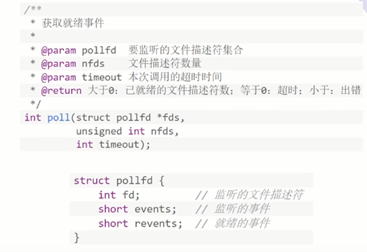
- 解释：Poll 跟 select 基本一样，主要优化了监听1024的限制。主要就是通过数据结构的优化，底层使用链表存储数据，打破了1024的限制，此外，利用两个不同的参数来存储监听事件和就绪事件，所以无需每次都重置fd_set。
- 优点：将socket是否就绪检查逻辑下沉到操作系统层面，避免大量系统调用。由于不需要每个 FD 都进行一次系统调用，解决了频繁的用户态内核态切换问题
- 缺点：
  每次调用需要将 FD 从用户态拷贝到内核态
  不知道具体是哪个文件描述符就绪，需要遍历全部文件描述符

#### **（5）IO多路复用模型epoll:**
- 问题：select/poll中，每次调用还需要将fd全部复制一份到内核空间中，如果fd比较大，这也是一个比较大的开销，此外，在返回就绪事件时，select/poll是无法知道具体是哪个fd就绪的，这就需要再次进行遍历，这也是一个比较大的开销
- 解释1：学生写完了作业会举手，你知道是谁举手，你直接去收作业。
- 解释2✔：epoll实际上是将文件描述符直接维护在内核态中（使用红黑树），由此解决了select/poll中，每次调用还需要将fd全部复制一份到内核空间中。此外，通过就绪列表，可以知道哪些文件描述符是就绪的，用户空间无需再次进行遍历。
- 缺点：
  跨平台性不够好，只支持 linux，macOS 等操作系统不支持
  相较于 epoll，select 更轻量可移植性更强
  在监听连接数和事件较少的场景下，select 可能更优

#### 网络编程的两个主要问题 及 对应的两个基本要素
- 如何定位另一台主机，定位主机上特定的应用 ==> IP地址+端口号
- 找到主机后如何可靠高效地进行数据传输 ==> 网络通信协议TCP/IP协议（应用层、传输层、）
  **IP地址**
   - IP地址作为internet上计算机的唯一标识，标识了不同计算机的身份。
   - IP地址=网络地址+主机地址，在java中使用inetAddress类，来代表IP。
   - IP分类：（1）IPv4和IPv6（2）万维网和局域网。
  **域名**
   - 域名相当于是ip地址的别名
   - 类似于www.baidu(域名).com。如果我们通过IP地址去访问服务器，非常难以记忆，所以引入了域名的概念。
  **DNS**：
   - DNS称为域名解析服务器，它存储了网络中 `域名`和`对应IP地址的服务器`。他会通过域名找到对应的IP地址去访问对应的网络服务器。
  **网络掩码(子网掩码)**
   - 子网掩码两个作用是：（1）用于屏蔽IP地址的一部分以区别网络标识和主机标识，并说明该IP地址是在局域网（网络标识相同）上，还是在广域网上。只有网络标识相同的两台主机在无路由的情况下才能相互通信。（2）用于将一个大的IP网络划分为若干小的子网络。
   - 使用子网是为了减少IP的浪费。因为随着互联网的发展，有的网络多则几百台，有的只有区区几台，这样就浪费了很多IP地址，所以要划分子网。使用子网可以提高网络应用的效率。

#### URI、URL和URN的区别
- `URI`，是uniform resource identifier，统一资源标识符，用来唯一的标识一个资源。
- `URL`是uniform resource locator，统一资源定位符，它是一种具体的URI，即URL可以用来标识一个资源，而且还指明了如何locate这个资源。如，浏览器通过解析给定的 URL 可以在网络上查找相应的、资源。
- `URN`，uniform resource name，统一资源命名，是通过名字来标识资源，比如 mailto:java-net@java.sun.com。
   - 也就是说，URI是以一种抽象的，高层次概念定义统一资源标识，而URL和URN则是具体的资源标识的方式。
   - URL和URN都是一种URI。在Java的URI中，一个URI实例可以代表绝对的，也可以是相对的，只要它符合URI的语法规则。
   - 而URL类则不仅符合语义，还包含了定位该资源的信息，因此它不能是相对的。 

#### SNAT/DNAT
- 通过路由器接入互联网的两台电脑，若IP地址相同，并且同时访问同一个网站，为什么IP地址不会冲突（若IP地址冲突，则arp缓存表会发生混乱）？
- 解决方案：✔通过原地址转换技术SNAT：让数据包通过路由器发送出去时，修改其ip地址！
- 工作流程：
   - PC1和PC2请求一个因特网上的资源，由于不属于同一个子网，首先将目标ip地址改为网关ip地址
   - 然后通过SNAT技术，修改 源IP 和 源端口 为路由器上的公网ip ———— "我感觉这里得这样理解，互联网看做是一个超大服务器！分配给路由器的一个唯一的ip是这个数"
   - （若不修改端口，则从服务器返回时无法判断该把信息返回给哪一台主机）
   - 服务器处理后将处理后的数据包发送回路由器，再通过反SNAT，修改回 ip和端口，最终将数据返回给客户端
- 目标地址转换技术DNAT：配置DNAT，当访问公网地址的8080端口时，将目标IP改为PC1，当PC2访问公网地址的8080端口时，最终将数据包转发给了PC1！实现了本地服务器！

### 计算机网络体系结构
#### OSI分层
- OSI：开放式系统互联通信参考模型（Open System Interconnection Reference Model），是一种由国际标准化组织提出，一个试图使各种计算机在世界范围内互连为网络的标准框架 的概念模型。
- 结构：分为应用层、表示层、会话层、传输层、网络层、数据链路层、物理层，七层结构！
- 在TCP/IP体系中，它的前三层 和 后两层 都被合并成一层了

#### TCP/IP参考模型
- TCP/IP协议: 指的是一系列协议的集合。指一个由FTP、SMTP、TCP、UDP、IP等协议构成的协议簇，只是因为在TCP/IP协议中TCP协议和IP协议最具代表性，所以被称为TCP/IP协议。
- 结构：分为 应用层、传输层（TCP/UDP）、网际(络)层（IP）、网络接口层


- 应用层：规定了应用程序的数据格式！即 客户端和服务器端 约定一种数据格式，双方遵守，方便解析数据。
   - 常见数据格式有，域名系统DNS、HTTP协议、SMTP协议等。
   
- 传输层: 有了IP地址，就可以在两台主机上建立通信，但是主机上有很多不同的应用程序，需要建立端口到端口的通信。由此引出了 socket = "ip + 端口" 的概念。基于socket，引出了可靠的TCP协议 以及 不可靠的UDP协议。通过这两个协议进行数据传输。

- 网络层（第三层）: 该层主要的参数就是IP路由协议。 数据包不能发送给全世界，所以需要一个IP协议，确认数据包发送的位置，保证点对点传输！

- 数据链路层（第二层）：该层主要参数是MAC地址
   - 并且数据链路层将网络层交下来的IP数据报组装成帧，在两个相邻节点间的链路上传送帧（解析 0 和 1 的电信号并传输）。
   （帧作为数据链路层传输的基本单位，以太网规定，一组电信号组成一个数据包，称为'帧'）
   
- 物理层:物理层就是实际的连接介质，比如网线、光纤、电缆等，负责传输电信号
  
### 应用层
#### HTTP & HTTPS 的区别
- HTTP协议：HTTP协议指的是超文本传输协议，请求和响应的报文都是明文的，所有人都能看得到HTTP报文中的内容。为了给HTTP协议增加安全性，所以应运而生了HTTPS
- HTTPS：HTTPS协议并不是一个单独的协议，只不过是在HTTP的基础之上，运用了TLS和SSL进行加密，这样通信就不容易受到拦截和攻击
- 如要使用HTTPS协议，服务端需要向CA（Certificate Authority）申请SSL证书（证书而言，SSL证书比TLS证书更出名）这个证书中，包含了：域名所属、日期、特定的公钥和密钥。申请成功后，浏览器会把HTTP的默认端口从80改为HTTPS的默认端口443

#### SSL & TLS
- SSL 是 TLS的前身，他们都是加密安全协议，现在绝大部分浏览器都不支持SSL，而是支持 TLS
（只不过SSL的名气大，所以很多人会把这两个名字混用）
- TLS握手过程：
1. 客户端向服务端发送Client Hello，并且发送自己支持的TLS版本和加密套件，以及第一个随机数
2. 服务端向客户端发送Server Hello，确认支持的TLS版本和加密套件，以及第二个随机数。接着，服务端还把自己的证书、公钥都发给了客户端，最后发送一个Server Hello Done，说明自己发送完了
3. 客户端生成第三个随机数（预主密钥），并通过公钥加密后发送给服务端。 服务端使用自己的私钥进行解密，得到原始的预主密钥（只有客户端和服务端知道这个预主密钥）
4. 客户端和服务端，都使用 第一个随机数+第二个随机数+预主密钥 = 会话密钥
5. 前四个步骤直到得到会话密钥都是属于非对称加密！最终得到了只有通信二者才知道的会话密钥。接下来客户端和服务端都使用会话密钥对数据进行加密传输（对称加密）

#### 浏览器输入URL返回页面过程
1. 通过DNS解析URL中域名对应的服务器主机IP地址
2. 与服务器主机三次握手建立TCP连接
3. 发送HTTP请求（请求报文） ，获取服务器返回的数据（响应报文）
4. 浏览器解析HTML、CSS和JS等前端文件，渲染页面

### 传输层
#### 三次握手
1. 当客户端向服务端发起请求时，会先发一包连接请求数据（SYN数据包），询问能否建立连接
2. 如果服务端同意建立连接，则回复一个SYN+ACK包
3. 客户端收到后，回复一个ACK包，则连接建立
- 因为这个过程中发送了三次数据，所以称之为三次握手。


#### 传输确认（确认应答原理）：解决丢包、乱序问题
- 经过三次握手后，客户端和服务端都进入了数据传输状态。。。一个数据包可能被拆成多个，并且数据包到达的先后顺序可能不同，如何解决数据包的丢包、乱序问题呢。为了解决上述问题，tcp协议为每一个连接建立了发送缓冲区，发送缓冲区的第一个字节的序列号为0，后面每个字节号都会增加1（首先将数据写入发送缓冲区）。。。发送数据时，从发送缓冲区取一部分数据（序列号+长度）组成发送报文，在其tcp协议头中会附带序列号和长度，————"这个发送报文最终就由：序列号、长度、数据内容组成！！"
- 接收端在收到数据后，需要回复确认报文，确认报文中的ACK包含了 序列号加长度，这个 序列号+长度 是下一包数据发送的起始序列号和长度！！这样一问一答的方式能够使得发送端确认发送的数据已经被对方收到，发送端也可以一次性发送连续的多包数据，接收端只需要回复一次ACK就可以了，这样发送端可以把待发送的数据分割成一系列的碎片发送到对端，对端根据序列和长度在接收后重构出来完整的数据，假设其中丢失了某些数据包，在接收端可以要求发送端重传。比如丢失100-199这100个字节，接收端向发送端发送ACK=100的报文，发送端收到后重传这包数据，接收端进行补齐！！
- 这种方式不论在客户端还是服务端均适用！

#### 四次挥手
- 处于连接状态的客户端和服务端，都可以发起关闭连接请求，此时需要四次挥手来进行连接关闭
1. 假设客户端主动发起连接关闭请求，需要向服务端发起一包FIN包，表示关闭连接，自己进入终止等待1状态，这是第一次挥手
2. 服务端随后发送一包ACK包，表示自己进入了关闭等待状态，客户端进入终止等待2状态，这是第二次挥手，
3. 服务端此时还可以发送未发送的数据，客户端还可以接收数据，待服务端发送完数据后，发送一个FIN包进入最后确认状态，这是第三次挥手，
4. 客户端收到回复ACK包，进入超时等待状态，经过超时时间后关闭连接，服务端收到ack包后立即关闭连接，这是第四次挥手。
- 客户端需要等待超时时间的原因是，需要保证对方已经收到ACK包，假设客服端发送完最后一包ACK就释放了连接，一旦ACK包在网络中丢失，服务端将一直停留在最后确认状态，如果客户端发送最后一包ACK包后，进入停留等待，这时候服务端会因为没收到ACK包会重发FIN包，客户端会响应这个FIN包，重发ACK包并刷新超时时间。这个功能和三次握手一样，也是为了在不可靠的网络链路中，进行可靠的连接断开


#### TCP是如何保证可靠性的？

1. 校验和机制
计算发送端 数据的校验和，如果接收端算出来的检验和和发送端发送的不一样，那么接收端认为报文在传输过程中出了错，就会丢弃该数据。
2. 确认应答和序列号机制
即上述的 传输确认 过程
3. 超时重传机制
指发送出去数据包后，一段时间后没有收到服务端发来的 收到数据的回应报文，则认为数据发送失败，会重新发送一次数据包
4. 连接管理
在进行连接时以及断开连接时，有三次握手和四次挥手来保证有效连接
5. 流量控制
根据接收端的能力，抑制发送方发送数据的速率，使得接收方来得及接受。
6. 拥塞控制
会向探路一样，先发送小的数据，防止堵塞

#### TCP的粘包和拆包问题
- 为什么TCP有粘包和拆包问题 而 UDP没有呢？
   因为，UDP提供了数据边界。而TCP基于流协议（面向流），传输的是一串没有边界的数据
- 在应用层判定，一个完整的包要进行拆分/合并处理
   -  粘包：两个数据包被合并起来。一起发送给服务器端
   - 拆包：将一个数据包拆分为一个或多个数据包，发送给服务器端
- 为什么会发生拆包和粘包
   -  要发送的数据小于TCP发送缓冲区的大小，TCP将多次写入缓冲区的数据一次发送出去，将会发生粘包；
   - 接收数据端的应用层没有及时读取接收缓冲区中的数据，将发生粘包；
   -  要发送的数据大于TCP发送缓冲区剩余空间大小，将会发生拆包；
- 解决方法：
   - 发送端将每个数据包封装为固定长度（不足的字节补0或1）
   - 在数据尾部增加特殊字符进行分割
   - 将数据分为两部分，一部分是头部，一部分是内容体；其中头部结构大小固定，且有一个字段声明内容体的大小。

#### SYN FLOOD
- 该攻击是利用TCP握手过程缺陷，发送大量连接请求，导致服务器半连接队列溢出 或 服务器资源耗尽，最终导致服务器无法处理正常请求
   - 该攻击本质上和三次握手密切相关，与服务器的两个队列SYN QUEUE半连接队列 和 ACCEPT QUEUE全连接队列
   - SYN QUEUE半连接队列：进入半连接队列意味着服务器已经接收到了SYN，并且已经发送了SYN+ACK
   - ACCEPT QUEUE全连接队列：当服务器收到了客服端回复的ACK后，会进入全连接队列
   - SYN攻击者会在短时间内伪造大量不存在的IP地址，向服务器不断地发送syn包，这些伪造的SYN包将长时间占用未连接队列，
   - 半连接队列/全连接队列 是有上限的，如果请求连接数量过多，导致队列溢出，则会丢弃数据包（即导致新连接被丢弃，导致拒绝服务）！
- 解决：
   - 通过防火墙、路由器等过滤网关防护；
   - 通过加固TCP/IP协议栈防范，比如增加最大半连接数，缩短超时时间。
   - 使用SYN cookies技术，这个技术是对服务器端的三次握手做一些修改，是用来专门SYN防范洪范攻击的一种手段。

#### 为什么不是两次握手？
- 为什么不在服务端发完SYN+ACK完就建立连接？？
   - 这是为了防止已失效的请求报文，突然又传到服务器引起错误。
   - 假设两次握手建立连接，客户端向服务端发送了一个SYN包来请求建立连接，因为某些未知的原因并未到达服务器，在中间某个网络节点产生了滞留，为了建立连接客户端会重发SYN包，这次数据包正常送达，服务端回答SYN+ACK，建立连接。
   - 但是第一包数据阻塞的网络节点突然恢复，第一包SYN包又送到服务端，这时服务端会误认为客户端又发起了一个新的连接，从而两次握手之后进入等待数据状态。服务端认为两个连接，客户端认为是一个连接，造成了状态不一致。
   - 三次握手的话接收不到最后的ACK包（因为当前客户端有连接，不会再传一个ACK包过去），就认为连接失败，所以三次握手就是为了解决网络信道不可靠的问题！！TCP协议就是实现了在不可靠的信道上实现了可靠的连接

#### UDP
- UDP的通信是基于非连接的
   - 发送数据时，就只是把数据简单的封装一下，然后从网卡发出去，数据包之间并没有状态上的联系，正因为UDP这种简单的处理方式，导致它的性能损耗非常小（对于CPU和内存的占用远小于TCP），但是对于网络传输中的丢包等问题，UDP协议并无法保证，所以它的传输稳定性要小于TCP
- TCP和UDP的区别
   - TCP是基于连接的; UDP是基于非连接的（发送数据之前不需要建立连接）
   - TCP传输数据稳定可靠，适用于对网络通信质量较高的场景，如：传输文件、发送邮件、浏览网页等。
   - UDP不保证可靠交付，但是它的速度快，适用于对实时性要求较高，但是对少量丢包没有太大要求的场景，如：语音通话、视频直播等。
   - TCP对每一条连接 是点到点的; UDP支持 一对一、一对多、多对一和多对多的通信方式。


### 数据链路层
#### ARP协议
- ARP(address resolution protocol)地址解析协议，其唯一作用就是根据目标设备的IP地址，解析出目标设备的MAC地址
- ARP缓存：其中存储了IP地址与MAC地址的映射关系
- 工作流程
1. PC1需要根据目标IP地址查找APR缓存，查看目标主机所对应的mac地址
2. 若没有查找到PC2对应的mac地址，PC1发送 APR广播请求(请求报文)，来请求PC2所对应的MAC地址
3. PC2收到之后，回复一个 APR响应报文，其中携带有自身的MAC地址（将PC1的IP地址与MAC地址记录到自己的ARP缓存中）
4. PC1收到PC2的MAC地址后，与PC1建立通信，然后发送请求（将PC2的IP地址与MAC地址记录到自己的ARP缓存中）
5. 若ARP缓存中，存在对应IP地址的MAC地址，则直接根据 缓存表内容 完成数据链路层的封装，并从对应的链路发送请求。


# 四：JVM
#### JDK JRE JVM
* JDK：Java Development Kit 开发工具包，面向程序开发者，提供了编译运行程序Java程序的各种工具包，包括编译器、JRE及常用库类，是JAVA核心。
* JRE：Java RunTime Environment 运行时环境，面向程序使用者。它是运行Java程序的必要环境，包括JVM、核心类库、核心配置工具。
* JVM：Java Virtual Mechinal, Java虚拟机。它负责解释执行字节码文件，是Java实现跨平台的核心。
* JDK包含JRE，JRE包含JVM。
* **使用JDK开发了JAVA程序后，通过JDK中的编译器将java源程序编译成字节码文件，在JRE上运行这些字节码文件，用JVM解析这些字节码文件，得到操作系统可以识别的机器语言进行执行操作。**


#### 类加载器
- 类加载器具体功能就是将 class文件字节码 内容加载到内存中，即 将这些静态数据（静态常量池等）转换成方法区的运行时数据结构（运行时常量池等），最终生成一个代表这个类的java.lang.Class对象（运行时类对象）。以及 将这些静态数据转换成堆空间的实例数据（对象具体的实例）
- 类加载器分为以下四种:
（1）系统类/应用程序类加载器(AppClassloader)。系统类加载器位置，jre/lib/rt.jar/java.lang.ClassLoader，只要实现了该抽象类的都为自定义类(object类也实现了)
（2）扩展类加载器(ExtClassLoader) 。扩展类加载器位置，jre/lib/ext。
（3）引导类/启动类/根加载器（BootstrapClassLoader。无法直接获取。因为是用C编写的）。根加载器位置，jre/lib/rt.jar。
（4）用户自定义类加载器（用户编写，继承自ClassLoader）
作用：隔离加载类、修改类加载的方式、扩展加载源、防止源码泄漏

#### 双亲委派机制
- 为保证安全性，实际上类加载器采用了双亲委派机制✔✔✔✔✔。当一个类加载器收到一个类加载的请求，他首先不会尝试自己去加载，而是将这个请求委派给父类加载器去加载，只有父类加载器在自己的搜索范围类查找不到给类时，子加载器才会尝试自己去加载该类，如果都无法加载则抛出异常（classNotFound）。即，实际上类加载器是层层递进的一层层往下寻找（根加载器==>扩展类加载器==>系统类加载器）

- 双亲委派机制的作用：
  （1）防止重复加载同一个.class。通过委托去向上面问一问，加载过了，就不用再加载一遍。保证数据安全。
  （2）保证核心.class不能被篡改。通过委托方式，不能去篡改核心.class（即使篡改也不会加载）。这样保证了Class执行安全。

- 举例来说，比如我们自己写了一个String类，然后定义一个main方法。这个时候去运行这个代码，会发现他返回错误说在String类中找不到main方法。这个原因就是因为双亲委派模型，在我们的应用类加载器收到类加载请求时，它是先向上委派给扩展类加载器，再委派给启动类加载器去加载的，然后呢这个String类它本身是属于启动类加载器路径中rt.jar包里的核心类，并且它是没有main方法的。所以运行时就会加载这个核心类而不是我们自己编写的String类了。

#### 打破双亲委派模型
使用自定义类加载器，可以实现打破双亲委派模型。

### JVM内存结构
- jvm将虚拟机分为5大区域，程序计数器、虚拟机栈、本地方法栈、java堆、元空间
- **程序计数器、虚拟机栈、本地方法栈3个区域随线程而生，随线程而灭**
  

####  程序计数器
- 每个线程都有一个程序计数器，是线程私有的，是一个非常小的内存空间，几乎可以忽略不计。
- 作用：本质就是一个指针。 要知道 方法区中的字节码文件，里面的一行一行的都是JVM指令。程序计数器的作用就是记住下一条JVM指令的执行地址（类似于记住行号一样），让执行引擎可以顺利读取下一条指令
- 如果是native方法，则PC计数器为空
- 特点
（1）线程私有： Java程序是支持多线程运行的，多个线程运行的时候，CPU会有一个调度器组件，给他们分配时间片，比如说给线程1分配一个时间片，若在时间片内，线程1的代码没有执行完，他就会把线程1的状态执行暂存，切换到线程2去，因为不能让线程2老等着，等线程2代码执行到一定程度了，线程2的时间片用完了，那么切换回来再继续执行线程1的剩余部分的代码，这是时间片的概念。那如果在线程切换的过程中，如果我要记住下一条指令执行到哪里了，那么还是要用到程序计数器, 并且由于各自执行的指令地址都是不一样的，所以每个线程都需要自己的程序计数器。在jvm规范中，每个线程都有它自己的程序计数器，是线程私有的，生命周期与线程的生命周期保持一致✔。
（2）不存在内存溢出： 程序计数器是在Java虚拟机规范中规定的唯一一个不会存在内存溢出（OOM，OutOfMemoryError）的区。 比如其他的一些区（堆、栈、方法区之类的）他们都会出现内存溢出。

#### 虚拟机栈
- 结构：先进后出，后进先出。类似于一个桶的结构。。。。队列就是先进先出
- 为什么main()先执行，最后结束~
main的主线程开始执行，就把main方法放到栈空间中，由于在栈的最下面，所以main方法最后结束。
-  作用：栈可以管理线程的生命周期，当main方法结束（栈空间为空时），线程就结束 即程序就结束了
- 对于栈来说，完全不存在垃圾回收问题
- 存放内容：✔✔✔9大基本类型 + 对象引用 + 实例的方法
每有一个方法就会创建一个栈帧，局部变量中的基本类型可以直接放入栈帧中的局部变量表中，引用类型(String User)就会指向堆里的引用对象。

#### 本地方法栈
- native的作用：示例：在new Thread().start()方法中有一个方法。private native void start0();
   ✔凡是带了native关键字的，说明java的作用范围达不到了，需要调用底层c语言的库！
   ✔具体调用方式为：进入本地方法栈，调用本地方法本地接口（JNI，即Java Native Interface）
   
- JNI作用：开拓Java的使用，融合不同的编程语言为Java所用！

- 本地方法栈的作用：在内存区域中专门开辟了一块标记区域，用来登记native方法。在执行引擎最终执行时通过 JNI 加载本地方法库中的方法

   

####  方法区
- ✔方法区被所有线程共享！所有定义的方法的信息都保存在该区域
  逻辑上，方法区属于堆的一部分，但是为了和堆进行区分，通常又叫 "非堆"

- 存放内容：
  ✔✔✔ 静态变量(static)、运行时常量池（final常量）、类信息(.Class运行时类)。
  注意：实例变量存在堆内存中，和方法区无关

  

#### 堆
- 一个JVM只有一个堆内存，并且堆内存的大小是可以调节的。
✔✔是JVM中所有线程共享的部分
- 存放内容：类的实例化对象，包括实例对象的方法、常量（字符串常量池）、变量等
- 堆内存中还要细分为三个区域
（1）新生区/代(eden gen) Young/New： 包括伊甸园（Eden Space）、幸存者0区（from）、幸存者1区(to)
（2）养老（老年）区/代（old gen）
（3） 永久（持久）区/代（Perm gen）： 实际上永久区在方法区中实现
永久存储区里存放的都是Java自带的类，例如lang包中的类 如果不存在这些，Java就跑不起来了
✔在JDK8以后，永久存储区改了个名字(元空间)

#### 堆内存的溢出处理（JVM优化）
可以使用特殊的命令，可以在发生OOM异常时✔Dump出 堆转储快照，堆转储快照可以使用分析工具JProfile对其进行分析（可以找到哪行代码出问题，内存中占用最多的变量是什么等信息），确认内存中导致 OOM 的对象是否必要，分清到底是内存泄漏还是内存溢出。  

### 内存分配过程
#### 对象的内存分配流程
- 当我们new一个对象，开始流程。（1）大部分对象的内存 是在堆上分配的，只有小部分是在栈上分配的。根据 逃逸分析 算法进行判断，决定是否在栈上分配，栈上分配后的对象通过标量分析，会被拆分成更小的部分（2）如果不允许被栈上分配，就会在堆上进行分配，如果被判定为java中的大对象，该对象会直接在老年代中被进行分配（3）若并未判定为大对象，对象会通过 线程本地分配缓冲区TLAB进行判断后，在eden区完成内存分配
- 逃逸分析：原则（1）当对象的 适用范围不止当前方法，那么不允许对象在栈上分配。（2）当对象 只在当前方法中使用，那么允许对象在栈上分配
- 当经过了逃逸分析后的对象，若对象在栈上进行分配，jvm会通过标量替换来拆解对象
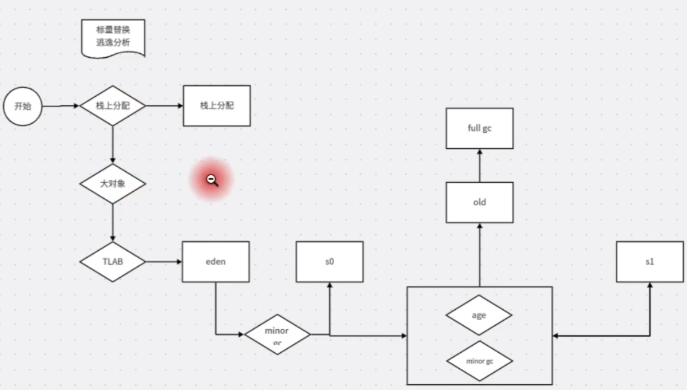

#### 内存划分方式
- （1）指针碰撞：将内存拆分，中间放一个指针，指针左边是已分配的内存空间，右边是空闲的内存空间。
  申请内存时，将空间内存空间中的内存划出，指针向右移动
  缺点：无法分配 非连续的内存空间
- （2）空闲列表：空闲列表记录了哪段内存地址是空闲的，申请内存空间时，从这个空闲列表中的区域获取内存地址

#### 内存分配并发问题 的解决方案
- （1）CAS+失败重试: compareAndSwap
     CAS 加 失败重试机制 来保证更新原子性，从而解决并发问题。
     CAS是乐观锁的一种实现方式。即每次不加锁而是假设没有冲突而去完成某项操作，如果因为冲突失败就重试，直到成功为止。
- （2）TLAB：本地线程分配缓冲区
  每个线程在创建时，这个线程为自己提前申请一小块的内存空间！
  结合对象的内存分配流程：
  TLAB的判断指的是，先判断TLAB中的内存空间是否足够可用，如果足够可用，则在该内存中进行分配，此时不会产生并发问题（因为线程是私有的，申请的内存空间也是私有不可重复的）
  当对象大于 TLAB 中的剩余内存或 TLAB 的内存已用尽时，再采用上述的 CAS 进行内存分配

### 常见GC算法
#### 判断对象是否是垃圾
- 引用计数：在对象中添加一个引用计数器，如果被引用计数器加 1，引用失效时计数器减 1，如果计数器为 0 则被标记为垃圾。原理简单，效率高，但是在 Java 中很少使用，因为存在对象间循环引用的问题，导致计数器无法清零。
- 可达性分析：主流语言的内存管理都使用可达性分析判断对象是否存活。基本思路是通过一系列称为GC Roots 的根对象作为起始节点集，从这些节点开始，根据引用关系向下搜索，搜索过程走过的路径称为引用链，如果某个对象到 GC Roots 没有任何引用链相连，则会被标记为垃圾。可作为 GC Roots的对象包括虚拟机栈和本地方法栈中引用的对象、类静态属性引用的对象、常量引用的对象。 

#### Java 的引用类型（四大引用）
- JDK1.2 后对引用进行了扩充，将引用分为强引用（Strongly Re-ference）、软引用（Soft Reference）、弱引用（Weak Reference）、虚引用（Phantom Reference）4种，这4种引用强度依次逐渐减弱。
（1）强引用：强引用是最传统的“引用”的定义，是指在程序代码之中普遍存在的引用赋值，即类似“Object obj = new Object()”这种引用关系。无论任何情况下，只要强引用关系还存在，垃圾收集器就永远不会回收掉被引用的对象。
（2）软引用：软引用是用来描述一些还有用，但非必须的对象。只被软引用关联着的对象，在系统将要发生内存溢出异常前，会把这些对象列进回收范围之中进行第二次回收，如果这次回收还没有足够的内存，才会抛出内存溢出异常。在JDK 1.2版之后提供了SoftReference类来实现软引用
**软引用用来缓存服务器中间计算结果及不需要实时保存的用户行为等（备用和缓存）**
（3）弱引用： 弱于软引用，弱引用也是用来描述那些非必须对象，但是它的强度比软引用更弱一些，被弱引用关联的对象只能生存到下一次垃圾收集发生为止。当垃圾收集器开始工作，无论当前内存是否足够，都会回收掉只被弱引用关联的对象。在JDK 1.2版之后提供了WeakReference类来实现弱引用。**弱引用常用语ThreadLocal中，用来保证上下文同一个对象**
（4）虚引用：虚引用也称为“幽灵引用”或者“幻影引用”，它是最弱的一种引用关系。定义完成后无法通过该引用获取对象。为一个对象设置虚引用关联的唯一目的只是为了能在这个对象被收集器回收时受到一个系统通知。在JDK 1.2版之后提供了PhantomReference类来实现虚引用。

#### GC算法
（1）复制算法
✔JVM年轻代 中，基本上都是使用这个算法
- 流程：复制算法可以保证to区永远是干净的。每一次GC后，都会将Eden区中存活下来的对象移动到幸存区中（eden区被清空）。**第一次移动**，移动到哪个区，哪个区就是from，即剩下的空的区为to。。。为了方便理解，可以用口诀 "谁空谁是to" 来记忆。**第二次以及之后的GC**，存活下来的对象到to区中区，此时from和to两个区都有对象，此时将其中一个区的对象移动到另一个区（通常将from移动到to），腾出的空区为to区
- 默认当一个对象经历了15次GC 都还没有被清除，就会进入老年区
- 优点：运行高效，没有内存碎片（对象都规整到from区，保证了to区永远干净）
- 缺点: 浪费了内存空间（to区永远为空）
- 问题：如果eden区空间很大，并且其所有对象都幸存下来了，在from和to区进行复制的消耗是很大的。所以复制算法最佳使用场景是在对象存货度较低的区域，即在新生代中能得到很好的利用

（2）标记-清除算法
✔目前JVM老年代中，基本都是使用标记整理算法，标记清除算法就是标记整理算法的前身（当JVM产生的内存碎片不多时，就使用标记清除算法）
- 标记-清除算法将垃圾回收分为两个阶段：标记阶段和清除阶段。
在标记阶段，标记所有 活动的对象（从每个 GC Roots 出发依次标记有引用关系的对象）
 在清除阶段，清除所有未被标记的对象。
- 优点：不需要额外的空间（复制算法就需要两块空间）
-  缺点：两次扫描严重浪费时间,并且还会产生内存碎片

（3）标记-整理算法
- 标记-压缩算法适合用于存活对象较多的场合，如老年代。它在标记-清除算法的基础上做了一些优化。即在清除阶段，它并不简单的清理未标记的对象，而是将所有的存活对象压缩到内存的一端，然后清理边界外所有的空间以便复用，由此来解决内存碎片的问题！
- 优点：解决了内存碎片问题
- 缺点：多了一个移动的成本

（4）分代-收集算法
- 分代收集算法是现在普遍采用的垃圾收集算法：
把堆内存分为新生代和老年代。新生代采用复制算法，老年代采用标记清除和标记整理的算法
- JVM调优很多就是在调整 标记清除和整理 的次数，如几次标记清除后进行整理


####  堆中垃圾回收的过程？
   首先堆中划分了新生代和老生代，新生代中还以8：1：1的比例划分了Eden区，From Survivor区和To Survivor区，我们简称S0和S1区。**垃圾回收主要是在伊甸园区和养老区，幸存区是新生区和养老区的过度，一般不会被回收**。
   那么在实例化一个对象的时候，对象是被存放在堆中的Eden区的，然后在Eden区满了的时候，就会需要进行一次轻GC垃圾收集，存活下来的对象保存到幸存者区，每熬过一次轻GC，年龄会加1，当年龄增加到15岁(默认)，就会晋升到老年代。当养老区满了则触发 重GC。。。。如果重GC后内存仍不足，则触发OOM异常
   S0区，S1区空着，在新生代对象下一次GC时就把Eden区和S0区的存活对象复制到空着的S1区，清空Eden和S0区。S0和S1区交替使用，保证有一个是空闲的，用于复制，这样的效率很高。

####  为何需要Survivor区？
  - 如果没有Survivor区的话，新生代对象存放区域只有一个Eden区，并且新生代对象的更新是非常频繁的，因此在Eden区和老年区之间的复制会非常频繁，也会比较频繁的触发Full GC算法，影响系统的性能。

  - 为何需要两个Survivor区？ 主要是用于复制算法！如果只有一个S区的话，只能用标记清除算法，这样会出现内存碎片，如果要解决内存碎片的问题就需要引入标记整理的算法，而这样又会影响整体性能。

  - 为啥设计8：1：1。统计和经验表明，90%的对象存活时间极短，每次GC会有90%的对象被回收，剩下的10%就要预留一个survivor空间去保存。

    
#### 什么情况下对象会进入老年代？
（1）躲过15次GC之后会进入老年代
（2）大对象直接进入老年代
-   大对象是指需要大量连续内存空间的Java对象，比如很长的字符串或者是很大的数组或者 List集合，大对象在分配空间时，容易导致内存明明还有不少空间时就提前触发垃圾回收以获得足够的连续空间来存放它们，而当复制对象时，大对象又会引起高额的内存复制开销，为了避免新生代里出现那些大对象，然后屡次躲过GC而进行来回复制，此时JVM 就直接把该大对象放入老年代，而不会经过新生代。
   （3）**动态年龄判断**
   Survivor区的对象年龄从小到大累加，当累加到X年龄时占用空间的总和大于50%，则比X年龄大的对象都要晋升到老年代。
   （4）**JVM的空间担保机制(避免频繁进行Full GC)**
   新生代Minor GC后剩余存活对象太多，无法放入S区，就必须把这些存活对象转移到老年代中，如果此时老年代空间也不够怎么办？
- 每次执行Minor GC之前，JVM会检查一下老年代可用的内存空间，是否大于新生代所有对象的总大小。（因为在极端情况下，如果新生代Minor GC之后，所有对象都需要存活，就会造成新生代所有对象都要进入老年代）
   -  如果老年代可用内存大于新生代所有对象总大小，就可以大胆发起Minor GC，因为即使所有新生代对象都存活，S区放不下，也可以转到老年代中。
   - 如果老年代可用空间小于新生代所有对象总大小，那么就去判断老年代可用空间大小是否大于之前每一次Minor GC后进入老年代的对象的平均大小。
      - 如果小于就会直接触发FullGC
      - 如果大于，就可以冒险尝试Minor GC。但是有可能会出现新生代存活对象大小大于S空间同时也大于老年代可用空间，此时就会触发“Full GC”。如果Full GC后，老年代还是没有足够的空间来存放Minor GC后的剩余存活对象，那么就会导致内存溢出。


####  JMM
- java memory mode, java的内存模型
- JMM的定义：是一个缓存一致性的协议，用于定义数据读写的规则。是一种抽象的概念，描述了一组规则或规范
- JMM的作用：JMM定义了线程 工作内存和主内存之间的抽象关系，从而确定了哪些操作是线程安全的，哪些操作是线程不安全的。具体的如：线程之间的共享变量存储在主内存中（main memory），每个线程都有自己的私有本地内存（local memory）
- 共享对象的可见性/一致性问题：解决主内存和私有本地内存中数据的一致性问题，可以使用 volilate关键字，该关键字可以将本地内存中的修改立刻更新到主内存中

#### JMM的规则
- 定义的数据读写的规则
(1) 不允许read和load、store和write操作之一 单独出现，即使用了read必须load，使用了store必须write
(2) 不允许一个线程丢弃它最近的assign操作，即变量在工作内存中改变了之后必须把该变化同步回主内存。
(3) 不允许一个线程无原因地（没有发生过任何assign操作）把数据从线程的工作内存同步回主内存中。
- 前面三点就是 volilate 关键字所实现的功能了
(4) 一个新的变量只能在主内存中“诞生”，不允许在工作内存中直接使用一个未被初始化（load或assign）的变量。
- 这也很合理，因为new操作都是在堆中，在主内存中，工作内存是线程从 主内存中拷贝出来的
(5)一个变量在同一个时刻只允许一条线程对其进行lock操作
- 这个实际上就是lock锁，高并发状态下，只能允许一个线程拿到锁
(6) 如果对一个变量执行lock操作，那将会清空工作内存中此变量的值，在执行引擎使用这个变量前，需要重新执行load或assign操作以初始化变量的值。
(7) 如果一个变量事先没有被lock操作锁定，那就不允许对它执行unlock操作，也不允许去unlock一个被其他线程锁定的变量。
(8) 对一个变量执行unlock操作之前，必须先把此变量同步回主内存中（执行store、write操作）

#  五、多线程与高并发
#### 程序/进程/线程
- 程序(program)：是为完成特定任务、用某种语言编写的一组指令的集合。即指一段静态的代码（qq.exe、powerpoint.exe）！
- 进程(process)：是程序的一次执行过程（或是正在运行的一个程序）。✔是系统进行资源分配和调度的基本单位（即程序启动后 在内存中为其分配空间）。
- 线程(thread)：进程可进一步细化为线程，是一个程序内部的一条执行路径。✔是程序执行的基本单位。

#### 线程调度/切换/超线程
- 程序的执行过程（CPU读取内存中进程的过程）：CPU中的三个组件（PC、register、ALU），PC存储指令的地址，Register读取进程中的数据，ALU进行计算处理后 将结果返回给内存。
- 线程调度：每个进程都有各自的多个线程，这么多的线程，是通过OS（操作系统）来进行调度的。。。
- 线程切换（context switch）：其中，CPU读取指令 ==> 保存现场 ==> 执行新线程 ==> 恢复现场继续执行原线程这样一个过程，称为线程的切换
   - 了解了线程切换概念，我们知道了线程不是越多越好，如果线程太多，会把时间浪费在切换线程上
   - 所以我们才需要有线程池的概念，提前建立好一些线程，控制好总线程数量，避免大量的线程切换
- 超线程：即一个ALU对应多个(PC + REGISTER)，如4核8线程。。。 具体说来即为一颗cpu中装配两套 PC + REGISTER，一套保存一个线程的数据，这样在线程切换时只需要将ALU指向另一套即可，省去了 保存现场/恢复现场 的流程


#### 对象在内存中的结构
- 对象在内存中的结构，即把对象加载到JVM堆中的内存结构，包括如下：
- 普通对象包含的结构
1. markword对象头，8字节（64bit）
   - 锁的信息记录在markword中，如syschronized(new Object())，锁的信息就记录在这个Object对象的markword中
   - GC相关信息，如分代年龄等
2. class point类型指针，指向所属类，4字节（注意对象指针如果没有被压缩则占8字节，JVM默认开启指针压缩，所以占4字节）
3. instance data实例数据，所含变量字节（如 int为4个字节），本例为0字节
4. padding对齐，将字节数补充至8的倍数（最终所有的java对象所占内存都能被8整除），方便JVM处理，本例为 4字节
- 即，new Object()在内存中占了16字节！！
- 若为数组对象，包含的结构中 除了普通对象包含的结构外，还有一个专门记录数组长度的结构


#### 线程的状态
- **创建状态(new)** ：进程正在被创建，尚未到就绪状态。
- **运行状态(runnable)** ：进程正在CPU上运行(单核 CPU 下任意时刻只有一个进程处于运行状态)。
- **阻塞状态（blocked）：**被阻塞等待监视器锁定的线程处于此状态
- **等待状态(waiting)** ：进程正在等待某一事件而暂停运行如等待某资源为可用或等待 IO 操作完成。即使处理器空闲，该进程也不能运行。
- **限期等待状态(time_waiting)：**限期等待状态，可以在指定时间内自行返回。 可能由于调用了带参的 wait 和join 方法。  
- **结束状态(terminated)** ：进程正在从系统中消失。可能是进程正常结束或其他原因中断退出运行。
   

#### sleep和wait的异同
- 同：一旦执行方法，都可以让当前线程进入阻塞状态
- 异：1）声明位置不同：thread类中声明sleep(),object类中声明wait()
2) 调用要求不同：sleep()可以在任何需要的场景下调用，wait()必须要同步代码块和同步方法中调用
3）如果两个方法都在同步代码块和同步方法中,sleep不会释放同步锁，wait会释放锁
4）sleep会设置时间自动唤醒，而wait可以设置时间唤醒，不设置的话需要notify函数进行唤醒

### 锁
#### CAS
- compare and swap自旋锁，属于乐观锁的一种实现
可以在没有锁的情况下，对数值进行更新操作 且 不会产生并发问题（保证线程一致性）
- 工作流程（原理）
1. 首先读取当前值 并存入E，然后进行更新操作，将结果存入V
2. 再次读取当前值 并存入N
   - 若 E=N，则代表修改过程中没有其他线程进行更新操作，直接对数据进行更新即可
   - 若 E≠N，则代表修改过程中有其他线程进行更新操作，则回到(1)，即重新 首次读取当前值
- ABA问题
✔E=N，但是实际上过程中有其他线程进行更新操作，只不过是多次更新后最后值与原值相同
- ABA问题解决
   - 可以通过添加版本号的方式解决ABA问题。如第一次读取的E=0，版本号为1.0。第二次读取时N=0，版本号为2.0，即说明了版本被更新过（当然也可以使用布尔类型进行标记，修改过版本号为true~）

#### 锁升级过程
- 偏向锁（new对象时） ==> 轻量级锁（无锁、自旋锁、自适应自旋） ==>重量级锁
- 不同锁状态下，markword的布局
1. new对象：刚new的对象，未加锁的状态下，若调用了hashcode()，会将该实体的31位的hashcode存入。4位用来存储分代年龄，所以最多存15代。 3位/2位用来存储 锁信息
2. 偏向锁：当可能存在多个线程（synchronized），并且竞争不是特别激烈时，没有必要申请排他锁（让当前线程工作完后 让给下一个线程就好了）
   - 偏向锁的想法类似于贴标签，使用52位来记录了一个指向当前线程的指针。
3. 轻量级锁（乐观锁）：当另一个线程与持有偏向锁的线程发生任意的竞争，就会撤销偏向锁，自动升级为轻量级锁。此时，每个线程都会在各自的线程栈中生成自己的lock record对象。撤销偏向锁后，各个线程使用自旋（CAS）的方式✔ 去竞争轻量级锁得到轻量级锁的线程，使用62位来记录 指向当前线程中lock record的指针
4. 重量级锁（排他锁）：早期jdk在 某线程自旋超过了10次，或者等待自旋的线程超过了整个cpu核数的二分之一，即竞争特别激烈。锁升级为重量级锁
   - jdk升级到某个版本(1.6)之后，变成了自适应调优，自动判定何时升级为重量级锁
   - 重量级锁需要向内核态中申请（其他锁在用户态即可申请），并且重量级锁是mutex结构，在内核态中也是有数量限制的。申请到重量级锁的线程进入等待队列（重量级锁维护了一个队列），由操作系统进行调度，指挥执行队列中下一个线程

#### synchronized 的底层实现原理
1. java代码层级：添加synchronized关键字
2. 字节码层级：synchronized 被翻译为 monitorenter moniterexit
3. jvm：执行过程中，自动进行锁升级
4. hotSpot层面：
问：多核cpu进行CAS锁升级时，是如何保证原子性的？
答：调用lock comxchg（汇编语言，compare and exchange），
使用comxchg指令，即底层cpu支持CAS操作，但是该操作是非原子性的
使用lock指令，底层具体是调用 cpu锁定缓存行 或者 锁总线来实现的，可以保证了一个cpu执行时不会被另一颗cpu打断，保证了原子性！！！
- 注意：synchronized加锁的代码中，指令仍然能够重排序，即synchronized能够保证程序的可见性(CAS)和原子性(lock)，无法保证其有序性

#### 重入锁
- java中大多数的锁都是重入锁，即可以在一个 锁的内部继续加锁（同一把锁）。。。如synchronized,lock锁等。。。。
- 实际上 锁可重入 是非常常用的，譬如 子类重写父类的 一个同步方法 synchronized m()，并在该方法中调用了父类的 synchronized m()方法，此即为锁重入
   - 重入锁解决了 连续多次对同一把锁进行lock时，会造成死锁的问题。
   - 重入锁使同一个线程可以对同一把锁在不释放的前提下，反复的加锁不会导致线程的卡死，唯一的一点就是需要保证 unlock() 的次数和 lock()一样的多。

#### lock锁
- java提供的两种最常见的锁，一个是synchronized锁，一个就是lock锁
  而lock锁中，最重要的就是 ReentrantLock锁 和ReadWriteLock

#### lock锁 和  synchronized的异同
- 同： ReentrantLock锁 和 synchronized 一样，是一个互斥锁，可以让多线程在执行期间，只有一个线程在执行指定的代码
- 异：
   - 区别1： synchronized是非公平的，ReentrantLock在默认情况下是非公平的，可以通过构造方法指定公平锁。（一旦使用了公平锁，性能会急剧下降，影响吞吐量。。故推荐优先使用非公平锁）（公平锁指多个线程在等待同一个锁时，必须按照申请锁的顺序来依次获得锁，而非公平锁不保证这一点，在锁被释放时，任何线程都有机会获得锁）
   - 区别2：ReentrantLoc锁具有等待可中断的特性，持有锁的线程长期不释放锁时，正在等待的线程可以选择放弃等待而处理其他事情。。。而synchronized是不可中断的
   - 区别3：锁绑定多个条件，一个 ReentrantLock可以同时绑定多个 Condition（多次调用 newCondition 创建多个条件），而synchronized 中锁对象的wait跟notify可以实现一个隐含条件，如果要和多个条件关联就不得不额外添加锁

#### AQS
- AQS介绍：AQS 就是 AbstractQueuedSynchronizer，多线程同步器
  lock锁中，sync()方法就是继承了AQS类。
  AQS 提供了两种锁机制，分别是排它锁，和共享锁。 排它锁，就是存在多线程竞争同一共享资源时，同一时刻只允许一个线程访问该 共享资源，也就是多个线程中只能有一个线程获得锁资源，比如 Lock 中的 ReentrantLock 重入锁实现就是用到了 AQS 中的排它锁功能。共享锁也称为读锁，就是在同一时刻允许多个线程同时获得锁资源，比如 CountDownLatch 和 Semaphore 都是用到了 AQS 中的共享锁功能。

- AQS类的属性
  (1) AQS内部有一个内部类Node(next,prev,thread属性)，由多个node组成双向链表
  (2) AQS类有三个属性，Node head, Node tail, int state

- 锁的实现机制：
   - 如ReentrantLock锁想要获得锁资源，就需要基于CAS的方式，将AQS的state属性值加1（默认为0）。初始化时，state = 0，当一个线程A，拿到了锁资源，state改为1。此时其他线程B，想要获取锁资源时，无法获取锁，会将其信息存储在node双向链表中排队(线程信息存储在thread属性中)（如果线程 A又请求锁，是不需要排队的，否则就直接死锁了，作为可重入锁，state继续加1即可）
   
   - 若为公平锁，只有线程A把此锁全部释放了，状态值减到0了。然后才会通知队列唤醒线程B，使B可以再次竞争锁。如果线程B后面还有线 C，线程C继续休眠，直到B执行完了，通知了线程C。
   
   - 若为非公平锁，唤醒线程B的过程中，来了一个线程 D，那么线程 D 是有可能获取到锁的，如果线程 D 获取到了锁，线程 B 就只能继续等待休眠了。
   
     


#### Lock锁实现（了解）
1. ReentrantLock 可重入锁
- 替代synchronized，需要unlock写在try finally里
- tryLock（时间）方法。决定要不要wait、要不要阻塞，具有等待可中断的特点。二synchronized不可中断
- lockInterruptibly（）方法。这种方式来加锁可以被打断，后用interrupt（）可以打断
- ReentranLock(true)公平锁，线程来取锁先检查队列有没有等待，有就等，没有就去抢锁，默认非公平锁

2. CountDownLatch
CountDownLatch 是基于执行时间的同步类，允许一个或多个线程等待其他线程完成操作，构造方法接收一个 int 参数作为计数器，如果要等待 n 个点就传入 n。每次调用 countDown 方法时计数器减 1，await 方法会阻塞当前线程直到计数器变为0，由于 countDown 方法可用在任何地方，所以 n 个点既可以是 n 个线程也可以是一个线程里的 n 个执行步骤。 

3. Phaser
分为每个阶段，每个阶段完成相应的线程才可以到达下一个阶段，必须完成那个阶段需要完成的所有线程才可以到达下一个阶段

4. ReadWriteLock
- 读就是共享锁。写就是排他锁
- 大大提高了读的效率
- 读的时候不加锁，是不行的，可能写一半被读了

5. Semaphore
- 限流，最多允许多少个线程同时使用
- 信号量用来控制同时访问特定资源的线程数量，通过协调各个线程以保证合理使用公共资源。信号量可以用于流量控制，特别是公共资源有限的应用场景，比如数据库连接。Semaphore 的构造方法参数接收一个 int 值，表示可用的许可数量即最大并发数。使用 acquire 方法获得一个许可证，使用 release 方法归还许可，还可以用 tryAcquire 尝试获得许可。  也可以设公平和不公平，默认不公平

6. Exchanger
- 交换者是用于线程间协作的工具类，用于进行线程间的数据交换。它提供一个同步点，在这个同步点两个线程可以交换彼此的数据。
- 两个线程通过 exchange 方法交换数据，第一个线程执行 exchange 方法后会阻塞等待第二个线程执行该方法，当两个线程都到达同步点时这两个线程就可以交换数据，将本线程生产出的数据传递给对方。应用场景包括遗传算法、校对工作等。  

7. LockSupport
- 锁的支持，park（），当前线程停止
- 解封LockSupport.unpark（），继续运行 
- 与wait区别，wait需要在锁上执行，LockSupport.park()不需要
- 可以叫醒指定的线程
- unpark可以先行park调用，不用停车了


### cacheline
#### 缓存行cacheline

-  CPU到内存之间有L1，L2，L3多层缓存（L1L2为私有缓存，常位于cpu上，L3为公共缓存，常位于主板上多个cpu访问相同的L3）。当需要读取数据时，CPU会先从最近的缓存L1中寻找，一直逐层读取到主内存main memory。若直到 找到主内存中存在需要的数组X，则先将其存到缓存L3 ==> L2 ==> L1，最后由CPU开始计算
- ✔实际上，我们从内存往缓存中读数据是按"块"读（因为程序往往有一个局部性原理，当使用某一个数据后，很可能接下来会使用其相邻的数据）
- ✔这个"块"的概念，专业术语上称 cacheline缓存行，一个缓存行占64字节
- 缓存行的这种特性也决定了在访问同一缓存行中的数据时效率是比较高的。比如当你访问java中的一个long类型（8字节）的数组，当数组中的一个值被加载到缓存中，它会额外加载另外7个，因此可以非常快速的遍历这个数组（遍历连续的内存块中分配的数据结构非常快速）

#### 系统底层如何实现数据一致性

- java层面：除了volatile外，synchronized和final也可以保证可见性
- jvm层面：如果对声明了 volatile 变量将进行写操作，JVM就会向处理器发送一条Lock前缀的指令，将这个变量所在的缓存行的数据立即写回到系统内存。并且cpu读取volatile标识的变量时 只能从系统内存中读取，不能从缓存中读取。这样便保证了线程的可见性。

- cpu层面：数据一致性即指的是，当某一颗cpu改变了某个缓存行中的一个值✔，通知所有其他拥有该缓存行的cpu，该缓存行失效，请从内存中重新读取数据

   即在cpu级别的数据一致性，是以缓存行为单位的。。实现方式是通过缓存一致性协议（MESI）做到的

- MESI做不到的可以用锁总线的方式实现（只允许当前cpu访问）

- MESI：其中一种缓存一致性协议。 MESI是intel芯片的协议，不同的公司缓存一致性协议名称不同
   - cpu将缓存行标记为了四种状态，Modified,Exclusive,Shared,Invalid
   - 缓存一致性协议即当cpu修改某一缓存行的数据时，将当前缓存行修改为modified，然后通知所有其他拥有该缓存行的cpu，将该缓存标记为invalid
   - 若cpu需要修改缓存行状态为invalid中的数据时，需要从内存中重新读取数据到缓存中
   - 缓存一致性协议是硬件级别的协议，不受软件控制，和java层面的volatile有天壤之别

#### 伪共享问题
- 在core1上线程需要更新变量X, 同时core2上线程需要更新变量Y，X和Y处于同一个缓存行。。。。在这种情况下，每个线程都要去竞争缓存行的所有权来更新对应的变量。如果core1获得了缓存行的所有权，那么缓存子系统将会使core2中对应的缓存失效。相反，如果core2获得了所有权然后执行更新操作，core1就要使自己对应的缓存行失效。
- 这里需要注意：整个操作过程是以缓存行为单位进行处理的，这会来来回回的经过L3缓存，大大影响了性能，core1和core2的修改本应该是一个并行的操作，但是由于缓存一致性协议，却成为了串行！这就是伪共享问题，即每次当前线程对缓存行进行写操作时，内核都要把另一个内核上的缓存块无效掉，并重新读取里面的数据。

#### 缓存行对齐
- 缓存行对齐是一种编程技巧。。。在一些会频繁操作数据的情况下，若不希望出现伪共享问题 ，可以根据缓存行的特性进行缓存行对齐，即将要操作的数据凑齐一个缓存行进行操作
- 若数据本身就超过了缓存行的大小，此时仍希望保持数据一致性，只能通过锁总线的方式（即当前cpu访问时，不允许其他的cpu访问）

#### 乱序执行
- 指令乱序执行主要由两种因素导致：（1）编译期指令重排。（2）运行期 CPU 乱序执行。
- 无论是编译期的指令重排还是 CPU 的乱序执行，主要都是为了让 CPU 内部的指令流水线可以“充满”，提高指令执行的并行度。
（允许重排序的原则：as-if-serial原则，单线程下 两条无关的 最终能导致相同结果的指令，可以乱序执行）
- as-if-serial：了解。该原则规定了 不管怎么重排序，单线程程序的执行结果不能改变，编译器和处理器必须遵循 as-if-serial 语义。为了遵循 as-if-serial，编译器和处理器不会对存在数据依赖关系的操作重排序，因为这种重排序会改变执行结果。但是如果操作之间不存在数据依赖关系，这些操作就可能被编译器和处理器重排序。

### Volatile
#### Volatile的两个作用
1. 保证线程可见性
- 指的是 volatile 类型的变量，其变量值一旦被修改，其他线程就能够立刻感知到
- 如果对声明了 volatile 变量将进行写操作，JVM就会向处理器发送一条Lock前缀的指令，将这个变量所在的缓存行的数据立即写回到系统内存。并且cpu读取volatile标识的变量时 只能从系统内存中读取，不能从缓存中读取。这样便保证了线程的可见性
2. 禁止指令重排序
-  指的是被 volatile 修饰的变量，其执行顺序不能被重排序

#### happens-before原则
- JVM中，规定了8种程序不可以乱序执行的情况！这八种情况具体无须背诵，只需要知道存在这么个东西即可✔✔！
1. 程序次序规则：同一个线程内，按照代码出现的顺序，前面的代码 先行于 后面的代码。
2. 管程锁定规则： unlock 操作先行发生于后面对同一个锁的 lock 操作。
3. volatile规则：对 volatile 变量的 写操作 先行发生于 后面对这个变量的读操作。
4. 线程启动规则：线程的 start()方法 先行发生于该线程的每个操作。
5. 线程终止规则：线程中所有操作先行发生于对线程的终止检测。
6. 对象终结规则：对象的初始化完成 先行发生于 finalize()方法。
7. 传递性：如果操作 A 先行发生于操作 B，操作 B 先行发生于操作 C，那么操作 A 先行发生于操作C 。

#### volatile的底层实现
- 即volatile底层如何实现 禁止指令重排序以及线程可见性
1. java层面：对指定变量使用volatile标记
字节码层面: 指定表面添加了ACC_VOLATILE标记
2. ✔JVM层面：JVM中使用了JSR内存屏障机制规范，屏障两端的指令不允许重排序
   - JVM层面规定了必须要实现四种逻辑屏障——针对读读LoadLoad，读写LoadStore，写读StoreLoad，写写StoreStore的屏障。
3. hotSpot层面：调用了lock;addl（汇编语言）
   - 这里是hotSpot中的lock指令，具体是调用 cpu锁定缓存行 或者 锁总线来实现的
4. ✔✔✔cpu层面：① 使用MESI来实现，也即缓存数据的一致性
② 使用sfence/ifence/mfence（intel cpu实现屏障的指令）实现JVM规定的各种屏障（原语支持）
③ 或使用lock指令，锁总线！


#### 对象创建过程(半初始化问题)
1. new #2                      //  申请一段内存空间，此时对象的属性值都是默认值（如int默认为0）
2. dup                            //  暂时不用管
3. invokespecial #3     // 调用构造方法，初始化对象，为对象中的各个属性赋值
4. astore_1                    //  建立关联，将引用指向对象地址。
5. return
- 如果发生了指令重排序，在调用构造方法前，先建立了关联。。。此时该对象,引用指向的对象此时是默认值，别的线程此时读到的是对象的默认值而出现错误。

#### 系统底层如何实现数据有序性
1. Java层面，使用volatile即可禁止指令重排序
2.  JVM中使用了JSR内存屏障机制规范，屏障两端的指令不允许重排序
3.  cpu层面使用sfence/ifence/mfence实现JVM规定的各种屏障（原语支持），或者通过lock指令，锁总线！的方式来实现

#### 系统底层如何实现数据原子性
- cpu层面提供了lock指令，通过锁总线的方式，在当前cpu访问时，不允许其他的cpu访问。。。从而保证了数据操作的原子性


#### 多线程下的单例模式DCL

问：private static volatile UM04 INSTANCE; 是否一定要加volatile
 答：一定需要，因为new一个对象时，实际上分为 (1)为对象分配内存地址 (2)构造器赋值 (3) 建立引用，堆栈之间建立引用
   - 如果不加volatile，指令乱序执行，先执行了3，对象中属性均为初始值（如int=0）
   - 此时若第二个线程进来拿走了对象，由于构造器还未赋值，将造成不可估量的后果


#### Threadlocal

- ThreadLocal 可以解决多线程的数据安全问题。即通过可以给当前线程关联一个数据（普通变量、对象、数组、集合等），避免了其他线程访问该数据

 *  threadLocal 的底层原理，即它是创建了当前线程的一个map（key为当前线程），然后向map中存值，从而实现了数据的线程隔离。然而实际上，key不是简单的指向当前线程！threadLocal.set() 后，底层维护了一个 ThreadLocalMap，key为弱引用指向当前ThreadLocal（即指向当前线程）这里使用弱引用的原因是，当我们不想使用这个 ThreadLocal，垃圾回收可以顺利的清除掉ThreadLocal对象（弱引用关联的对象会被自动垃圾回收），从而不发生内存泄漏的问题
 * 问题1：线程复用会产生脏数据，由于线程池会复用 Thread 对象，因此与 Thread 绑定的 ThreadLocal 也会被重用。如果没有调用 remove 清理与线程相关的 ThreadLocal 信息，那么假如下一个线程没有调用 set 设置初始值就可能 get 到重用的线程信息。
 * 问题2：垃圾回收后，threadLocal对象被顺利回收，而ThreadLocalMap的key变为空值。这条没有用的记录中，value值可能很大（即我们存放的内容），可能也会产生内存泄漏。我们想让这条记录也在清除ThreadLocal后被删掉，因此需要及时调用 remove 方法进行清理操作。


